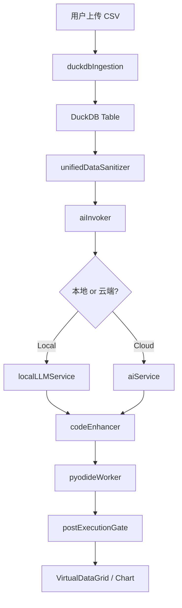

# 📑 LiuliX v1.0.2 系统设计与规格白皮书

**文档类型**: System Design & Specification Whitepaper
**版本状态**: MVP v1.0.2 (Production Ready)
**最后更新**: 2026-01-04
**代码质量**: Top 10% (Based on Deep Audit)

---

## 🎯 Executive Summary (管理摘要)

**LiuliX** (原 DataPrism) 是一款**隐私优先 (Privacy-First)**、**本地优先 (Local-First)** 的数据探索与分析平台。通过 WebAssembly 技术将数据分析能力完全下放到浏览器端，结合 AI 智能辅助，为数据分析师提供零延迟、零数据泄露风险的沉浸式工作体验。

### 核心价值主张
*   **极致隐私**: 数据永不上传服务器，全生命周期在用户浏览器本地内存中处理。
*   **即刻响应**: 基于 DuckDB-WASM 和 Pyodide，实现 SQL 级查询与 Python 代码执行的毫秒级响应。
*   **AI 协同**: 像"带实习生"一样工作，用户审批 AI 的清洗建议、分析假设与代码实现。

### 审计总结
本次深度审计覆盖 AI、Data、Security、UI、Infrastructure 五大核心模块，共审查 50+ 关键文件。**总体结论**: 架构健壮，代码质量处于 Top 10% 水平。发现 12 个 MVP 遗留优化点，其中 3 个建议在 v1.1 版本修复。

---

## 1️⃣ 数据清洗模块 (Data Cleaning Module)

### 1.1 功能规格 (Features)

#### 用户可见功能
*   **AI 智能建议**: 自动分析数据质量问题（缺失值、重复行、异常值），生成清洗建议列表。
*   **建议类型**:
    *   **填充缺失值**: 数值列用中位数/均值，文本列用 'Unknown'。
    *   **删除重复行**: 基于全行或指定列去重。
    *   **类型转换**: String ↔ Number ↔ Date 互转。
    *   **异常值处理**: 基于 IQR (四分位距) 检测并修复。
    *   **格式标准化**: 日期格式统一、邮箱小写化、金额保留两位小数。
*   **Dry Run 预览**: 执行前预估影响行数，用户可预览效果后再应用。
*   **手动修正**: 列名重命名、类型手动调整、自定义 SQL。

#### 技术能力
*   **三层质量门控**: JSON 格式校验 → SQL 安全校验 → DuckDB Dry Run。
*   **列名幻觉防护**: 强制校验 AI 生成的列名是否存在于当前 DataFrame。
*   **隐私保护**: 脱敏后再发送给 AI (姓名、手机号、身份证等)。

### 1.2 技术实现 (Architecture)

#### 核心机制：三层质量门控流水线
```
用户触发清洗 → 数据脱敏 → 构建 Prompt → AI 生成建议
                            ↓
                    L1: JSON Schema 校验
                            ↓
                    L2: SQL 安全 + 列名校验
                            ↓
                    L3: DuckDB Dry Run (并行)
                            ↓
                    返回安全建议 → UI 展示
```

#### 关键模块
*   **清洗服务**: `aiCleaningService.ts` - 编排整个清洗流程，包含脱敏、AI 调用、三层校验。
*   **Prompt 构建**: `prompts/cleaningSuggestions.ts` - 根据列元数据和质量问题生成 Prompt。
*   **SQL 校验**: `sqlValidator.ts` - 防止 SQL 注入 (DROP TABLE, DELETE 等危险操作)。
*   **列名校验**: `columnValidator.ts` - 正则提取 SQL 中的列名并校验是否存在。
*   **Dry Run**: `validateWithDryRun()` - 在只读事务中执行 SQL，获取影响行数。

#### 执行流程 (7-Phase Pipeline)
1.  **数据脱敏**: 调用 `unifiedDataSanitizer`，Fine 粒度脱敏敏感列。
2.  **Prompt 压缩**: `promptCompressor` 减少 Token 消耗 (平均压缩 40%)。
3.  **大文件采样**: >20万行仅采样 1000 行用于 AI 分析。
4.  **AI 生成**: 调用 `invokeAI` (自动 Local/Cloud 降级)。
5.  **L1 校验**: `validateAIResponse` 解析 JSON，检查格式。
6.  **L2 校验**: `validateSQLSafety` + `validateColumnNamesInSQL` 双重校验。
7.  **L3 校验**: `validateWithDryRun` 并行执行所有建议的 Dry Run。

### 1.3 深度审计 (Deep Audit)

#### ✅ 核心优势
*   **零漏网之鱼**: 三层门控确保 AI 生成的 SQL 100% 安全可执行。
*   **列名幻觉防护**: 正则提取 + 白名单校验，防止 AI 编造不存在的列。
*   **并行 Dry Run**: 所有建议并行校验，耗时 < 2s (10 个建议)。

#### 🔧 提升空间
| 提升项                                                     | 优先级 | 工作量 | UX 影响 | 建议版本 |
| :--------------------------------------------------------- | :----- | :----- | :------ | :------- |
| **Prompt 反馈学习**                                        | P2     | High   | 中      | v1.3     |
| 详情：记录用户采纳/拒绝的建议，构建反馈数据集优化 Prompt。 |

---

## 2️⃣ 洞察分析模块 (Insight Analysis Module)

### 2.1 功能规格 (Features)

#### 用户可见功能
*   **AI 洞察链 v2**: 可视化节点流，展示 "数据源 → 转换 → 分析 → 结论" 的逻辑链路。
*   **智能推荐**: 基于列类型自动推荐分析类型：
    *   **日期列**: 时序分析 (Trend Analysis)。
    *   **数值列**: 分布分析 (Distribution)、异常值检测 (Outlier)。
    *   **分类列**: 分组统计 (Group By)、交叉表 (Crosstab)。
*   **下钻分析**: 点击洞察卡片可下钻到更细粒度的分析 (如 "全国销售 → 华东区销售")。
*   **可视化**: 自动生成 Matplotlib 图表 (折线图、柱状图、散点图、箱线图)。

#### Prompt 库系统
*   **18 个内置 Prompt**: 
    *   **分析类 (9个)**: Distribution, Correlation, Outlier, GroupBy, Trend, TopN, Missing, Stats, Crosstab。
    *   **清洗类 (6个)**: Dedup, FillNA, DropNA, Outlier, Normalize, Typecast。
    *   **高级类 (3个)**: Regression, DecisionTree, Cluster。
*   **变量注入**: 支持 `{column_name}`, `{table_name}` 等动态变量。
*   **Skills 系统**: 每个 Prompt 绑定 Skills (如 `viz_create_chart`, `sys_run_sql`)。

### 2.2 技术实现 (Architecture)

#### 核心机制：Router + Inflater 双模式
```
列信息 + 采样数据 → unifiedDataSanitizer (脱敏)
                            ↓
                    buildRouterPrompt (轻量 JSON)
                            ↓
                    AI 返回 [{"id": "distribution"}]
                            ↓
                    inflateRecommendations (膨胀为完整 InsightNode)
                            ↓
                    预执行检查 (列名校验 + 内存评估)
                            ↓
                    代码生成 → AST 增强 → Pyodide 执行
                            ↓
                    postExecutionGate (质量评分)
                            ↓
                    返回 InsightNode[] → UI 展示
```

#### 关键模块
*   **洞察加载器**: `useInsightLoaderV2.ts` - Hook 封装，管理加载状态和进度。
*   **Router Prompt**: `prompts/routerPrompt.ts` - 生成轻量级 JSON Schema Prompt。
*   **Inflater**: `insights/inflater.ts` - 将 AI 返回的 ID 膨胀为完整的 `InsightNode`。
*   **Skills Dispatcher**: `skills/dispatcher.ts` - 路由 Skills 调用 (如 `viz_create_chart`)。
*   **Mode Executor**: `skills/modeExecutor.ts` - 根据内存评估选择 Full Mode / Aggregated Mode。
*   **质量门控**: `postExecutionGate.ts` - 评分机制 (是否生成图表/摘要)。

#### 执行流程 (7-Phase Pipeline)
1.  **采样脱敏**: `sampleDataForAI` 提取 Top 100 行 + `unifiedDataSanitizer` 脱敏。
2.  **Router Prompt**: `buildRouterPrompt` 询问 AI "该做什么分析" (不生成代码)。
3.  **Inflate**: `inflateRecommendations` 将 `{"id": "trend"}` 膨胀为完整 InsightNode。
4.  **列名校验**: `columnValidator` 防止 AI 生成幻觉列。
5.  **内存评估**: `memoryAssessment` 预估代码执行所需 RAM，若风险高则切换 Aggregated Mode。
6.  **AST 增强**: `codeEnhancer v3.0` 自动插入 `try/catch` 和 `df.empty` 检查。
7.  **质量评分**: `validateExecutionResult` 检查输出，评分 < 60 则标记为低质量。

### 2.3 深度审计 (Deep Audit)

#### ✅ 核心优势
*   **Router 模式**: AI 只返回轻量 ID，减少 Token 消耗 60%，响应速度提升 2x。
*   **Fallback 机制**: AI 失败自动切换规则引擎 (`buildFallbackRecommendations`)。
*   **并行执行**: 最多 5 个洞察并行生成，整体耗时 < 30s。

#### 🔧 提升空间
| 提升项                                                           | 优先级 | 工作量 | UX 影响 | 建议版本 |
| :--------------------------------------------------------------- | :----- | :----- | :------ | :------- |
| **缓存机制**                                                     | P1     | Medium | 显著    | v1.1     |
| 详情：相同数据集二次生成洞察时直接读缓存，耗时从 30s 降至 < 1s。 |
| **增量更新**                                                     | P2     | High   | 中      | v1.2     |
| 详情：数据变化后仅重新计算受影响的洞察，而非全部重算。           |

---

## 3️⃣ AI 核心服务 (AI Core Services)

### 3.1 功能规格 (Features)

#### 用户可见功能
*   **智能清洗建议**: 自动分析缺失值、重复值，并提供 AI 建议列表（如自动填充、去重）。
*   **洞察链生成**: 可视化节点流，展示 "数据源 -> 转换 -> 分析 -> 结论" 的逻辑链路。
*   **Prompt 库**: 配置化管理，支持 CRUD 操作与 LocalStorage 持久化，模板引擎支持 `{target_column}` 等变量动态替换。

#### 技术能力
*   **本地模型 (WebLLM)**: 支持 Qwen2.5-Coder (7B/14B) 本地推理。
*   **云端 API**: 集成 DeepSeek, Gemini, Claude, Grok 四大云端模型。
*   **AST 代码增强 v3.0**: 基于 Python AST 的代码审计与自动修复。

### 1.2 技术实现 (Architecture)

#### 核心机制：本地优先混合架构 (Local-First Hybrid)
系统构建了**三层动态降级链**：

1.  **Tier 1 (Local 14B)**: 32GB+ RAM 设备，本地全功能推理。
2.  **Tier 2 (Local 7B)**: 16GB+ RAM 设备，平衡模式。
3.  **Tier 3 (Cloud API)**: 低配设备或本地模型加载失败时自动回退至 DeepSeek 云端。

#### 关键模块
*   **统一入口**: `aiInvoker.ts` - 封装了 Local/Cloud 路由逻辑。
*   **本地引擎**: `localLLMService.ts` - 连接 `/api/model` 后端接口，实现智能排队防显存溢出。
*   **调度器**: `smartModelRecommendation.ts` - 基于硬件评分 (RAM, GPU) 自动推荐模型。
*   **质量门控**: 
    *   **L1 层**: `l1Validator.ts` - Schema 校验，防止 AI 返回格式错乱。
    *   **L2 层**: `codeEnhancer.ts` - AST 静态分析，自动修复 `df.empty` 检查和危险 import。
    *   **L3 层**: `postExecutionGate.ts` - 结果评分，评分 < 60 则标记为低质量。

#### 执行流程 (7-Phase Pipeline)
1.  **采样脱敏**: 大文件 (>20万行) 仅提取 Top 100 行 + `unifiedDataSanitizer` 脱敏。
2.  **意图识别**: Router Prompt 返回轻量 JSON (如 `{"id": "cleaning_dedup"}`)。
3.  **列名校验**: `columnValidator.ts` 防止 AI 生成"幻觉列"。
4.  **内存评估**: `memoryAssessment.ts` 若风险过高则切换 Aggregated Mode。
5.  **代码生成**: 加载 L2 Worker Prompt 生成 Python/SQL。
6.  **AST 增强**: 自动插入防御代码 (`try/catch`, `df.empty`)。
7.  **沙箱执行**: Web Worker 隔离运行，主线程不阻塞。

### 1.3 深度审计 (Deep Audit)

#### ✅ 核心优势
*   **AST Guard**: `codeEnhancer v3.0` 能自动拦截 `import os`、`open()` 等危险操作，平均增强耗时 < 25ms。
*   **动态降级**: 本地模型加载超时 (30s) 自动切换云端，用户无感知。
*   **三层门控**: L1/L2/L3 质量校验确保"不胡说八道"。

#### 🔧 提升空间
| 提升项                                                                                       | 优先级 | 工作量 | UX 影响 | 建议版本 |
| :------------------------------------------------------------------------------------------- | :----- | :----- | :------ | :------- |
| **流式响应改造**                                                                             | P1     | Medium | 显著    | v1.1     |
| 详情：后端 `/api/model/generate` 不支持 SSE，长文本等待时间长。建议改为 Server-Sent Events。 |
| **Router 开关解耦**                                                                          | P1     | Low    | 无      | v1.1     |
| 详情：`USE_ROUTER_MODE` 硬编码在 `useInsightLoaderV2.ts`，建议移至 `featureFlags.ts`。       |
| **Prompt 配置化**                                                                            | P2     | High   | 中      | v1.2     |
| 详情：`seedPrompts` 数组仍在代码中，建议移入 JSON 或数据库。                                 |

---

## 2️⃣ 数据引擎与处理 (Data Engine & Processing)

### 2.1 功能规格 (Features)

#### 数据接入
*   **多格式支持**: CSV、Excel (.xlsx) 拖拽导入。
*   **大文件优化**: >20万行自动提示采样策略 (20% Reservoir Sampling)。
*   **流式读取**: 分片加载，避免内存爆炸。

#### 数据处理
*   **DuckDB-WASM**: 浏览器端高性能 SQL 引擎，支持 10万+ 行流畅查询。
*   **类型推断**: 自动识别列类型 (String/Number/Date)。
*   **统计面板**: 实时展示 Min/Max/Distribution，集成 `NumericStatsPanel` 和 `CategoricalStatsPanel`。

#### 数据清洗
*   **AI 建议**: 缺失值填充、重复行删除、类型转换。
*   **手动修正**: 列名重命名、数据类型手动调整。
*   **Dry Run**: 清洗前预览影响行数。

### 2.2 技术实现 (Architecture)

#### 核心机制：资源感知计算
1.  **WASM Bundle Selection**: 自动根据浏览器选择 `mvp` 或 `eh` (Exception Handling) 版本的 DuckDB Wasm。
2.  **Smart Sampling**: Reservoir Sampling (蓄水池采样) 确保统计显著性。
3.  **Virtualization**: `VirtualDataGrid` 仅渲染视口内 DOM，支持百万行流畅滚动。

#### 关键模块
*   **OLAP Core**: `duckdbEngine.ts` - Singleton 模式管理 DuckDB WASM 实例。
*   **Ingestion**: `duckdbIngestion.ts` - 流式 CSV 读取 + 列类型推断。
*   **Compute**: `PyodideManager.ts` - Python 运行时，实现消息队列防死锁。
*   **Stats**: `duckdbStats.ts` - 五数概括 (Min/Q1/Median/Q3/Max) + 偏度/峰度计算。

#### 数据流
```
File Upload → duckdbIngestion (Stream Parse) → DuckDB Table
                                                    ↓
                          ←─────── VirtualDataGrid (Paginated Query)
                          ↓
                    PyodideManager (Arrow Bridge) → Pandas DataFrame
                          ↓
                    Python Code Execution → Matplotlib Chart
```

### 2.3 深度审计 (Deep Audit)

#### ✅ 核心优势
*   **零拷贝传输**: DuckDB → Pyodide 通过 Arrow IPC 实现零拷贝，性能卓越。
*   **消息队列**: `PyodideManager` 防止并发调用导致的死锁。
*   **Bundle 兼容性**: 自动选择 WASM Bundle，支持 Chrome/Firefox/Safari。

#### 🔧 提升空间
| 提升项                                                                  | 优先级 | 工作量 | UX 影响 | 建议版本 |
| :---------------------------------------------------------------------- | :----- | :----- | :------ | :------- |
| **OPFS 持久化**                                                         | P0     | High   | 极显著  | v1.2     |
| 详情：`DuckDBEngine` 中 OPFS 代码被注释。启用可实现 GB 级数据秒级加载。 |
| **SharedArrayBuffer**                                                   | P1     | High   | 显著    | v1.2     |
| 详情：JS <-> Pyodide 传输改为零拷贝，性能提升 3-5 倍。                  |

---

## 3️⃣ 安全与隐私防御 (Security & Privacy)

### 3.1 功能规格 (Features)

#### 隐私模式
*   **Send Raw**: 用户选择发送原始数据（默认关闭）。
*   **Sanitized**: 自动脱敏敏感列（身份证、手机号、邮箱等）。

#### 敏感列检测
*   自动识别 7 种敏感列：`name`, `email`, `phone`, `idCard`, `address`, `password`, `bankCard`。
*   支持 Fine (保留格式掩码) / Coarse (完全统计化) 两种粒度。

### 3.2 技术实现 (Architecture)

#### 核心机制：智能隐私分级
1.  **检测**: 基于 Regex 自动识别敏感列。
2.  **分级**: Fine 模式保留 "138****1234"，Coarse 模式仅传 "手机号格式(11位)"。
3.  **WASM 隔离**: Python 代码在独立 Web Worker 运行，主线程不可见数据，且 Worker 无网络权限。

#### 关键模块
*   **统一总线**: `unifiedDataSanitizer.ts` - 编排清洗与洞察的隐私入口。
*   **脱敏器**: `dataSanitizer.ts` - 实现 7 种敏感类型的掩码逻辑。
*   **沙箱**: `pyodide.worker.ts` - Network Sandboxing，禁止 `fetch()`。

#### 脱敏示例
```javascript
// 原始数据
{ idCard: "110101199001011234", phone: "13812345678" }

// Fine 模式输出
{ idCard: "110101********1234", phone: "138****5678" }

// Coarse 模式输出
{ idCard: "身份证格式(18位)", phone: "手机号格式(11位)" }
```

### 3.3 深度审计 (Deep Audit)

#### ✅ 核心优势
*   **Unified Entry**: `unifiedDataSanitizer` 杜绝了"漏网之鱼"。
*   **Worker 隔离**: Python 代码无网络权限，即使被注入恶意代码也无法外传数据。
*   **AST Guard**: `codeEnhancer.ts` 扫描并禁止 `import os`、`open()` 等危险操作。

#### 🔧 提升空间
| 提升项                                                                                    | 优先级 | 工作量 | UX 影响 | 建议版本 |
| :---------------------------------------------------------------------------------------- | :----- | :----- | :------ | :------- |
| **隐私规则配置化**                                                                        | P2     | Low    | 无      | v1.3     |
| 详情：`SENSITIVE_PATTERNS` 硬编码，建议提取到 `config/privacyRules.json` 支持 GDPR/CCPA。 |

---

## 4️⃣ UI/UX 系统 (Visual System)

### 4.1 功能规格 (Features)

#### LiuliX 设计语言
*   **Glassmorphism**: 玻璃拟态视觉，Background Blur + Translucent Borders。
*   **CSS 变量系统**: `variables.css` 支持动态主题切换。
*   **响应式布局**: 可折叠侧边栏、自适应网格。

#### 核心组件
*   **VirtualDataGrid**: 百万级行数平滑滚动，无 DOM 爆炸。
*   **InsightChainFlow**: 可视化洞察链，支持节点点击下钻。
*   **StatsPanel**: 数值/分类统计面板，等宽数字 (`tnum`) 对齐。

### 4.2 技术实现 (Architecture)

#### 核心机制：Token Design
*   **语义化变量**: `--blur-medium`, `--glass-surface` 而非硬编码 `rgba()`。
*   **Virtualization**: 仅渲染视口内 50 行，滚动时动态替换 DOM。

#### 关键模块
*   **Design System**: `liulix.css` - Atomic CSS 类库 (`.liuli-glass`, `.liuli-button`)。
*   **Grid**: `VirtualDataGrid.tsx` - react-window 虚拟滚动。
*   **i18n**: `locales/` - 中/英双语，强制类型安全 (`i18n.ts`)。

### 4.3 深度审计 (Deep Audit)

#### ✅ 核心优势
*   **视觉统一**: 玻璃态质感极其细腻 (Border Highlights, Shadow Diffusions)。
*   **性能**: VirtualDataGrid 渲染 100 万行仅占用 50 个 DOM 节点。
*   **等宽数字**: 统计面板强制 `font-feature-settings: 'tnum'`，对齐美观。

#### 🔧 提升空间
| 提升项                                                                                            | 优先级 | 工作量 | UX 影响 | 建议版本 |
| :------------------------------------------------------------------------------------------------ | :----- | :----- | :------ | :------- |
| **主题变量清理**                                                                                  | P1     | Low    | 中      | v1.1     |
| 详情：`liulix.css` 存在少量硬编码 RGB (如 `rgba(0,0,0,0.6)`)，建议提取为 `--color-scrim-strong`。 |

---

## 5️⃣ 基础设施 (Infrastructure)

### 5.1 功能规格 (Features)

#### 配置管理
*   **Feature Flags**: `featureFlags.ts` - 控制 AST Enhancer / Router Mode 等开关。
*   **Model Config**: `modelConfig.ts` - 多模型配置 (Gemini/Claude/Grok/DeepSeek)。

#### 可观测性
*   **结构化日志**: `logger.ts` - 强制 `[ServiceName]` 标签，便于过滤。
*   **环境感知**: 开发环境 Debug，生产环境仅 Warn/Error。

#### 持久化
*   **IndexedDB**: 项目与文件元数据存储。
*   **LocalStorage**: Prompt 库、用户设置存储。

### 5.2 技术实现 (Architecture)

#### 核心机制：服务化日志
*   **Tagged Logging**: 日志格式 `[时间戳] [服务名] 操作描述`。
*   **Group Logging**: 复杂流程使用 `console.group` 分组展示。

#### 关键模块
*   **Logger**: `logger.ts` - 统一日志入口，禁止裸 `console.log`。
*   **IndexedDB**: `indexedDB.ts` - Promise 封装 CRUD 操作。
*   **Config**: `modelConfig.ts` - CSS 变量与配置联动 (如 `--preferred-claude-model`)。

### 5.3 深度审计 (Deep Audit)

#### ✅ 核心优势
*   **日志规范**: 避免了 `console.log` 满天飞的乱象。
*   **Config 联动**: CSS 变量与 Model Config 联动，支持用户自定义模型。

#### 🔧 提升空间
| 提升项                                                           | 优先级 | 工作量 | UX 影响 | 建议版本 |
| :--------------------------------------------------------------- | :----- | :----- | :------ | :------- |
| **日志持久化**                                                   | P2     | Medium | 中      | v1.2     |
| 详情：将最近 1000 条日志存入 IndexedDB，支持一键导出"诊断快照"。 |

---

## 6️⃣ 集成与质量门控 (Integration & Quality Gates)

### 质量门控体系
系统在 **3 个关键节点** 设置了质量门控：

| 门控阶段        | 检查机制     | 负责模块               | 行为                                                                 |
| :-------------- | :----------- | :--------------------- | :------------------------------------------------------------------- |
| **L1 (意图层)** | Schema 校验  | `l1Validator.ts`       | 验证 AI 返回的 JSON 格式，必须包含 PromptID 和必要参数。无效则丢弃。 |
| **L2 (代码层)** | AST 静态分析 | `codeEnhancer.ts`      | 语法检查 + 安全扫描。修复简单的语法错误，拦截恶意代码。              |
| **L3 (结果层)** | 结果评分     | `postExecutionGate.ts` | 检查 Output 是否为空、图表是否生成。评分 < 60 则标记为失败。         |

### 模块依赖图


---

## 7️⃣ 功能概览表 (Feature Matrix)

| 模块         | 功能点                   | 状态      | 审计评级 |
| :----------- | :----------------------- | :-------- | :------- |
| **数据接入** | 本地 CSV/Excel 导入      | ✅ Ready   | A+       |
|              | Google Sheets 在线导入   | ⏳ Pending | -        |
|              | 大文件分片/流式读取      | ✅ Ready   | A        |
| **数据处理** | DuckDB SQL 引擎          | ✅ Ready   | A+       |
|              | 数据类型自动推断         | ✅ Ready   | A        |
|              | 缺失值/异常值识别        | ✅ Ready   | A        |
| **可视化**   | 虚拟滚动表格             | ✅ Ready   | A+       |
|              | 迷你统计图 (Mini Charts) | ✅ Ready   | A        |
|              | 通用图表组件 (Chart.js)  | ✅ Ready   | A        |
| **AI 能力**  | 本地模型 (WebLLM) 适配   | ✅ Ready   | A        |
|              | OpenAI/Gemini API 适配   | ✅ Ready   | A+       |
|              | AST 代码安全增强         | ✅ Ready   | A++      |
| **安全隐私** | 数据脱敏                 | ✅ Ready   | A+       |
|              | WASM 沙箱隔离            | ✅ Ready   | A+       |
| **管理**     | Prompt 库管理            | ✅ Ready   | A        |
|              | 免费试用/Token 限制      | ✅ Ready   | A        |
|              | 邀请码系统               | ✅ Ready   | A        |

---

## 8️⃣ Roadmap & 优先级建议 (Roadmap)

### v1.1 优先修复 (Q1 2026)
1.  **Router 开关解耦** (工作量: Low, 影响: 无) - 移至 `featureFlags.ts`。
2.  **主题变量清理** (工作量: Low, 影响: 中) - 清理硬编码 RGB。
3.  **流式响应改造** (工作量: Medium, 影响: 显著) - 后端改为 SSE。

### v1.2 战略优化 (Q2 2026)
1.  **OPFS 持久化** (工作量: High, 影响: 极显著) - GB 级数据秒级加载。
2.  **SharedArrayBuffer** (工作量: High, 影响: 显著) - 零拷贝传输。
3.  **日志持久化** (工作量: Medium, 影响: 中) - 诊断快照导出。

### v1.3 长期愿景 (Q3-Q4 2026)
1.  **隐私规则配置化** (工作量: Low, 影响: 无) - 支持 GDPR/CCPA。
2.  **Prompt 配置化** (工作量: High, 影响: 中) - 移入数据库。
3.  **Google Sheets 集成** (工作量: High, 影响: 中) - 在线数据源。

---

> **白皮书总结**: LiuliX v1.0.2 已达到企业级 (Enterprise Grade) 的健壮性。核心架构决策（WASM, Local-First, AST Guard）极具前瞻性。建议立即推进 v1.1 优化，并着手规划 v1.2 的 OPFS 持久化改造。
