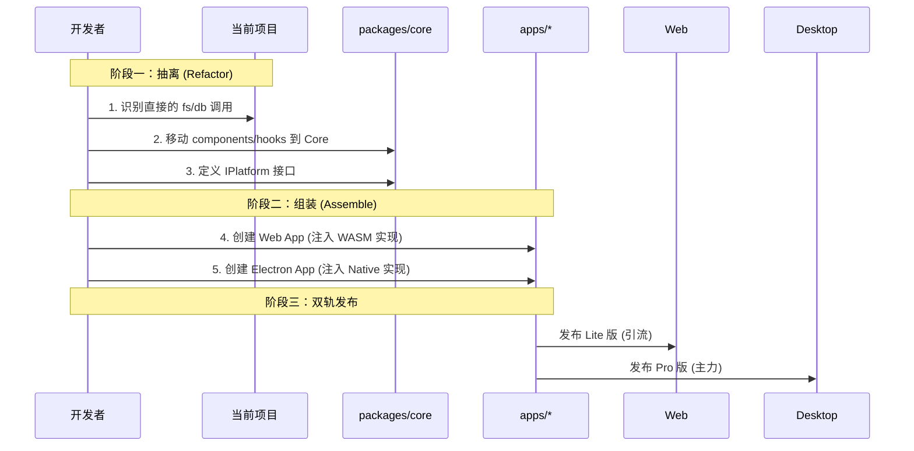

# 08-核心-LiuliX离线版战略与架构白皮书

> **文档性质**: 2.0 版本战略总纲（汇总合并版）
> **包含内容**: 竞品分析、离线架构、大数据扩容、代码复用策略、迁移流程
> **原文档**: [47], [70], [71], [72], [27] (已合并)

---

## 第一章：战略定位与竞品分析

### 1.1 核心差异化定位
LiuliX 不做"中国的 Kaggle"，而是做 **"AI Native 的 Excel/Tableau"**（新一代生产力工具）。

| 维度 | Kaggle / 天池 / 和鲸 | LiuliX (Target) |
| :--- | :--- | :--- |
| **本质** | **平台 (Platform)** | **工具 (Tool)** |
| **核心场景** | 竞赛、培训、展示 | 日常工作、生产、交付 |
| **数据位置** | 云端 (Cloud) | 本地 (Local-First) |
| **网络依赖** | 强依赖 (Web Notebook) | 零依赖 (离线可用) |
| **AI 推理** | **云端 Only** | **本地 Only (AI Native)** |
| **商业模式** | B端招聘/私有化部署 | C端订阅/B端工具授权 |

### 1.2 Kaggle 带来的启示
尽管定位不同，Kaggle 在 UX 上的设计值得借鉴：
1.  **强引导操作**: "Create" 按钮极其醒目，引导用户生产内容。
2.  **全局检索**: 侧边栏常驻搜索，适应海量资源管理。
3.  **社区资产**: "Copy & Edit" (抄作业) 模式是降低门槛的核心。LiuliX 必须建立强大的 **Prompt 库** 和 **案例库** 来实现这一点。

---

## 第二章：离线与大数据架构

为了突破浏览器内存限制（WASM 2GB上限）并实现从"玩具"到"生产力"的跨越，必须推出 **桌面离线版**。

### 2.1 技术选型：Electron + Native DuckDB
*   **外壳**: Electron (成熟、Node.js 生态丰富)。
*   **引擎策略**: **双引擎架构 (Double Engine)**。
    *   **Web 端**: 继续使用 `DuckDB-WASM` (轻量、便捷)。
    *   **Desktop 端**: 使用 `duckdb-node` (Native Binding)，调用 C++ 核心。
*   **收益**:
    *   **打破内存墙**: 直接利用物理内存和虚拟内存。
    *   **多线程并行**: 真正利用多核 CPU。
    *   **大文件流式处理**: 支持 GB/TB 级 Parquet/CSV 秒级分析。

### 2.2 代码复用策略：Adapter 模式
通过抽象底层能力，实现 **95% 代码复用**。

*   **UI/业务层 (Core)**: 完全复用 (React, Hooks, Stores)。
*   **适配层 (Adapter)**:
    ```typescript
    interface IPlatform {
      fs: { read(), write() };
      db: { query(), ingest() };
    }
    ```
    *   **Web实现**: `File API` + `WasmEngine`
    *   **Desktop实现**: `Node FS` + `NativeEngine`

---

## 第三章：实施路线与迁移流程

### 3.1 架构建议：Monorepo
强烈建议采用 Monorepo 结构，避免维护两套代码。

```text
/ (Root)
├── packages/core/       # 核心业务 (95%)
├── apps/web-lite/       # Web 引流版
└── apps/desktop-pro/    # 离线主力版
```

### 3.2 迁移工作流 (Workflow)



### 3.3 新功能开发流程
1.  **PM 提需求**: 例如 "批量清洗"。
2.  **Core 开发**: 编写业务组件，调用 `platform.db.batchClean()` 接口。
3.  **Web 适配**: 实现降级逻辑（如"仅限前100行"或弹窗引导下载桌面版）。
4.  **Desktop 适配**: 实现全量高性能逻辑。
5.  **发布**: 自动同步到双端。

---

## 第四章：总结

*   **战略上**: Web 版负责**广度**（触达、引流、体验），桌面版负责**深度**（性能、隐私、付费）。
*   **战术上**: 通过 Monorepo + Adapter 模式，以极低的成本维持双端版本。
*   **商业上**: 桌面版是企业付费和重度用户订阅的核心载体。
