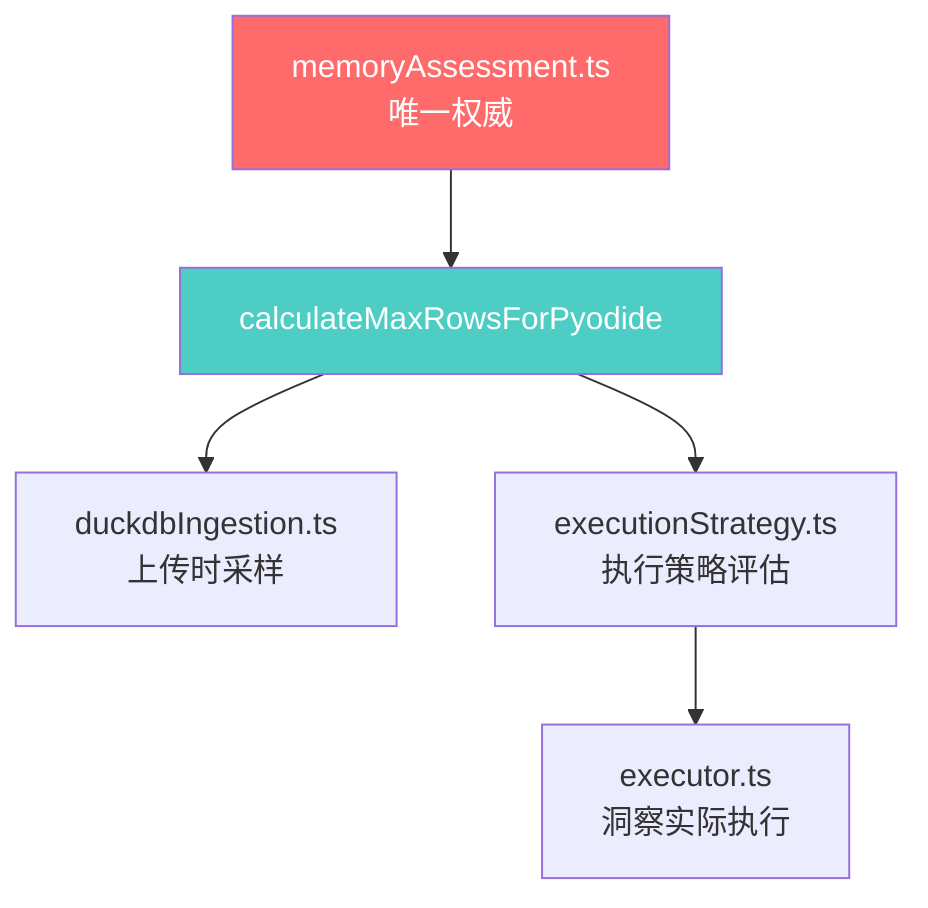

# 动态内存评估与采样策略架构文档

> ⚠️ **文档状态**: 
> - **Web版MVP**: 已废弃，改为**固定10万行**上限（2026-01-14）
> - **Native离线版**: 本文档保留作为未来参考
> - **废弃原因**: Pyodide WASM内存限制导致动态评估收益有限，复杂度与稳定性不成正比

## 📋 文档元信息

- **创建日期**: 2026-01-13
- **最后更新**: 2026-01-14
- **维护者**: Agent + Catherine Wang
- **相关模块**: `memoryAssessment.ts`, `executionStrategy.ts`, `duckdbIngestion.ts`
- **当前状态**: 代码已保留但不调用，文档作为历史记录

---

## 🎯 设计目标

### 核心问题
Pyodide（WebAssembly中的Python）在浏览器环境下存在严格的内存限制：
- **WASM进程限制**: ~256-512MB（Worker进程）
- **总堆限制**: ~4GB（但实际可用远小于此）
- **问题表现**: 大数据集（如60万行×14列）执行洞察分析时触发`MemoryError`

### 设计目标
1. **动态评估**: 根据设备内存和数据规模自动计算Pyodide安全行数上限
2. **唯一权威**: 所有内存相关决策统一在`memoryAssessment.ts`中维护
3. **保守策略**: 宁可过度采样，避免MemoryError导致用户体验中断
4. **透明可追溯**: 采样决策过程清晰记录，便于调试

---

## 🏗️ 整体架构

### 核心模块



### 调用链路

| 调用场景           | 入口                      | 流程                                                                          | 使用函数                                  |
| ------------------ | ------------------------- | ----------------------------------------------------------------------------- | ----------------------------------------- |
| **数据上传采样**   | `duckdbIngestion.ts:170`  | 上传文件 → 分析行数和列数 → 调用`calculateMaxRowsForPyodide` → 决定是否采样   | `calculateMaxRowsForPyodide(columnCount)` |
| **洞察执行策略**   | `executionStrategy.ts:65` | 洞察执行前 → 评估数据规模 → 调用`calculateMaxRowsForPyodide` → 串行/并行/采样 | `calculateMaxRowsForPyodide(columnCount)` |
| **Worker数据传递** | `modeExecutor.ts:96`      | 执行时 → 验证数据是否超限 → 二次采样保护                                      | `calculateMaxRowsForPyodide(columnCount)` |

---

## 🔍 核心算法：`calculateMaxRowsForPyodide`

### 函数签名
```typescript
export function calculateMaxRowsForPyodide(columnCount: number): number
```

### 算法流程

```typescript
// Step 1: 获取设备内存
const browserMemory = getBrowserMemory();  // 16GB设备 → 17179869184 bytes
const memoryGB = browserMemory / (1024 ** 3);  // → 16GB

// Step 2: 动态预算比例（6档）
let budgetRatio = 0.1;  // 默认10%
if (memoryGB >= 32) budgetRatio = 0.4;      // 32GB+ → 40%
else if (memoryGB >= 24) budgetRatio = 0.35; // 24GB → 35%
else if (memoryGB >= 16) budgetRatio = 0.3;  // 16GB → 30%
else if (memoryGB >= 8) budgetRatio = 0.2;   // 8GB  → 20%
else if (memoryGB >= 4) budgetRatio = 0.15;  // 4GB  → 15%

// Step 3: 绝对上限保护（Pyodide Worker限制）
const PYODIDE_MAX_MEMORY_MB = 256;  // 不超过256MB
const dynamicMemoryMB = (browserMemory / (1024 * 1024)) * budgetRatio;
const availableMemoryMB = Math.min(dynamicMemoryMB, PYODIDE_MAX_MEMORY_MB);
// 16GB设备: min(4915MB, 256MB) = 256MB

// Step 4: 保守系数（6-8倍开销）
const OVERHEAD_MULTIPLIER = columnCount > 10 ? 8 : 6;
const BYTES_PER_DATAPOINT = 8 * OVERHEAD_MULTIPLIER;
// 14列: 8 * 8 = 64 bytes/datapoint

// Step 5: 安全系数（60%）
const SAFETY_MARGIN = 0.6;
const availableBytes = availableMemoryMB * 1024 * 1024 * SAFETY_MARGIN;
// 256MB * 0.6 = 153.6MB

// Step 6: 计算最大行数
const maxDataPoints = availableBytes / BYTES_PER_DATAPOINT;
const maxRows = Math.floor(maxDataPoints / columnCount);
// 153.6MB / 64 / 14列 ≈ 167,772 行

// Step 7: 底线保护
const MIN_ROWS = 1000;
return Math.max(MIN_ROWS, maxRows);  // ✅ 信任动态计算，无硬编码上限
```

### 参数说明

| 参数                      | 值        | 说明                           | 调整依据                        |
| ------------------------- | --------- | ------------------------------ | ------------------------------- |
| **PYODIDE_MAX_MEMORY_MB** | 256MB     | Pyodide Worker绝对上限         | Worker进程内存限制（经验值）    |
| **OVERHEAD_MULTIPLIER**   | 6-8x      | Pandas+Matplotlib+临时变量开销 | 实测60万行MemoryError反推       |
| **SAFETY_MARGIN**         | 0.6 (60%) | 安全系数                       | 保留40%缓冲，防止峰值溢出       |
| **budgetRatio**           | 10%-40%   | 设备内存预算占比               | 6档精细化，高端设备更激进       |
| **MIN_ROWS**              | 1000      | 最小行数保护                   | 极端情况（如单列100GB设备）兜底 |

---

## 📊 典型场景计算示例

### 场景1：16GB设备，14列数据
```
设备内存: 16GB
budgetRatio: 0.3 (30%)
dynamicMemoryMB: 16384 * 0.3 = 4915MB
PYODIDE_MAX_MEMORY_MB: 256MB
availableMemoryMB: min(4915, 256) = 256MB  ← 被限制

OVERHEAD_MULTIPLIER: 8 (14列 > 10)
BYTES_PER_DATAPOINT: 8 * 8 = 64 bytes
availableBytes: 256 * 1024 * 1024 * 0.6 = 161MB

maxDataPoints: 161MB / 64 bytes = 2,516,582 数据点
maxRows: 2,516,582 / 14列 ≈ 179,756 行 ≈ 17.8万行  // ⚠️ 注意是17.8万，不是178万！

✅ 结果: 100万行文件 → **采样到17.8万行**（采样率17.8%）
        60万行文件 → **采样到17.8万行**（采样率29.7%）
        10万行文件 → 不采样（小于17.8万）
```

**实际验证**（15列数据）:
```
日志: [DuckDB] 采样决策 {原始行数: 1000000, 列数: 15, 内存评估最大行数: 167772}
结果: 100万行 → 采样到16.7万行 ✓ 符合预期
```

### 场景2：8GB设备，20列数据
```
设备内存: 8GB
budgetRatio: 0.2 (20%)
dynamicMemoryMB: 8192 * 0.2 = 1638MB
availableMemoryMB: min(1638, 256) = 256MB

OVERHEAD_MULTIPLIER: 8 (20列 > 10)
availableBytes: 156MB
maxRows: 2.5M / 20列 = 125,000 行

✅ 结果: 50万行文件 → 采样到12.5万行
```

### 场景3：4GB设备，5列数据
```
设备内存: 4GB
budgetRatio: 0.15 (15%)
dynamicMemoryMB: 4096 * 0.15 = 614MB
availableMemoryMB: min(614, 256) = 256MB

OVERHEAD_MULTIPLIER: 6 (5列 ≤ 10)
BYTES_PER_DATAPOINT: 8 * 6 = 48 bytes
availableBytes: 161MB
maxRows: 3.4M / 5列 = 680,000 行

✅ 结果: 低配设备，列少时仍可处理较大数据集
```

---

## 🔧 历史修复记录

### 问题1：硬编码上限覆盖动态计算（已修复）
**时间**: 2026-01-13  
**症状**: 16GB设备计算出345万行，导致MemoryError  
**原因**: 
```typescript
// ❌ 旧代码
const MAX_ROWS = memoryGB >= 16 ? 300000 : ...;
return Math.min(maxRows, MAX_ROWS);  // 即使maxRows更小，也被30万限制
```
**修复**: 
```typescript
// ✅ 新代码
const MIN_ROWS = 1000;
return Math.max(MIN_ROWS, maxRows);  // 信任动态计算
```

### 问题2：budgetRatio过大（已修复）
**时间**: 2026-01-13  
**症状**: 16GB设备分配4.9GB给Pyodide，超出Worker限制  
**原因**: budgetRatio=0.3（30%）是为DuckDB设计，不适用Pyodide  
**修复**: 添加`PYODIDE_MAX_MEMORY_MB = 256`绝对上限

### 问题3：OVERHEAD_MULTIPLIER=3过于乐观（已修复）
**时间**: 2026-01-13  
**症状**: 30万行×14列触发MemoryError  
**原因**: 3倍系数严重低估Pandas+Matplotlib实际开销  
**实测数据**:
- 原始DataFrame: 1x
- Pandas索引/元数据: 1.5x
- Matplotlib图表对象: 2x
- 临时变量+栈: 1.5x
- **总计**: ~6-8x

**修复**: 
```typescript
const OVERHEAD_MULTIPLIER = columnCount > 10 ? 8 : 6;
```

---

## 🚨 注意事项

### 禁止事项
1. ❌ **其他文件不得独立计算内存限制**  
   必须调用`calculateMaxRowsForPyodide()`
   
2. ❌ **不得硬编码行数阈值**  
   如`if (totalRows > 100000)`应改为动态判断

3. ❌ **不得维护重复的系数参数**  
   所有参数统一在`memoryAssessment.ts`

### 调试技巧
```typescript
// 1. 查看采样决策日志
[DuckDB] 采样决策（纯内存评估）
{
  原始行数: 1000000,
  列数: 15,
  内存评估最大行数: 167772,  // ← 关键
  是否采样: true,
  决策依据: '基于设备内存动态计算'
}

// 2. 验证Pyodide执行时的实际行数
[AI服务] 📊 数据采样完成，准备发送给AI
{
  原始总行数: 1000000,
  内存限制最大行数: 167772,
  实际发送行数: 167772,  // ← 应与上面一致
  是否采样: false
}
```

---

## 🔮 未来优化方向

### 短期（MVP后）
1. **自适应系数**: 根据执行成功率动态调整OVERHEAD_MULTIPLIER
2. **缓存计算结果**: 同设备同列数缓存`calculateMaxRowsForPyodide`结果

### 中期（1.0版本）
1. **实时内存监控**: WebAssembly提供内存使用API后，动态调整
2. **渐进式降级**: MemoryError时自动重试更小采样率

### 长期（PC端）
1. **Native Python版**: 绕过WASM限制，使用系统RAM
2. **流式处理**: 分块处理大数据集，避免一次性加载

---

## 📚 相关文档

- [55-专题-内存评估与采样策略规范](../04-技术专题/55-专题-内存评估与采样策略规范.md)
- [63-日志-数据采样与执行策略优化实施计划](../02-开发日志/63-日志-数据采样与执行策略优化实施计划.md)
- [Walkthrough: Pyodide内存溢出完整修复报告](file:///Users/catherinewang/.gemini/antigravity/brain/40815df0-b158-44c3-b9d1-126e201eecc4/walkthrough.md)

---

## 🐛 已知问题

### P0: Pyodide Worker初始化竞态条件
**现象**: 首次执行洞察全部失败，用户重试成功  
**原因**: Worker标记"就绪"时，scipy/seaborn等包仍在加载  
**临时方案**: 用户重试  
**计划修复**: 2026-01-14，优先级P0

---

**最后更新**: 2026-01-13 21:53  
**下次审查**: 1.0版本发布前
