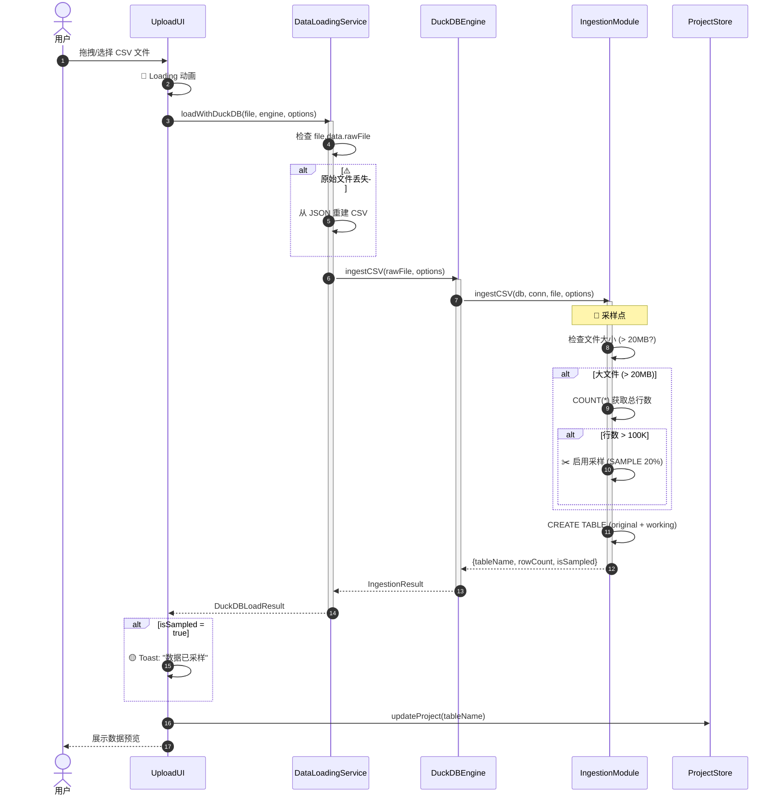

# 核心业务交互时序图

> **最后更新日期**: 2026-01-12
> **状态**: ✅ 精确校准 + 用户设置集成 + 风险点标注
> **目的**: 明确系统核心业务流程的交互时序，标注用户设置读取点与待优化项。

本文档梳理了 LiuliX 系统中三个最核心的业务流程：
1. **数据加载与预处理** (Data Loading)
2. **智能洞察分析** (Insight Generation)
3. **智能清洗建议** (Smart Cleaning)

---

## 用户设置汇总

| 设置项        | localStorage Key           | 读取位置        | 影响           |
| :------------ | :------------------------- | :-------------- | :------------- |
| 用户角色      | `user_role`                | CleaningService | 并行/串行策略  |
| 本地模型开关  | `use_local_model`          | AIInvoker       | Ollama vs 云端 |
| AI 优先级     | `ai_priority`              | AIService       | 模型选择顺序   |
| 隐私模式      | `dataprism_privacy_config` | DataPrivacy     | 脱敏 vs 原始   |
| 启用 Router   | `cleaning_router`          | CleaningService | 模板匹配策略   |
| Python 扩展包 | 动态读取                   | PyodideManager  | sklearn 等加载 |

---

## 1. 数据加载与预处理流程

### 核心代码位置
| 模块               | 文件路径                             |
| :----------------- | :----------------------------------- |
| DataLoadingService | `src/services/dataLoadingService.ts` |
| IngestionModule    | `src/db/duckdbIngestion.ts`          |

### 采样策略 (实际代码)
| 条件                      | 策略     | 实际参数                         |
| :------------------------ | :------- | :------------------------------- |
| 文件 > 20MB 且行数 > 100K | 自动采样 | `sampleRate: 20%`                |
| 行数 > 100万              | 强制采样 | `autoSampleThreshold: 1,000,000` |



### ⚠️ 问题与 v1.1 优化
| 问题           | v1.1 计划                                                                                          |
| :------------- | :------------------------------------------------------------------------------------------------- |
| File 对象丢失  | OPFS 持久化                                                                                        |
| 采样无用户控制 | 采样率选择器 [📄 参考: 内存评估与采样策略规范](../../04-技术专题/55-专题-内存评估与采样策略规范.md) |

---

## 2. 智能洞察分析流程

### 核心代码位置
| 模块              | 文件路径                            |
| :---------------- | :---------------------------------- |
| Executor          | `src/services/insights/executor.ts` |
| ExecutionStrategy | `src/utils/executionStrategy.ts`    |
| PyodideManager    | `src/services/PyodideManager.ts`    |
| DataPrivacy       | `src/utils/dataPrivacy.ts`          |

### 执行策略 (实际代码)
| 策略       | 条件                       | 并发数 |
| :--------- | :------------------------- | :----- |
| 高性能并行 | 内存占比 < 30%, 行数 < 3万 | 1-5    |
| 串行+采样  | 行数 > 5万                 | 1      |

### 真实交互流程

```mermaid
sequenceDiagram
    autonumber
    actor User as 用户
    participant UI as InsightPanel
    participant Config as UserSettings
    participant Privacy as DataPrivacy
    participant Service as InsightService
    participant Strategy as ExecutionStrategy
    participant Py as PyodideManager
    participant AI as AIService

    Note over User,AI: 📍 Phase 1: 后台静默执行

    User->>UI: 上传数据 / 选择文件
    UI->>UI: 🔄 Loading + 进度条

    rect rgb(40, 60, 80)
    Note over Config: 🔧 读取用户设置
    UI->>Privacy: getPrivacyConfig()
    Privacy->>Privacy: localStorage.get('dataprism_privacy_config')
    Privacy-->>UI: {mode: 'auto_sanitize' | 'send_raw'}
    end
    
    UI->>Service: generateInsights(tableName, schema)
    activate Service

    rect rgb(40, 60, 80)
    Note over Config: 🔧 读取隐私设置
    Service->>Privacy: prepareAIInput(sampleData)
    alt mode = 'auto_sanitize'
        Privacy->>Privacy: sanitizeData() → 仅统计信息
    else mode = 'send_raw'
        Privacy-->>Service: 原始采样数据
    end
    end
    
    Service->>AI: 生成洞察建议 (Prompt → LLM)

    rect rgb(40, 60, 80)
    Note over Config: 🔧 读取 AI 优先级
    AI->>AI: localStorage.get('ai_priority')
    Note right of AI: 默认: grok > gemini > claude > deepseek
    end

    AI-->>Service: InsightNode[] (含代码)
    
    Service->>Strategy: assessExecutionStrategy(nodes, totalRows)
    Strategy-->>Service: {mode, concurrency}
    
    alt ⚠️ 内存不足
        Service->>UI: 🟡 Toast: "切换串行模式"
    end

    rect rgb(40, 60, 80)
    Note over Config: 🔧 读取扩展包设置
    Service->>Py: loadUserConfigExtensions()
    Py->>Py: getEnabledPackages()
    Note right of Py: 按用户设置加载 sklearn/statsmodels
    end
    
    alt 高性能并行
        rect rgb(20, 60, 40)
        Note over Service: 🟢 并行模式
        loop 分批执行 (每批 concurrency 个)
            Service->>Py: runPython(code)
            Py-->>Service: {image, summary}
        end
        end
    else 串行模式
        rect rgb(80, 50, 20)
        Note over Service: 🟠 串行模式
        loop 逐个执行
            Service->>Py: runPython(code)
            Py-->>Service: Result
            Service->>UI: onNodeComplete (流式渲染)
        end
        end
    end
    
    Service-->>UI: 所有 InsightNode
    deactivate Service

    Note over User,AI: 📍 Phase 2: 用户交互
    
    UI-->>User: 展示洞察卡片
    User->>UI: 点击"采纳" → 加入报告
```



### ⚠️ 问题与 v1.1 优化
| 问题             | v1.1 计划        |
| :--------------- | :--------------- |
| Pyodide 单线程   | Web Worker 池    |
| 无中断能力       | AbortController  |
| API 超时静默失败 | Retry + 本地降级 |

---

## 3. 智能清洗建议流程

### 核心代码位置
| 模块                      | 文件路径                                    |
| :------------------------ | :------------------------------------------ |
| CleaningSuggestionService | `src/services/cleaningSuggestionService.ts` |
| CleaningRouter            | `src/services/prompts/cleaningRouter.ts`    |
| UserRolePresets           | `src/config/userRolePresets.ts`             |

### 当前模式: **纯 Router 模式**

> ⚠️ **重要说明**: 代码中存在"两层架构"逻辑 (Router + AI 直接生成)，但 **配置已禁用 AI 生成层**：
> - `analyst.cleaning.enableAI = false`
> - `expert.cleaning.enableAI = false`
> - `DEFAULT_CONFIG.enableAIGeneration = false`
>
> 因此，当前实际运行的是 **纯 Router 模式**。

```mermaid
sequenceDiagram
    autonumber
    actor User as 用户
    participant UI as CleaningPanel
    participant Config as UserSettings
    participant Service as CleaningSuggestionService
    participant Router as CleaningRouter
    participant AI as AIService
    participant Duck as DuckDBEngine

    User->>UI: 进入清洗模式
    UI->>UI: 🔄 Loading
    UI->>Service: generateCleaningSuggestionsV2()
    
    activate Service

    rect rgb(40, 60, 80)
    Note over Config: 🔧 读取用户角色
    Service->>Service: getCurrentUserRole()
    Service->>Service: localStorage: 'user_role'
    Service->>Service: getCleaningConfigByRole()
    Note right of Service: enableRouter: true<br/>enableAI: false (已禁用)
    end
    
    Note over Service: 📍 当前: 纯 Router 模式
    
    Service->>Router: generate(tableName, columns, stats, aiService)
    activate Router
    
    Router->>Router: buildRouterPrompt() (语言路由)
    Router->>AI: aiService(prompt)
    Note right of AI: AI 选择模板 + 填充参数
    AI-->>Router: JSON: {promptId, params}
    
    Router->>Router: parseRouterResponse()
    Router->>Router: inflateSQLTemplates()
    Note right of Router: 从 promptRegistry 获取 SQL 模板<br/>替换占位符
    
    Router-->>Service: CleaningSuggestion[]
    deactivate Router
    
    Note over Service: ❌ Layer 1 (AI直接生成) 已禁用
    
    loop Dry Run 验证 (Promise.all)
        Service->>Duck: validateWithDryRun(sql)
        Duck-->>Service: {valid, affectedRows}
        Service->>UI: onSuggestionUpdate (流式更新)
    end

    Service->>Service: sortSuggestions()
    Service-->>UI: 最终建议列表
    deactivate Service
    
    UI-->>User: 展示清洗建议
```



### ⚠️ 问题与 v1.1 优化

| 问题                                 | 当前状态                      | v1.1 计划                        |
| :----------------------------------- | :---------------------------- | :------------------------------- |
| **冗余代码**: Layer 1 (AI直接生成)   | 代码存在但配置禁用            | 删除 `executeAILayer` 及相关逻辑 |
| **冗余代码**: 并行模式分支           | 永远不会进入 (enableAI=false) | 删除并行模式 if 分支             |
| **冗余代码**: `aiCleaningService.ts` | 整个文件未被使用              | 评估删除或归档                   |
| Router 模板有限                      | 仅覆盖常见场景                | 扩展 30+ 模板                    |
| 无撤销能力                           | 需手动恢复                    | Undo/Redo 栈                     |

### 需清理的冗余代码

```
src/services/cleaningSuggestionService.ts:
  - 行 111-146: 并行模式分支 (永远不执行)
  - 行 165-181: enableAIGeneration 兜底分支 (永远不执行)
  - 行 227-264: executeAILayer 函数 (未调用)

src/services/aiCleaningService.ts:
  - 整个文件 (仅被 executeAILayer 调用，而该函数已禁用)
```

---

## 4. 报告模块接口 (Beta)

### 当前状态 (v1.0)
- 单列布局 + 代码展示 + AI 解读

### v1.1 规划
- 左右分栏 (数据 | 洞察)
- 结论提纯 + 用户编辑
- PDF/Markdown 导出

---

## 变更记录

| 日期       | 变更内容                                               | 负责人 |
| :--------- | :----------------------------------------------------- | :----- |
| 2026-01-12 | 修正清洗流程为**纯 Router 模式**，标注冗余代码清理建议 | Agent  |
| 2026-01-12 | 添加用户设置读取点 (深色 rect 标注)                    | Agent  |
| 2026-01-11 | 初始化文档                                             | Agent  |
