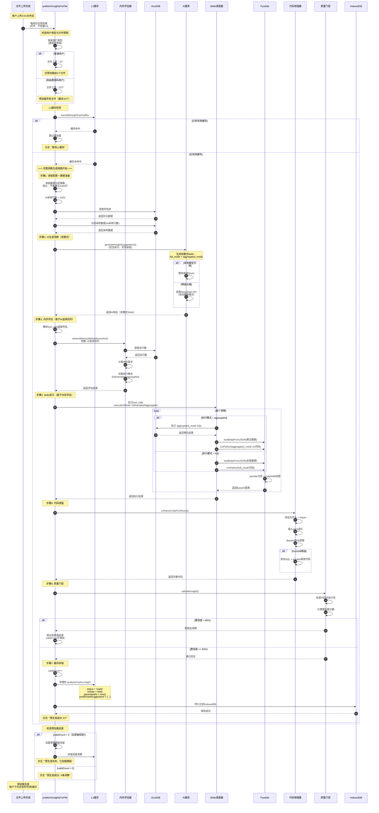
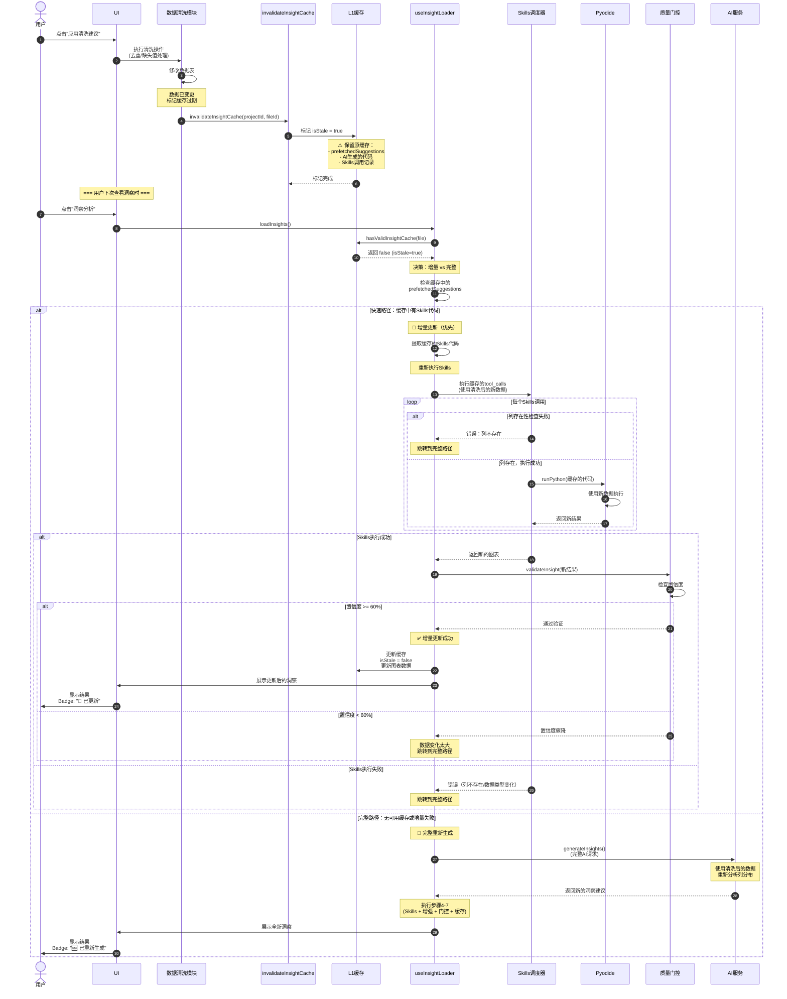
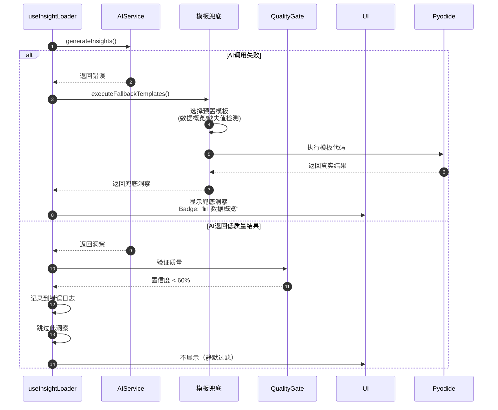
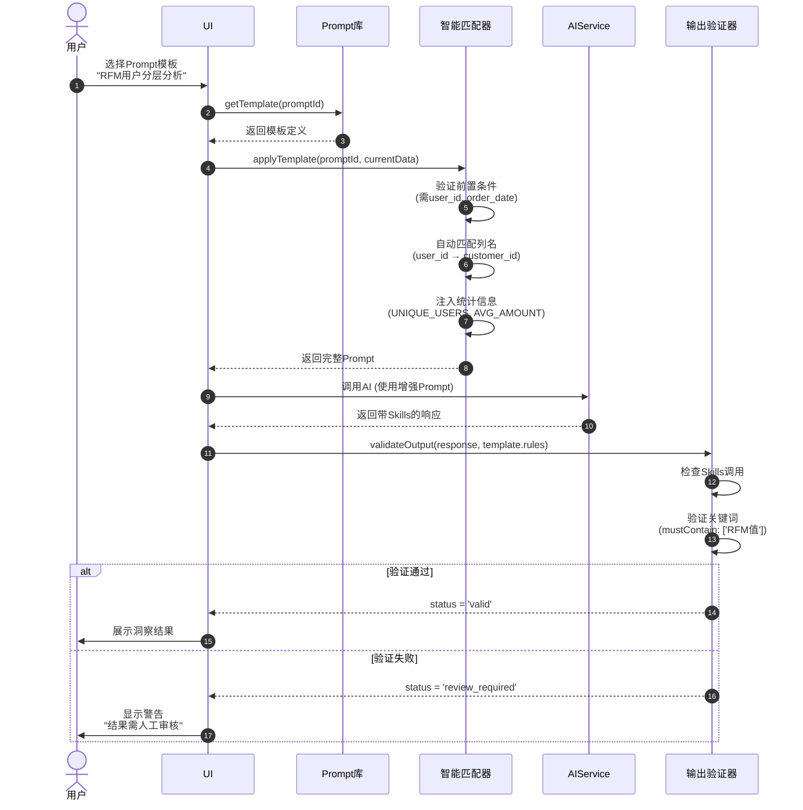

# 架构：洞察分析模块用户交互时序图

**作者**: Google Antigravity Agent  
**日期**: 2025-12-23  
**版本**: v1.0

本文档展示DataPrism洞察分析模块的完整用户交互流程，从用户触发到结果展示的所有关键步骤。

---

## 1. 洞察分析完整流程

### 1.1 主流程时序图（含预加载）

```mermaid
sequenceDiagram
    autonumber
    
    actor 用户
    participant UI as 前端UI
    participant Cache as L1缓存检查
    participant Hook as useInsightLoader
    participant Memory as 内存评估器
    participant DuckDB
    participant AIService as AI服务<br/>(Qwen/DeepSeek)
    participant Skills as Skills调度器
    participant Pyodide
    participant Enhancer as 代码增强器
    participant QualityGate as 质量门控
    
    用户->>UI: 点击"生成洞察"按钮
    UI->>Hook: 触发 loadInsights()
    
    Note over Cache: 步骤0: L1缓存检查
    Hook->>Cache: hasValidInsightCache(file)
    Cache->>Cache: 检查 analysisCache.insight
    Cache->>Cache: 验证过期时间(30分钟)
    Cache->>Cache: 检查 isStale 标记
    
    alt L1缓存命中（预加载成功）
        Cache-->>Hook: 返回缓存洞察
        Note over Hook: 直接跳到步骤7展示
        Hook->>UI: 渲染预加载的洞察<br/>⚡ 0秒展示
        UI->>用户: 立即展示洞察卡片
        Note over UI: Badge: "⚡ 已预加载"
    else L1缓存未命中
        Cache-->>Hook: 无有效缓存
        
        Note over Hook: 步骤1: 读取用户配置
        Hook->>Hook: 读取数据分析策略<br/>(导航栏→设置→数据分析)
        
        alt 策略 = "快速模式"
            Note over Hook: ⚡ AI采样：500行<br/>🔒 MVP暂未开放
            Hook->>UI: 显示Toast: "敬请期待"
            Hook->>Hook: 降级到平衡模式
        else 策略 = "平衡模式"（默认）
            Note over Hook: ⚖️ AI采样：1000行<br/>✅ 当前MVP版本
        else 策略 = "精确模式"
            Note over Hook: 🎯 AI采样：5000行<br/>🔒 MVP暂未开放
            Hook->>UI: 显示Toast: "敬请期待"
            Hook->>Hook: 降级到平衡模式
        end
        
        Hook->>Hook: AI采样行数 = 1000 (平衡模式)
        
        Note over Hook: 步骤1.5: 数据脱敏策略检查
        Hook->>Hook: 检查AI服务类型
        
        alt 使用本地模型 (Qwen)
            Note over Hook: ✅ 数据不离开浏览器<br/>准备采样数据
            Hook->>DuckDB: 获取列信息
            DuckDB-->>Hook: 返回列元数据
            Hook->>DuckDB: 分层采样数据(AI采样行数)
            Note over DuckDB: 时间列分层<br/>或随机采样
            DuckDB-->>Hook: 返回采样数据
            
        else 使用云端API (DeepSeek)
            Hook->>Hook: 读取脱敏设置<br/>(导航栏→设置→数据隐私)
            
            alt 脱敏设置 = "自动脱敏"（推荐）
                Note over Hook: 🔒 仅准备元数据<br/>不采样原始数据
                Hook->>DuckDB: 获取列信息
                DuckDB-->>Hook: 返回列元数据
                Hook->>DuckDB: 获取统计信息<br/>(COUNT, MIN, MAX, AVG, STDDEV)
                DuckDB-->>Hook: 返回统计数据
                Hook->>Hook: 构造脱敏数据包<br/>- 列名 + 数据类型<br/>- 统计指标<br/>- 数据分布描述
                Note over Hook: 发送到AI：<br/>metadata + statistics<br/>❌ 不含原始数据
                
            else 脱敏设置 = "发送原始数据"
                Note over Hook: 准备采样数据
                Hook->>DuckDB: 获取列信息
                DuckDB-->>Hook: 返回列元数据
                Hook->>DuckDB: 分层采样数据(AI采样行数)
                DuckDB-->>Hook: 返回采样数据
                Note over Hook: 发送到AI：<br/>采样数据（用户已同意）
                
            else 首次使用（未设置脱敏）
                Hook->>UI: 显示首次引导弹窗<br/>"数据隐私设置"<br/>- 推荐：自动脱敏<br/>- 高级：发送原始数据<br/>☑ 不再显示此提示
                UI->>用户: 请求设置偏好
                用户->>UI: 选择脱敏方式<br/>+ 勾选"记住我的选择"<br/>+ 可选勾选"不再显示"
                UI-->>Hook: 保存脱敏偏好到LocalStorage<br/>+ hidePrivacyGuide标记
                Note over UI: 提示：可在导航栏→设置中修改
                
                Hook->>Hook: 根据用户选择<br/>准备对应数据
            end
        end
        
        Note over Hook: 步骤2: AI生成洞察（双模式）
        Hook->>AIService: generateBatchInsights()<br/>参数: 列名, 行数, 采样数据, 总行数
        Note over AIService: AI需要生成双模式Skills：<br/>1. full_mode (pandas全量)<br/>2. aggregated_mode (DuckDB+viz)
        
        alt 本地模型启用
            AIService->>AIService: 检查Qwen模型状态
            AIService->>AIService: 使用本地Qwen生成
        else 降级云端
            AIService->>AIService: 调用DeepSeek API
        end
        
        AIService-->>Hook: 返回AI响应（双模式Skills）<br/>每个洞察包含：<br/>- full_mode: sys_run_python代码<br/>- aggregated_mode: sys_run_sql + viz代码
        
        Note over Hook: 步骤3: 内存评估（基于AI选择的列）
        Hook->>Hook: 解析AI返回的tool_calls
        Hook->>Hook: 提取full_mode中分析的列名
        
        Hook->>Memory: assessMemoryBeforeExecution()<br/>参数: tableName, AI分析的列
        Memory->>DuckDB: 获取总行数
        DuckDB-->>Memory: 返回总行数
        
        Memory->>Memory: 计算内存需求<br/>dataPoints(行×AI选择的列) × 24 bytes
        Memory->>Memory: 获取浏览器可用内存<br/>performance.memory
        Memory->>Memory: 决策执行模式<br/>full / sampled / aggregated
        
        Memory-->>Hook: 返回评估结果 + 警告信息
        
        alt 内存不足 (>50%)
            Hook->>UI: 显示降级标识<br/>"⚡ 已优化：DuckDB预聚合"
        end
        
        Note over Hook: 步骤4: Skills执行（选择对应模式）
        Hook->>Skills: 根据内存评估选择执行模式
        
        loop 每个洞察
            alt 评估结果 = full (内存充足)
                Skills->>Skills: 选择执行 full_mode
                Skills->>Pyodide: loadDataFromJSON(全量数据)
                Skills->>Pyodide: runPython(full_mode代码)
                Note over Pyodide: 执行pandas分析<br/>df.groupby().plot()
            else 评估结果 = aggregated (内存不足)
                Skills->>Skills: 选择执行 aggregated_mode
                Skills->>DuckDB: 执行 aggregated_mode SQL<br/>（仅针对AI选择的列）
                Note over DuckDB: SELECT age_group, COUNT(*)<br/>FROM users GROUP BY age_group<br/>100万行 → 100行
                DuckDB-->>Skills: 返回聚合结果
                Skills->>Pyodide: loadDataFromJSON(聚合数据)
                Skills->>Pyodide: runPython(aggregated_mode viz代码)
                Note over Pyodide: 基于聚合数据绘图<br/>plt.bar(df['age_group'], df['count'])
            end
            
            Pyodide->>Pyodide: matplotlib绘图
            Pyodide->>Pyodide: 转Base64
            Pyodide-->>Skills: 返回图表 + 摘要
        end
        
        Skills-->>Hook: 返回执行结果
        
        Note over Hook: 步骤5: 代码增强
        Hook->>Enhancer: enhanceCodeForReuse()<br/>参数: AI原始代码, metadata
        
        Enhancer->>Enhancer: 添加文件头注释
        Enhancer->>Enhancer: 注入import语句
        Enhancer->>Enhancer: 智能插入print语句
        Enhancer->>Enhancer: 添加Base64导出逻辑
        
        alt DuckDB降级模式
            Enhancer->>Enhancer: 添加SQL展示
            Enhancer->>Enhancer: 生成pandas等效代码
        end
        
        Enhancer-->>Hook: 返回完整可复用代码
        
        Note over Hook: 步骤6: 质量门控
        Hook->>QualityGate: validateInsight()<br/>参数: 洞察结果
        
        QualityGate->>QualityGate: 检查代码可执行性
        QualityGate->>QualityGate: 验证输出有效性
        QualityGate->>QualityGate: 计算置信度分数<br/>(代码30+AI40+覆盖20+显著性10)
        
        alt 置信度 < 60%
            QualityGate-->>Hook: 拒绝展示，记录日志
            Hook->>Hook: 跳过此洞察
        else 置信度 >= 60%
            QualityGate-->>Hook: 通过验证
            
            Note over Hook: 步骤7: 结果展示与缓存
            Hook->>Hook: 累计有效洞察数validCount++
            Hook->>UI: 更新进度提示<br/>"已完成 X/Y 条"
            
            Hook->>Hook: 存储到 analysisCache.insight<br/>(L1缓存，30分钟有效)
            Hook->>Hook: 持久化到IndexedDB
            
            Hook->>UI: 返回洞察卡片数据<br/>(图表+摘要+代码+元数据)
            
            UI->>UI: 渲染洞察卡片
            
            alt 降级模式
                UI->>UI: 显示Badge: "⚡ DuckDB预聚合"
                UI->>UI: 显示Alert: 内存占用信息
            end
            
            UI->>UI: 提供代码Tab<br/>(Python代码 + SQL查询)
            UI->>用户: 展示可视化结果
            
            用户->>UI: 点击"复制代码"
            UI->>UI: 复制完整Python代码到剪贴板
            UI->>用户: 提示"代码已复制"
        end
    end
    
    Note over Hook: 检查全局结果
    alt validCount = 0（全部被拒绝）
        Hook->>Hook: 触发兜底方案
        Hook->>Hook: 加载预置模板<br/>- 数据概览<br/>- 缺失值检测<br/>- 数据类型分布
        Hook->>UI: 显示兜底洞察 + 警告
        UI->>用户: 展示基础统计卡片<br/>⚠️ "AI暂时无法生成洞察<br/>已为您展示基础数据概览"
    else validCount > 0
        UI->>用户: 最终进度："已生成 X 条洞察"
    end
```



---

### 1.2 后台预加载流程（完整链路）

> [!NOTE]
> 预加载执行**完整的洞察生成链路**（步骤1-7），与用户点击触发的主流程完全一致，区别仅在于：
> - **触发时机**：文件上传完成后自动后台执行
> - **执行方式**：异步不阻塞UI
> - **失败处理**：静默失败，不影响用户操作



---

**预加载与主流程的关键差异**：

| 维度 | 预加载 | 主流程（用户点击） |
|------|--------|-----------------|
| **触发时机** | 文件上传完成后自动 | 用户点击"生成洞察"按钮 |
| **执行方式** | 异步后台，不阻塞UI | 同步前台，显示加载状态 |
| **AI优先级** | 低优先级（避免影响主流程） | 正常优先级 |
| **失败处理** | 静默失败，不显示错误 | UI提示错误或降级到模板 |
| **结果展示** | 仅缓存，不展示 | 立即渲染到UI |
| **用户感知** | 完全无感知 | 看到加载→结果过程 |
| **文件数限制** | 普通用户3个，高级10个 | 单文件分析，无限制 |

> [!NOTE]
> **用户类型与文件限制**：
> - 普通用户：最多3个文件/项目，预加载前3个
> - 高级邀请码：最多10个文件/项目，预加载所有
> 
> 详细的多文件预加载调度逻辑见 `12-架构-预加载调度时序图.md`（待创建）

**预加载成功率优化**：
1. **检查浏览器空闲** - 使用`requestIdleCallback`在浏览器空闲时执行
2. **资源限制** - 同时最多预加载2个文件，避免资源竞争
3. **失败重试** - AI失败时不重试，等待用户手动触发
4. **优先级策略** - 优先预加载最近访问/修改的文件

---

### 1.3 缓存失效机制（L3增量更新）

> [!TIP]
> **智能增量更新策略**：数据清洗后优先尝试**快速路径**（重新执行已缓存的Skills代码），仅在失败时才触发**完整路径**（AI重新生成）。



---

**增量更新触发条件**：

| 条件 | 是否触发增量 | 说明 |
|------|-------------|------|
| **去重** | ✅ 是 | 列结构不变，仅行数减少 |
| **缺失值填充** | ✅ 是 | 列结构不变，数据分布轻微变化 |
| **异常值修正** | ✅ 是 | 列结构不变，统计特征轻微变化 |
| **列删除** | ❌ 否 | 列不存在，Skills执行失败 → 完整路径 |
| **列重命名** | ❌ 否 | 列不匹配 → 完整路径 |
| **数据类型变化** | ❌ 否 | pandas执行错误 → 完整路径 |

---

**性能对比**：

| 路径 | 耗时 | AI调用 | 说明 |
|------|------|--------|------|
| **快速路径** | ~2秒 | ❌ 无需AI | 仅重新执行Skills + 验证 |
| **完整路径** | ~10秒 | ✅ 需要AI | 完整的7步链路 |

**预期成功率**：
- 快速路径成功率：~70%（大部分清洗操作）
- 完整路径触发率：~30%（列结构变更）

---

**L3缓存失效触发时机**：
1. **数据清洗后** - 去重、缺失值处理、异常值修正
2. **列删除/重命名** - 数据结构变更
3. **数据重新上传** - 同名文件覆盖

---

### 1.5 设置页面配置

#### **导航栏 → ⚙️ 设置 → 📊 数据分析**

```
数据分析策略

○ 快速模式（🔒 敬请期待）
  AI采样：500行
  推理时间：~2秒
  适合：快速探索、笔记本
  
● 平衡模式（推荐，当前MVP）
  AI采样：1000行
  推理时间：~5秒
  适合：日常分析
  
○ 精确模式（🔒 敬请期待）
  AI采样：5000行（动态计算）
  推理时间：~10秒
  适合：关键报告、高性能PC
```

> [!NOTE]
> MVP阶段仅开放**平衡模式**，用户选择其他模式时显示Toast提示"敬请期待"，并自动降级到平衡模式。

---

#### **导航栏 → ⚙️ 设置 → 🔒 数据隐私**

```
AI服务模式
○ 本地模型（Qwen）- 数据不离开浏览器
○ 云端API（DeepSeek）- 需要网络

云端API数据处理（仅云端API可用）
● 自动脱敏（推荐）
  仅发送列名和统计信息，不含具体数据
  
○ 发送原始数据
  发送采样数据到云端API以获得更准确的建议

💡 首次使用时会引导设置，后续可随时修改
```

---

### 1.6 关键决策点说明

#### **决策点1：内存评估**
```typescript
if (estimatedMemory < browserMemory * 0.2) {
    mode = 'full';        // 全量数据，不妥协
} else if (estimatedMemory < browserMemory * 0.5) {
    mode = 'sampled';     // 分层采样10%
} else {
    mode = 'aggregated';  // DuckDB预聚合
}
```

#### **决策点2：AI模型选择**
```typescript
if (useLocalModel && qwenReady) {
    model = 'Qwen2.5-7B';  // 本地WebLLM
} else {
    model = 'DeepSeek';    // 云端API
}
```

#### **决策点3：质量门控**
```typescript
confidenceScore = {
    codeQuality: 30,      // 语法正确、可执行
    aiConfidence: 40,     // AI自报置信度
    dataCoverage: 20,     // 采样比例
    significance: 10      // 统计显著性
};

if (confidenceScore.total >= 60) {
    displayInsight();
} else {
    logAndDiscard();
}
```

---

### 1.3 数据流示例

#### **场景A：小数据集（10,000行）**
```
用户数据 (10,000行 × 5列)
    ↓
内存评估: 400KB < 20% → mode = 'full'
    ↓
Pyodide: 加载全量数据 (10,000行)
    ↓
AI生成: plt.scatter(x, y)
    ↓
Pyodide执行 → 返回Base64图表
    ↓
用户看到: ✅ 完整散点图 (10,000点)
```

#### **场景B：超大数据集（1,000,000行）**
```
用户数据 (1,000,000行 × 3列)
    ↓
内存评估: 24MB > 50% → mode = 'aggregated'
    ↓
DuckDB: SELECT age_group, COUNT(*) GROUP BY age_group
    ↓
聚合结果: 100行
    ↓
Pyodide: 加载100行聚合数据
    ↓
AI生成: plt.bar(age_group, count)
    ↓
Pyodide执行 → 返回Base64图表
    ↓
用户看到: ⚡ 柱状图 (基于DuckDB聚合，100%准确)
    ↓
用户复制: 同时获得SQL + pandas代码
```

---

### 1.4 错误处理流程



---

## 2. 未来扩展（V2规划）

### 2.1 Prompt库集成流程



---

## 3. 参考文档

- [洞察链模块现状分析](../04-技术专题/44-专题-洞察链模块现状分析.md)
- [Prompt库架构与编辑器设计](../04-技术专题/61-技术专题-Prompt库架构与编辑器设计.md)
- [用户交互时序图主索引](./11-架构-用户交互时序图.md)
