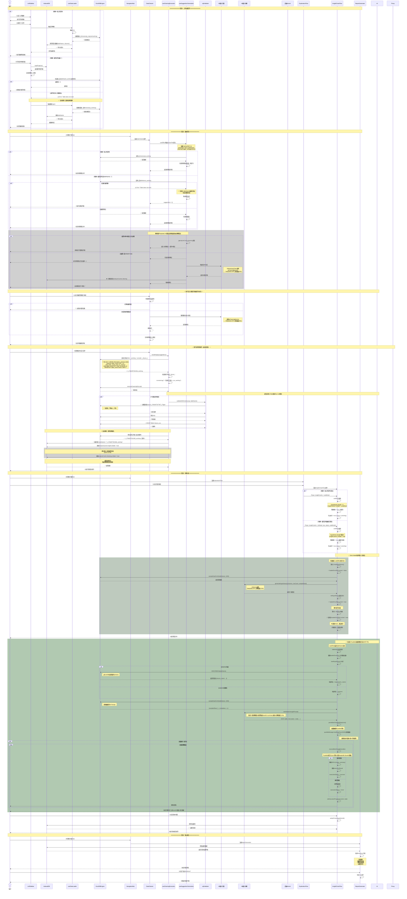

# DataPrism 用户交互时序图 - 全流程
**最后更新**: 2025-12-21

```mermaid
sequenceDiagram
    actor 用户
    participant UI as LeftSidebar
    participant IDB as IndexedDB
    participant Loader as useDataLoader
    participant DB as DuckDBEngine
    participant Nav as NavigationBar
    participant DC as DataCleaner
    participant Hook as useCleaningExecution
    participant SG as useSuggestionGeneration
    participant Validator as sqlValidator
    participant AI_Clean as AI服务-清洗
    participant AI_Insight as AI服务-洞察
    participant Backend as 后端Kernel
    participant Exp as ExplorationFlow
    participant ICF as InsightChainFlow
    participant RG as ReportGenerator
    
    Note over 用户,RG: ═══════════ 阶段1: 上传/加载文件 ═══════════
    
    alt 场景A: 新上传文件
        用户->>UI: ①点击"上传数据"
        UI->>用户: 显示文件选择器
        用户->>UI: ②选择CSV文件
        UI->>Loader: 触发文件解析
        Loader->>Loader: 解析CSV
        Loader->>DB: 创建双表(t_[timestamp]_original/working)
        DB-->>Loader: ✅ 表创建成功
        Loader->>IDB: 保存项目元数据(tableName, columns)
        IDB-->>Loader: ✅ 持久化成功
        Loader-->>UI: 文件加载完成
        UI-->>用户: ③显示数据预览表格
    else 场景B: 缓存文件加载 ✅
        用户->>UI: ①打开应用/刷新页面
        UI->>IDB: loadProjects()
        IDB-->>UI: 返回缓存项目列表
        UI->>UI: 自动选择第一个项目
        UI->>DB: 验证表t_旧tableName_working是否存在
        
        alt 表存在 ✅
            DB-->>UI: 表有效
            UI-->>用户: ②直接显示缓存项目
        else 表不存在 ❌ (问题源头)
            DB-->>UI: ⚠️ Error: Table does not exist
            Note over UI,DB: ✅ 自动处理：旧表失效时重建
            UI->>Loader: 触发重新ingest
            Loader->>DB: 创建新双表(t_[新timestamp]_working)
            DB-->>Loader: ✅ 新表创建成功
            Loader->>IDB: 更新tableName
            IDB-->>Loader: ✅ 持久化成功
            Loader-->>UI: 表重建完成
            UI-->>用户: ③显示数据(新表)
        end
    end
    
    Note over 用户,RG: ═══════════ 阶段2: 数据清洗 ═══════════
    
    用户->>Nav: ④切换到"清洗"tab
    Nav->>DC: 渲染DataCleaner组件
    
    DC->>SG: useEffect触发(activeFile变化)
    Note over SG: 依赖: [activeFile?.id,<br/>activeFile?.data?.tableName,<br/>cleaningTrigger, aiSuggestions]
    
    alt 场景A: 新上传文件
        SG->>DB: 查询t_[timestamp]_working
        DB-->>SG: ✅ 返回数据
        SG->>SG: 生成规则建议(缺失值、重复行)
        SG-->>DC: 返回规则建议列表
        DC-->>用户: ⑤显示规则建议卡片
    else 场景B: 缓存文件(旧tableName) ✅
        SG->>DB: 查询t_旧tableName_working
        
        alt 旧表已被清理
            DB-->>SG: ⚠️ Error: Table does not exist
            Note over SG: ✅ 已修复: tableName依赖已添加<br/>会自动重新生成
            SG->>SG: 跳过建议生成
            SG-->>DC: suggestions = []
            DC-->>用户: ⑤显示空建议列表
        else 旧表仍存在
            DB-->>SG: ✅ 返回数据
            SG->>SG: 生成规则建议
            SG-->>DC: 返回规则建议列表
            DC-->>用户: ⑤显示规则建议卡片
        end
    end
    
    rect rgba(100, 100, 100, 0.3)
        Note over SG,DC: 🟢 新增/Proposed: AI建议自动预加载 (类似洞察假设)
        
        alt 缓存中有AI建议 且 未过期
            SG->>SG: 从analysisCache.cleaning读取
            SG-->>DC: 返回: 规则建议 + 缓存AI建议
            DC-->>用户: 直接显示完整建议列表
        else 无缓存 或 isStale=true
            SG-->>DC: 先返回规则建议
            DC-->>用户: 显示规则建议(后台加载AI...)
            
            SG->>AI_Clean: 触发后台AI生成
            Note right of AI_Clean: AIWorkshopTools调用<br/>aiCleaningService<br/>→ DeepSeek API (清洗通道 30s)
            AI_Clean-->>SG: 返回AI建议列表
            SG->>IDB: 📥 静默保存到 analysisCache.cleaning
            SG-->>DC: 推送新建议
            DC-->>用户: 自动更新显示AI建议 ✅
        end
    end
    
    Note over 用户,AI: --- 用户交互 (保留手动触发作为补充) ---
    用户->>DC: ⑥点击"数据清洗建议"按钮
    
    DC->>DC: 检查缓存/生成状态
    alt 已预加载完成
        DC-->>用户: 🚀 立即显示缓存结果
    else 生成失败/需要重试
        DC->>AI_Clean: 强制重新生成AI建议
        Note right of AI_Clean: 调用aiCleaningService<br/>→ DeepSeek API (清洗通道 30s)
        AI_Clean-->>DC: 返回新建议
        DC-->>DC: 更新显示
    end
    
    DC->>DC: 合并规则建议+AI建议
    DC-->>用户: ⑦显示增强建议列表

    
    Note over 用户,Proxy: --- 用户应用清洗操作（安全修复版） ---
    用户->>DC: ⑧选择建议并点击"应用"
    DC->>Hook: handleApply(suggestions)
    
    Hook->>DB: 查询工作表 (filter: _working + exclude: _dryrun_)
    activate DB
    Note right of DB: ✅ SELECT * FROM information_schema.tables<br/>WHERE table_name LIKE 't_%'<br/>AND table_name LIKE '%_working'<br/>AND table_name NOT LIKE '%_dryrun_%'<br/>ORDER BY table_name DESC LIMIT 1
    DB-->>Hook: ✅ t_1766287304266_working
    deactivate DB
    
    Hook->>Hook: 验证表名不包含 '_dryrun_'
    Hook->>Hook: console.log("✅ 已选择工作表: t_xxx_working")
    
    Hook->>DB: executeCleaningSQL(sql)
    DB-->>Hook: ✅ 清洗完成
    
    Note over Hook,AI: 【后台异步】SQL校验(Dry-run机制)
    
    par AI 建议异步校验
        Hook->>Validator: validateWithDryRun(sql, tableName)
        Validator->>DB: ✅ 创建临时表 dryrun_1766287327367_z7tjgm
        Note right of DB: ✅ 新命名：不再以 t_ 开头
        DB-->>Validator: ✅ 表已创建
        Validator->>DB: 测试 SQL
        DB-->>Validator: ✅ 测试通过
        Validator->>DB: ✅ DROP TABLE dryrun_xxx
        DB-->>Validator: ✅ 已删除
    end
    
    Note over Hook,IDB: ✅ 安全更新：使用正确表名
    
    Hook->>DB: 再次查询工作表 (含过滤条件)
    activate DB
    DB-->>Hook: ✅ t_1766287304266_working (正确！)
    deactivate DB
    
    Hook->>IDB: ✅ 更新项目 tableName = "t_1766287304266_working"
    Hook->>IDB: 更新analysisCache.insight.isStale = true
    
    rect rgba(100, 100, 100, 0.3)
        Note over Hook,IDB: 🟢 新增: AI建议缓存失效<br/>(2025-12-20)
        Hook->>IDB: 更新analysisCache.cleaning.isStale = true
    end
    
    Note over Hook,IDB: 缓存失效标记<br/>触发洞察/建议自动刷新
    IDB-->>Hook: ✅ 缓存更新
    Hook-->>用户: ⑨显示清洗成功提示
    
    Note over 用户,RG: ═══════════ 阶段3: 洞察分析 ═══════════
    
    用户->>Nav: ⑩切换到"探索"tab
    Nav->>Exp: 渲染ExplorationFlow
    用户->>Exp: ⑪点击"假设"按钮
    Exp->>ICF: 渲染InsightChainFlow组件
    
    alt 场景A: 新上传文件(首次)
        Exp->>ICF: Props: insightCache = undefined
        ICF->>ICF: useEffect触发
        Note over ICF: hypotheses.length = 0<br/>insightCache?.isStale = undefined
        ICF->>ICF: 需要刷新 = true (无缓存)
        ICF->>ICF: 可以执行 = true (status ≠ pending)
    else 场景B: 缓存文件(数据已清洗)
        Exp->>ICF: Props: insightCache = {isStale: true, status: undefined}
        ICF->>ICF: useEffect触发
        Note over ICF: hypotheses.length可能>0<br/>insightCache?.isStale = true
        ICF->>ICF: 需要刷新 = true (数据已变更)
        ICF->>ICF: 可以执行 = true (status ≠ pending)
    end
    
    Note over ICF,AI: ✅ Strict Mode防护机制（已修复）
    rect rgba(40, 80, 40, 0.3)
        Note over ICF: 开发模式: useEffect执行2次
        ICF->>ICF: 第1次: loadHypotheses()
        ICF->>ICF: ✅ loadedOnceRef.current = false
        ICF->>DB: sampleDataForAI(tableName, 1000)
        DB-->>ICF: 返回采样数据
        ICF->>AI_Insight: generateHypotheses({columns, rowCount, sampleData})
        Note right of AI_Insight: aiService调用<br/>DeepSeek API (洞察通道 120s)
        AI_Insight-->>ICF: 返回3-5条假设
        ICF->>ICF: setHypotheses(假设卡片)
        ICF->>ICF: ✅ loadedOnceRef.current = true
        
        Note over ICF: 🟢 防护已生效
        ICF->>ICF: 第2次: useEffect触发
        ICF->>ICF: ✅ 检测到 loadedOnceRef.current = true
        Note over ICF: ⏭️ 直接return，跳过执行
        ICF-->>ICF: [拦截成功，无重复调用]
    end
    
    ICF-->>用户: ⑫显示假设卡片
    
    
    rect rgba(60, 120, 60, 0.4)
        Note over ICF,AI: ✅ 已实现: Pyodide批量洞察执行流 (MVP P0)
        
        Note over ICF: useEffect监听tableName变化
        ICF->>ICF: tableName变化检测
        ICF->>ICF: 重置loadedOnceRef (允许重新加载)
        
        ICF->>ICF: loadHypotheses() 执行
        
        alt columns为空
            ICF->>DB: DESCRIBE ${tableName}
            Note right of DB: 从DuckDB动态获取列schema
            DB-->>ICF: 返回列信息 [{column_name: ...}]
            ICF->>ICF: 有效列名 = map(column_name)
        else columns已提供
            ICF->>ICF: 有效列名 = columns
        end
        
        ICF->>DB: sampleDataForAI(tableName, 1000)
        Note right of DB: 采样数据用于AI Prompt
        DB-->>ICF: {sampledData: [...], metadata: {...}}
        
        ICF->>AI_Insight: askAI(batchInsightPrompt)
        Note right of AI_Insight: 生成3-5条洞察建议\n要求输出Base64+summary格式\n(洞察通道 120s)
        AI_Insight-->>ICF: JSON: [{title, description, code}, ...]
        
        ICF->>ICF: parseBatchInsightsResponse()
        
        Note over ICF: 加载数据到Pyodide环境
        ICF->>ICF: pyodideManager.loadDataFromJSON(采样数据)
        Note right of ICF: 创建全局df变量\n供AI代码使用
        
        par 批量执行 (串行)
            loop 每条洞察建议
                ICF->>ICF: executeBatchInsights(codes)
                Note over ICF: Pyodide执行Python代码\n生成matplotlib Base64图表
                
                alt 执行成功
                    ICF->>ICF: 解析JSON {image, summary}
                    ICF->>ICF: 更新executionResult
                    ICF->>ICF: executionStatus = 'success'
                else 执行失败
                    ICF->>ICF: 记录错误信息
                    ICF->>ICF: executionStatus = 'error'
                end
                
                ICF->>ICF: setExecutionProgress(current, total)
                ICF-->>用户: 更新进度条
            end
        end
        
        ICF-->>用户: ⑭显示洞察卡片 (含Base64图表+统计摘要)
    end
    
    用户->>ICF: ⑰点击"采纳"按钮
    ICF->>ICF: adoptChain(hypothesisId)
    ICF->>IDB: 保存到证据池
    IDB-->>ICF: ✅ 证据已采纳
    ICF-->>用户: ⑱显示采纳成功提示
    
    Note over 用户,RG: ═══════════ 阶段4: 输出报告 ═══════════
    
    用户->>Nav: ⑲切换到"报告"tab
    Nav->>RG: 渲染ReportGenerator
    RG->>IDB: 获取证据池数据
    IDB-->>RG: 返回已采纳证据列表
    RG->>RG: 生成Markdown内容
    Note over RG: - 项目概览<br/>- 数据清洗记录<br/>- 洞察分析结果<br/>- 证据池汇总
    RG-->>用户: ⑳显示报告预览
    
    用户->>RG: ㉑点击"导出Markdown"
    RG->>RG: 生成.md文件
    RG-->>用户: ㉒触发浏览器下载
```
