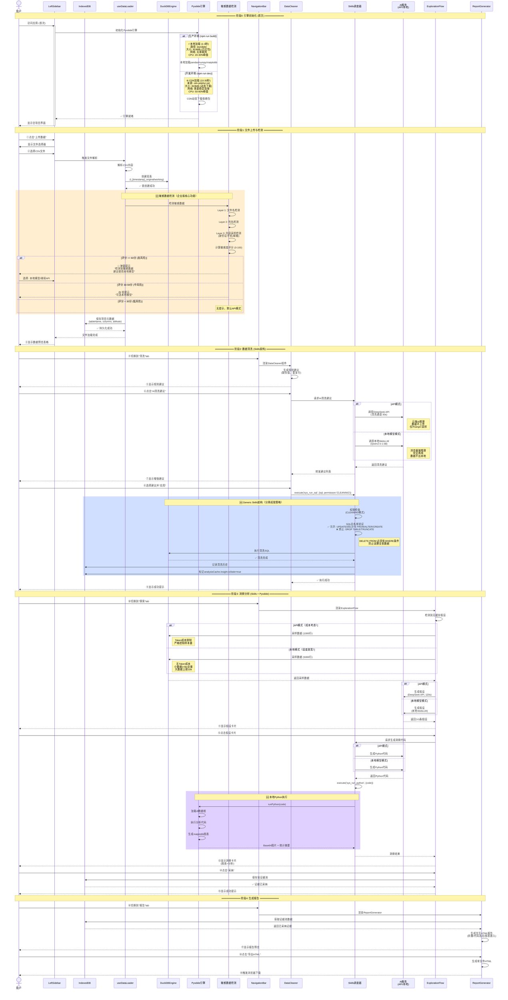

# DataPrism 用户交互时序图 - 新用户首次使用

**最后更新**: 2025-12-22  
**场景**: 新用户首次上传文件到生成报告的完整流程  
**架构版本**: v0.9.9（含Pyodide本地化、Generic Skills、敏感数据检测）

---

## 关键技术说明

### 1. **Pyodide本地化部署** ⚡
- **生产环境**: 从本地`/pyodide/`加载（1-3秒，10-50倍提升）
- **开发环境**: 从CDN加载（10-30秒，方便开发）
- **离线支持**: 完全支持断网使用

### 2. **敏感数据检测** 🔒
- **三层检测**: 文件名 + 列名 + 内容格式
- **智能评分**: 0-100分，自动判断风险等级
- **用户选择**: 高风险弹窗，中风险提示，低风险静默

### 3. **API vs 本地模型** 🎯
- **API模式**: DeepSeek云端推理（快速、准确）
- **本地模式**: WebLLM浏览器端（安全、离线）
- **统一接口**: Skills调度器对上层透明

### 4. **Generic Skills架构** 🛠️
- **sys_run_sql**: SQL执行（分离权限策略）
  - **READ_ONLY**（洞察分析）: 仅SELECT/DESCRIBE/SHOW
  - **CLEANING**（数据清洗）: 允许UPDATE/DELETE FROM/ALTER/CREATE，禁止DROP/TRUNCATE
  - **FULL**（系统内部）: 完全权限
- **sys_run_python**: Python执行（集成PyodideManager）
- **统一调度**: 日志、鉴权、错误处理一体化
- **安全机制**: DELETE FROM必须带WHERE条件

---

## 性能优化点

| 阶段 | 优化前 | 优化后 | 提升 |
|-----|-------|-------|------|
| Pyodide加载 | 10-30秒 | 1-3秒 | **10-50倍** |
| CPU占用 | 50-80% | 20-30% | **降低60%** |
| AI推理 | 仅云端 | 云端+本地 | **双轨可选** |
| Skills调用 | 50+函数 | <10函数 | **Token降80%** |

---

## 新用户体验亮点

1. **首次加载快**: Pyodide本地化，1-3秒启动
2. **数据安全提示**: 敏感检测自动提醒
3. **灵活选择**: API/本地模型自由切换
4. **全程离线**: 生产环境无需网络
5. **性能卓越**: CPU占用低，风扇静音
