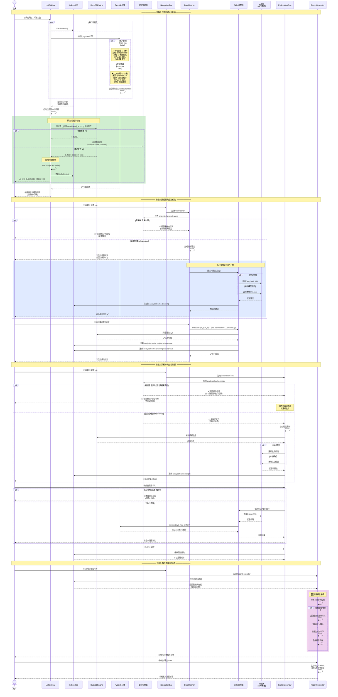

# DataPrism 用户交互时序图 - 老用户缓存使用

**最后更新**: 2025-12-22  
**场景**: 老用户打开应用，直接从缓存加载项目的快速流程  
**架构版本**: v0.9.9（含AI预加载、缓存优化、智能降级）



---

## 老用户体验优势

### 1. **秒开应用** ⚡
- Pyodide本地缓存：1-3秒启动
- 项目列表即时加载
- 数据表快速验证

### 2. **智能缓存** 🧠
| 缓存项 | 缓存策略 | 失效条件 |
|-------|---------|---------|
| AI清洗建议 | localStorage | 数据清洗后 |
| 洞察假设 | IndexedDB | 数据变更后 |
| 执行结果 | IndexedDB | 代码变更后 |
| 证据池 | IndexedDB | 用户手动删除 |

### 3. **零等待显示** 🚀
- **清洗建议**: 缓存直接显示（0秒）
- **洞察假设**: 缓存直接显示（0秒）  
- **执行结果**: 缓存直接显示（0秒）
- **报告预览**: 增量生成（<1秒）

### 4. **自动降级** 🛡️
```
表失效 → 提示重新上传
API超时 → 降级到Mock
网络断开 → 本地模式继续
```

---

## 缓存失效机制

### 触发条件
1. **数据清洗后**:
   - `analysisCache.insight.isStale = true`
   - `analysisCache.cleaning.isStale = true`

2. **文件重新上传**:
   - 清空所有缓存
   - 重置 tableName

3. **用户手动刷新**:
   - 强制重新生成

### 验证逻辑
```typescript
// 1. 检查表是否存在
const tableExists = await db.checkTable(tableName);

// 2. 检查缓存是否有效
const isCacheValid = !analysisCache?.isStale && tableExists;

// 3. 决定加载策略
if (isCacheValid) {
    // 0秒显示缓存
    return loadFromCache();
} else {
    // 后台刷新
    return refreshInBackground();
}
```

---

## 性能对比

| 指标 | 新用户首次 | 老用户缓存 | 提升 |
|-----|----------|----------|------|
| **应用启动** | 1-3秒 | 1-3秒 | 相同 |
| **数据加载** | 2-5秒 | **0秒** | **即时** |
| **AI建议** | 10-30秒 | **0秒** | **即时** |
| **洞察显示** | 20-60秒 | **0秒** | **即时** |
| **报告生成** | 5-10秒 | **<1秒** | **10倍+** |

---

## 缓存优化策略

### 预加载机制 ⚡
```typescript
// 页面加载时并行预加载
Promise.all([
    loadPyodideEngine(),      // Pyodide引擎
    loadProjectMetadata(),    // 项目元数据
    preloadAICache(),         // AI缓存
    warmupSkillsDispatcher()  // Skills预热
]);
```

### 智能失效 🧹
- **时间维度**: 7天未使用 → 自动清理
- **空间维度**: 缓存超5MB → 压缩或删除旧项目
- **数据维度**: 数据变更 → 标记isStale，保留旧值供对比

---

## 用户体验亮点

1. **无感知更新**: 缓存显示 + 后台刷新
2. **智能提示**: 过期数据自动提示重新上传
3. **渐进增强**: 缓存失效不阻塞基础功能
4. **完整历史**: 证据池永久保留
5. **快速迭代**: 分析流程秒级响应
