# 洞察分析模块调用流程技术分析

## 1. 模块概述
洞察分析模块（Insight Analysis）是 DataPrism 的核心智能功能，负责自动化分析数据集、生成假设并执行验证。该模块采用"双模引擎"（本地LLM/云端API）与"双重验证"（静态质量门控+动态执行验证）架构。

## 2. 核心组件
| 组件 | 对应文件 | 职责 |
| :--- | :--- | :--- |
| **Orchestrator** | `hooks/useInsightLoaderV2.ts` | 核心调度器，管理从数据准备到结果生成的全流程 |
| **PromptEngine** | `services/prompts/batchInsightGenerator.ts` | 负责构建Prompt、解析AI响应、JSON修复 |
| **AI Service** | `services/localLLMService.ts` | 封装WebLLM调用，管理GPU资源与模型状态 |
| **Executor** | `services/skills/modeExecutor.ts` | 执行具体的分析代码（Python/SQL） |
| **Validator** | `utils/qualityGate.ts` | 静态质量检查，过滤幻觉或格式错误的洞察 |
| **Data Access** | `db/duckdbEngine.ts` | 数据采样、元数据获取 |

## 3. 技术调用流程详解

### 3.1 阶段一：数据准备与脱敏 (Pre-Processing)
1. **数据获取**: 调度器首先检查是否传入了充分的元数据。若缺失，调用 `DuckDBEngine` 获取表结构 (`DESCRIBE`) 和总行数。
2. **智能采样**: 为避免Token溢出，调用 `sampleDataForAI` 抽取前1000行样本。
3. **隐私检查**: 调用 `prepareAIInput` 检查数据敏感性，决定是否开启脱敏模式（Sanitization）。
4. **列数截断**: 强制限制用于Prompt的列数上限（Top 50），防止上下文超长。

### 3.2 阶段二：AI 生成 (Generation)
1. **Prompt构建**: `batchInsightGenerator` 根据数据特征构建结构化Prompt，强制要求返回 JSON 数组格式，包含 `full_mode` (Python) 和 `aggregated_mode` (SQL) 两种执行方案。
2. **模式路由**:
   - **Local Mode**: 检查 WebGPU 能力与显存限制。调用 `localLLMService`，通过 `localModelQueue` 队列串行执行，防止 GPU 崩溃。
   - **Cloud Mode**: 作为降级方案或默认方案，调用远程 API。

### 3.3 阶段三：解析与静态门控 (Parsing & Static Gate)
1. **响应解析**: 接收 AI 的原始字符串，进行 JSON 截断修复 (`attemptJSONRepair`) 和解析。
2. **静态验证**: 调用 `batchValidateInsights` 对生成的建议进行评分。检查项包括：
   - 标题与描述的完整性
   - 引用列是否存在于原始数据中（防幻觉）
   - 代码语法的基本检查

### 3.4 阶段四：动态执行与验证 (Execution & Dynamic Gate)
1. **内存预估**: 在执行前，调用 `assessMemoryBeforeExecution` 估算 Pyodide 执行所需内存，决定使用 `full_mode` (全量pandas) 还是 `aggregated_mode` (DuckDB聚合+绘图)。
2. **沙箱执行**: 依次执行通过筛选的洞察（限制并发数和总数），在 Pyodide 或 DuckDB 中运行生成的代码。
3. **结果验证**: 执行完成后，检查生成的图片 (`base64`) 和摘要是否有效。无效结果（如空白图、报错）将被丢弃。

## 4. 交互时序图

```mermaid
sequenceDiagram
    participant User
    participant UI as UI Component
    participant Hook as useInsightLoaderV2
    participant DB as DuckDBEngine
    participant Sec as DataPrivacy/Sampling
    participant Prompt as BatchInsightGenerator
    participant LLM as LocalLLM/CloudAI
    participant Gate as QualityGate
    participant Exec as SkillExecutor
    participant Ctx as InsightChainContext

    User->>UI: 1. 点击"生成洞察"按钮
    UI->>Hook: loadInsights(tableName, columns)
    
    rect rgb(30, 30, 40)
        Note over Hook, DB: 阶段一：数据准备
        Hook->>DB: Describe Table / Count Rows
        DB-->>Hook: Schema & Stats
        Hook->>Sec: Sample Data (1000 rows)
        Hook->>Sec: PrepareAIInput (隐私检查)
        Sec-->>Hook: 脱敏后的数据 & 模式
    end

    rect rgb(40, 40, 50)
        Note over Hook, LLM: 阶段二：AI 生成
        Hook->>Prompt: generateBatchInsightsPrompt
        Prompt-->>Hook: Prompt String
        
        alt Mode = Local LLM
            Hook->>LLM: generateInsight(prompt)
            LLM->>LLM: WebLLM Execution (GPU)
            Note right of LLM: 队列机制防止并发崩溃
            LLM-->>Hook: JSON String
        else Mode = Cloud API
            Hook->>LLM: askAIInsight(prompt)
            LLM-->>Hook: JSON String
        end
    end

    rect rgb(30, 40, 60)
        Note over Hook, Gate: 阶段三：解析与静态门控
        Hook->>Prompt: parseBatchInsightsResponse
        Prompt-->>Hook: InsightSuggestion[]
        Hook->>Gate: batchValidateInsights (质量检查)
        Gate-->>Hook: Validated Suggestions (Top N)
    end

    rect rgb(50, 30, 40)
        Note over Hook, Exec: 阶段四：执行验证
        loop For Each Insight (Max 5)
            Hook->>Exec: assessMemoryBeforeExecution (内存预估)
            Hook->>Exec: executeInsightWithMode (Python/SQL)
            Exec-->>Hook: Execution Result (Image/Summary)
            Hook->>Gate: validateExecutionResult (结果校验)
            
            alt Valid
                Hook->>Ctx: 构造 HypothesisCard
            else Invalid
                Hook->>Hook: 记录日志并丢弃
            end
        end
    end

    Hook-->>UI: Return HypothesisCard[]
    UI->>Ctx: Update Context & Render Cards
```

## 5. 关键设计策略
- **容错机制**: AI生成JSON错误时自动尝试修复；本地模型加载失败自动降级到云端。
- **资源保护**: 
    - **Prompt**: 限制列数和采样行数。
    - **GPU**: 显存检测与队列锁。
    - **Browser RAM**: 执行前内存预估，动态切换聚合模式。
- **质量闭环**: 从Prompt约束到静态检查，再到执行后结果校验，三层过滤确保展示给用户的内容不仅"看起来对"，而且"跑得通"。

## 6. 架构评估与优化建议

### 6.1 总体评价
**评分：A- (工程复杂度: High)**

当前架构在浏览器端成功实现了一套通常需要后端集群支撑的"数据分析流水线"，特别是在 **隐私计算（本地模型/脱敏）** 和 **资源自适应（双模执行）** 方面展现了前瞻性设计。然而，核心逻辑过度集中在 Hook 层，且对 LLM 输出格式的依赖较脆弱，工程扩展性面临挑战。

### 6.2 核心亮点 (Strengths)
1. **"双模执行"资源熔断 (Resource Adaptive)**: 通过 `MemoryAssessment` 动态切换 Pandas/DuckDB 模式，完美解决了 WASM 内存限制，极大拓展了浏览器的处理边界。
2. **本地 AI 并发安全 (Concurrency Safety)**: `localModelQueue` 确保了 GPU 资源的独占访问，防止了因抢占导致浏览器崩溃。
3. **多层级容错 (Resilience)**: 即使 AI 生成格式错误或执行失败，也能通过正则修复和预置模板实现降级，确保用户体验不中断。

### 6.3 潜在风险 (Weaknesses)
1. **"上帝 Hook" (God Object)**: `useInsightLoaderV2` 承担了 UI、数据准备、AI 调用、解析、执行等过多职责，难以测试和维护。
2. **脆弱的 JSON 依赖**: 依赖 AI 输出完美 JSON 或正则修复是不稳定的，尤其是对于量化后的本地小模型。
3. **Prompt 耦合**: 提示词硬编码在生成器中，难以进行 A/B 测试或快速迭代。

### 6.4 优化建议 (Optimization Plan)
1. **Pipeline 模式重构**: 将 `useInsightLoaderV2` 拆解为 `DataPrepService`, `InsightGenerator`, `ExecutorService` 等独立服务。
2. **强化输出控制**: 利用 WebLLM 的 Grammar 功能强制 AI 输出合法 JSON，而非事后修复。
3. **增强可观测性**: 引入 Trace View 面板，可视化展示 Prompt、原始响应和执行内存峰值，便于调试。
