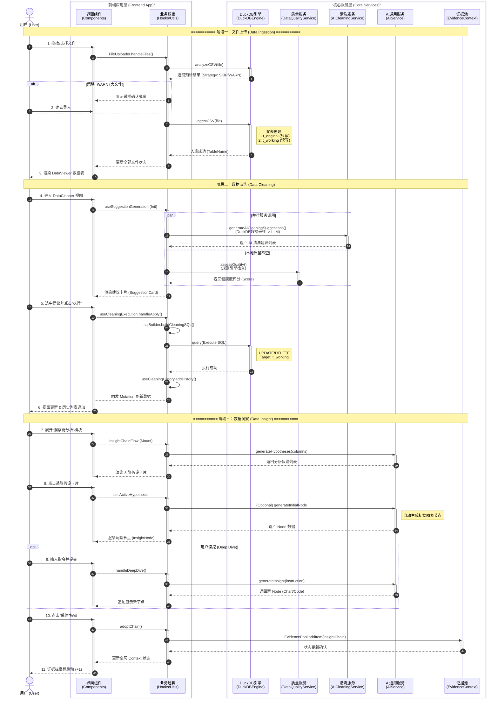

# 用户交互时序图 (User Interaction Flow)

该文档梳理了 **DataPrism** 系统中“文件上传 > 数据清洗 > 数据洞察”的完整用户交互时序图。

**更新日志**：
- **v2**: 将核心服务拆分为独立泳道 (`DuckDB`, `QualitySvc`, `CleanSvc`, `AISvc`, `EvidenceStore`)，展示更细粒度的调用交互。

图表设计规范：
1.  **左侧 (User/UI)**：聚焦用户显式操作与界面反馈。
2.  **右侧 (Core Services)**：将逻辑层与具体的基础设施服务解耦，明确数据流向。
3.  **正交性**：所有交互线段水平且垂直，流程清晰。

## 完整时序图 (Detailed Service Interaction)

## 服务职责定义

*   **DuckDBEngine**: 负责所有本地数据的存储、查询和物理表操作（Ingest, Query）。管理 `original` 和 `working` 双表生命周期。
*   **DataQualityService**: 客户端轻量级服务，直接基于部分数据进行规则计算（缺失率、重复率等），提供即时健康度反馈。
*   **AICleaningService**: 负责与 LLM 交互，提供复杂的数据清洗建议。包含 Prompt 构建、结果解析和格式化。
*   **AIService**: 通用 AI 服务，负责“分析假设生成”、“自由数据洞察”和“代码生成/解释”。
*   **EvidenceContext (Store)**: 全局状态容器，负责存储用户采纳的有价值分析片段（证据），供后续报告生成使用。
