# ��：质�门�模�详细时�图

**作者**: Google Antigravity Agent  
**日期**: 2025-12-24  
**版本**: v1.0  
**相关代�**: `src/utils/qualityGate.ts`

---

## 📋 模�概述

**质�门�（Quality Gate）** 是�察分�链路中的关键过滤器，负责在Skills执行�过滤�质��察。

**核心�责**：
- � **执行�过滤**：��浪费计算资�在�质�代�上
- 📊 **4维度评分**：代�质��AI置信度�数�覆盖�统计显著性
- ✅ **60分阈值**：总分≥60�通过
- 🚫 **拒��因**：记录详细的拒��由

---

## 1. �个�察验��程

### 1.1 完整验�时�图

```mermaid
sequenceDiagram
    autonumber
    
    participant Caller as 调用方<br/>(useInsightLoader)
    participant QG as qualityGate<br/>validateInsight()
    participant CodeEval as 代�质�评估<br/>evaluateCodeQuality()
    participant AIEval as AI置信度评估<br/>evaluateAIConfidence()
    participant DataEval as 数�覆盖评估<br/>evaluateDataCoverage()
    participant SigEval as 显著性评估<br/>evaluateSignificance()
    participant Logger as logger
    
    Caller->>QG: validateInsight(insight)
    Note over QG: �始化评分对象<br/>total=0, passed=false
    
    Note over QG: === 维度1：代�质�（0-30分）===
    QG->>CodeEval: evaluateCodeQuality(insight)
    
    CodeEval->>CodeEval: 检查代�长度<br/>100-5000字符
    alt 长度��
        CodeEval->>CodeEval: +5分
    end
    
    CodeEval->>CodeEval: 检查必�导入<br/>import+matplotlib+base64
    alt 包�所需导入
        CodeEval->>CodeEval: +5分
    end
    
    CodeEval->>CodeEval: 检查数�处�逻辑<br/>包�'df'或'DataFrame'
    alt 包�数�处�
        CodeEval->>CodeEval: +10分
    end
    
    CodeEval->>CodeEval: 检查�视化代�<br/>包�'plt.'或'fig'
    alt 包��视化
        CodeEval->>CodeEval: +10分
    end
    
    CodeEval-->>QG: 返�代�质�分数（0-30）
    QG->>QG: codeQuality = 返�值
    
    Note over QG: === 维度2：AI置信度（0-40分）===
    QG->>AIEval: evaluateAIConfidence(insight)
    
    AIEval->>AIEval: 检查标题长度<br/>3-50字符
    alt 标题��
        AIEval->>AIEval: +10分
    end
    
    AIEval->>AIEval: 检查�述长度<br/>10-200字符
    alt �述详细
        AIEval->>AIEval: +10分
    end
    
    AIEval->>AIEval: 检查�模�完整性<br/>full_mode + aggregated_mode
    alt �模�都存在
        AIEval->>AIEval: +20分
    else 仅full_mode存在
        AIEval->>AIEval: +10分
    end
    
    AIEval-->>QG: 返�AI置信度分数（0-40）
    QG->>QG: aiConfidence = 返�值
    
    Note over QG: === 维度3：数�覆盖（0-20分）===
    QG->>DataEval: evaluateDataCoverage(insight)
    
    DataEval->>DataEval: ��columns_used列表
    DataEval->>DataEval: 计算：列数 × 10<br/>最多20分
    
    alt 使用1个列
        DataEval->>DataEval: 10分
    else 使用2个列
        DataEval->>DataEval: 20分（�顶）
    else 使用3个以上列
        DataEval->>DataEval: 20分（�顶）
    end
    
    DataEval-->>QG: 返�数�覆盖分数（0-20）
    QG->>QG: dataCoverage = 返�值
    
    Note over QG: === 维度4：统计显著性（0-10分）===
    QG->>SigEval: evaluateSignificance(insight)
    
    Note over SigEval: ⚠� 当���：<br/>默认给满分10分<br/>TODO: 未�基�统计检验
    SigEval->>SigEval: 返�固定值10分
    
    SigEval-->>QG: 返�显著性分数（10）
    QG->>QG: significance = 10
    
    Note over QG: === 计算总分�判定 ===
    QG->>QG: total = codeQuality + aiConfidence<br/>+ dataCoverage + significance
    QG->>QG: passed = (total >= 60)
    
    alt 总分 < 60分
        QG->>QG: 记录拒��因
        
        alt codeQuality < 15
            QG->>QG: reasons.push('代�质��足')
        end
        
        alt aiConfidence < 20
            QG->>QG: reasons.push('AI置信度过�')
        end
        
        alt dataCoverage < 10
            QG->>QG: reasons.push('数�覆盖�足')
        end
    end
    
    Note over QG: === 日志记录 ===
    QG->>Logger: log('质�门�', '评分: X/100')
    Logger->>Logger: 记录详细breakdown<br/>{code, ai, coverage, sig}
    
    alt passed = false
        Logger->>Logger: 记录拒��因数组
    end
    
    QG-->>Caller: 返�QualityScore对象<br/>{total, passed, reasons, ...}
```



---

## 2. 批�验��程

### 2.1 批�验�时�图

```mermaid
sequenceDiagram
    autonumber
    
    participant Hook as useInsightLoader
    participant BatchQG as qualityGate<br/>batchValidateInsights()
    participant ValidateOne as validateInsight()
    participant Logger as logger
    
    Hook->>BatchQG: batchValidateInsights(insights)
    Note over BatchQG: �收AI生�的�察数组<br/>例如：10个�察
    
    Note over BatchQG: === �个验� ===
    loop �个�察
        BatchQG->>ValidateOne: validateInsight(insight)
        ValidateOne->>ValidateOne: 执行4维度评分<br/>（�图1）
        ValidateOne-->>BatchQG: 返�QualityScore<br/>{total, passed, reasons}
        BatchQG->>BatchQG: 收集验�结�<br/>{insight, score}
    end
    
    Note over BatchQG: === 过滤通过的�察 ===
    BatchQG->>BatchQG: passed = validated.filter(<br/>v => v.score.passed)
    
    Note over BatchQG: 示例结�：<br/>10个�察 → 6个通过
    
    BatchQG->>Logger: log('质�门�', '批�验�完�')
    Logger->>Logger: 记录：6/10 通过
    
    BatchQG-->>Hook: 返�通过的�察数组<br/>Array<{insight, score}>
    
    Note over Hook: === �续处� ===
    alt 过滤�数� > 0
        Hook->>Hook: 对通过的�察执行Skills
    else 过滤�数� = 0
        Hook->>Hook: 触�Fallback模�
        Note over Hook: 返�3个预置�察<br/>（数�概览�缺失值�类�分布）
    end
```



---

## 3. 评分规则详解

### 3.1 代�质�评分（0-30分）

```mermaid
graph TD
    A[代�质�评估] --> B{代�长度100-5000?}
    B -->|是| C[+5分]
    B -->|�| D[0分]
    
    A --> E{包�import+matplotlib+base64?}
    E -->|是| F[+5分]
    E -->|�| G[0分]
    
    A --> H{包�df或DataFrame?}
    H -->|是| I[+10分]
    H -->|�| J[0分]
    
    A --> K{包�plt.或fig?}
    K -->|是| L[+10分]
    K -->|�| M[0分]
    
    C --> N[累计分数]
    D --> N
    F --> N
    G --> N
    I --> N
    J --> N
    L --> N
    M --> N
    
    N --> O{总分 >= 15?}
    O -->|是| P[代�质��格]
    O -->|�| Q[拒��因: 代�质��足]
```



**�际代�示例**：
```typescript
// qualityGate.ts:102-131
function evaluateCodeQuality(insight: InsightForValidation): number {
    let score = 0;
    const code = insight.full_mode.code;

    // ✅ 检查1：代�长度（5分）
    if (code.length > 100 && code.length < 5000) {
        score += 5;
    }

    // ✅ 检查2：必�导入（5分）
    const hasImports = code.includes('import') &&
        code.includes('matplotlib') &&
        code.includes('base64');
    if (hasImports) {
        score += 5;
    }

    // ✅ 检查3：数�处�（10分）
    const hasDataProcessing = code.includes('df') || code.includes('DataFrame');
    if (hasDataProcessing) {
        score += 10;
    }

    // ✅ 检查4：�视化（10分）
    const hasVisualization = code.includes('plt.') || code.includes('fig');
    if (hasVisualization) {
        score += 10;
    }

    return score; // 最高30分
}
```

---

### 3.2 AI置信度评分（0-40分）

```mermaid
graph TD
    A[AI置信度评估] --> B{标题长度3-50?}
    B -->|是| C[+10分]
    B -->|�| D[0分]
    
    A --> E{�述长度10-200?}
    E -->|是| F[+10分]
    E -->|�| G[0分]
    
    A --> H{⚠� 严格�模�检查}
    H --> I{full_mode存在?}
    I -->|�| K[� 直�返�0分<br/>必定拒�]
    I -->|是| J{aggregated_mode完整?<br/>sql + viz_code}
    
    J -->|是| L[+20分<br/>�模�完整 ✅]
    J -->|�| M[� 直�返�0分<br/>必定拒�]
    
    C --> N[累计分数]
    D --> N
    F --> N
    G --> N
    L --> N
    
    K -.�累计.-> End[强制总分=0]
    M -.�累计.-> End
    
    N --> O{总分 >= 20?}
    O -->|是| P[AI置信度�格]
    O -->|�| Q[拒��因: AI置信度过�]
    
    style K fill:#f8d7da
    style M fill:#f8d7da
    style End fill:#f8d7da
    style L fill:#d4edda
```



**关键�更** ⚠�：
```typescript
// qualityGate.ts:150-169 (已修改)
const hasBothModes =
    insight.full_mode?.code &&
    insight.aggregated_mode?.sql &&
    insight.aggregated_mode?.viz_code;

if (hasBothModes) {
    score += 20; // �模�完整
} else {
    // � 严格�求：缺少�模�直�拒�
    logger.warn('质�门�', 'AI未生��模�Skills，直�拒�');
    return 0; // 直�返�0分，总分必定<60
}
```

**影�**：
- ✅ **强制AI生��模�**：full_mode + aggregated_mode 缺一��
- ✅ **MVP核心需求**：内存评估�赖�模�切�
- � **旧逻辑（已删除）**：`else if (insight.full_mode?.code) { score += 10; }` 太宽�

---

### 3.3 数�覆盖评分（0-20分）

```mermaid
graph TD
    A[数�覆盖评估] --> B{��columns_used}
    B --> C{使用列数?}
    
    C -->|0列| D[0分<br/>无数�覆盖]
    C -->|1列| E[10分]
    C -->|2列| F[20分<br/>�顶]
    C -->|3+列| G[20分<br/>�顶]
    
    D --> H{总分 >= 10?}
    E --> H
    F --> H
    G --> H
    
    H -->|是| I[数�覆盖�格]
    H -->|�| J[拒��因: 数�覆盖�足]
```



**计算公�**：
```typescript
// qualityGate.ts:168-177
const columnsUsed = insight.columns_used?.length || 0;
if (columnsUsed > 0) {
    score = Math.min(columnsUsed * 10, 20); 
    // �个列10分，最多20分
}
```

---

### 3.4 统计显著性评分（0-10分）

```mermaid
graph TD
    A[统计显著性评估] --> B[⚠� 当���简化]
    B --> C[直�返�10分<br/>默认满分]
    
    C --> D[TODO: 未�改进]
    D --> E[基�代�中的统计检验]
    E --> F[例如: ttest, chi2, correlation]
    
    style B fill:#fff3cd
    style C fill:#fff3cd
    style D fill:#d1ecf1
    style E fill:#d1ecf1
    style F fill:#d1ecf1
```



**当���**：
```typescript
// qualityGate.ts:183-191
function evaluateSignificance(_insight: InsightForValidation): number {
    // �留�数供未�扩展
    void _insight;

    let score = 10; // ⚠� 默认给满分

    // TODO: 未��基�统计检验加分
    // 例如：检测代�中是�包� scipy.stats.ttest_ind

    return score;
}
```

---

## 4. 完整评分决策树

```mermaid
graph TD
    Start[开始评分] --> C1[代�质�: 0-30分]
    Start --> C2[AI置信度: 0-40分]
    Start --> C3[数�覆盖: 0-20分]
    Start --> C4[统计显著性: 10分固定]
    
    C1 --> Sum[计算总分]
    C2 --> Sum
    C3 --> Sum
    C4 --> Sum
    
    Sum --> Decision{总分 >= 60?}
    
    Decision -->|是| Pass[✅ 通过质�门�]
    Decision -->|�| Fail[� 拒�]
    
    Fail --> Reason{分�拒��因}
    Reason --> R1{代�质� < 15?}
    Reason --> R2{AI置信度 < 20?}
    Reason --> R3{数�覆盖 < 10?}
    
    R1 -->|是| Msg1[�因1: 代�质��足]
    R2 -->|是| Msg2[�因2: AI置信度过�]
    R3 -->|是| Msg3[�因3: 数�覆盖�足]
    
    Pass --> Log1[记录日志: 评分 X/100 ✅通过]
    Msg1 --> Log2[记录日志: 评分 X/100 �拒�<br/>+ 拒��因数组]
    Msg2 --> Log2
    Msg3 --> Log2
    
    Log1 --> End[返�QualityScore]
    Log2 --> End
    
    style Pass fill:#d4edda
    style Fail fill:#f8d7da
```



---

## 5. 典�评分示例

### 5.1 高质��察（通过）✅

**AI生�内容**：
```json
{
  "title": "销售�按月趋势分�",
  "description": "分�过�12个月的销售��化趋势，识别季节性模�",
  "columns_used": ["order_date", "total_amount"],
  "full_mode": {
    "code": "import pandas as pd\nimport matplotlib.pyplot as plt\nimport base64\nfrom io import BytesIO\n\ndf_sorted = df.sort_values('order_date')\ndf_sorted['month'] = pd.to_datetime(df_sorted['order_date']).dt.to_period('M')\nmonthly_sales = df_sorted.groupby('month')['total_amount'].sum()\n\nplt.figure(figsize=(10,6))\nplt.plot(monthly_sales.index.astype(str), monthly_sales.values)\nplt.title('Monthly Sales Trend')\nplt.xlabel('Month')\nplt.ylabel('Total Sales')\n\nbuf = BytesIO()\nplt.savefig(buf, format='png')\nbuf.seek(0)\nimage_base64 = base64.b64encode(buf.read()).decode('utf-8')\nprint(f'IMAGE:{image_base64}')"
  },
  "aggregated_mode": {
    "sql": "SELECT strftime('%Y-%m', order_date) as month, SUM(total_amount) as total FROM __TABLE_NAME__ GROUP BY month ORDER BY month",
    "viz_code": "import matplotlib.pyplot as plt\nimport base64\nfrom io import BytesIO\n\nplt.figure(figsize=(10,6))\nplt.plot(df['month'], df['total'])\nplt.title('Monthly Sales Trend')\n\nbuf = BytesIO()\nplt.savefig(buf, format='png')\nbuf.seek(0)\nimage_base64 = base64.b64encode(buf.read()).decode('utf-8')\nprint(f'IMAGE:{image_base64}')"
  }
}
```

**评分过程**：
```
代�质�:
  ✅ 长度1500字符（100-5000）→ 5分
  ✅ 包�import+matplotlib+base64 → 5分
  ✅ 包�df → 10分
  ✅ 包�plt. → 10分
  �计: 30分

AI置信度:
  ✅ 标题14字符（3-50）→ 10分
  ✅ �述30字符（10-200）→ 10分
  ✅ �模�完整 → 20分
  �计: 40分

数�覆盖:
  ✅ 使用2个列 → 20分
  �计: 20分

统计显著性:
  ✅ 默认满分 → 10分
  �计: 10分

总分: 30 + 40 + 20 + 10 = 100分
判定: ✅ 通过（100 >= 60）
```

---

### 5.2 �质��察（拒�）�

**AI生�内容**：
```json
{
  "title": "分�",
  "description": "数�分�",
  "columns_used": ["col1"],
  "full_mode": {
    "code": "df.plot()"
  },
  "aggregated_mode": null  // � 缺失
}
```

**评分过程**：
```
代�质�:
  � 长度9字符（<100）→ 0分
  � 缺少import → 0分
  ✅ 包�df → 10分
  ✅ 包�plot → 10分
  �计: 20分

AI置信度:
  � 标题2字符（<3）→ 0分
  � �述4字符（<10）→ 0分
  � aggregated_mode缺失 → 直�返�0 ⚠� 严格拒�
  �计: 0分（强制）

数�覆盖:
  ✅ 使用1个列 → 10分
  �计: 10分

统计显著性:
  ✅ 默认满分 → 10分
  �计: 10分

总分: 20 + 0 + 10 + 10 = 40分
判定: � 拒�（40 < 60）

拒��因:
  - AI置信度过�（0 < 20）✅
  - AI未生��模�Skills（直�拒�）✅
```

**关键�更**：
- 🔴 **旧逻辑**：仅full_mode也能得10分 → 总分50分（�能通过if其他维度高）
- 🟢 **新逻辑**：缺少aggregated_mode直�0分 → 总分40分（必定拒�）

---

## 6. 已知�制�改进方�

### 6.1 当��制 ⚠�

| �制 | 影� | 示例 |
|------|------|------|
| **无语法检查** | 语法错误的代�会通过 | `plt.plot(df['col1)` 缺引��得分 |
| **无列�验�** | �存在的列会通过 | `df['non_existent'].plot()` 会通过 |
| **���弱** | 容易被骗 | `print('plt.')` 也会得分 |
| **显著性虚�** | 直��10分 | 所有�察都得满分 |

### 6.2 改进路线图

```mermaid
graph LR
    V1[当�版本<br/>���规则] --> V2[Phase 1<br/>基础语法检查]
    V2 --> V3[Phase 2<br/>列�存在性验�]
    V3 --> V4[Phase 3<br/>Python AST解�]
    V4 --> V5[Phase 4<br/>统计检验识别]
    
    style V1 fill:#d4edda
    style V2 fill:#fff3cd
    style V3 fill:#d1ecf1
    style V4 fill:#d1ecf1
    style V5 fill:#d1ecf1
```



**Phase 1: 基础语法检查**（P1）
- 检测括�匹�
- 检测引�匹�
- 检测基础Python语法错误

**Phase 2: 列�存在性验�**（P1）
- �DuckDB���际列�
- 检查`columns_used`是�真�存在
- 列��存在直�0分

**Phase 3: Python AST解�**（P2）
- 使用轻�级Python解�器
- 验�代��解�性
- 语法错误直�0分

**Phase 4: 统计检验识别**（P2）
- 检测代�中使用的统计方法
- 根���度动�评分

---

## 7. 性能�监�

### 7.1 执行性能

```mermaid
graph LR
    A[10个�察] --> B[批�验�<br/>~10ms]
    B --> C[过滤通过<br/>6个]
    C --> D[节�Skills执行<br/>4×2秒=8秒]
    
    style D fill:#d4edda
```



**预期收益**：
- ✅ 验�开销：10个�察约10ms（�忽略）
- ✅ 资�节�：过滤40-50%无效�察
- ✅ 时间节�：��8-10秒无效Skills执行

### 7.2 监�指标

**日志示例**：
```
[质�门�] 评分: 85/100 ✅通过 {
  title: "销售�趋势",
  breakdown: { code: 30, ai: 40, coverage: 20, sig: 10 }
}

[质�门�] 评分: 45/100 �拒� {
  title: "分�",
  breakdown: { code: 15, ai: 10, coverage: 10, sig: 10 },
  reasons: ['AI置信度过�', '数�覆盖�足']
}

[质�门�] 批�验�完�: 6/10 通过
```

---

## 8. �考文档

- [�察分�交互时�图](./11-��-�察分�交互时�图.md) - 主�程
- [时�图�代�差异分�](../../.gemini/antigravity/brain/.../sequence_diagram_code_diff.md)
- 代���：`src/utils/qualityGate.ts`

---

**文档维护**: 代�修改��步更新此时�图
# 补充内容：添加到12-��-质�门�详细时��md末尾

---

## 9. ��质�门�（执行�+执行�）🆕

### 9.1 设计背景

**当�问题**�
- �执行�门�：�以过滤代�质�差的�察
- �无法检测：空白图表�无效Summary�执行�功但无价值的结�
- ⚠� 用户体验：�能看�技术上�功但�际无�的��

**解决方案**：�加执行�质�评估，确�展示的�察真正有价值�

---

### 9.2 完整�程时��

```mermaid
sequenceDiagram
    autonumber
    
    participant Hook as useInsightLoader
    participant PreGate as 质�门�(执行�<br/>validateInsightCode()
    participant Skills as Skills执行�
    participant PostGate as 质�门�(执行�<br/>validateInsightResult() 🆕
    participant UI as �端UI
    participant Logger as �索日志
    
    Note over Hook: AI生�10个�察建�
    Hook->>PreGate: 批�验�代�质�
    
    Note over PreGate: === 执行�评�===
    PreGate->>PreGate: 代�质�(0-30)<br/>AI置信�0-40)<br/>数�覆盖(0-20)<br/>统计显著�0-10)
    
    alt 执行�得�>= 60
        PreGate-->>Hook: �通过: 6�br/>�拒�: 4�
        Note over Hook: 记录被拒��察到日志
        
        Note over Hook: === Skills执行阶段 ===
        loop �个通过的��
            Hook->>Skills: 执行�察代�
            Skills->>Skills: Pyodide�行Python<br/>生�图表+Summary
            
            alt 执行�功
                Skills-->>Hook: 返�结�{<br/>  image: Base64,<br/>  summary: string<br/>}
                
                Note over Hook: === 执行�评�🆕 ===
                Hook->>PostGate: validateInsightResult(result, insight)
                
                PostGate->>PostGate: 执行�功�0-30)<br/>有图�Summary?
                PostGate->>PostGate: �视化质�0-40)<br/>图表>10KB? Summary>50�
                PostGate->>PostGate: 数�有效�0-20)<br/>包�数字和统计关键�?
                PostGate->>PostGate: 用户价�0-10)<br/>四�素完�
                PostGate->>PostGate: 计算总分(0-100)
                
                alt 执行�得�>= 60
                    PostGate-->>Hook: �高价值��
                    Hook->>UI: 展示给用�
                    UI->>用户: ���察�片
                    
                else 执行�得�< 60
                    PostGate-->>Hook: ⚠� �价值��
                    Hook->>Logger: 记录��索日志"
                    Note over Logger: score: 45/100<br/>reasons: ["�视化质��"]
                    Hook->>UI: 折�/�展�
                end
                
            else 执行失败
                Skills-->>Hook: 返�错误
                Hook->>Logger: 记录�执行失败日志"
            end
        end
        
    else 执行�得�< 60
        PreGate-->>Hook: �全部拒�
        Hook->>Hook: 触�Fallback模�
    end
    
    Note over UI: 最终用户看到：<br/>1. 高质�����门�通过)<br/>2. (���索日志(�价值��
```



---

### 9.3 执行�评估标�

#### 维度1：执行�功性（0-30分）

| 检查项 | 分数 | 判断标准 |
|--------|------|---------|
| 图表存在 | 15�| `result.image` �空且长�100 |
| Summary存在 | 15�| `result.summary` �空且长�20 |

```typescript
function evaluateExecutionSuccess(result): number {
    let score = 0;
    if (result.image && result.image.length > 100) score += 15;
    if (result.summary && result.summary.length > 20) score += 15;
    return score;
}
```

---

#### 维度2：�视化质��-40分）

| 检查项 | 分数 | 判断标准 |
|--------|------|---------|
| 图表大� | 20�| Base64解��>10KB（�是空白图�|
| Summary长度 | 20�| >50字符（有�质内容�|

```typescript
function evaluateVisualizationQuality(result): number {
    let score = 0;
    
    // 图表大�检查（防止空白图）
    if (result.image) {
        const imageSizeKB = (result.image.length * 3/4) / 1024;
        if (imageSizeKB > 10) score += 20;
        else if (imageSizeKB > 1) score += 10;
    }
    
    // Summary质�检�
    if (result.summary && result.summary.length > 50) score += 20;
    else if (result.summary && result.summary.length > 20) score += 10;
    
    return score;
}
```

---

#### 维度3：数�有效性（0-20分）

```typescript
function evaluateDataValidity(result): number {
    let score = 0;
    const summary = result.summary || '';
    
    // 检查数�
    if (/\d+/.test(summary)) score += 10;
    
    // 检查统计关键�
    const statsKeywords = ['平�', '最�, '最�, '趋势', '�长', '下�', '相关'];
    if (statsKeywords.some(kw => summary.includes(kw))) score += 10;
    
    return score;
}
```

---

#### 维度4：用户价值（0-10分）

```typescript
function evaluateUserValue(insight, result): number {
    const hasAll = 
        insight.title?.length > 3 &&
        insight.description?.length > 10 &&
        result.image?.length > 100 &&
        result.summary?.length > 20;
    
    return hasAll ? 10 : 0;
}
```

---

### 9.4 典�场景对比

**场景1：完���* �
```json
{
  "title": "销售�月度趋势分�",
  "executionResult": {
    "image": "...(50KB)",
    "summary": "过�12个月销售�呈�季节性，Q4平�销售�比Q2�5%�1月峰�20万元"
  }
}
```
**执行�评�*: 30+40+20+10 = **100�* ��展示

---

**场景2：空白图�* ⚠�
```json
{
  "title": "用户年龄分布",
  "executionResult": {
    "image": "...(2KB, 空白)",
    "summary": "用户年龄分布"
  }
}
```
**执行�评�*: 30+20+0+0 = **50�* �⚠� �索日志

---

### 9.5 ��门�决策矩阵

| 执行�| 执行�| 结� | 用户�� | 记录日志 |
|--------|--------|------|---------|---------|
| �0 | �0 | �高价值��| **�* | �功日志 |
| �0 | <60 | ⚠� �价值��| �索日志(�� | �价值日�|
| �0 | 失败 | �执行失败 | **�* | 失败日志 |
| <60 | - | �代�质��| **�* | 拒�日志 |

---

### 9.6 �施优先�

**P0（当�）** - 已完�：
- �执行�质�门�
- ��模�强制��
- �被拒�日志记�

**P1（建议下一步）** - 待�施：
- 🆕 执行�质�评�
- 🆕 �视化质�检�
- 🆕 Summary有效性验�
- 🆕 �价值�察日�

**P2（未�）** - 规划中：
- AI�索日志UI
- 用户�馈收集
- 动�阈值调�

---

### 9.7 预期收益

**质���**�
- 过滤空白图表（图�10KB�
- 过滤无效Summary（无数字�无统计�）
- 确�用户�看到真正有价值的�察

**数�收集**�
- 执行�拒��：期�10%
- 空白图比例：期望<5%
- Summary平�长度：期�50�

---

**总结**：��质�门�通过"代�检�结�验�"两�关�，最大化用户看到的�察质�和价值�
