# 用户交互时序图 - 预处理优化版 (Pre-processing Optimization Flow)

该文档展示了引入 **预处理 (Pre-processing)** 与 **缓存 (Caching)** 机制后的优化交互流程。

**核心优化点**：
1.  **前置计算 (Front-loading)**：将 AI 运算（清洗建议、分析假设）和质量评分计算移至文件上传后的后台任务中进行，而非用户点击时才触发。
2.  **即时响应 (Instant Feedback)**：用户进入功能模块时，直接读取缓存数据，实现“秒开”体验。
3.  **动态反馈 (Dynamic Score)**：清晰展示数据治理前后的质量分变化（如 67% → 88%）。

## 完整时序图 (Optimized Sequence Diagram)

```mermaid
sequenceDiagram
    autonumber
    actor User as 用户 (User)
    box "应用前端 (Frontend)" #ffffff
        participant UI as 界面组件<br>(Components)
        participant Store as 全局状态/缓存<br>(ProjectContext)
        participant Worker as 后台处理器<br>(BackgroundWorker)
    end
    box "核心服务 (Core Services)" #f9f9f9
        participant DB as DuckDB引擎<br>(DuckDB)
        participant Quality as 质量服务<br>(QualitySvc)
        participant AI as AI智能服务<br>(AISvc)
    end

    Note over User, AI: =========== 阶段一：智能上传与预处理 (Smart Ingestion) ===========

    User->>UI: 1. 拖拽/上传文件 (Batch Upload)
    activate UI
    UI->>DB: ingestCSV(files)
    activate DB
    DB-->>UI: 入库完成 (Tables Ready)
    deactivate DB
    
    UI->>Store: 更新文件列表 (Status: Processing)
    activate Store
    Store-->>UI: 渲染列表 (显示"分析中...")
    deactivate Store

    rect rgb(50, 60, 70)
        Note left of Worker: 🚀 [OPTIMIZED] 预处理流水线 (后台静默执行)
        
        UI->>Worker: 触发文件分析任务 (startAnalysis)
        activate Worker
        
        par 并行预处理
            Note right of Worker: ✨ [NEW] 任务 A: 质量评分前置
            Worker->>Quality: assessQuality(fileData)
            activate Quality
            Quality-->>Worker: 返回评分 (e.g. 67分)
            deactivate Quality
            Worker->>Store: Update File.qualityScore
            
        and Note right of Worker: ✨ [NEW] 任务 B: 清洗建议缓存
            Worker->>AI: generateCleaningSuggestions(sample)
            activate AI
            AI-->>Worker: 返回建议列表 (JSON)
            deactivate AI
            Worker->>Store: Cache CleaningSuggestions
            
        and Note right of Worker: ✨ [NEW] 任务 C: 洞察假设缓存
            Worker->>AI: generateHypotheses(columns)
            activate AI
            AI-->>Worker: 返回分析假设 (Hypotheses)
            deactivate AI
            Worker->>Store: Cache InsightHypotheses
        end
        
        Worker-->>UI: 通知任务完成
        deactivate Worker
    end

    UI->>Store: 订阅状态变更
    Store-->>UI: 推动更新 (Scores Ready)
    UI-->>User: 2. 列表刷新：显示文件及质量分 (🔴 67分) ✨ [NEW]
    deactivate UI

    Note over User, AI: =========== 阶段二：即时清洗与质量跃迁 (Instant Cleaning) ===========

    User->>UI: 3. 点击"数据清洗" / "查看详情"
    activate UI
    
    UI->>Store: readCache(CleaningSuggestions)
    activate Store
    Note left of Store: ⚡ [SPEED] 命中缓存，无需等待AI
    Store-->>UI: 立即返回建议列表
    deactivate Store

    UI-->>User: 4. 瞬间展示建议卡片 (无Loading)
    
    User->>UI: 5. 勾选建议并点击"一键优化"
    UI->>DB: 执行清洗 SQL (Execute Update)
    activate DB
    DB-->>UI: 影响行数确认
    deactivate DB

    Note over UI, Quality: ♻️ [Loop] 质量重评估 (Re-assessment)
    UI->>Quality: reAssessQuality(newTableData)
    activate Quality
    Quality-->>UI: 返回新评分 (e.g. 88分)
    deactivate Quality

    UI->>Store: 更新质量分 & 记录历史
    UI-->>User: 6. 界面反馈：评分跳变 (🔴 67% → 🟢 88%) ✨ [NEW]
    deactivate UI

    Note over User, AI: =========== 阶段三：即时洞察 (Instant Insight) ===========

    User->>UI: 7. 切换至"洞察链分析" Tab
    activate UI
    
    UI->>Store: readCache(InsightHypotheses)
    activate Store
    Note left of Store: ⚡ [SPEED] 命中缓存，无需等待AI
    Store-->>UI: 立即返回分析假设
    deactivate Store

    UI-->>User: 8. 瞬间展示分析假设卡片
    deactivate UI

    User->>UI: 9. 点击卡片查看详情...
    Note over User, UI: (后续深挖流程同标准版)
```



## 服务职责与数据流变更点

### 1. 全局状态 (ProjectContext/Store)
*   **新增职责**: 充当预处理结果的 **高速缓存 Layer**。
*   **存储结构**:
    ```typescript
    interface FileAnalysisCache {
        fileId: string;
        qualityScore: number;          // ✨ 实时质量分
        initialScore: number;          // ✨ 原始质量分 (用于对比)
        cleaningSuggestions: Suggestion[]; // ✨ 缓存的清洗建议
        hypotheses: Hypothesis[];      // ✨ 缓存的分析假设
        isProcessing: boolean;         // 后台处理状态
    }
    ```

### 2. 后台处理器 (BackgroundWorker)
*   **新增组件**: 负责协调多文件的并行预处理。
*   **工作流**:
    1.  监听文件上传完成事件。
    2.  对每个文件并发发起 `Quality`, `Cleaning`, `Insight` 三大请求。
    3.  将结果原子化写入 Store。

### 3. 数据可视化层 (UI)
*   **DataViewer**: 不再被动显示数据，而是主动订阅 `qualityScore`。支持显示 `(Prev -> Curr)` 的分数变化动画。
*   **DataCleaner**: 移除 "Generate Suggestions" 的 Loading 状态，改为 "Check Cache ? Render : Loading" (兜底逻辑)。
*   **InsightChain**: 移除初始 Loading，实现“打开即用”。
