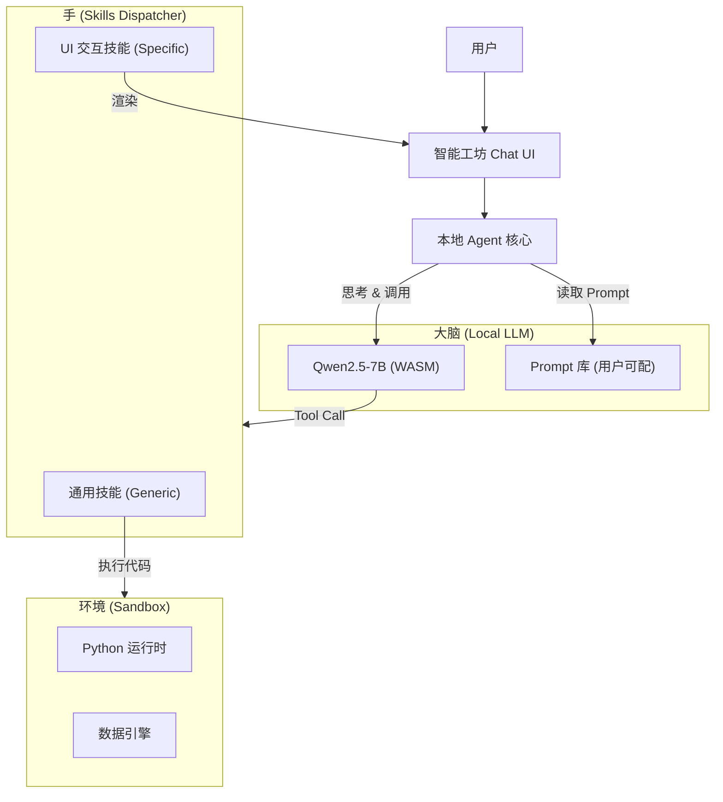

# 架构设计：本地模型 Agent 技术方案 (Local Agent V1)

> [!NOTE]
> **版本**: v1.1 (已评估)
> **状态**: ✅ 技术可行，待实施 (评估日期: 2025-12-22)
> **可行性评分**: 🟢 85/100
> **关联**: [49-技术专题-Skills架构设计与实施方案](../04-技术专题/49-技术专题-Skills架构设计与实施方案.md)

## 1. 背景与目标

### 1.1 核心需求
随着 Skills 架构（Phase 2）和本地大模型（WebLLM）的就绪，我们具备了构建**全本地、自主化 Agent** 的基础。
我们需要构建一个**内置 Agent**：
1.  **内测阶段**: 跑通数据分析全流程，掌握核心数据分析范式。
2.  **V1 阶段**: 开放给用户，支持基于 Prompt 库的自定义优化。
3.  **架构优化**: 解决"Skills 函数爆炸"问题，引入通用能力。

### 1.2 关键痛点：Skills 数量膨胀
现有设计为每个操作定义独立 Skill（如 `clean_fillna`, `clean_dedup`），导致：
*   **维护成本高**: 每加一个功能都要写定义、实现、Prompt。
*   **Token 消耗大**: System Prompt 中塞入几十个工具定义，挤占上下文。
*   **灵活性差**: AI 无法执行未定义的组合操作。

---

## 2. 核心架构设计

### 2.1 整体架构图



### 2.2 战略调整：通用 Skills (Generic Skills) 🚀

针对"注册函数太多"的问题，我们采用**"通用代码执行 + UI 桥接"**的混合策略。

#### ❌ 旧方案 (Specific Skills)
需要定义 50+ 个函数：
*   `clean_remove_nulls()`
*   `clean_standardize_date()`
*   `analytics_linear_regression()`
*   ...

#### ✅ 新方案 (Generic Skills)
包含 **3 个核心通用能力** + **少量 UI 交互能力**：

| 类别 | Skill Name | 说明 | 示例 |
|:---|:---|:---|:---|
| **通用计算** | `sys_run_python` | **(核心)** 执行任意 Python 代码 | 数据清洗、统计分析、机器学习 |
| **数据查询** | `sys_run_sql` | 执行 SQL 查询 | 数据筛选、聚合、取样 |
| **UI 交互** | `ui_render_chart` | 指示前端渲染图表 | "画个柱状图" |
| **系统反馈** | `ui_ask_user` | 请求用户确认或输入 | "检测到异常，是否删除？" |

**优势**:
1.  **注册表瘦身**: 从 50+ 缩减到 <10 个。
2.  **无限能力**: 只要 Python 能做（在 Pyodide 限制内），Agent 就能做。
3.  **Prompt 驱动**: 具体怎么"清洗日期"，由 Prompt 库中的模板定义，而不是硬编码在 Skill 里。

---

## 3. 功能模块详细设计

### 3.1 Prompt 库开放架构

用户不再是被动使用者，而是 Agent 的"调教者"。

*   **存储位置**: `src/config/prompts.json` (未来支持导入/导出)
*   **结构定义**:
    ```typescript
    interface PromptTemplate {
        id: string;          // e.g., "cleaning_expert"
        role: string;        // "你是一个拥有20年经验的数据清洗专家..."
        constraints: string[]; // ["优先使用 pandas", "不仅要代码，还要解释"]
        few_shots: Array<{   // 少样本示例（教 Agent 写正确的 Python）
            user: string;
            assistant: string; // 包含 sys_run_python 调用
        }>;
    }
    ```
*   **用户侧功能**:
    *   **Prompt 市场**: 内置高质量模板。
    *   **自定义优化**: 用户发现 Agent 写代码老报错，可以修改 Prompt 加一条"不要使用 xxx 库"。

### 3.2 交互面板 (Enhanced Copilot Bar)

响应用户关于"探索流底部已有输入框"的反馈，我们放弃独立的右侧对话栏，转而在**现有布局基础上进行增强**：

*   **位置**: 保持在 `ExplorationFlow` 底部的 `DeepDiveInput` 组件位置。
*   **形态升级**: 从简单的 Text Input 升级为 **Agent Copilot Bar**。
*   **交互模式**:
    *   **原地展开**: 用户输入后，输入框上方展开"思考气泡" (Thinking Bubble)，实时展示 Agent 的推理步、工具调用状态。
    *   **结果流式插入**: Agent 生成的文字结论、图表卡片，直接作为新的 `InsightNode` 插入到上方的时间轴流中。
    *   **过程可见性**: 在节点生成过程中，显示简化的过程卡片（如 "正在编写 Python 代码...", "正在查询 DuckDB..."），点击可展开查看详细日志。
    *   **Artifacts 预览**: 复杂产物（如完整报告、独立页面）以卡片形式插入流中，点击可全屏预览。

**优势**:
*   **无缝融合**: 不破坏现有的 Timeline 浏览心流。
*   **空间节省**: 无需挤占侧边栏空间，保证主视觉区域（图表/数据）最大化。

### 3.3 数据流与生命周期 (Data Flow)

针对用户关于"结果归档"的疑问，我们设计了明确的**三级漏斗模型**，避免无效对话污染分析流：


1.  **Stage 1: 瞬态预览 (Ephemeral Preview)**
    *   **位置**: 输入框上方的临时区域。
    *   **状态**:不仅入库，刷新即失。
    *   **作用**: 用户快速查看 Agent 跑出来的结果是否靠谱。如果不满意，直接修改 Prompt 重跑，不产生垃圾节点。

2.  **Stage 2: 洞察分析流 (Exploration Timeline)**
    *   **位置**: 中央主时间轴。
    *   **状态**: 持久化存储 (IndexedDB)，可编辑、可回溯。
    *   **作用**: 只有用户点击 **"应用/保留"** 后，结果才会沉淀到这里。这是分析师的"草稿本"。

3.  **Stage 3: 证据池 (Evidence Pool)**
    *   **位置**: 右侧证据栏。
    *   **状态**: 只有点击节点右上角的 **"星标/采纳"**，才会进入证据池。
    *   **作用**: 这是最终报告的"素材库"。

**设计结论**:
用户确认应用后，应**先加入洞察分析模块** (Stage 2)。
*原因*: Agent 生成的结果通常需要微调（改改图表颜色、补两句注释），在 Timeline 上编辑完成后，再放入证据池才是最自然的工作流。


### Phase 1: 基础设施改造 (P0)
1.  **Generic Skill 实现**:
    *   实现 `sys_run_python`: 封装 Pyodide 调用，捕获 stdout/stderr。
    *   实现 `sys_run_sql`: 封装 DuckDB 查询，返回 JSON 结果。
2.  **安全沙箱**:
    *   确保 Pyodide 无法访问 DOM 或 LocalStorage（Worker 环境已天然隔离）。
    *   SQL 只读权限控制（仅允许 SELECT）。

### Phase 2: Agent 核心逻辑 (P1)
1.  **Prompt 库加载器**: 动态加载 System Prompt。
2.  **上下文管理**: 管理对话历史，控制 Token 窗口（通过 WebLLM API）。
3.  **双模切换**:
    *   **轻量任务**: 使用 Qwen-2.5-1.5B (更轻量)。
    *   **复杂分析**: 自动切换到 Qwen-2.5-7B 或云端 API。

### Phase 3: 用户交互与开放 (P2)
1.  **Chat UI 升级**: 支持 Markdown 渲染、代码块高亮、图表组件嵌入。
2.  **Prompt 编辑器**: 允许用户修改内置 Prompt。

---

## 5. 技术评估与风险

### 5.1 综合评估

| 维度 | 评估结果 | 应对策略 |
|:---|:---|:---|
| **安全性** | 🟢 高 | Pyodide 运行在 WebWorker，内存隔离；DuckDB 限制写操作。 |
| **性能** | 🟡 中 | 本地模型推理速度受硬件影响。**策略**: 耗时操作显示详细进度条与"思考过程"。 |
| **幻觉** | 🟡 中 | 通用 Python Skill 可能会写出库中不存在的函数。**策略**: `Context Injection`，在 Prompt 中注入可用库清单（pandas, numpy, etc.）。 |
| **可用性** | 🟢 高 | 即使本地模型跑不动，架构天然支持切回云端 API。 |

**总体可行性评分**: 🟢 **85/100** （可行，需补充关键细节）

---

### 5.2 关键待解决问题（7个）

> [!WARNING]
> 以下问题必须在Phase 1实施前明确，否则存在重大风险

#### 问题1：Pyodide库限制未明确 🔴 **高优先级**

**现状**: 文档仅提及"Pyodide限制内"，但未明确列出可用库清单。

**风险**:
- Agent生成代码后执行失败率高（调用不存在的库）
- 用户困惑："为什么pandas能用，scikit-learn不行？"

**缓解措施**:
```typescript
// 1. 在Prompt中注入可用库清单
const PYODIDE_AVAILABLE_LIBS = [
    'pandas', 'numpy', 'scipy', 
    'matplotlib',  // ⚠️ 需验证Pyodide是否支持
    'statsmodels'
];

const systemPrompt = `
你只能使用以下Python库：${PYODIDE_AVAILABLE_LIBS.join(', ')}
如果任务需要其他库，必须明确告诉用户"此功能需要XXX库，但浏览器环境不支持"。

示例：
用户："用sklearn做线性回归"
回答："抱歉，sklearn库在浏览器环境不可用。但我可以用numpy实现简单的线性回归。"
`;
```

**行动项**:
- [ ] 验证Pyodide默认可用库列表
- [ ] 测试matplotlib等可视化库是否可用
- [ ] 建立库白名单机制

---

#### 问题2：Python代码沙箱安全边界未明确 🔴 **高优先级**

**现状**: 仅提及"Worker环境已天然隔离"，未说明具体限制。

**风险**:
- 恶意/错误代码导致浏览器崩溃
- 死循环耗尽CPU资源
- 内存泄漏

**缓解措施**:
```typescript
// sys_run_python实现示例
async function sys_run_python(code: string) {
    const TIMEOUT = 30000; // 30秒超时
    const MEMORY_LIMIT = 512 * 1024 * 1024; // 512MB（理论上限，实际由浏览器控制）
    
    try {
        // 设置超时保护
        const result = await Promise.race([
            pyodide.runPythonAsync(code),
            new Promise((_, reject) => 
                setTimeout(() => reject(new Error('代码执行超时(30秒)')), TIMEOUT)
            )
        ]);
        
        return { success: true, output: result };
        
    } catch (error) {
        // 错误分类
        if (error.message.includes('超时')) {
            return { success: false, error: '执行超时，请优化代码或切换到云端执行' };
        } else if (error.message.includes('MemoryError')) {
            return { success: false, error: '内存不足，请减少数据量或使用采样' };
        } else {
            return { success: false, error: error.message };
        }
    }
}
```

**安全边界定义**:
| 限制项 | 值 | 说明 |
|--------|---|------|
| 执行超时 | 30秒 | 超时自动中断，建议用户优化代码 |
| 内存上限 | 512MB | 由浏览器控制，无法强制限制 |
| 文件系统访问 | 仅虚拟FS | Pyodide默认限制，无法访问本地文件 |
| 网络请求 | 禁止 | Worker环境默认限制 |

---

#### 问题3：SQL只读权限实现细节缺失 🟡 **中优先级**

**现状**: 提及"SQL只读权限控制（仅允许SELECT）"，但未说明如何实现。

**技术验证需求**:
- DuckDB WASM是否支持只读模式？
- 如何拦截`DELETE/UPDATE/DROP`等危险操作？

**缓解措施**:
```typescript
function sys_run_sql(sql: string) {
    // SQL白名单验证（简单但有效的方案）
    const FORBIDDEN_KEYWORDS = [
        'DELETE', 'UPDATE', 'DROP', 'INSERT', 
        'ALTER', 'CREATE', 'TRUNCATE', 'REPLACE'
    ];
    
    const upperSQL = sql.toUpperCase();
    for (const keyword of FORBIDDEN_KEYWORDS) {
        if (upperSQL.includes(keyword)) {
            throw new Error(
                `禁止执行${keyword}操作，仅支持SELECT查询。` +
                `如需修改数据，请使用Python（sys_run_python）。`
            );
        }
    }
    
    // 额外：限制结果集大小（防止内存溢出）
    if (!upperSQL.includes('LIMIT')) {
        sql += ' LIMIT 10000'; // 默认最多返回1万行
    }
    
    return duckdb.query(sql);
}
```

**行动项**:
- [ ] 验证DuckDB是否支持只读连接
- [ ] 测试SQL注入防护（参数化查询）
- [ ] 多表JOIN性能测试（大表JOIN可能很慢）

---

#### 问题4：本地模型Token窗口管理策略未定义 🟡 **中优先级**

**现状**: 提及"上下文管理：控制Token窗口"，但未说明具体策略。

**风险**:
- 长对话后上下文丢失，Agent"失忆"
- Token超限导致推理失败

**建议策略**:
```typescript
interface ContextManager {
    maxTokens: 4096; // Qwen2.5-7B默认窗口
    strategy: 'sliding_window' | 'summary' | 'hybrid';
    
    // 滑动窗口：保留最近N轮对话
    slidingWindow: {
        keepRecentTurns: 10; // 保留最近10轮
    };
    
    // Summary模式：每N轮总结一次
    summary: {
        summaryInterval: 10; // 每10轮总结
        summaryPrompt: "用3-5句话总结以上对话的核心要点和已完成操作";
    };
    
    // Hybrid模式（推荐）：结合两者优势
    hybrid: {
        keepRecentTurns: 5;        // 保留最近5轮完整对话
        summaryOlderTurns: true;   // 更早的对话压缩为摘要
    };
}
```

**实施建议**: 采用**Hybrid模式**，兼顾上下文连贯性和Token效率。

---

#### 问题5：双模切换触发条件未量化 🟡 **中优先级**

**现状**: 提及"轻量任务用1.5B，复杂分析用7B"，但未定义"复杂"。

**风险**:
- 复杂任务用轻量模型→结果质量差
- 简单任务用大模型→浪费资源

**量化指标**:
```typescript
function selectModel(task: string, context: DataContext): ModelSize {
    const score = calculateComplexityScore(task, context);
    
    if (score >= 7) return '7B';        // 高复杂度
    else if (score >= 4) return '3B';   // 中等复杂度
    else return '1.5B';                 // 低复杂度
}

function calculateComplexityScore(task: string, context: DataContext): number {
    let score = 0;
    
    // 规则1：多步任务 (+3分)
    if (/并且|然后|接着|之后/.test(task)) score += 3;
    
    // 规则2：数据量 (+0-3分)
    if (context.rowCount > 100000) score += 3;
    else if (context.rowCount > 10000) score += 2;
    else if (context.rowCount > 1000) score += 1;
    
    // 规则3：复杂分析关键词 (+2分)
    if (/回归|聚类|分类|预测|建模/.test(task)) score += 2;
    
    // 规则4：简单查询 (-2分)
    if (/^(查询|显示|看一下|列出)/.test(task)) score -= 2;
    
    return Math.max(0, score); // 最低0分
}
```

---

#### 问题6：幻觉处理的Context Injection具体内容未定义 🟡 **中优先级**

**现状**: 提及"在Prompt中注入可用库清单"，但未说明还需注入什么。

**完整Context Injection清单**:
```typescript
interface ContextInjection {
    // 1. 可用库清单（已有）
    availableLibs: string[];
    
    // 2. 当前表结构（核心）
    tableSchema: {
        tableName: string;
        columns: Array<{
            name: string;      // 精确列名（防止拼写错误）
            type: string;      // 数据类型
            sample: any;       // 示例值
            nullCount: number; // 缺失值数量
        }>;
        rowCount: number;
    };
    
    // 3. 数据样本（前10行JSON）
    dataSample: Record<string, any>[];
    
    // 4. 历史成功操作（作为Few-shot）
    successHistory: Array<{
        task: string;
        code: string;
        result: string;
    }>;
}

// Prompt示例
const systemPrompt = `
当前数据表: ${context.tableName}
列名（请精确使用，区分大小写）: ${context.columns.map(c => c.name).join(', ')}

数据样本（前3行）:
${JSON.stringify(context.dataSample.slice(0, 3), null, 2)}

可用Python库: ${context.availableLibs.join(', ')}

注意：
1. 列名必须完全匹配，使用df['列名']访问
2. 优先使用pandas进行数据操作
3. 确保代码输出结果可JSON序列化
`;
```

---

#### 问题7：UI交互Skill的回调机制未设计 🟢 **低优先级**

**现状**: 定义了`ui_ask_user` Skill，但未说明如何等待用户响应。

**实现方案**:
```typescript
async function ui_ask_user(question: string, options: string[]) {
    return new Promise<string>((resolve, reject) => {
        const timeoutId = setTimeout(() => {
            reject(new Error('用户响应超时(60秒)'));
        }, 60000); // 60秒超时
        
        // 显示确认对话框
        showConfirmDialog({
            question,
            options,
            onConfirm: (answer) => {
                clearTimeout(timeoutId);
                resolve(answer);
            },
            onCancel: () => {
                clearTimeout(timeoutId);
                reject(new Error('用户取消操作'));
            }
        });
    });
}

// Agent循环中的使用
const userAnswer = await dispatcher.execute('ui_ask_user', {
    question: '检测到100个异常值，是否删除？',
    options: ['删除', '保留', '标记为特殊值']
});

if (userAnswer === '删除') {
    // 执行删除操作
}
```

---

### 5.3 降级策略矩阵

| 失败场景 | 降级方案 | 用户提示 | 优先级 |
|---------|---------|---------|--------|
| Pyodide执行超时 | 切换到云端Python执行 | "本地执行超时，已切换到云端" | P1 |
| 库不存在 | 提示用户限制 | "此功能需要XXX库，浏览器不支持" | P0 |
| 本地模型推理失败 | 切换到云端API | "本地模型不可用，使用云端" | P0 |
| SQL语法错误 | 提供修正建议 | "SQL错误：XXX，建议改为YYY" | P2 |
| Token窗口溢出 | 自动Summary压缩 | "对话过长，已自动总结历史" | P1 |

---

### 5.4 性能监控指标（建议）

```typescript
interface AgentMetrics {
    // 性能指标
    averageThinkingTime: number;      // 平均思考时间（秒）
    pythonExecutionSuccess: number;   // Python执行成功率（%）
    sqlExecutionSuccess: number;      // SQL执行成功率（%）
    
    // 资源消耗
    tokenUsagePerTask: number;        // 每任务Token消耗
    peakMemoryUsage: number;          // 峰值内存（MB）
    
    // 用户体验
    userSatisfaction: number;         // 用户满意度（👍/👎比例）
    taskCompletionRate: number;       // 任务完成率（%）
}
```

## 6. 结论

采用 **"通用 Skill + 可配置 Prompt"** 的路径，能最大程度发挥本地 Agent 的潜力，同时解决 Skills 维护难题。这标志着 DataPrism 从"工具集合"向"智能分析伙伴"的质变。
