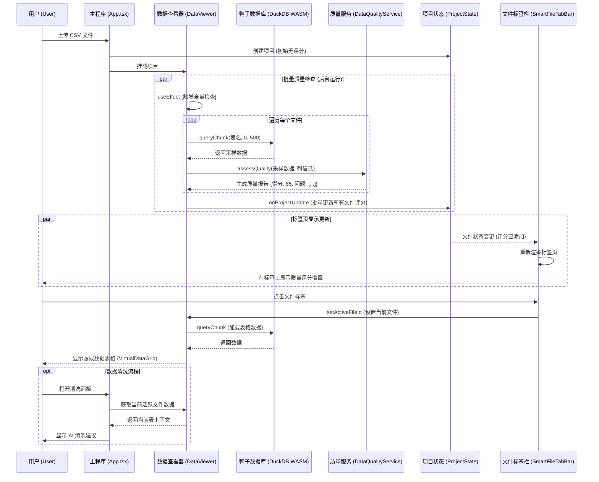

```mermaid
sequenceDiagram
    participant U as 用户 (User)
    participant App as 主程序 (App.tsx)
    participant DV as 数据查看器 (DataViewer)
    participant E as 鸭子数据库 (DuckDB WASM)
    participant S as 质量服务 (DataQualityService)
    participant P as 项目状态 (ProjectState)
    participant TB as 文件标签栏 (SmartFileTabBar)

    U->>App: 上传 CSV 文件
    App->>P: 创建项目 (初始无评分)
    App->>DV: 挂载项目

    par 批量质量检查 (后台运行)
        DV->>DV: useEffect [触发全量检查]
        loop 遍历每个文件
            DV->>E: queryChunk(表名, 0, 500)
            E-->>DV: 返回采样数据
            DV->>S: assessQuality(采样数据, 列信息)
            S-->>DV: 生成质量报告 {得分: 85, 问题: [...]}
        end
        DV->>P: onProjectUpdate (批量更新所有文件评分)
    end

    par 标签页显示更新
        P-->>TB: 文件状态变更 (评分已添加)
        TB->>TB: 重新渲染标签页
        TB-->>U: 在标签上显示质量评分徽章
    end

    U->>TB: 点击文件标签
    TB->>DV: setActiveFileId (设置当前文件)
    DV->>E: queryChunk (加载表格数据)
    E-->>DV: 返回数据
    DV-->>U: 显示虚拟数据表格 (VirtualDataGrid)

    opt 数据清洗流程
        U->>App: 打开清洗面板
        App->>DV: 获取当前活跃文件数据
        DV-->>App: 返回当前表上下文
        App->>U: 显示 AI 清洗建议
    end
```
