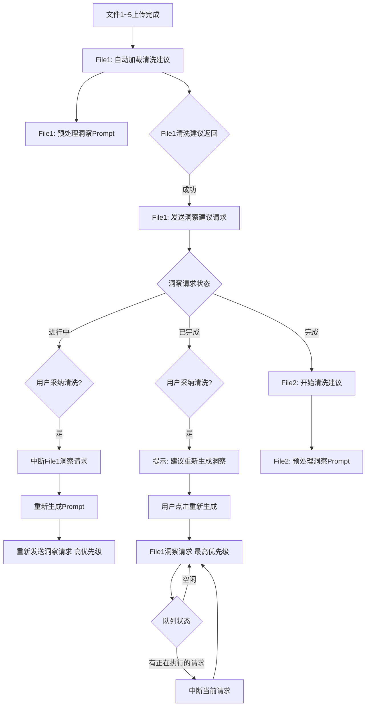

# 优化后的多文件AI请求队列机制

**创建日期**: 2025-12-25  
**状态**: 设计方案  
**优先级**: P1  

---

## 📊 核心机制流程图



---

## 🔄 详细时间线（5文件场景）

```
T=0s: 文件1~5上传完成
├─ File1: tableName创建完成
├─ File2: tableName创建完成
├─ File3: tableName创建完成
├─ File4: tableName创建完成
└─ File5: tableName创建完成

T=0.1s: 自动触发File1清洗建议
├─ 构建清洗Prompt
├─ 预处理洞察Prompt（缓存）
└─ 队列: [File1-清洗(high)]

T=24s: File1清洗建议返回
├─ 立即发送File1洞察请求
└─ 队列: [File1-洞察(normal)]

T=24~48s: File1洞察请求进行中
├─ 场景A：用户采纳清洗建议
│  ├─ 中断File1洞察请求（abort()）
│  ├─ 重新生成Prompt（新数据）
│  └─ 队列: [File1-洞察-重新生成(high)]
│
└─ 场景B：不干预
   └─ 继续执行洞察请求

T=48s: File1洞察完成
├─ 场景A：用户此时采纳清洗
│  └─ 提示："数据已变化，建议重新生成洞察"
│     └─ 用户点击"重新生成"
│        └─ 队列: [File1-洞察-更新(highest)]
│
└─ 场景B：自动触发File2清洗
   └─ 队列: [File2-清洗(high)]

T=72s: File2清洗完成
└─ 如果File1洞察未更新，发送File2洞察
   否则，等待File1洞察完成

以此类推...
```

---

## ⚙️ 队列优先级系统

### 优先级定义

```typescript
enum PRIORITY {
    HIGHEST = 10,  // 用户主动触发的洞察重新生成
    HIGH = 5,      // 用户采纳清洗后的洞察重新生成 / 清洗建议生成
    NORMAL = 3,    // 自动触发的洞察建议（后台预加载）
    LOW = 1        // 批量预加载（非active文件）
}
```

### 队列处理规则

```typescript
class SmartQueue {
    queue: Request[] = [];
    currentRequest: Request | null = null;
    
    enqueue(request: Request) {
        // 1. 插入排序：按优先级
        const index = this.queue.findIndex(r => r.priority < request.priority);
        if (index === -1) {
            this.queue.push(request);
        } else {
            this.queue.splice(index, 0, request);
        }
        
        // 2. 检查中断：如果新请求优先级 >= highest，中断当前
        if (this.currentRequest && request.priority >= PRIORITY.HIGHEST) {
            this.currentRequest.abort();
            this.executeNext();
        }
    }
    
    executeNext() {
        if (this.queue.length === 0) return;
        
        // 取出最高优先级请求
        this.currentRequest = this.queue.shift();
        this.currentRequest.execute();
    }
}
```

---

## 🎯 关键特性

### 1. 智能中断机制

```
用户采纳清洗建议时：
├─ 检测洞察请求状态
├─ 如果"进行中" → abort() → 重新排队（高优先级）
├─ 如果"已完成" → 提示用户重新生成
└─ 如果"未开始" → 更新Prompt
```

### 2. Prompt预处理缓存

```
清洗建议生成时：
├─ 同步构建洞察Prompt（不发送）
├─ 缓存到fileCache中
└─ 清洗完成后直接使用缓存Prompt
```

### 3. 自动批量调度

```
洞察完成后：
├─ 检查队列中是否有高优先级请求
├─ 如果有 → 执行高优先级
└─ 如果无 → 触发下一个文件的清洗建议
```

---

## 📋 实现清单

### 阶段1：基础队列系统（P0）
- [ ] 创建`SmartQueue`类（优先级队列）
- [ ] 实现`abort()`机制（AbortController）
- [ ] 添加队列状态日志
- [ ] 单元测试：优先级排序

### 阶段2：Prompt缓存（P1）
- [ ] 在清洗建议生成时预构建洞察Prompt
- [ ] 缓存到`fileCache[fileId].insightPrompt`
- [ ] 清洗完成后使用缓存
- [ ] 缓存失效策略（数据变化时）

### 阶段3：自动调度（P1）
- [ ] 洞察完成后触发`next()`
- [ ] 检测所有文件状态
- [ ] 按文件顺序调度清洗/洞察
- [ ] 批量预加载逻辑

### 阶段4：用户中断处理（P2）
- [ ] 清洗采纳时检测洞察状态
- [ ] 实现`regenerateInsight()`方法
- [ ] UI提示"建议重新生成"
- [ ] 中断重试机制

---

## 🎨 UI提示设计

### 洞察已完成时

```
┌───────────────────────────────────────────┐
│ ⚠️ 数据已变化                             │
│                                           │
│ 您刚刚应用了清洗建议，洞察分析可能已过时  │
│                                           │
│ [忽略] [重新生成洞察]                      │
└───────────────────────────────────────────┘
```

### 队列状态指示器

```
队列状态: 
├─ 🟢 File1-洞察生成中... (30s)
├─ 🔵 File2-清洗等待中
└─ ⚪ File3-未开始
```

---

## 💡 优化收益

### 用户体验
- ✅ 无需手动切换文件即可获得所有建议
- ✅ 采纳清洗后自动更新洞察（数据一致性）
- ✅ 清晰的队列状态反馈

### 性能优化
- ✅ Prompt预处理减少延迟
- ✅ 智能调度避免GPU空闲
- ✅ 优先级保证用户操作响应

### 数据一致性
- ✅ 洞察始终基于最新清洗后的数据
- ✅ 中断机制防止过时结果

---

## 🔗 相关文档

- [当前队列机制分析](./queue_mechanism_analysis.md)
- [多文件场景详解](./multi_file_queue_scenarios.md)
- [AI清洗与洞察对比](./62-技术专题-AI清洗与洞察模块深度对比分析.md)
