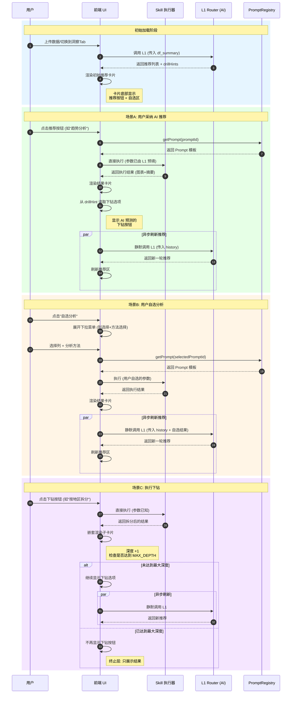
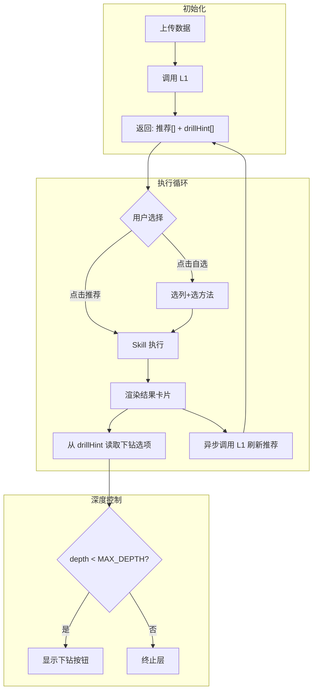

# 11-架构设计-洞察建议Prompt库时序图

> **适用范围**: 洞察分析模块的 Prompt 库交互流程
> **核心理念**: L1 预测 + Skill 直接执行 + 异步刷新推荐

---

## 1. 完整时序图



---

## 2. 关键节点说明

| 阶段 | AI 调用 | 说明 |
|:---|:---|:---|
| **初始加载** | ✅ L1 同步调用 | 分析数据，返回推荐 + 预填 drillHint |
| **执行推荐/自选/下钻** | ❌ 无 AI 调用 | 直接执行 Skill，参数已知 |
| **执行完成后** | ✅ L1 异步调用 | 静默刷新推荐，传入历史链 |

---

## 3. 数据流示意



---

## 4. L1 输入输出格式

### 4.1 L1 输入
```json
{
  "df_summary": { "columns": [...], "row_count": 1000 },
  "history": [
    { "action": "trend_analysis", "columns": ["日期", "销售额"], "result": "上升趋势" },
    { "action": "trend_by_dimension", "columns": ["日期", "销售额", "地区"], "result": "华东最快" }
  ]
}
```

### 4.2 L1 输出
```json
{
  "recommendations": [
    {
      "promptId": "worker-distribution-v1",
      "params": { "column_name": "销售额" },
      "reason": "销售额方差大，建议查看分布",
      "drillHint": {
        "promptId": "worker-outlier-v1",
        "params": { "column_name": "销售额" },
        "label": "分析异常点"
      }
    }
  ]
}
```

---

*本文档描述洞察分析模块的 Prompt 库交互时序，是技术实现的核心参考。*
