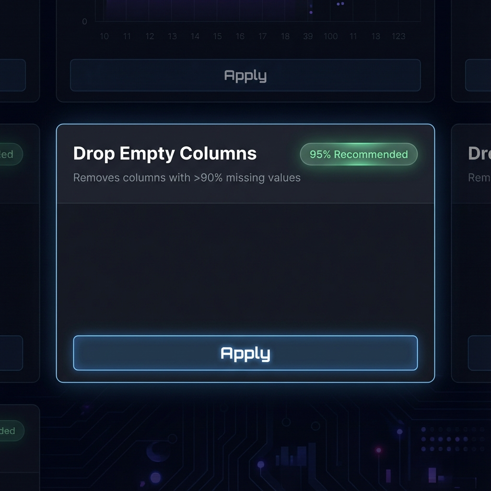

# 数据清洗建议 UI/UX 交互重构方案

> **当前状态**: 采用极简文本卡片设计，虽解决了过度复杂的问题，但在信息层级和交互反馈上略显单薄。以下是结合 DataPrism "Cyber Dark" 风格的三个进阶方案。

## 方案一：智能卡片流 (Intelligent Card Flow) - 推荐
> **核心理念**: "Context is King"。在保持视觉整洁的同时，提供决策所需的上下文（原因、影响）。

*(AI生成概念图: 展示了带有标题、副标题原因说明、推荐度胶囊和悬停AcTion的卡片)*

### 设计细节
- **卡片结构**:
  - **顶部**: 动作标题 (e.g., "删除空列") + 推荐度胶囊 (绿色/黄色/红色 自动映射)
  - **中部**: 灰色小字说明原因 (e.g., "该列缺失率 > 95%")
  - **交互**: 鼠标 Hover 时，卡片底部浮现 "预览/应用" 按钮组。
- **视觉风格**:
  - 背景色：使用 `var(--bg-element)` (深灰)，边框 `var(--border)`
  - 选中态：发光外边框 (Glow Effect) + 对应意图的主色调微渐变。
- **优点**: 信息密度适中，用户能明确知道"为什么"要执行此操作。
- **缺点**: 占用空间比纯文本略大。

### 适用场景
适合中等数量建议（10-30条），且需要用户关注操作后果的场景。

---

## 方案二：极简标签云 (Refined Tag Cloud) - 当前升级版
> **核心理念**: "Efficiency First"。将建议视为可快速筛选的标签，强调批量操作效率。

### 设计细节
- **形态**: 类似 GitHub Issue 的 Label，但在左侧带有一个极小的状态点。
- **布局**: 紧凑排列，一行可放 4-5 个。
- **增强**:
  - **置信度条**: 在标签底部添加一条细细的进度条，用长度和颜色直观展示推荐度，替代文字 "95%"。
  - **图标回归**: 恢复极简的单色线性图标 (如 `trash-2`, `edit-2`)，放在文字左侧增加识别度。
- **示例**:
  `[🗑️ 删除空列 ____________]` (绿色下划线表示高置信度)
- **优点**: 屏幕空间利用率最高，适合大量建议快速扫视。
- **缺点**: 缺乏解释性，用户全凭信任 AI。

### 适用场景
适合大量重复性建议（如 50+ 条重复值处理），用户只关心“全选 -> 执行”。

---

## 方案三：垂直列表清单 (Checklist View)
> **核心理念**: "Power User Interface"。类似 VSCode 的 "Problems" 面板，提供最详尽的信息。

### 设计细节
- **布局**: 垂直列表，每行占据全宽。
- **列结构**:
  - **[复选框]**
  - **[类型图标]** (固定宽度)
  - **[操作描述]** (主标题)
  - **[原因分析]** (灰色副标题，自动截断)
  - **[影响范围]** ("影响 25 行")
  - **[推荐度]** (右侧对齐)
- **交互**: 支持 Shift 连选，右键菜单。
- **优点**: 即使有 100 条建议也能轻松管理，信息展现最全。
- **缺点**: 视觉上不够 "性感"，偏向传统工具软件。

## 综合对比

| 维度 | 方案一 (智能卡片) | 方案二 (标签云) | 方案三 (列表清单) |
|---|---|---|---|
| **视觉冲击力** | ⭐⭐⭐⭐ | ⭐⭐⭐ | ⭐⭐ |
| **信息密度** | ⭐⭐⭐ | ⭐⭐⭐⭐⭐ | ⭐⭐⭐⭐ |
| **决策辅助** | ⭐⭐⭐⭐⭐ | ⭐⭐ | ⭐⭐⭐⭐ |
| **开发成本** | 中 | 低 | 中 |
| **推荐指数** | 👑 首选 | 备选 | 仅限专家模式 |

## 建议执行路径
1. **优先采纳方案一 (智能卡片)**: 它是美学与功能的最佳平衡点。
2. **保留方案二作为 "紧凑模式"**: 如果用户觉得卡片太占地，可提供一个 Toggle 切换到紧凑视图。
