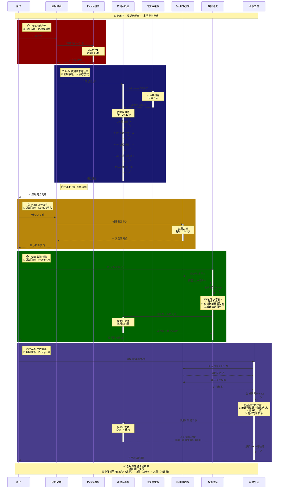
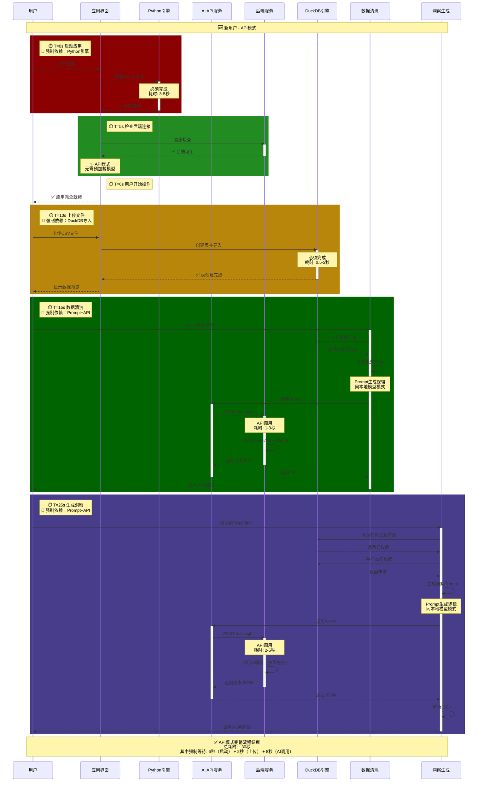
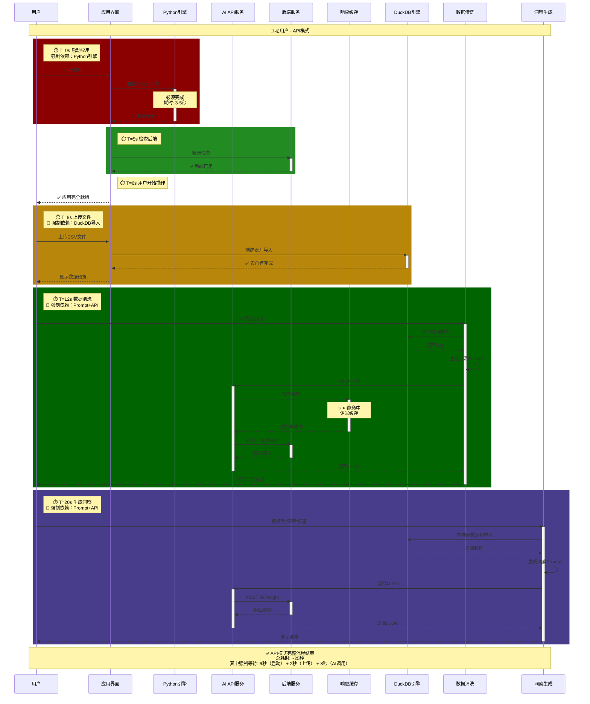

```mermaid
sequenceDiagram
    participant U as 用户
    participant App as 应用界面
    participant Pyodide as Python引擎
    participant LocalLLM as 本地AI模型
    participant DuckDB as DuckDB引擎
    participant Clean as 数据清洗
    participant Insight as 洞察生成

    Note over U,Insight: 🆕 新用户首次使用 - 本地模型模式
    
    Note right of App: ⏱️ T=0s ⚡ 并行启动
    
    par Python引擎 & 本地模型并行加载
        rect rgb(139, 0, 0)
            Note right of App: 🔴 强制依赖：Python引擎
            App->>Pyodide: 加载Python引擎
            activate Pyodide
            Note over Pyodide: 必须完成<br/>耗时: 3-5秒
            Pyodide-->>App: ✅ 引擎就绪
            deactivate Pyodide
        end
    and
        rect rgb(25, 25, 112)
            Note right of App: 🔴 强制依赖：模型加载<br/>⚡ 并行执行
            App->>LocalLLM: 开始加载模型<br/>(Qwen2.5-7B, 4GB)
            activate LocalLLM
            Note over LocalLLM: 并行加载中<br/>首次下载+加载: 20秒
            LocalLLM-->>LocalLLM: 0% 准备GPU环境
            LocalLLM-->>LocalLLM: 25% 加载权重 1/4
            LocalLLM-->>LocalLLM: 50% 加载权重 2/4
            LocalLLM-->>LocalLLM: 75% 加载权重 3/4
            LocalLLM-->>LocalLLM: 95% 初始化引擎
            LocalLLM-->>App: ✅ 模型就绪
            deactivate LocalLLM
        end
    end
    
    Note right of App: ⏱️ T=5s Python就绪，UI可用
    App-->>U: ✅ 应用基础功能就绪
    
    Note right of App: ⏱️ T=20s 模型就绪
    App-->>U: ✅ AI功能完全就绪
    
    rect rgb(184, 134, 11)
        Note right of U: ⏱️ T=25s 上传文件<br/>🔴 强制依赖：DuckDB导入
        U->>App: 上传CSV文件
        activate App
        App->>DuckDB: 创建表并导入
        activate DuckDB
        Note over DuckDB: 必须完成<br/>耗时: 0.5-2秒
        DuckDB-->>App: ✅ 表创建完成
        deactivate DuckDB
        App-->>U: 显示数据预览
        deactivate App
    end
    
    rect rgb(0, 100, 0)
        Note right of U: ⏱️ T=30s 数据清洗<br/>🔴 强制依赖：Prompt+AI
        U->>Clean: 点击"智能清洗"
        activate Clean
        Clean->>DuckDB: 查询数据样本
        DuckDB-->>Clean: 返回1000行样本
        Clean->>Clean: 生成清洗Prompt
        Note over Clean: Prompt包含：<br/>列信息、数据类型、样本
        Clean->>LocalLLM: 调用AI生成建议
        activate LocalLLM
        Note over LocalLLM: 模型已就绪<br/>耗时: 2-5秒
        LocalLLM-->>Clean: 返回清洗建议JSON
        deactivate LocalLLM
        Clean-->>U: 显示清洗建议
        deactivate Clean
    end
    
    rect rgb(47, 79, 79)
        Note right of U: ⏱️ T=40s 应用清洗
        U->>Clean: 应用清洗建议
        Clean->>DuckDB: 执行清洗SQL
        DuckDB-->>Clean: ✅ 清洗完成
        Clean-->>U: 显示清洗后数据
    end
    
    rect rgb(72, 61, 139)
        Note right of U: ⏱️ T=45s 生成洞察<br/>🔴 强制依赖：Prompt+AI
        U->>Insight: 切换到"洞察"标签
        activate Insight
        Insight->>DuckDB: 查询列信息和行数
        DuckDB-->>Insight: 返回元数据
        Insight->>DuckDB: 采样30行数据
        DuckDB-->>Insight: 返回样本
        Insight->>Insight: 生成洞察Prompt
        Note over Insight: Prompt包含：<br/>列统计、数值列、分类列
        Insight->>LocalLLM: 调用AI生成洞察
        activate LocalLLM
        Note over LocalLLM: 模型已就绪<br/>耗时: 5-10秒
        LocalLLM-->>Insight: 返回洞察建议JSON
        deactivate LocalLLM
        Insight->>Insight: 解析JSON
        Insight-->>U: 显示3-5条洞察
        deactivate Insight
    end
    
    Note over U,Insight: ✅ 新用户完整流程结束<br/>总耗时: ~55秒<br/>⚡ 并行加载优化：节省5秒<br/>强制等待: 20秒（并行启动） + 2秒（上传） + 15秒（AI调用）
```

# DataPrism 应用加载时序图

## 📋 图例说明

- **🔴 深色块** = 强制依赖关系（必须完成才能继续）
- **深红色** `rgb(139, 0, 0)` = Python引擎加载
- **深蓝色** `rgb(25, 25, 112)` = 本地模型加载
- **暗金色** `rgb(184, 134, 11)` = DuckDB导入
- **深绿色** `rgb(0, 100, 0)` = 数据清洗
- **深紫色** `rgb(72, 61, 139)` = 洞察生成

---

## 📊 场景1: 新用户 - 本地模型模式

### 时序图



---

## 📊 场景2: 老用户 - 本地模型模式

### 时序图



---

## 📊 场景3: 新用户 - API模式

### 时序图



---

## 📊 场景4: 老用户 - API模式

### 时序图



---

## 📋 强制依赖关系总结

### 本地模型模式

| 阶段 | 强制依赖 | 耗时（新用户） | 耗时（老用户） | 优化说明 |
|------|---------|--------------|--------------|---------|
| **应用启动** | Python引擎 + 本地模型（并行） | 20秒 | 18-20秒 | ⚡ 并行加载 |
| **上传文件** | DuckDB导入 | 0.5-2秒 | 0.5-2秒 | - |
| **数据清洗** | Prompt生成 + AI推理 | 2-5秒 | 2-5秒 | - |
| **洞察生成** | Prompt生成 + AI推理 | 5-10秒 | 5-10秒 | - |

> **⚡ 并行加载优化**: Python引擎（5秒）和本地模型（20秒）同时启动，总耗时= max(5秒, 20秒) = 20秒，相比顺序加载节省5秒

### API模式

| 阶段 | 强制依赖 | 耗时（新/老用户） |
|------|---------|-----------------|
| **应用启动** | Python引擎加载 | 3-5秒 |
| **应用启动** | 后端健康检查 | 0.5秒 |
| **上传文件** | DuckDB导入 | 0.5-2秒 |
| **数据清洗** | Prompt生成 + API调用 | 1-3秒 |
| **洞察生成** | Prompt生成 + API调用 | 2-5秒 |

---

## 🔑 关键发现

### 1. 最大瓶颈
- **本地模型**: 启动时的模型加载（18-25秒）
- **API模式**: Python引擎加载（3-5秒）

### 2. Prompt生成流程
所有AI调用都必须经过Prompt生成阶段：
1. **数据采样** - 从DuckDB查询样本数据
2. **列分析** - 分析数据类型（数值/分类）
3. **统计计算** - 计算唯一值、缺失率等
4. **Prompt构建** - 组装成结构化提示词
5. **AI调用** - 发送给本地模型或API

### 3. 优化机会
- ✅ **并行加载已实施** - Python引擎和本地模型同时加载，节省5秒
- ✅ 本地模型在后台预加载（已实施）
- ✅ Prompt生成可以优化（减少列数、样本数）
- ⚠️ Python引擎加载无法优化（浏览器限制）
- ⚠️ 本地模型加载无法加速（4GB数据传输）

### 4. 并行加载优化详情

**优化前（顺序）**:
```
[0-5秒]   Python引擎加载
[5-25秒]  本地模型加载（等Python完成）
总计: 25秒
```

**优化后（并行）**:
```
[0-5秒]   Python引擎加载  |
[0-20秒]  本地模型加载    |  ← 同时进行
总计: 20秒（节省5秒）
```

---

**创建日期**: 2025-12-25  
**版本**: v1.0  
**作者**: Antigravity Agent
