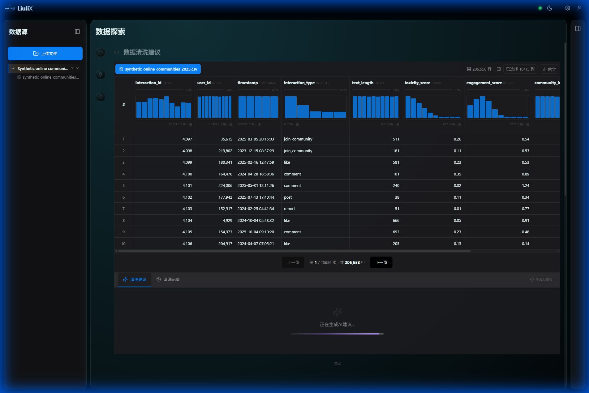
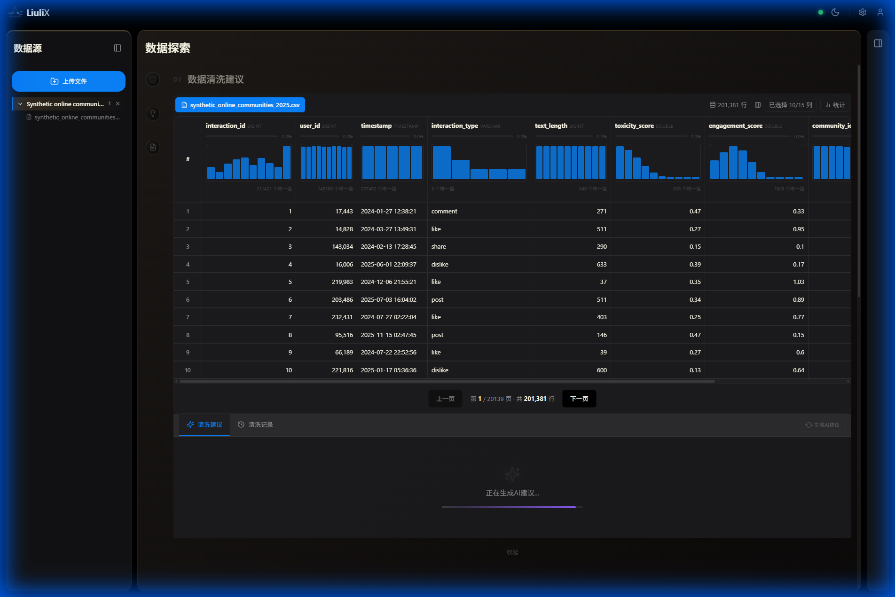
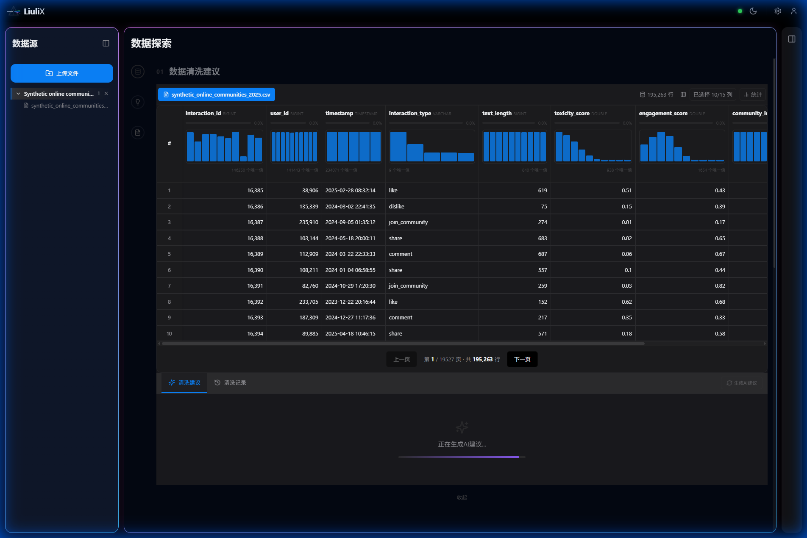

# LiuliX (琉璃X) 视觉升级设计方案

**版本**: v1.0  
**日期**: 2025-12-25  
**状态**: 待选择  

结合新产品名 **"LiuliX"** (琉璃 + Exploration)，我们重新构想了三套顶级 Dark Mode UI/UX 方案。每套方案都围绕“透明”、“光影”、“探索”展开，但侧重点不同。

由于当前 AI 绘图服务繁忙，特提供详细**视觉概念方案**供您选择。确认方向后，我们将基于选定方案输出具体设计规范。

---

## 🦚 方案 D：Classic Peacock (孔雀琉璃)
> **关键词**：古法、孔雀蓝、东方美学、温润  
> **核心理念**：取色于中国传统琉璃工艺中的“孔雀蓝”，兼具温润如玉的质感与现代界面的通透。

### 1. 视觉特征
-   **背景 (Background)**：
    -   深邃的青蓝渐变，如同深潭之水。
    -   Hex: `radial-gradient(circle at 20% 0%, #113038 0%, #03080a 100%)`
-   **琉璃质感**：
    -   **色彩**：主色调采用 Cyan-500 (#06b6d4) 与 Teal-700 的融合。
    -   **边框**：顶部高亮，底部微暗，模拟厚重玻璃的边缘反光。
-   **光效**：
    -   界面元素带有柔和的漫射光，没有刺眼的锐利反射，强调“内敛”。
-   **适用场景**：
    -   适合希望体现**文化底蕴**与**极高品质感**的产品定位。

---

## 🔸 方案 E：Molten Amber (流光琥珀)
> **关键词**：琥珀、流动、能量、尊贵  
> **核心理念**：模拟高温下熔融状态的琉璃，充满了流动感与生命力，金褐色的光泽象征数据的价值。

### 1. 视觉特征
-   **背景 (Background)**：
    -   极暗的暖黑背景，点缀着金色的光斑。
    -   Hex: `linear-gradient(#1c1917, #0c0a09)` + 径向金光。
-   **琉璃质感**：
    -   **色彩**：Amber-400 (#fbbf24) 为主。
    -   **形态**：大圆角 (16px)，如同未冷却完全的液体。
    -   **边框**：金色的边缘发光，如同金镶玉的工艺。
-   **光效**：
    -   强烈的暖色高光，营造出“富丽堂皇”的数据展示效果。
-   **适用场景**：
    -   适合需要**高活跃度**、**充满激情**的数据探索场景。

---

## 🔮 方案 F：Ethereal Glaze (幻彩琉璃)
> **关键词**：光影、全息、折射、未来东方  
> **核心理念**：琉璃最迷人之处在于对光的折射。本方案通过全息渐变边框，复现光线穿过琉璃时的七彩晕影。

### 1. 视觉特征
-   **背景 (Background)**：
    -   深邃蓝紫夜空，带有极光般的锥形渐变。
    -   Hex: `conic-gradient(#030712, #1e1b4b, ...)`
-   **琉璃质感**：
    -   **色彩**：Violet-400 (#c084fc) 与 LightBlue 的全息渐变。
    -   **边框**：这是一大亮点，使用 Linear Gradient Border 模拟七彩折射。
-   **光效**：
    -   **Iridescence (虹彩)**：界面边缘在不同角度下呈现不同颜色，极具梦幻感。
-   **适用场景**：
    -   适合**探索未知**、**发现洞察**的 AI 分析场景，寓意“拨云见日”。

---

## 📊 第二轮方案对比

| 维度 | D. Classic Peacock (孔雀) | E. Molten Amber (琥珀) | F. Ethereal Glaze (幻彩) |
| :--- | :--- | :--- | :--- |
| **主色调** | 青色/孔雀蓝 (Teal/Cyan) | 金色/琥珀色 (Amber/Gold) | 紫色/全息光 (Violet/Holographic) |
| **质感隐喻** | 温润的玉石/凝固的琉璃 | 流动的熔岩/高温玻璃 | 折射的光线/棱镜 |
| **情感基调** | 沉稳、内敛、匠心 | 热情、高贵、活力 | 梦幻、神秘、未来 |
| **边框风格** | 顶部高光 (模拟厚度) | 金色辉光 (模拟镶嵌) | 全息渐变 (模拟折射) |

## 💡 选择建议
请回复您倾向的方案编号（**A / B / C**），或者描述您希望的组合（例如：“A的背景加上B的锐利线条”）。我将基于您的选择完善设计规范。
