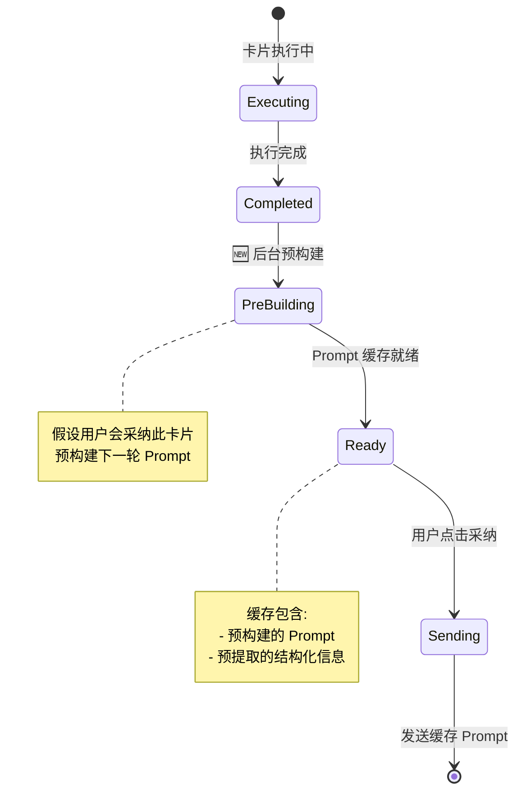

# EDA 闭环与 Context 回流设计

**版本**: v1.0  
**日期**: 2026-01-08  
**状态**: 规划中  
**Feature Flag**: `ENABLE_EDA_CONTEXT_LOOP`

---

## 1. 功能概述（用户视角）

### 1.1 用户痛点

当前的 EDA（探索性数据分析）流程是**单向的**：

```
用户上传数据 → AI 分析 → 查看洞察结果 → 结束
```

用户在 EDA 阶段发现的关键问题（如"房价数据在 50 万处截断"）无法自动传递到后续的数据清洗或建模步骤。用户或 AI 需要**手动重复描述**这些发现，造成体验割裂。

### 1.2 目标体验

实现**闭环智能体验**：

```
用户上传数据 → AI 分析 → 用户标记关键发现 → AI 记忆这些发现 → 后续分析自动参考历史发现
```

### 1.3 典型使用场景

**场景：房价预测数据准备**

| 步骤 | 用户操作 | AI 响应 | 系统行为 |
|-----|---------|--------|---------|
| **Step 1** | 点击"生成洞察" | 生成"median_house_value 存在截断"洞察卡片 | — |
| **Step 2** | 点击洞察卡片的 **"采纳"** 按钮 | — | 📌 **系统记录**：`Column: median_house_value, Issue: Capped at 500k` |
| **Step 3** | *(无需操作，系统静默触发)* | 卡片下方自动显示"基于之前的发现，建议进一步检验截断对分布的影响…" | 📤 **系统注入**：历史发现到 Prompt，自动生成 L1 子卡片 |

### 1.4 核心价值

- **智能记忆**：用户采纳的洞察不会丢失
- **上下文感知**：AI 能"记住"之前的发现
- **减少重复**：无需反复向 AI 描述同样的问题
- **决策连贯**：EDA → 清洗 → 建模形成完整链路

---

## 2. 用户交互时序图

> [!NOTE]
> 下图中 **深绿色阴影区域** 表示本次闭环功能新增的模块和交互。
> 
> **关键设计**：用户**无需手动点击**"再次生成洞察"，采纳后系统**静默触发** Context 回流，自动在当前卡片下方生成新的推荐卡片。

```mermaid
sequenceDiagram
    participant U as 👤 用户
    participant UI as 📱 洞察面板 UI
    participant Card as 洞察卡片组件
    participant Loader as useInsightLoaderV2
    participant Chain as InsightChainContext
    participant Ctx as AnalysisContext [新增]
    participant Ext as InsightExtractor [新增]
    participant Inj as ContextInjector [新增]
    participant Router as RouterPrompt
    participant AI as AI 服务
    participant Exec as 代码执行器
    participant Gate as 质量门控

    Note over U, UI: ===== 首次分析流程 =====
    U->>UI: 1. 点击 "生成洞察"
    UI->>Loader: loadInsights(columns, rowCount)
    Loader->>Router: buildRouterPrompt(columns, data)
    Router->>AI: 发送 L1 Prompt
    AI-->>Router: 返回推荐列表 (含 drillHint)
    Router-->>Loader: InsightNode[] (depth=0, L0 卡片)
    Loader->>Exec: 批量执行代码
    Exec-->>Loader: 执行结果 (图表+摘要)
    Loader-->>UI: 返回 L0 洞察卡片
    UI-->>U: 2. 展示 L0 洞察卡片列表

    Note over U, UI: ===== 用户采纳流程 (静默触发) =====
    U->>Card: 3. 点击 L0 卡片的 "采纳" 按钮
    Card->>Chain: adoptInsight(node)
    
    rect rgb(35, 55, 35)
        Note over Chain, Ctx: 🆕 Phase A: 提取结构化信息
        Chain->>Ext: extractAdoptedInsight(node)
        Note right of Ext: 从 node.depth 识别层级<br/>depth=0 → L0 父卡片<br/>depth≥1 → L1 下钻卡片
        Ext-->>Chain: { type, description, structuredData, depth }
        Chain->>Ctx: addAdoptedInsight(insight)
        Ctx-->>Ctx: 存储到 adoptedInsights[]
    end
    
    Chain-->>Card: 标记为已采纳
    Card-->>U: 4. 卡片显示 ✅ 已采纳
    
    rect rgb(35, 55, 35)
        Note over Chain, AI: 🆕 Phase B: 静默触发 Context 回流
        Chain->>UI: 通知: 需要生成后续推荐
        UI->>Card: 在当前卡片下方插入加载占位符
        Card-->>U: 5. 显示 "正在生成相关推荐..." 加载卡片
        
        UI->>Loader: triggerFollowUp(parentNode, context)
        Loader->>Ctx: getAdoptedInsights()
        Ctx-->>Loader: [{ column: "house_value", issue: "capped" }]
        Loader->>Inj: injectContextToPrompt(basePrompt, context)
        Inj-->>Loader: 增强后的 Prompt
        
        Loader->>Router: buildRouterPrompt(columns, data, context)
        Router->>AI: 发送带 Context 的 L1 Prompt
        AI-->>Router: "基于之前发现，建议进一步分析..."
        Router-->>Loader: 新的推荐列表 (L1 子卡片)
        
        Loader->>Exec: 执行 L1 代码
        Exec-->>Loader: 执行结果
        Loader->>Gate: validateExecutionResult()
        Gate-->>Loader: 通过质量门控
        
        Loader-->>UI: 返回 L1 子节点
        UI->>Card: 将 L1 节点添加到 parentNode.children[]
        Card-->>U: 6. 加载卡片替换为新洞察卡片 (depth=1)
    end
```



---

## 2.1 层级识别机制

### 问题：如何区分 L0 (父卡片) 和 L1 (下钻卡片)？

**核心字段**：`InsightNode.depth`

| depth 值 | 含义 | 来源 |
|---------|------|------|
| `0` | **L0 根卡片** | 首次 AI 推荐生成，无父节点 |
| `1` | **L1 下钻卡片** | 用户点击 L0 的下钻按钮，或采纳后静默生成 |
| `2` | **L2 下钻卡片** | 用户点击 L1 的下钻按钮 |
| `≥3` | **终点卡片** | 达到 `MAX_DRILL_DEPTH`，不再显示下钻按钮 |

### 现有代码复用

| 功能 | 文件 | 可复用逻辑 |
|------|------|-----------|
| **下钻执行** | `usePromptExecution.ts` → `executeDrillDown()` | 将子节点添加到 `parentNode.children[]` |
| **drillHint 转换** | `inflater.ts` → Line 127-143 | 将 AI 返回的 `drillHint` 转为 `drillDownActions` |
| **树更新** | `usePromptExecution.ts` → Line 317-338 | 递归更新 `insightChain.rootCards` |
| **深度检查** | `usePromptExecution.ts` → Line 286 | `parentNode.depth >= MAX_DRILL_DEPTH` 检查 |

---

## 2.2 场景分类与技术调用流程

### 场景 A：用户采纳 L0 根卡片

用户在首次生成的洞察卡片列表中点击"采纳"。

```mermaid
sequenceDiagram
    participant U as 👤 用户
    participant Card as L0 洞察卡片
    participant Chain as InsightChainContext
    participant Ext as InsightExtractor
    participant Ctx as AnalysisContext
    participant Loader as useInsightLoaderV2
    participant Router as RouterPrompt
    participant AI as AI 服务

    U->>Card: 点击 L0 卡片的 "采纳"
    Card->>Chain: adoptInsight(node) 
    Note right of Chain: node.depth === 0
    
    rect rgb(35, 55, 35)
        Note over Chain, Ctx: Phase A: 提取 + 存储
        Chain->>Ext: extractAdoptedInsight(node)
        Ext-->>Chain: { depth: 0, parentId: undefined, ... }
        Chain->>Ctx: addAdoptedInsight(insight)
    end
    
    rect rgb(35, 55, 35)
        Note over Chain, AI: Phase B: 静默触发后续推荐
        Chain->>Loader: triggerFollowUp(parentNode, context)
        Loader->>Ctx: getAdoptedInsights()
        Ctx-->>Loader: [{ type: "distribution", column: "price", ... }]
        Loader->>Router: buildRouterPrompt(columns, data, context)
        Note right of Router: Prompt 包含:<br/>## Previous Insights<br/>1. price 列存在截断
        Router->>AI: 发送带 Context 的 Prompt
        AI-->>Router: 返回 L1 推荐 (关联 drillHint)
    end
    
    Router-->>Loader: L1 InsightNode[] (depth=1)
    Loader-->>Card: 添加到 node.children[]
    Card-->>U: 在 L0 卡片下方显示 L1 子卡片
```



**技术调用链**：
```typescript
// 1. 采纳触发
InsightChainContext.adoptInsight(node: InsightNode)
  ├─ InsightExtractor.extractAdoptedInsight(node)
  │     └─ 返回 { depth: 0, parentId: undefined, ... }
  ├─ AnalysisContext.addAdoptedInsight(insight)
  └─ triggerFollowUp(parentNode, context)  // 🆕 静默触发

// 2. 静默触发后续推荐
triggerFollowUp(parentNode, context)
  ├─ AnalysisContext.getAdoptedInsights()
  ├─ ContextInjector.injectContextToPrompt(basePrompt, context)
  ├─ RouterPrompt.buildRouterPrompt(columns, data, enhancedPrompt)
  ├─ AI.invoke()  // L1 Prompt 请求
  ├─ Inflater.inflateRecommendations(response)  // 膨胀为 InsightNode[]
  ├─ Executor.executeBatchNodes(nodes)  // 执行代码
  └─ 更新 parentNode.children.push(...newNodes)
```

---

### 场景 B：用户采纳 L1 下钻卡片

用户在 L0 卡片下方的下钻推荐卡片中点击"采纳"。

```mermaid
sequenceDiagram
    participant U as 👤 用户
    participant L0Card as L0 父卡片
    participant L1Card as L1 下钻卡片
    participant Chain as InsightChainContext
    participant Ext as InsightExtractor
    participant Ctx as AnalysisContext
    participant Loader as useInsightLoaderV2
    participant AI as AI 服务

    Note over L0Card, L1Card: L1 卡片已存在于 L0.children[]
    
    U->>L1Card: 点击 L1 卡片的 "采纳"
    L1Card->>Chain: adoptInsight(node) 
    Note right of Chain: node.depth === 1
    
    rect rgb(35, 55, 35)
        Note over Chain, Ctx: Phase A: 提取 + 存储 (含父级关联)
        Chain->>Ext: extractAdoptedInsight(node)
        Note right of Ext: 识别 depth > 0<br/>需要关联 parentId
        Ext->>Ext: findParentId(node)  // 从树结构中查找
        Ext-->>Chain: { depth: 1, parentId: "L0-xxx", isFollowUp: true, ... }
        Chain->>Ctx: addAdoptedInsight(insight)
        Note right of Ctx: 现有 insights:<br/>[L0洞察, L1洞察]<br/>形成链式上下文
    end
    
    rect rgb(35, 55, 35)
        Note over Chain, AI: Phase B: 静默触发 L2 推荐
        Chain->>Loader: triggerFollowUp(L1Node, context)
        Note right of Loader: 检查 L1Node.depth < MAX_DEPTH
        Loader->>Ctx: getAdoptedInsights()
        Ctx-->>Loader: [{ L0洞察 }, { L1洞察 }]  // 链式上下文
        Loader->>AI: 发送带完整链条的 Prompt
        AI-->>Loader: 返回 L2 推荐
    end
    
    Loader-->>L1Card: 添加到 L1Node.children[]
    L1Card-->>U: 在 L1 卡片下方显示 L2 子卡片
```



**技术调用链**：
```typescript
// 1. 采纳触发 (含父级关联)
InsightChainContext.adoptInsight(node: InsightNode)
  ├─ InsightExtractor.extractAdoptedInsight(node)
  │     ├─ depth: node.depth  // 1
  │     ├─ parentId: findParentId(node)  // 🆕 关联父卡片
  │     └─ isFollowUp: true
  ├─ AnalysisContext.addAdoptedInsight(insight)
  │     └─ 形成链式 insights: [L0洞察, L1洞察]
  └─ triggerFollowUp(L1Node, context)

// 2. 静默触发 L2 推荐
triggerFollowUp(L1Node, context)
  ├─ 检查 L1Node.depth < MAX_DRILL_DEPTH  // 1 < 3 ✓
  ├─ AnalysisContext.getAdoptedInsights()  // 返回链式上下文
  ├─ ContextInjector.buildChainedContext(insights)  // 🆕 构建链式 Prompt
  │     └─ 输出: "L0发现→L1验证→建议L2方向"
  ├─ AI.invoke()  // L2 Prompt
  ├─ 更新 L1Node.children.push(...L2Nodes)
  └─ 若 L2Node.depth >= MAX_DRILL_DEPTH → 不再触发后续
```

---

### 场景对比

| 维度 | 场景 A (采纳 L0) | 场景 B (采纳 L1) |
|-----|-----------------|-----------------|
| **触发节点** | `node.depth === 0` | `node.depth >= 1` |
| **父级关联** | `parentId: undefined` | `parentId: L0卡片ID` |
| **Context 注入** | 单条洞察 | 链式洞察 (L0 → L1) |
| **生成目标** | L1 子卡片 | L2 子卡片 |
| **树结构更新** | `L0.children.push(L1)` | `L1.children.push(L2)` |
| **深度检查** | 始终允许 | 检查 `depth < MAX_DRILL_DEPTH` |
| **Prompt 差异** | "分析发现：{L0洞察}" | "基于 L0 发现 + L1 验证，建议..." |

### 链式 Context 构建示例

```typescript
// ContextInjector.buildChainedContext()
function buildChainedContext(insights: AdoptedInsight[]): string {
    // 按 depth 排序，形成链条
    const sorted = [...insights].sort((a, b) => a.depth - b.depth);
    
    let result = '## Analysis Chain\n\n';
    
    sorted.forEach((insight, idx) => {
        const prefix = idx === 0 ? '🔍 Initial Finding' : `↪️ Follow-up ${idx}`;
        result += `### ${prefix} (Level ${insight.depth})\n`;
        result += `- ${insight.description}\n`;
        if (insight.structuredData?.column) {
            result += `- Column: \`${insight.structuredData.column}\`\n`;
        }
        result += '\n';
    });
    
    result += '---\n';
    result += '**Task**: Generate the next level of analysis based on this chain.\n';
    
    return result;
}
```

---

## 2.3 Prompt 预构建优化策略

> [!TIP]
> **核心优化思路**：在洞察卡片执行完成后（用户尚未采纳），后台**立即预构建**下一轮 Prompt。用户点击"采纳"时，直接发送已缓存的 Prompt，**跳过构建阶段**。

### 时间收益对比

| 阶段 | 无预构建 (当前) | 有预构建 (优化后) |
|-----|----------------|------------------|
| **用户点击采纳** | → 开始构建 Prompt | → 直接发送已缓存 Prompt |
| **Prompt 构建** | ~200ms | ✅ 0ms (已预构建) |
| **AI 响应** | ~2-5s | ~2-5s |
| **代码执行** | ~1-3s | ~1-3s |
| **总等待时间** | 3.2-8.2s | **3-8s** (节省 200ms+) |

> [!NOTE]
> 200ms 看似不多，但在连续采纳多个卡片时，累积效果明显。更重要的是**用户感知**：点击后"立即响应"比"短暂卡顿后响应"体验更流畅。

### 预构建时机



### 缓存失效场景

| 场景 | 处理策略 |
|-----|---------|
| **用户忽略卡片** | 缓存自然过期，无副作用 |
| **用户采纳其他卡片** | 清除当前卡片缓存，重新构建（因 Context 已变化） |
| **数据集切换** | 全局清除所有预构建缓存 |
| **长时间未操作 (>30s)** | 懒过期，下次采纳时重新构建 |

### 技术实现

```typescript
// 新增: PromptPreBuilder 服务
class PromptPreBuilder {
    private cache = new Map<string, PreBuiltPrompt>();
    
    /**
     * 在卡片执行完成后调用
     * 假设用户会采纳此卡片，预构建下一轮 Prompt
     */
    async prebuildForNode(node: InsightNode): Promise<void> {
        // 1. 预提取结构化信息（不存储到 Context，仅缓存）
        const insight = extractAdoptedInsight(node);
        
        // 2. 模拟将此洞察加入 Context
        const simulatedContext = {
            ...getCurrentContext(),
            adoptedInsights: [...getCurrentContext().adoptedInsights, insight]
        };
        
        // 3. 预构建 Prompt
        const prebuiltPrompt = await buildRouterPrompt(
            columns,
            sampleData,
            simulatedContext
        );
        
        // 4. 缓存
        this.cache.set(node.id, {
            prompt: prebuiltPrompt,
            extractedInsight: insight,
            createdAt: Date.now()
        });
        
        logger.log('优化', `[预构建] 完成 node=${node.id.slice(-8)}`);
    }
    
    /**
     * 用户点击采纳时调用
     * 返回缓存的 Prompt，若缓存失效则返回 null
     */
    getPrebuiltPrompt(nodeId: string): PreBuiltPrompt | null {
        const cached = this.cache.get(nodeId);
        
        if (!cached) return null;
        
        // 检查缓存是否过期 (30秒)
        if (Date.now() - cached.createdAt > 30_000) {
            this.cache.delete(nodeId);
            return null;
        }
        
        // 检查 Context 是否已变化（其他卡片被采纳）
        if (this.isContextChanged(cached.extractedInsight)) {
            this.cache.delete(nodeId);
            return null;
        }
        
        return cached;
    }
    
    /**
     * 清除所有缓存（数据集切换时调用）
     */
    clearAll(): void {
        this.cache.clear();
    }
}
```

### 调用时序

```mermaid
sequenceDiagram
    participant Exec as 代码执行器
    participant Card as 洞察卡片
    participant Pre as PromptPreBuilder
    participant Cache as 缓存
    participant U as 👤 用户
    participant AI as AI 服务

    Note over Exec, Card: 卡片执行完成
    Exec-->>Card: result (图表+摘要)
    Card-->>U: 展示卡片内容
    
    rect rgb(35, 55, 35)
        Note over Card, Pre: 🆕 后台预构建 (不阻塞 UI)
        Card->>Pre: prebuildForNode(node)
        Pre->>Pre: extractAdoptedInsight(node)
        Pre->>Pre: buildRouterPrompt(simulated)
        Pre->>Cache: 存储 { prompt, insight }
    end
    
    Note over U, AI: 用户决策时间 (0-30秒)
    
    U->>Card: 点击 "采纳"
    Card->>Pre: getPrebuiltPrompt(nodeId)
    
    alt 缓存命中
        Pre-->>Card: { prompt, insight }
        Card->>AI: 🚀 立即发送 (无构建延迟)
    else 缓存失效/未命中
        Pre-->>Card: null
        Card->>Card: 重新构建 Prompt
        Card->>AI: 发送新构建的 Prompt
    end
```



### 实施优先级

此优化为 **P1 (Nice-to-have)**，依赖 P0 核心闭环完成后实施：

- [ ] Phase 1 (P0) 完成后实施
- [ ] 创建 `PromptPreBuilder` 服务
- [ ] 在 `executeBatchNodes` 完成时触发预构建
- [ ] 修改 `adoptInsight` 优先读取缓存
- [ ] 添加缓存命中率监控日志

---

## 3. 技术架构

### 3.1 新增组件

| 组件 | 文件路径 | 职责 |
|------|---------|------|
| **AnalysisContext** | `src/contexts/AnalysisContext.tsx` | 全局状态存储，管理 `adoptedInsights` |
| **InsightExtractor** | `src/utils/insightExtractor.ts` | 从 InsightNode 提取结构化信息 |
| **ContextInjector** | `src/services/prompts/contextInjector.ts` | 将 Context 格式化注入 Prompt |

### 3.2 修改组件

| 组件 | 文件路径 | 变更内容 |
|------|---------|---------|
| InsightChainContext | `src/contexts/InsightChainContext.tsx` | Adopt 时调用 Extractor + Context |
| RouterPrompt | `src/services/prompts/routerPrompt/index.ts` | 新增 `analysisContext` 参数 |
| useInsightLoaderV2 | `src/hooks/useInsightLoaderV2.ts` | 读取并传递 Context |
| App | `src/App.tsx` | 添加 `<AnalysisContextProvider>` |

### 3.3 数据结构

```typescript
/** 采纳的洞察条目 */
interface AdoptedInsight {
    id: string;
    type: 'data_quality' | 'distribution' | 'correlation' | 'trend' | 'outlier' | 'other';
    description: string;          // "房价在 500,000 处存在截断"
    structuredData?: {
        column?: string;          // "median_house_value"
        issues?: string[];        // ["capped_values"]
        values?: {
            threshold?: number;   // 500000
            [key: string]: unknown;
        };
    };
    codeSnippet?: string;
    timestamp: number;
}

/** 分析上下文 */
interface AnalysisContext {
    datasetProfile: { rowCount: number; columns: string[] } | null;
    adoptedInsights: AdoptedInsight[];
    actionPlan: { cleaningSteps: string[]; modelingStrategy: string } | null;
}
```

---

## 4. Feature Flag 定义

### 4.1 Flag 信息

| 属性 | 值 |
|------|-----|
| **名称** | `ENABLE_EDA_CONTEXT_LOOP` |
| **分类** | FRONTEND_OPTIONAL |
| **状态** | Development |
| **默认值** | `false` |
| **创建时间** | 2026-01-08 |
| **Owner** | USER |

### 4.2 影响范围

- **启用时**：Adopt 动作触发结构化提取，Context 注入到 Prompt
- **禁用时**：行为与现有逻辑完全一致（Adopt 仅存入 Evidence）

### 4.3 使用示例

```typescript
import { isFeatureEnabled } from '@/config/featureFlags';

// InsightChainContext.tsx
const adoptChain = (hypothesisId: string) => {
    // ... 原有逻辑 ...
    
    // 🆕 闭环功能（Feature Flag 控制）
    if (isFeatureEnabled('ENABLE_EDA_CONTEXT_LOOP')) {
        for (const node of chainInsights) {
            const extracted = extractAdoptedInsight(node);
            addAdoptedInsight(extracted);
        }
    }
    
    // ... 原有 Evidence 存储逻辑 ...
};
```

---

## 5. 实施计划

### Phase 1：核心闭环 (P0)

- [ ] 添加 `ENABLE_EDA_CONTEXT_LOOP` Feature Flag
- [ ] 创建 `AnalysisContext.tsx`
- [ ] 创建 `insightExtractor.ts`
- [ ] 修改 `InsightChainContext.tsx` 的 `adoptChain`
- [ ] **验证**：Adopt 后控制台显示提取的结构化信息

### Phase 2：Prompt 注入 (P0)

- [ ] 创建 `contextInjector.ts`
- [ ] 修改 `routerPrompt/index.ts`
- [ ] 修改 `useInsightLoaderV2.ts`
- [ ] **验证**：Console 中 Prompt 包含 "Previous Insights" 区块

### Phase 3：可观测性 (P1)

- [ ] UI 显示当前已采纳洞察列表
- [ ] 洞察卡片标记"基于历史发现"徽章

---

## 6. 验证计划

### 端到端测试场景

1. **准备**：上传 California Housing 数据集
2. **Step 1**：生成洞察 → 看到"median_house_value 截断"卡片
3. **Step 2**：点击采纳 → 检查 Console：
   ```
   [数据分析] 提取洞察: data_quality
   { column: "median_house_value", issues: ["capped_values"] }
   ```
4. **Step 3**：**等待系统静默触发** → 卡片下方出现加载中占位符 → 新卡片出现。检查 Console Prompt 包含：
   ```
   ## Previous Insights (User Verified)
   1. median_house_value 存在截断 (Column: median_house_value)
   ```
5. **Step 4**：验证 AI 响应是否提及"基于之前的发现"

---

## 7. 参考文档

- [125-专题-EDA闭环与Context回流方案](file:///c:/Users/86177/Desktop/DataPrism_antigravity/docs/04-技术专题/02-Prompt库/125-专题-EDA闭环与Context回流方案.md)
- [112-架构-洞察分析模块调用流程](file:///c:/Users/86177/Desktop/DataPrism_antigravity/docs/01-架构设计/112-架构-洞察分析模块调用流程.md)
- [09-专题-数据清洗与洞察分析模块技术文档](file:///c:/Users/86177/Desktop/DataPrism_antigravity/docs/04-技术专题/01-数据处理/09-专题-数据清洗与洞察分析模块技术文档.md)

---

## 8. 风险评估与缓解策略

> [!CAUTION]
> 本节列出当前方案的潜在风险点及对应的缓解措施。实施前务必逐项确认。

### 8.1 状态一致性风险

| 风险 | 场景描述 | 严重程度 | 缓解策略 |
|-----|---------|---------|---------|
| **Context 与 UI 不同步** | 用户快速连续采纳多张卡片，`AnalysisContext` 更新延迟导致 Prompt 注入的 Context 不完整 | 🔴 高 | 采用**乐观锁**：每次采纳前检查 Context 版本号，版本不一致时重新读取 |
| **树结构更新丢失** | 静默触发的 L1 节点未正确插入 `parentNode.children[]`，导致 UI 不显示 | 🔴 高 | 使用 **Immer** 进行不可变更新，确保 React 检测到状态变化 |
| **重复采纳** | 用户双击"采纳"按钮，导致同一洞察被添加两次 | 🟡 中 | 在 `adoptInsight()` 入口处检查 `node.isAdopted` 标志，已采纳则直接返回 |

### 8.2 并发与竞态风险

| 风险 | 场景描述 | 严重程度 | 缓解策略 |
|-----|---------|---------|---------|
| **多卡片同时采纳** | 用户快速点击多张卡片的"采纳"，触发多个并行的 AI 请求 | 🟡 中 | 使用**请求队列**（类似现有的 `aiRequestQueue`），顺序处理采纳请求 |
| **预构建与实际采纳竞争** | 预构建尚未完成时用户点击采纳，导致缓存未命中 | 🟢 低 | 缓存未命中时 fallback 到同步构建，用户体验略差但功能正常 |
| **静默触发与用户手动触发冲突** | 用户在静默触发进行中又手动点击"生成洞察" | 🟡 中 | 使用 `AbortController` 取消正在进行的静默触发，优先响应用户操作 |

### 8.3 性能风险

| 风险 | 场景描述 | 严重程度 | 缓解策略 |
|-----|---------|---------|---------|
| **Context 过大导致 Prompt 超长** | 用户采纳大量洞察（>10条），注入的 Context 超过模型 Token 限制 | 🔴 高 | **Context 容量限制**：最多保留最近 5 条洞察，或按重要性排序截断 |
| **预构建占用过多内存** | 每张卡片执行完都预构建 Prompt，内存占用线性增长 | 🟡 中 | **LRU 缓存**：限制缓存条目数（如最多 5 条），超出时清除最早的 |
| **频繁的树结构更新导致渲染卡顿** | 快速连续采纳时，多次更新触发多次 React 重渲染 | 🟡 中 | 使用 **批量更新**（React 18 自动批处理）+ **虚拟化列表** |

### 8.4 用户体验风险

| 风险 | 场景描述 | 严重程度 | 缓解策略 |
|-----|---------|---------|---------|
| **静默触发不透明** | 用户不知道系统正在后台生成推荐，感觉系统"卡住" | 🔴 高 | **明确的加载状态**：在父卡片下方显示"正在生成相关推荐..."占位符 |
| **无限下钻体验** | 用户不断采纳，卡片层级越来越深，页面变得混乱 | 🟡 中 | **深度限制**（`MAX_DRILL_DEPTH=3`）+ 收起已读卡片 |
| **AI 返回空推荐** | Context 注入后 AI 认为"无需进一步分析"，返回空列表 | 🟡 中 | 空结果时显示友好提示："分析完成，暂无进一步建议" |
| **撤销困难** | 用户误采纳后无法撤销，Context 被污染 | 🟡 中 | 提供 **"取消采纳"** 按钮，从 `AnalysisContext` 移除对应洞察 |

### 8.5 数据安全与隐私风险

| 风险 | 场景描述 | 严重程度 | 缓解策略 |
|-----|---------|---------|---------|
| **敏感信息泄露到 Prompt** | 洞察中包含敏感列值（如身份证号），被注入到发送给云端 AI 的 Prompt | 🔴 高 | **隐私模式检查**：`privacyMode === 'sanitized'` 时，`structuredData.values` 置空 |
| **Context 持久化风险** | 用户关闭页面后 Context 丢失，重新打开后无历史 | 🟡 中 | **可选持久化**：提供"保存分析进度"功能，存入 `localStorage` |

### 8.6 架构兼容性风险

| 风险 | 场景描述 | 严重程度 | 缓解策略 |
|-----|---------|---------|---------|
| **与现有 Evidence 机制冲突** | `AnalysisContext` 和 `EvidenceContext` 功能重叠，维护复杂 | 🟡 中 | **明确边界**：Evidence 负责展示历史记录，AnalysisContext 负责 Prompt 注入 |
| **与 InsightChainContext 耦合** | `adoptInsight` 需要同时调用 Evidence、AnalysisContext，职责不清 | 🟡 中 | **事件驱动**：采纳时触发 `INSIGHT_ADOPTED` 事件，各 Context 独立监听 |
| **Feature Flag 切换问题** | 用户中途开关 Feature Flag，导致状态不一致 | 🟡 中 | 切换 Flag 时**清空 AnalysisContext**，重新开始 |

---

### 8.7 风险矩阵总结

| 风险点 | 概率 | 影响 | 象限 |
|-------|------|------|------|
| 敏感信息泄露 | 中 | 🔴 极高 | **需立即处理** |
| Context 过大 | 高 | 🔴 高 | **需立即处理** |
| 状态不同步 | 高 | 🟡 高 | **需立即处理** |
| 静默触发不透明 | 高 | 🟡 中 | 需制定计划 |
| 多卡片并发 | 中 | 🟡 中 | 持续监控 |
| 无限下钻 | 中 | 🟡 中 | 持续监控 |
| 预构建竞争 | 低 | 🟢 低 | 可接受风险 |

---

### 8.8 建议的实施顺序

基于风险评估，建议按以下顺序添加防护机制：

1. **🔴 P0 必须**（高影响 + 高概率）
   - [ ] Context 容量限制（最多 5 条洞察）
   - [ ] 隐私模式检查
   - [ ] 明确的加载状态 UI
   - [ ] 重复采纳防护

2. **🟡 P1 推荐**（中等风险）
   - [ ] 请求队列（避免并发）
   - [ ] 取消采纳功能
   - [ ] AbortController 支持

3. **🟢 P2 Nice-to-have**（低风险）
   - [ ] Context 持久化
   - [ ] 事件驱动解耦

