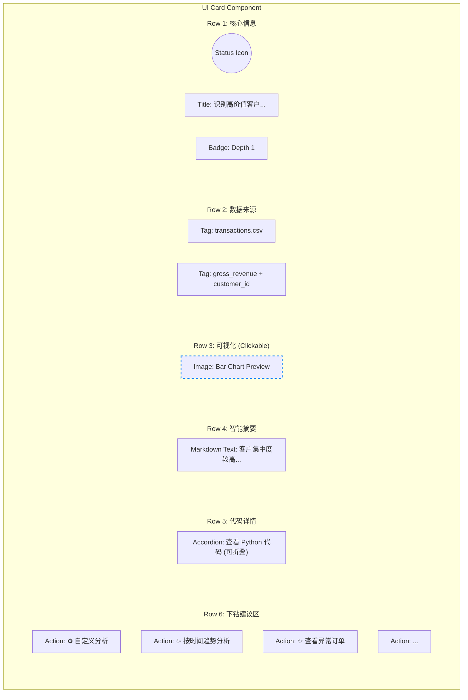

# 洞察卡片与思维导图 UI 设计方案

## 1. 核心设计目标
- **思维导图风格**: 强化“树”的连接感，使用线条清晰连接父子节点。
- **结构化卡片**: 严格分行展示信息，提升阅读效率。
- **全屏交互**: 图表点击放大，沉浸式查看。

## 2. 卡片内部布局示意图 (Row-by-Row)

每个 `InsightTreeNode` 卡片内部将严格分为以下 **6+ 行**：



## 3. 树状连接线效果 (Directory Tree Style)

**确认方案**：采用类似 **Obsidian/VS Code 文件树** 的连接线风格。与您提供的参考图一致。

### 视觉示意图 (ASCII Tree)

```text
┌────────────────────────────────────────────────────────────────────────────┐
│ 洞察建议1: 标题 (Title/Hypothesis) [Depth 0] [Status Icon]                 │
│ ├────────────────────────────────────────────────────────────────────────┤
│ │ 📄 文件名 + 📊 列名                                                    │
│ │ 🖼️ 可视化图表 (Image)                                                  │
│ │ 📝 智能摘要 (Summary)                                                  │
│ │ 💻 代码详情 [展开/折叠]                                                │
│ │                                                                        │
│ │ ⚙️ 自定义分析 [Dropdown]                                                │
│ │                                                                        │
│ │ ┌── 推荐动作 1: 客户分析 (Depth 1) ──────────────────────────────────┐ │
│ │ │ ├────────────────────────────────────────────────────────────────┤ │ │
│ │ │ │ 🖼️ 可视化 ...                                                    │ │ │
│ │ │ │                                                                │ │ │
│ │ │ │ ┌── 孙节点 A: 高价值客户 (Depth 2) ──────────────────────────┐ │ │ │
│ │ │ │ │ ...                                                        │ │ │ │
│ │ │ │ └────────────────────────────────────────────────────────────┘ │ │ │
│ │ │ │                                                                │ │ │
│ │ │ │ ┌── 孙节点 B: 客户流失 (Depth 2) ────────────────────────────┐ │ │ │
│ │ │ │ │ ...                                                        │ │ │ │
│ │ │ │ └────────────────────────────────────────────────────────────┘ │ │ │
│ │ │ └────────────────────────────────────────────────────────────────┘ │ │
│ │ │                                                                    │ │
│ │ └── 推荐动作 2: 地区分布 (Depth 1)                                   │ │
│ │     └── ...                                                          │ │
│ └────────────────────────────────────────────────────────────────────────┘
└────────────────────────────────────────────────────────────────────────────┘
```

**核心特征**：
1.  **左侧贯穿线 (Main Trunk)**: 父节点左侧有一条垂直线，向下延伸覆盖所有子节点。
2.  **L型分支线 (Branch)**: 每个子节点通过一条“└─”或“├─”形状的线连接到左侧垂直线。
3.  **对齐**: 卡片内容在分支线右侧垂直对齐。

**技术实现 (CSS)**:
- **容器**: 使用 `Flex Column` 布局。
- **垂直线**: 在父级容器 (`.insight-tree-node__children`) 左侧绘制 `border-left` 或 `::before`。
- **水平线**: 在每个子节点 (`.insight-tree-node`) 的 `:before` 伪元素上绘制短横线。
- **末端处理**: 最后一个子节点需要遮盖垂直线的多余部分（或使用 `bottom: 50%` 的技巧）来实现完美的 L 型转角。

## 4. 详细样式规划

### Row 1: Header
- **Layout**: Flex Row, `align-items: center`
- **Style**: 背景色微深，强调标题。

### Row 2: Metadata
- **Layout**: Flex Row, `gap: 8px`
- **Style**: 小字号，灰色胶囊背景，显示来源上下文。

### RowActions: Drill-down
- **Layout**: Flex Column (垂直列表)
- **Item Style**: 
  - **自定义分析**: 固定在第一位，虚线边框。
  - **推荐建议**: 实线边框，`width: 100%` 或 `fit-content`，整行可点。
