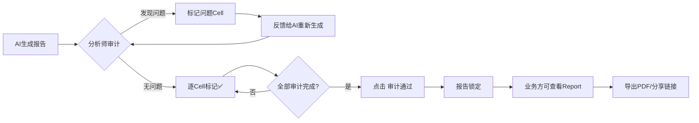

# 双角色分析报告 UI 方案（V2.0）

## 核心需求重新定义

### 用户画像

| 角色 | 核心需求 | 使用场景 | 关键操作 |
|-----|---------|---------|---------|
| **🔬 数据分析师** | 像Google Colab一样调整每个证据池 | 日常数据探索、调试分析逻辑 | 编辑代码、重新运行、调整参数、查看中间结果 |
| **👔 业务专家** | 看到简洁报告，不看代码细节 | 查看分析结论、做业务决策 | 查看图表、阅读摘要、导出报告、分享链接 |

### 设计目标
> **同一份数据，两种视角 —— 一键切换，无缝协作**

---

## 方案：Notebook + Report 双模式

### 核心理念
参考 **Google Colab** 的设计哲学：
- **分析师视角**：所见即所得的Notebook，每个证据是一个可编辑的Cell
- **业务视角**：自动隐藏代码，展示为精美的商业报告
- **一键切换**：顶部Toggle按钮，瞬间在两种模式间切换

---

## 一、Notebook 模式（数据分析师视角）

### 1.1 整体布局

```
┌─────────────────────────────────────────────────────────────────┐
│  LiuliX 分析报告   [📊 Notebook 模式 ⇄ Report 模式]  [▶ Run All] │
├─────────────────────────────────────────────────────────────────┤
│  ┌───────────────────────────────────────────────────────────┐  │
│  │ 📌 置顶工具栏                                              │  │
│  │ [+ 新建Cell] [导入.ipynb] [保存快照] [变量查看器]        │  │
│  └───────────────────────────────────────────────────────────┘  │
│                                                                 │
│  ┌─────────────────────────────────────────────────────────────┐│
│  │ Cell #001 【数据清洗】 Depth: 0          [▶] [⋮] [🗑]      ││
│  ├─────────────────────────────────────────────────────────────┤│
│  │ 📝 Markdown 区域（可编辑）                                  ││
│  │ ## 删除重复客户记录                                         ││
│  │ 发现 transactions.csv 中存在 234 条重复的 customer_id     ││
│  ├─────────────────────────────────────────────────────────────┤│
│  │ 💻 代码区域（可编辑，Monaco Editor）                        ││
│  │ ```sql                                                     ││
│  │ DELETE FROM transactions                                   ││
│  │ WHERE rowid NOT IN (                                       ││
│  │   SELECT MIN(rowid) FROM transactions                      ││
│  │   GROUP BY customer_id                                     ││
│  │ );                                                         ││
│  │ ```                                                        ││
│  │ [▶ Run Cell] [SQL → Python 切换]                          ││
│  ├─────────────────────────────────────────────────────────────┤│
│  │ 📊 输出区域                                                 ││
│  │ ✅ 执行成功 (耗时: 0.12s)                                   ││
│  │ ─────────────────────────────────────────                  ││
│  │ 删除行数: 234                                               ││
│  │ 剩余行数: 1,234 → 1,000                                    ││
│  │                                                            ││
│  │ 📋 数据预览 (前5行)                                         ││
│  │ ┌─────────┬──────────┬────────┐                           ││
│  │ │ cust_id │ amount   │ date   │                           ││
│  │ ├─────────┼──────────┼────────┤                           ││
│  │ │ C001    │ $1,234   │ 2024-01│                           ││
│  │ └─────────┴──────────┴────────┘                           ││
│  └─────────────────────────────────────────────────────────────┘│
│                                                                 │
│  ┌─────────────────────────────────────────────────────────────┐│
│  │ Cell #002 【洞察生成】 Depth: 0          [▶] [⋮] [🗑]      ││
│  ├─────────────────────────────────────────────────────────────┤│
│  │ 📝 ## 高价值客户识别                                        ││
│  ├─────────────────────────────────────────────────────────────┤│
│  │ 💻 ```python                                               ││
│  │ import matplotlib.pyplot as plt                            ││
│  │                                                            ││
│  │ df = duckdb.sql("""                                        ││
│  │   SELECT customer_id, SUM(amount) as total                ││
│  │   FROM transactions GROUP BY customer_id                  ││
│  │   ORDER BY total DESC LIMIT 20                            ││
│  │ """).df()                                                  ││
│  │                                                            ││
│  │ plt.bar(df['customer_id'], df['total'])                   ││
│  │ plt.title('Top 20 客户贡献')                               ││
│  │ ```                                                        ││
│  │ [▶ Run Cell] [参数面板 ▾]                                  ││
│  ├─────────────────────────────────────────────────────────────┤│
│  │ 📊 输出区域                                                 ││
│  │ ┌─────────────────────────┐                               ││
│  │ │  [柱状图: Top20客户]     │                               ││
│  │ │  (可点击放大)            │                               ││
│  │ └─────────────────────────┘                               ││
│  │                                                            ││
│  │ 💡 AI生成洞察                                               ││
│  │ TOP 20%客户贡献了80%的总收入，呈现典型的帕累托分布         ││
│  │ [编辑洞察] [重新生成]                                       ││
│  └─────────────────────────────────────────────────────────────┘│
│                                                                 │
│  ┌─────────────────────────────────────────────────────────────┐│
│  │ Cell #003 【深度下钻】 Depth: 1 (子节点)    [▶] [⋮] [🗑]  ││
│  │ 父节点: Cell #002                                          ││
│  │ ├── 可折叠显示缩进 ─────────────────────────────────────  ││
│  │ 📝 ## 北京地区高价值客户分析                                ││
│  │ 💻 [Python代码]                                            ││
│  │ 📊 [图表输出]                                               ││
│  └─────────────────────────────────────────────────────────────┘│
└─────────────────────────────────────────────────────────────────┘
```

### 1.2 核心功能

#### Cell 结构（类似Jupyter）
每个证据池 = 一个Cell，包含：
1. **📝 Markdown区域**：标题、假设、结论（富文本编辑）
2. **💻 代码区域**：SQL/Python代码（Monaco Editor，语法高亮、自动补全）
3. **📊 输出区域**：图表、表格、文本结果、错误信息

#### 关键交互
- **单Cell执行**：点击▶按钮，仅运行当前Cell
- **Run All**：顶部按钮，按顺序执行所有Cell
- **拖拽排序**：鼠标拖动Cell改变顺序（影响执行顺序）
- **参数面板**：点击展开，调整SQL变量/Python参数
- **版本快照**：保存当前Notebook状态，可回滚

#### 高级特性
```typescript
// 变量查看器（右侧侧边栏）
Variables Inspector:
  - tableName: "transactions" (string)
  - df_customers: DataFrame (1000 rows × 5 cols)
  - total_revenue: 12345.67 (number)
  [点击变量名查看详情]

// Cell依赖关系可视化
Cell #001 (数据清洗)
  ↓ 输出: cleaned_transactions
Cell #002 (洞察生成)
  ↓ 依赖: cleaned_transactions
  ↓ 输出: customer_segments
Cell #003 (深度分析)
  ↓ 依赖: customer_segments
```

---

## 二、Report 模式（业务专家视角）

### 2.1 整体布局

```
┌─────────────────────────────────────────────────────────────────┐
│  LiuliX 分析报告   [Notebook 模式 ⇄ 📊 Report 模式]   [📤 导出] │
├─────────────────────────────────────────────────────────────────┤
│  ┌───────────────────────────────────────────────────────────┐  │
│  │ 📊 执行摘要                           生成时间: 2024-12-27 │  │
│  │ ───────────────────────────────────────────────────────── │  │
│  │ 洞察数量: 5 条  |  数据清洗: 3 项  |  总耗时: 3m 24s      │  │
│  │ 主要发现: TOP 20%客户贡献80%收入，建议重点维护高价值客户  │  │
│  └───────────────────────────────────────────────────────────┘  │
│                                                                 │
│  ┌─────────────────────────────────────────────────────────────┐│
│  │ 📍 第一章：数据质量提升                                     ││
│  ├─────────────────────────────────────────────────────────────┤│
│  │                                                             ││
│  │ 删除重复客户记录                                             ││
│  │ ──────────────────────────────────                         ││
│  │ 发现 transactions.csv 中存在 234 条重复的 customer_id，    ││
│  │ 已自动去重，保留最早的交易记录。                             ││
│  │                                                             ││
│  │ 📊 影响范围                                                 ││
│  │ • 删除行数: 234                                             ││
│  │ • 数据清洗率: 19%                                           ││
│  │ • 剩余有效记录: 1,000 条                                    ││
│  │                                                             ││
│  │ [查看技术细节 ▾]  ← 折叠区域，点击展开查看SQL代码            ││
│  └─────────────────────────────────────────────────────────────┘│
│                                                                 │
│  ┌─────────────────────────────────────────────────────────────┐│
│  │ 📍 第二章：客户价值洞察                                     ││
│  ├─────────────────────────────────────────────────────────────┤│
│  │                                                             ││
│  │ 高价值客户识别                                               ││
│  │ ──────────────────────────────────                         ││
│  │ ┌─────────────────────────────┐                           ││
│  │ │                             │                           ││
│  │ │   📊 Top 20 客户贡献图       │                           ││
│  │ │   (精美柱状图，无代码背景)    │                           ││
│  │ │                             │                           ││
│  │ │   [点击查看大图]             │                           ││
│  │ └─────────────────────────────┘                           ││
│  │                                                             ││
│  │ 💡 关键发现                                                 ││
│  │ • TOP 20%客户贡献了80%的总收入                              ││
│  │ • 高价值客户集中在北京(35%)、上海(28%)                      ││
│  │ • 平均客单价为 ¥2,340，远高于整体均值 ¥890                 ││
│  │                                                             ││
│  │ 📌 业务建议                                                 ││
│  │ 1. 为TOP 20客户建立专属服务团队                             ││
│  │ 2. 设计VIP会员计划，提升客户粘性                            ││
│  │ 3. 重点投放广告资源到北京、上海地区                         ││
│  │                                                             ││
│  │ [深入分析 →] [添加批注]                                    ││
│  └─────────────────────────────────────────────────────────────┘│
│                                                                 │
│  ┌─────────────────────────────────────────────────────────────┐│
│  │ 📍 第三章：深度下钻分析                                     ││
│  │ (子节点自动缩进，显示层级关系)                               ││
│  │   └── 北京地区高价值客户分析                                ││
│  │       [图表] [结论]                                        ││
│  └─────────────────────────────────────────────────────────────┘│
│                                                                 │
│  ┌─────────────────────────────────────────────────────────────┐│
│  │ 📝 总结与行动计划                                           ││
│  │ ───────────────────────────────────────────────────────── ││
│  │ 基于本次分析，建议在Q1季度启动以下三项核心行动：            ││
│  │ ☐ 建立高价值客户CRM系统                                     ││
│  │ ☐ 上线VIP会员计划（预算50万）                               ││
│  │ ☐ 北京、上海地区广告投放增加30%                             ││
│  └─────────────────────────────────────────────────────────────┘│
└─────────────────────────────────────────────────────────────────┘
```

### 2.2 核心特性

#### 自动转换规则
从Notebook模式切换到Report模式时：
1. **隐藏代码**：所有💻代码区域默认折叠（可展开）
2. **突出图表**：📊输出区域放大，居中显示
3. **提炼结论**：💡AI洞察移到最显眼位置
4. **章节划分**：自动按Depth/类型分组为章节
5. **美化排版**：应用精美的商业报告样式

#### 可选展示
- **技术细节**：点击"查看技术细节▾"展开代码
- **数据表格**：默认隐藏，点击"查看原始数据"展开
- **执行日志**：仅显示成功/失败状态，隐藏详细日志

---

## 三、双模式切换机制

### 3.1 顶部Toggle设计

```
┌─────────────────────────────────────────┐
│ [📊 Notebook 模式 ⇄ Report 模式]        │
│                                         │
│ Notebook: 数据分析师视角 (完整编辑能力)  │
│ Report: 业务专家视角 (简洁报告视图)      │
└─────────────────────────────────────────┘
```

### 3.2 快捷键
- `Ctrl/Cmd + Shift + N`：切换到Notebook模式
- `Ctrl/Cmd + Shift + R`：切换到Report模式
- `Ctrl/Cmd + Enter`：运行当前Cell（仅Notebook模式）

### 3.3 URL参数
- `?mode=notebook`：默认打开为Notebook模式
- `?mode=report`：默认打开为Report模式
- 用于分享链接：分析师分享编辑链接，业务方仅查看报告

---

## 四、数据结构设计

### 4.1 Cell数据模型

```typescript
interface NotebookCell {
  // 唯一标识
  id: string;
  
  // Cell类型
  type: 'markdown' | 'code' | 'insight';
  
  // 编号和层级
  order: number;           // 执行顺序
  depth: number;           // 深度（下钻层级）
  parentId?: string;       // 父Cell ID
  
  // 内容（Notebook模式）
  markdown: string;        // Markdown文本（可编辑）
  code: {
    language: 'sql' | 'python';
    content: string;       // 代码内容（可编辑）
    parameters?: Record<string, any>; // 参数
  };
  
  // 输出（两种模式共享）
  output: {
    status: 'idle' | 'running' | 'success' | 'error';
    executionTime?: number;
    result?: {
      type: 'text' | 'table' | 'chart' | 'error';
      data: any;
      chartImage?: string; // Base64编码的图表
    };
  };
  
  // AI生成内容（Report模式核心）
  insights: {
    summary: string;       // 摘要（隐藏代码后显示）
    keyFindings: string[]; // 关键发现列表
    recommendations: string[]; // 业务建议
  };
  
  // 元数据
  metadata: {
    createdAt: number;
    updatedAt: number;
    executedAt?: number;
    tags: string[];
    isPinned: boolean;
  };
}
```

### 4.2 Notebook文档模型

```typescript
interface NotebookDocument {
  id: string;
  title: string;
  cells: NotebookCell[];
  
  // 全局变量（跨Cell共享）
  variables: Record<string, any>;
  
  // 版本快照
  snapshots: {
    timestamp: number;
    cells: NotebookCell[];
    note: string;
  }[];
  
  // 导出配置
  exportConfig: {
    includeCode: boolean;      // 导出时是否包含代码
    theme: 'light' | 'dark';   // 报告主题
    logoUrl?: string;          // 公司Logo
  };
}
```

---

## 五、技术实现要点

### 5.1 Monaco Editor集成

```typescript
// 代码编辑器配置
const editorConfig = {
  language: 'sql', // 或 'python'
  theme: 'vs-dark',
  minimap: { enabled: false },
  lineNumbers: 'on',
  automaticLayout: true,
  
  // 自动补全（SQL表名、列名）
  suggest: {
    showKeywords: true,
    showSnippets: true,
  },
  
  // 语法检查
  validate: true,
};
```

### 5.2 Cell执行引擎

```typescript
class CellExecutor {
  async executeCell(cell: NotebookCell): Promise<CellOutput> {
    // 1. 更新状态为running
    this.updateCellStatus(cell.id, 'running');
    
    // 2. 根据语言类型执行
    if (cell.code.language === 'sql') {
      return await this.executeSQLCell(cell);
    } else {
      return await this.executePythonCell(cell);
    }
  }
  
  async executeSQLCell(cell: NotebookCell) {
    // 使用DuckDB执行
    const result = await duckdb.query(cell.code.content);
    
    // 生成可视化（如果适用）
    const chartImage = await this.generateChart(result);
    
    // AI生成洞察
    const insights = await this.generateInsights(result, cell.markdown);
    
    return { result, chartImage, insights };
  }
  
  async executePythonCell(cell: NotebookCell) {
    // 使用Pyodide执行
    const result = await pyodide.runPython(cell.code.content);
    
    // 捕获matplotlib输出
    const chartImage = await this.capturePlot();
    
    return { result, chartImage };
  }
}
```

### 5.3 模式切换动画

```css
/* Notebook → Report 切换动画 */
.cell.notebook-mode {
  .code-area { opacity: 1; height: auto; }
  .insights-area { opacity: 0.7; font-size: 0.9em; }
}

.cell.report-mode {
  .code-area {
    opacity: 0;
    height: 0;
    overflow: hidden;
    transition: all 0.3s ease;
  }
  
  .insights-area {
    opacity: 1;
    font-size: 1.1em;
    margin-top: var(--gap-l);
    padding: var(--gap-m);
    background: var(--bg-highlight);
    border-left: 4px solid var(--bg-accent);
  }
  
  .chart-output {
    transform: scale(1.1);
    box-shadow: var(--shadow-lv3);
  }
}
```

---

## 六、MVP开发计划

### Phase 1: 基础Notebook (2周)

#### Week 1: Cell核心功能
- [ ] Cell组件开发（Markdown + Code + Output三区域）
- [ ] Monaco Editor集成（SQL语法高亮）
- [ ] DuckDB执行引擎对接
- [ ] Cell运行状态管理（idle/running/success/error）

#### Week 2: Cell交互
- [ ] 单Cell执行（▶按钮）
- [ ] Cell拖拽排序
- [ ] Markdown编辑（富文本编辑器）
- [ ] 输出区域（表格、文本、错误）

### Phase 2: Report模式 (1周)

#### Week 3: 模式切换
- [ ] 顶部Toggle组件
- [ ] Notebook ↔ Report切换逻辑
- [ ] 代码区域折叠/展开动画
- [ ] 章节自动划分（按Depth分组）
- [ ] 报告样式美化（商业风格CSS）

### Phase 3: 高级功能 (2周)

#### Week 4-5: Colab特性
- [ ] Run All按钮
- [ ] 变量查看器（右侧侧边栏）
- [ ] Cell依赖关系可视化
- [ ] 参数面板（调整SQL变量）
- [ ] 版本快照（保存/恢复）
- [ ] Python支持（Pyodide执行）
- [ ] matplotlib图表捕获

### Phase 4: 导出与分享 (1周)

#### Week 6: 导出功能
- [ ] 导出为PDF（Report模式）
- [ ] 导出为.ipynb（Jupyter兼容格式）
- [ ] 分享链接生成（只读Report模式）
- [ ] 品牌定制（Logo、主题色）

---

## 七、用户体验优化

### 7.1 首次引导

**Notebook模式引导**：
```
┌─────────────────────────────────────┐
│ 🎉 欢迎使用 LiuliX Notebook！        │
│                                     │
│ 这是一个类似Google Colab的环境：     │
│ • 每个证据池是一个Cell               │
│ • 点击▶运行Cell，查看结果            │
│ • 编辑代码后，重新运行即可更新        │
│                                     │
│ [开始教程] [跳过]                    │
└─────────────────────────────────────┘
```

**Report模式引导**：
```
┌─────────────────────────────────────┐
│ 📊 这是简洁的报告视图                │
│                                     │
│ • 所有代码已隐藏，仅显示结论          │
│ • 点击"查看技术细节"可展开代码        │
│ • 适合向业务方展示分析结果            │
│                                     │
│ [切换到Notebook模式] [明白了]        │
└─────────────────────────────────────┘
```

### 7.2 快捷键提示

```
┌─────────────────────────────────────┐
│ ⌨️ 快捷键                            │
│                                     │
│ Ctrl+Enter    运行当前Cell          │
│ Ctrl+Shift+N  切换Notebook模式       │
│ Ctrl+Shift+R  切换Report模式         │
│ Ctrl+S        保存快照              │
│ Ctrl+/        查看所有快捷键         │
└─────────────────────────────────────┘
```

### 7.3 错误处理

**代码执行错误**（Notebook模式）：
```
📊 输出区域
❌ 执行失败 (耗时: 0.05s)
─────────────────────────────
Error: table 'customers' does not exist

💡 修复建议:
• 确保表名正确（当前可用表: transactions）
• 检查是否需要先运行上游Cell
• 点击查看依赖关系 →

[重新运行] [查看日志]
```

**模式切换警告**（未保存编辑）：
```
⚠️ 检测到未保存的编辑
切换到Report模式前，是否保存当前更改？

[保存并切换] [放弃更改] [取消]
```

---

## 八、与现有架构的集成

### 8.1 Evidence Pool映射

```typescript
// 现有Evidence Record → Notebook Cell
function evidenceToCell(record: EvidenceRecord): NotebookCell {
  return {
    id: record.id,
    type: 'insight',
    order: record.timestamp, // 按时间排序
    depth: record.metadata?.depth || 0,
    
    markdown: record.title + '\n\n' + record.description,
    
    code: {
      language: record.metadata?.codeLanguage || 'sql',
      content: record.metadata?.code || '',
    },
    
    output: {
      status: 'success',
      result: {
        type: 'chart',
        chartImage: record.metadata?.chartImage,
        data: record.metadata?.tableData,
      },
    },
    
    insights: {
      summary: record.description,
      keyFindings: record.metadata?.keyFindings || [],
      recommendations: record.metadata?.recommendations || [],
    },
    
    metadata: {
      createdAt: record.timestamp,
      updatedAt: record.timestamp,
      tags: record.tags || [],
      isPinned: record.isPinned || false,
    },
  };
}
```

### 8.2 InsightChain兼容性

```typescript
// 洞察链 → Notebook层级结构
function insightChainToNotebook(chain: InsightChain): NotebookDocument {
  const cells: NotebookCell[] = [];
  
  // 1. Hypothesis作为第一个Markdown Cell
  cells.push({
    id: 'hypothesis',
    type: 'markdown',
    order: 0,
    depth: 0,
    markdown: `# ${chain.hypothesis.title}\n\n${chain.hypothesis.description}`,
  });
  
  // 2. 遍历insights，转为Code Cell
  chain.insights.forEach((insight, idx) => {
    cells.push({
      id: insight.nodeId,
      type: 'code',
      order: idx + 1,
      depth: insight.depth,
      parentId: insight.parentNodeId,
      code: {
        language: insight.codeLanguage,
        content: insight.code,
      },
      output: {
        status: 'success',
        result: {
          type: 'chart',
          chartImage: insight.chartImage,
        },
      },
      insights: {
        summary: insight.conclusion,
        keyFindings: [insight.conclusion],
        recommendations: [],
      },
    });
  });
  
  return {
    id: chain.id,
    title: chain.hypothesis.title,
    cells,
    variables: {},
    snapshots: [],
    exportConfig: { includeCode: false, theme: 'light' },
  };
}
```

---

## 九、成功指标

### 数据分析师（Notebook模式）
- ✅ Cell编辑 → 运行 → 查看结果，全流程<5秒
- ✅ 90%的分析师能在10分钟内掌握基本操作
- ✅ 代码编辑器体验与VS Code相当（语法高亮、补全）

### 业务专家（Report模式）
- ✅ 打开报告，3秒内看到关键图表和结论
- ✅ 无需培训，直接理解报告内容
- ✅ 导出PDF，排版美观，可直接用于演示

### 协作效率
- ✅ 分析师编辑后，业务方点击链接立即看到更新
- ✅ 两种模式切换流畅，无卡顿
- ✅ 支持5个Cell并发执行，总耗时<30秒

---

## 十、风险与应对

| 风险 | 影响 | 缓解措施 |
|-----|-----|---------|
| Monaco Editor性能问题 | 大代码文件卡顿 | 虚拟滚动、延迟加载 |
| Cell执行顺序混乱 | 结果不一致 | 依赖关系检查、强制顺序执行 |
| 代码注入安全风险 | 恶意代码执行 | SQL只读模式、Python沙箱隔离 |
| 模式切换丢失状态 | 用户困惑 | 保存编辑状态、提示未保存更改 |

---

## 十一、后续增强方向

### AI辅助编码
- **自动补全**：根据数据schema生成SQL
- **错误修复**：AI分析错误日志，建议修复方案
- **洞察生成**：自动生成keyFindings和recommendations

### 协作功能
- **多人同时编辑**：类似Google Docs，实时协作
- **评论系统**：业务方对Cell添加批注
- **版本对比**：查看两个快照的差异

### 高级可视化
- **交互式图表**：Plotly集成，支持缩放、筛选
- **仪表盘嵌入**：Cell输出可嵌入到外部仪表盘
- **动画演示**：自动播放Cell执行过程

---

## 附录：Figma原型链接（待创建）

- [ ] Notebook模式主界面
- [ ] Report模式主界面
- [ ] 模式切换动画演示
- [ ] Cell编辑交互流程
- [ ] 移动端适配方案

---

## 🚀 MVP 最小可行方案（V0：展示优先，1周实现）

### 核心原则重新定义
> **V0核心目标**：验证"Notebook展示 + Report视图 + 审计签字"是否满足双角色协作需求  
> **关键策略**：**仅展示，不执行** —— 分析师可复制到Google Colab自行执行

---

## MVP 功能矩阵（V0修订版）

| 功能 | 完整方案 | ~~MVP V1~~ | **MVP V0（本次实现）** | 调整说明 |
|-----|---------|-----------|---------------------|---------|
| **Cell基础结构** | Markdown + Code + Output | Code + Output | ✅ **仅Code + 已有Output** | V0不生成新输出，仅展示已有结果 |
| **代码编辑器** | Monaco Editor | `<textarea>` | ✅ **只读显示** + Prism.js | 不可编辑，仅查看和复制 |
| **代码执行** | SQL + Python | 仅SQL | ❌ **V0完全移除** | 执行按钮置灰，提示"请复制到Colab" |
| **模式切换** | Notebook ⇄ Report | ✅ | ✅ **核心功能** | 必须实现 |
| **一键导出Colab** | ❌ | ❌ | ✅ **新增核心功能** | 导出为.ipynb，可直接在Colab打开 |
| **审计签字流程** | ❌ | ❌ | ✅ **新增核心功能** | 数据分析师审计通过 → Finish |
| **代码复制** | 单Cell复制 | 单Cell | ✅ **支持整个Notebook复制** | 一键复制所有Cell到剪贴板 |
| **图表显示** | 可交互、放大 | 静态显示 | ✅ **静态Base64** | 复用现有图片 |
| **导出Report** | PDF/Word/MD | 仅Markdown | ✅ **Markdown + PDF** | 业务方导出报告 |

---

## V0 核心功能设计

### 1. 只读Notebook模式（数据分析师审计）

```
┌─────────────────────────────────────────────────────────────┐
│ [📊 Notebook] [Report]   [📋 复制全部到Colab] [✅ 审计通过] │
├─────────────────────────────────────────────────────────────┤
│ Cell #001 (Depth 0)           [📋 复制] [⚠️ 运行已禁用]    │
│ ┌─────────────────────────────────────────────────────────┐ │
│ │ SELECT customer_id, SUM(amount) as total                │ │
│ │ FROM transactions                                       │ │
│ │ GROUP BY customer_id ORDER BY total DESC LIMIT 20       │ │
│ └─────────────────────────────────────────────────────────┘ │
│ (只读，语法高亮，可选中复制)                                 │
│                                                             │
│ 📊 输出（已生成）                                            │
│ [柱状图Base64]                                              │
│ 💡 TOP 20客户贡献80%收入                                    │
│                                                             │
│ ✅ 审计状态: 待审核                                          │
│ [✓ 标记为已审计] [✗ 标记问题]                               │
├─────────────────────────────────────────────────────────────┤
│ Cell #002                     [📋 复制] [⚠️ 运行已禁用]    │
│ ...                                                         │
└─────────────────────────────────────────────────────────────┘
```

**关键特性**：
- **只读代码**：`<pre>` + Prism.js，不可编辑
- **执行按钮置灰**：显示"⚠️ V0版本暂不支持执行，请复制到Colab"
- **Cell审计状态**：待审核 / 已审计 / 有问题
- **整体审计**：右上角"✅ 审计通过"按钮

---

### 2. 一键导出到Google Colab

#### 功能设计
```tsx
// 顶部工具栏
<button onClick={exportToColab}>
  📋 复制全部到Colab
</button>

// 点击后
async function exportToColab() {
  // 1. 生成.ipynb格式JSON
  const notebook = {
    cells: cells.map(cell => ({
      cell_type: 'code',
      source: cell.code.split('\n'),
      metadata: {},
      outputs: [], // Colab会重新执行
    })),
    metadata: {
      kernelspec: {
        display_name: 'Python 3',
        language: 'python',
        name: 'python3'
      }
    },
    nbformat: 4,
    nbformat_minor: 0
  };
  
  // 2. 生成下载链接
  const blob = new Blob([JSON.stringify(notebook, null, 2)], {
    type: 'application/x-ipynb+json'
  });
  const url = URL.createObjectURL(blob);
  
  // 3. 自动下载
  const link = document.createElement('a');
  link.href = url;
  link.download = `LiuliX_Report_${Date.now()}.ipynb`;
  link.click();
  
  // 4. 提示用户
  toast.success('已下载.ipynb文件，请上传到Google Colab打开');
}
```

#### 用户操作流程
1. 点击"📋 复制全部到Colab"
2. 自动下载`.ipynb`文件
3. 浏览器提示："已下载，请前往 [colab.research.google.com](https://colab.research.google.com) 上传"
4. 用户在Colab点击"上传" → 选择下载的`.ipynb`
5. Colab自动加载所有Cell，可逐个执行验证

---

### 3. 审计签字流程（核心闭环）

#### 工作流设计


#### UI交互

**Cell级别审计**：
```
┌─────────────────────────────────────┐
│ Cell #001                           │
│ [SQL代码...]                        │
│ [图表输出...]                       │
│                                     │
│ 审计状态: ⚪ 待审核                 │
│ [✓ 通过] [✗ 有问题] [💬 添加备注] │
└─────────────────────────────────────┘

// 点击"✗ 有问题"后
┌─────────────────────────────────────┐
│ 标记问题                            │
│ ─────────────────────────────────  │
│ 问题类型:                           │
│ ○ SQL逻辑错误                       │
│ ○ 数据异常                          │
│ ○ 图表不准确                        │
│ ○ 结论不合理                        │
│                                     │
│ 备注: [文本框]                      │
│ [提交] [取消]                       │
└─────────────────────────────────────┘
```

**整体审计**：
```
┌─────────────────────────────────────┐
│ 审计进度: 3/5 Cell已审核             │
│ ✅ Cell #001 (通过)                 │
│ ✅ Cell #002 (通过)                 │
│ ⚪ Cell #003 (待审核)                │
│ ✅ Cell #004 (通过)                 │
│ ⚪ Cell #005 (待审核)                │
│                                     │
│ [完成审计并签字] ← 禁用，直到全部通过│
└─────────────────────────────────────┘

// 全部通过后
┌─────────────────────────────────────┐
│ ✅ 审计完成                         │
│                                     │
│ 审计人: 张三（数据分析师）           │
│ 审计时间: 2024-12-27 14:30          │
│ 签字确认:                           │
│ [我已审计所有Cell，确认无误]        │
│                                     │
│ [✅ 签字并锁定报告]                 │
└─────────────────────────────────────┘
```

**签字后状态**：
```
┌─────────────────────────────────────┐
│ 🔒 报告已锁定                       │
│                                     │
│ 审计人: 张三                        │
│ 审计时间: 2024-12-27 14:30          │
│ 状态: ✅ 已签字确认                 │
│                                     │
│ [解锁并重新审计] [导出审计报告]    │
└─────────────────────────────────────┘
```

---

### 4. Report模式（随时可查看）

**签字前状态**（数据分析师审计阶段）：
```
┌─────────────────────────────────────┐
│ [Notebook] [📄 Report] [📋 复制]   │
├─────────────────────────────────────┤
│ ⚠️ 报告尚未签字审计                 │
│ 可查看Report预览，但无法导出        │
├─────────────────────────────────────┤
│ 📍 洞察 #001                        │
│ 📊 [图表]                           │
│ 💡 TOP 20客户贡献80%收入            │
│                                     │
│ [查看代码 ▾] ← 可选查看技术细节     │
├─────────────────────────────────────┤
│ ...                                 │
├─────────────────────────────────────┤
│ [📤 导出Report] ← 禁用，提示需签字  │
│ [📋 复制代码] ← 可用                │
└─────────────────────────────────────┘
```

**签字后状态**（业务专家可导出）：
```
┌─────────────────────────────────────┐
│ [Notebook] [📄 Report] [📤 导出]   │
├─────────────────────────────────────┤
│ 🔒 本报告已通过数据分析师审计       │
│ 审计人: 张三 | 时间: 2024-12-27    │
├─────────────────────────────────────┤
│ 📍 洞察 #001                        │
│ 📊 [图表]                           │
│ 💡 TOP 20客户贡献80%收入            │
│                                     │
│ [查看代码 ▾] ← 可选查看技术细节     │
├─────────────────────────────────────┤
│ ...                                 │
├─────────────────────────────────────┤
│ [📤 导出PDF] [📤 导出Markdown]     │
│ [🔗 生成分享链接]                   │
└─────────────────────────────────────┘
```

**关键权限设计**：
| 操作 | 签字前 | 签字后 |
|-----|-------|-------|
| 切换Notebook ⇄ Report | ✅ 允许 | ✅ 允许 |
| 查看Report预览 | ✅ 允许 | ✅ 允许 |
| 复制代码到Colab | ✅ 允许 | ✅ 允许 |
| 导出Report（PDF/MD） | ❌ **禁用** | ✅ **解锁** |
| 生成分享链接 | ❌ 禁用 | ✅ 解锁 |

---

## V0 开发计划（7天冲刺）

### Day 1-2: Cell只读组件 + 模式切换
- [ ] 创建`ReportCellReadOnly.tsx`组件
- [ ] 使用`<pre>`标签 + Prism.js语法高亮
- [ ] 集成代码复制按钮（单Cell）
- [ ] 顶部Toggle组件（Notebook ⇄ Report）
- [ ] 模式状态管理和URL参数

### Day 3-4: 审计签字核心流程
- [ ] Cell审计状态数据结构（待审核/已审计/有问题）
- [ ] Cell级别审计按钮（✓通过 / ✗有问题

## MVP 实现范围

### ✅ 必须实现（核心验证）

#### 1. Cell组件（简化版）
```tsx
// 最简Cell结构
interface MVPCell {
  id: string;
  code: string;              // SQL代码（纯文本）
  output: {
    chartImage?: string;     // Base64图片
    summary?: string;        // AI摘要
    error?: string;          // 错误信息
  };
  depth: number;             // 层级
}
```

**UI结构**：
```
┌─────────────────────────────────────┐
│ Cell #001 (Depth 0)   [▶ 运行]      │
├─────────────────────────────────────┤
│ [代码编辑区]                         │
│ <textarea> SQL代码 </textarea>       │
│ (简单语法高亮：用Prism.js)           │
├─────────────────────────────────────┤
│ [输出区]                             │
│ 📊 图表（Base64 ）              │
│ 💡 摘要：AI生成的结论                │
└─────────────────────────────────────┘
```

#### 2. 模式切换（核心功能）
```tsx
// 顶部Toggle
<div className="mode-toggle">
  <button onClick={() => setMode('notebook')}>
    📊 Notebook模式
  </button>
  <button onClick={() => setMode('report')}>
    📄 Report模式
  </button>
</div>

// 条件渲染
{mode === 'notebook' && (
  <textarea value={cell.code} onChange={...} />
)}

{mode === 'report' && (
  <div className="report-view">
    
    <p>{cell.output.summary}</p>
    {/* 代码区域隐藏 */}
  </div>
)}
```

#### 3. 单Cell执行
```tsx
async function runCell(cellId: string) {
  const cell = cells.find(c => c.id === cellId);
  
  // 1. 执行SQL
  const result = await duckdb.query(cell.code);
  
  // 2. 生成图表（复用现有逻辑）
  const chartImage = await generateChart(result);
  
  // 3. AI生成摘要（复用现有AI服务）
  const summary = await aiService.generateSummary(result);
  
  // 4. 更新Cell输出
  updateCellOutput(cellId, { chartImage, summary });
}
```

#### 4. 从Evidence自动转换
```tsx
// 页面加载时，将现有Evidence转为Cell
useEffect(() => {
  const cells = records
    .filter(r => r.type === 'insightChain')
    .map(record => ({
      id: record.id,
      code: record.metadata?.code || '',
      output: {
        chartImage: record.metadata?.chartImage,
        summary: record.description,
      },
      depth: record.metadata?.depth || 0,
    }));
  
  setCells(cells);
}, [records]);
```

---

### ❌ 暂不实现（延后到V2）

1. **Monaco Editor** → 用简单`<textarea>` + Prism.js语法高亮
2. **Python支持** → 仅支持SQL
3. **拖拽排序** → 固定顺序展示
4. **Run All** → 仅单Cell运行
5. **变量查看器** → 无
6. **版本快照** → 无（可手动保存）
7. **Markdown编辑** → Cell仅包含代码
8. **章节自动分组** → Report模式线性排列

---

## MVP 开发计划（10天冲刺）

### Day 1-2: Cell组件开发
- [ ] 创建`ReportCell.tsx`组件
- [ ] 实现代码编辑区（`<textarea>`）
- [ ] 集成Prism.js语法高亮
- [ ] 输出区布局（图表 + 摘要）

### Day 3-4: 模式切换
- [ ] 顶部Toggle组件
- [ ] `notebook` / `report` 状态管理
- [ ] CSS样式：Notebook vs Report两种风格
- [ ] 代码区显示/隐藏逻辑

### Day 5-6: Cell执行引擎
- [ ] `runCell()` 函数实现
- [ ] 对接DuckDB执行SQL
- [ ] 对接现有图表生成服务
- [ ] 对接AI摘要服务
- [ ] 错误处理和状态显示

### Day 7-8: 数据集成
- [ ] Evidence → Cell 转换逻辑
- [ ] 从`EvidenceContext`读取数据
- [ ] Cell列表渲染（按depth缩进）
- [ ] 父子关系显示（简单缩进即可）

### Day 9: 导出功能
- [ ] Report模式导出为Markdown
- [ ] 复用现有`generateMarkdownReport()`
- [ ] 添加"包含代码"选项

### Day 10: 测试与优化
- [ ] 浏览器验证
- [ ] 修复Bug
- [ ] 性能优化（如有必要）
- [ ] 更新i18n

---

## MVP 技术栈（最小化）

```json
{
  "新增依赖": [
    "prismjs": "^1.29.0"  // 代码语法高亮（轻量级）
  ],
  "复用现有": [
    "DuckDB WASM",        // SQL执行
    "AI Service",         // 生成摘要
    "Chart Generator",    // 生成图表
    "EvidenceContext"     // 数据源
  ],
  "暂不引入": [
    "monaco-editor",      // 过重，MVP用textarea
    "@dnd-kit/core",      // 拖拽，V2再加
    "react-window"        // 虚拟滚动，数据量不大暂不需要
  ]
}
```

---

## MVP 成功标准（验证假设）

### 核心假设1：分析师愿意用Notebook模式编辑
**验证方式**：
- ✅ 分析师能在2分钟内编辑并运行一个Cell
- ✅ 编辑体验不明显劣于现有界面
- ✅ 错误提示清晰，能快速定位问题

### 核心假设2：业务方满意Report模式
**验证方式**：
- ✅ 切换到Report模式，3秒内看到图表和结论
- ✅ 代码完全隐藏，界面简洁
- ✅ 业务方能独立导出报告

### 核心假设3：双模式切换流畅
**验证方式**：
- ✅ 切换无卡顿（<100ms）
- ✅ 编辑状态保留（切换回Notebook，代码未丢失）
- ✅ 快捷键可用

---

## MVP UI 对比

### Notebook模式（MVP简化版）
```
┌─────────────────────────────────────┐
│ [📊 Notebook] [Report]     [导出]   │
├─────────────────────────────────────┤
│ Cell #001                 [▶ 运行]  │
│ ┌─────────────────────────────────┐ │
│ │ SELECT customer_id,             │ │
│ │   SUM(amount) as total          │ │
│ │ FROM transactions               │ │
│ │ GROUP BY customer_id            │ │
│ │ ORDER BY total DESC LIMIT 20    │ │
│ └─────────────────────────────────┘ │
│ (Prism.js语法高亮)                  │
│                                     │
│ 📊 [柱状图Base64]                   │
│ 💡 TOP 20客户贡献80%收入            │
├─────────────────────────────────────┤
│ Cell #002                 [▶ 运行]  │
│ ...                                 │
└─────────────────────────────────────┘
```

### Report模式（MVP简化版）
```
┌─────────────────────────────────────┐
│ [Notebook] [📄 Report]     [导出]   │
├─────────────────────────────────────┤
│ 📍 洞察 #001                        │
│                                     │
│ 📊 [柱状图Base64 - 放大显示]        │
│                                     │
│ 💡 关键发现                         │
│ TOP 20客户贡献80%收入               │
│                                     │
│ [查看代码 ▾]  ← 可选折叠            │
├─────────────────────────────────────┤
│ 📍 洞察 #002                        │
│ ...                                 │
└─────────────────────────────────────┘
```

---

## MVP 风险控制

| 风险 | MVP应对 |
|-----|--------|
| 简单编辑器体验差 | 如严重影响，2天内可升级为Monaco（已有备选方案） |
| Cell执行失败 | 复用现有DuckDB逻辑，风险低 |
| 模式切换状态丢失 | 使用React状态管理，确保数据不丢 |
| 性能问题 | MVP数据量小（<20个Cell），暂无虚拟滚动需求 |

---

## MVP 后的迭代路线（V2规划）

### 迭代1：编辑体验升级（1周）
- [ ] 升级为Monaco Editor
- [ ] SQL自动补全（表名、列名）
- [ ] 代码格式化

### 迭代2：协作功能（1周）
- [ ] Run All按钮
- [ ] Cell拖拽排序
- [ ] 版本快照

### 迭代3：高级功能（2周）
- [ ] Python支持（Pyodide）
- [ ] 变量查看器
- [ ] 导出为PDF/IPYNB

---

## 总结：MVP聚焦双模式价值验证

**保留功能**：
1. ✅ Cell代码编辑（简化版编辑器）
2. ✅ 单Cell执行（SQL + 图表 + AI摘要）
3. ✅ Notebook ⇄ Report 模式切换
4. ✅ Report模式代码隐藏
5. ✅ Markdown导出

**延后功能**（V2再做）：
1. ❌ Monaco Editor（用textarea代替）
2. ❌ Python支持（仅SQL）
3. ❌ 拖拽排序、Run All、变量查看器
4. ❌ Markdown编辑、章节分组

**时间估算**：
- **开发**：10天（1位全职工程师）
- **测试**：2天
- **上线**：**<2周**

**验证目标**：这样的MVP能在最短时间内验证核心假设：**双模式是否真正解决了双角色需求**？
