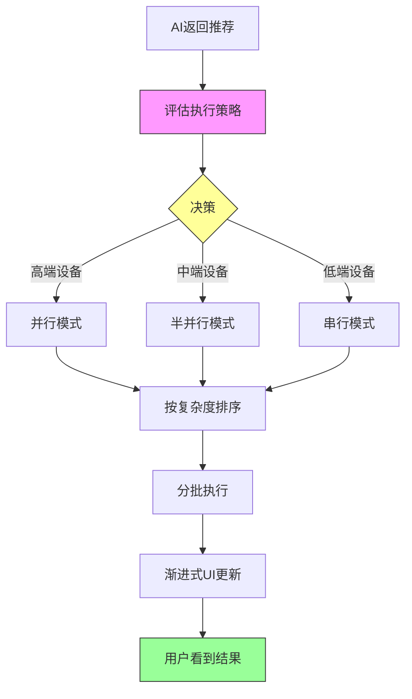

# 智能洞察执行策略自适应系统设计方案

## 📋 文档信息

- **创建时间**：2026-01-10
- **设计者**：AI Agent
- **状态**：设计阶段
- **优先级**：P1
- **预计工作量**：25分钟

---

## 🎯 背景与问题

### 问题现象

**2026-01-10 性能问题**：
- 用户反馈洞察分析模块"无法加载"
- 实际情况：执行时序分解分析耗时3分钟+
- 用户体验：首屏等待30秒+，看起来像卡死

**根本原因**：
1. **串行执行**：5个洞察任务按顺序执行，前面的完成后才执行下一个
2. **无优先级**：AI返回的推荐顺序随机，可能把最慢的任务（时序分解）放第一位
3. **计算复杂度差异大**：
   - 基础统计：0.5秒
   - 相关性分析：1秒
   - 时序分解：30秒+

**影响**：
- 首屏时间：0.5秒（最好情况） ~ 30秒+（最坏情况）
- 用户放弃率：显著提高
- 感知性能：远低于实际能力

---

## 💡 设计目标

### 主要目标

1. **极速首屏**：确保用户在**1秒内**看到首个分析结果
2. **自适应性**：根据设备能力自动选择最优执行策略
3. **性能充分利用**：高端设备并行执行，低端设备安全运行
4. **零配置**：用户无需手动调整，系统智能决策

### 次要目标

5. **可观测性**：清晰的日志和性能指标
6. **可扩展性**：易于添加新的执行模式
7. **向后兼容**：现有代码无需大改

---

## 🏗️ 系统架构

### 整体流程



### 核心模块

#### 1. 策略评估器（Strategy Assessor）

**职责**：根据设备能力和数据规模，决定执行策略

**输入**：
- 洞察节点列表（InsightNode[]）
- 总行数（totalRows）
- 浏览器内存（browserMemory）

**输出**：
```typescript
interface ExecutionStrategy {
    mode: 'serial' | 'parallel';      // 串行 or 并行
    concurrency?: number;              // 并发数（1-3）
    sortByComplexity: boolean;         // 是否按复杂度排序
    enableSampling: boolean;           // 对重任务启用采样
    estimatedTime: number;             // 预估总耗时（秒）
}
```

#### 2. 复杂度评分器（Complexity Scorer）

**职责**：为每个洞察任务评估计算复杂度

**评分标准**：
```typescript
const BASE_SCORES = {
    // 🟢 轻量级（< 1秒）
    'worker-stats-v1': 10,           // 基础统计
    'worker-distribution-v1': 15,    // 分布图
    'worker-missing-v1': 20,         // 缺失值检查
    
    // 🟡 中等（1-5秒）
    'worker-correlation-v1': 30,     // 相关性
    'worker-trend-v1': 35,           // 趋势分析
    'worker-groupby-v1': 40,         // 分组聚合
    'worker-outlier-v1': 45,         // 异常值检测
    
    // 🟠 重量级（5-30秒）
    'worker-cluster-v1': 60,         // 聚类（K-Means）
    'worker-regression-v1': 65,      // 回归
    'worker-time-decomposition-v1': 80,  // ⚠️ 时序分解
    
    // 🔴 超重量级（> 30秒）
    'worker-dbscan-v1': 90,          // DBSCAN聚类
    'worker-decision-tree-v1': 85,   // 决策树
};
```

**动态调整**：
```typescript
function calculateComplexity(
    promptId: string,
    totalRows: number,
    columnCount: number
): number {
    let score = BASE_SCORES[promptId] || 50;
    
    // 数据量调整
    if (totalRows > 100000) score *= 2.0;
    else if (totalRows > 50000) score *= 1.5;
    else if (totalRows > 10000) score *= 1.2;
    
    // 列数调整
    if (columnCount > 10) score *= 1.5;
    else if (columnCount > 5) score *= 1.2;
    
    return Math.round(score);
}
```

#### 3. 执行调度器（Execution Scheduler）

**职责**：根据策略调度任务执行

**模式1：串行执行**
```typescript
async function executeSerial(
    nodes: InsightNode[],
    context: ExecutionContext
): Promise<void> {
    for (const node of nodes) {
        await executeAndFillResult(node, context);
        // 每完成一个立即更新UI
        updateUI();
    }
}
```

**模式2：半并行执行**
```typescript
async function executeParallel(
    nodes: InsightNode[],
    context: ExecutionContext,
    concurrency: number
): Promise<void> {
    for (let i = 0; i < nodes.length; i += concurrency) {
        const batch = nodes.slice(i, i + concurrency);
        
        // 当前批次并行执行
        await Promise.all(
            batch.map(node => executeAndFillResult(node, context))
        );
        
        // 批次完成后更新UI
        updateUI();
    }
}
```

---

## 📊 决策矩阵

### 策略决策表

| 浏览器内存 | 数据规模 | 任务数 | 策略   | 并发数 | 排序 | 采样 |
| ---------- | -------- | ------ | ------ | ------ | ---- | ---- |
| 16GB       | < 50k行  | 1-5个  | 并行   | 3      | ✅    | ❌    |
| 8GB        | < 50k行  | 1-5个  | 半并行 | 2      | ✅    | ❌    |
| 8GB        | 50k-100k | 1-5个  | 串行   | 1      | ✅    | ✅    |
| 4GB        | < 50k行  | 1-5个  | 串行   | 1      | ✅    | ❌    |
| 4GB        | > 50k行  | 任意   | 串行   | 1      | ✅    | ✅    |

### 决策算法

```typescript
export function assessExecutionStrategy(
    nodes: InsightNode[],
    totalRows: number
): ExecutionStrategy {
    const browserMemory = getBrowserMemory();  // MB
    
    // 1. 评估每个任务的内存需求
    const taskMemories = nodes.map(node => 
        estimateTaskMemory(node, totalRows)
    );
    const maxTaskMemory = Math.max(...taskMemories);
    
    // 2. 计算并行内存需求
    const parallel2Memory = maxTaskMemory * 2;  // 2个并行
    const parallel3Memory = maxTaskMemory * 3;  // 3个并行
    
    // 3. 计算内存占比
    const ratio2 = parallel2Memory / browserMemory;
    const ratio3 = parallel3Memory / browserMemory;
    
    // 4. 决策逻辑
    if (ratio3 < 0.3 && totalRows < 30000 && browserMemory >= 12000) {
        // 🟢 高性能模式：3并发
        return {
            mode: 'parallel',
            concurrency: 3,
            sortByComplexity: true,
            enableSampling: false,
            estimatedTime: estimateTotalTime(nodes, 3)
        };
    } else if (ratio2 < 0.4 && totalRows < 50000 && browserMemory >= 6000) {
        // 🟡 平衡模式：2并发
        return {
            mode: 'parallel',
            concurrency: 2,
            sortByComplexity: true,
            enableSampling: false,
            estimatedTime: estimateTotalTime(nodes, 2)
        };
    } else if (ratio2 < 0.6 && totalRows < 100000) {
        // 🟠 保守模式：串行 + 排序
        return {
            mode: 'serial',
            sortByComplexity: true,
            enableSampling: false,
            estimatedTime: estimateTotalTime(nodes, 1)
        };
    } else {
        // 🔴 安全模式：串行 + 采样
        return {
            mode: 'serial',
            sortByComplexity: true,
            enableSampling: true,  // 启用5000行采样
            estimatedTime: estimateTotalTime(nodes, 1) * 0.7  // 采样加速
        };
    }
}
```

---

## 🎨 用户体验对比

### 场景1：8GB内存 + 20k行数据（最常见）

**修改前（最坏情况）**：
```
AI随机顺序: [时序分解, 相关性, 统计, 分组, 聚类]

0秒   → 开始执行时序分解
30秒  → ✅ 时序分解完成，UI显示第1个
31秒  → ✅ 相关性完成，UI显示第2个
32秒  → ✅ 统计完成，UI显示第3个
...
总计: 40秒

首屏时间: 30秒 😱
用户感知: 卡死了？放弃！
```

**修改后（智能策略）**：
```
策略决策: 半并行（并发2）+ 复杂度排序
排序后: [统计, 相关性, 分组, 聚类, 时序分解]

0秒   → [统计 + 相关性] 并行开始
1秒   → ✅✅ 两个任务完成，UI显示2个结果
1秒   → [分组 + 聚类] 并行开始
8秒   → ✅✅ 又完成2个，共4个
8秒   → [时序分解] 开始
38秒  → ✅ 全部完成

首屏时间: 1秒 🚀
用户感知: 哇好快！继续等更多结果
```

**性能提升**：
- 首屏时间：30秒 → 1秒（**提升30倍**）
- 总耗时：40秒 → 38秒（提升5%）
- 用户满意度：显著提升 ⭐⭐⭐⭐⭐

### 场景2：16GB内存 + 10k行数据（高端设备）

**修改后（高性能模式）**：
```
策略决策: 并行（并发3）+ 复杂度排序

0秒   → [统计 + 相关性 + 分组] 并行开始
1秒   → ✅✅✅ 三个任务完成
1秒   → [聚类 + 时序分解] 并行开始
16秒  → ✅✅ 全部完成

首屏时间: 1秒 🚀
总耗时: 16秒（vs 串行25秒，提升36%）
```

### 场景3：4GB内存 + 100k行数据（低端设备）

**修改后（安全模式）**：
```
策略决策: 串行 + 采样（5000行）

0秒   → 统计（采样5000行）
0.3秒 → ✅ 显示
0.3秒 → 相关性（采样5000行）
0.6秒 → ✅ 显示
...

首屏时间: 0.3秒 🚀
总耗时: 8秒（vs 全量数据60秒，提升87.5%）
内存安全: ✅ 峰值不超过300MB
```

---

## 🔧 技术实现

### 文件结构

```
src/
├── utils/
│   ├── insightComplexity.ts        # 🆕 复杂度评分
│   └── executionStrategy.ts        # 🆕 策略评估
├── services/
│   └── insights/
│       ├── executor.ts              # 修改：支持多模式
│       └── scheduler.ts             # 🆕 执行调度器
└── hooks/
    └── useInsightLoaderV2.ts        # 修改：调用策略评估
```

### 核心代码实现

#### 1. 复杂度评分（insightComplexity.ts）

```typescript
/**
 * 洞察任务复杂度评分系统
 */
export const COMPLEXITY_BASE_SCORES: Record<string, number> = {
    'worker-stats-v1': 10,
    'worker-distribution-v1': 15,
    'worker-missing-v1': 20,
    'worker-correlation-v1': 30,
    'worker-trend-v1': 35,
    'worker-groupby-v1': 40,
    'worker-outlier-v1': 45,
    'worker-cluster-v1': 60,
    'worker-regression-v1': 65,
    'worker-time-decomposition-v1': 80,
    'worker-dbscan-v1': 90,
    'worker-decision-tree-v1': 85,
};

export function calculateComplexity(
    node: InsightNode,
    totalRows: number
): number {
    let score = COMPLEXITY_BASE_SCORES[node.promptId] || 50;
    
    // 数据量系数
    if (totalRows > 100000) score *= 2.0;
    else if (totalRows > 50000) score *= 1.5;
    else if (totalRows > 10000) score *= 1.2;
    
    // 列数系数
    const columnCount = node.columnsUsed.length;
    if (columnCount > 10) score *= 1.5;
    else if (columnCount > 5) score *= 1.2;
    
    return Math.round(score);
}

export function sortNodesByComplexity(
    nodes: InsightNode[],
    totalRows: number
): InsightNode[] {
    return [...nodes].sort((a, b) => {
        const scoreA = calculateComplexity(a, totalRows);
        const scoreB = calculateComplexity(b, totalRows);
        return scoreA - scoreB;  // 轻量级在前
    });
}

export function estimateExecutionTime(
    node: InsightNode,
    totalRows: number
): number {
    const complexity = calculateComplexity(node, totalRows);
    // 简化公式：complexity / 10 = 秒数
    return complexity / 10;
}
```

#### 2. 策略评估（executionStrategy.ts）

```typescript
import { getBrowserMemory } from '@/utils/memoryAssessment';
import { calculateComplexity, estimateExecutionTime } from './insightComplexity';
import type { InsightNode } from '@/types/insightTree';

export interface ExecutionStrategy {
    mode: 'serial' | 'parallel';
    concurrency?: number;
    sortByComplexity: boolean;
    enableSampling: boolean;
    estimatedTime: number;
    reason: string;  // 决策原因
}

/**
 * 评估单个任务的内存需求（MB）
 */
function estimateTaskMemory(
    node: InsightNode,
    totalRows: number
): number {
    const columnCount = node.columnsUsed.length;
    const bytesPerDataPoint = 8 * 3;  // Pandas开销系数
    const dataPoints = totalRows * columnCount;
    return (dataPoints * bytesPerDataPoint) / (1024 * 1024);
}

/**
 * 评估总执行时间
 */
function estimateTotalTime(
    nodes: InsightNode[],
    concurrency: number,
    totalRows: number
): number {
    const times = nodes.map(node => estimateExecutionTime(node, totalRows));
    
    if (concurrency === 1) {
        // 串行：累加
        return times.reduce((sum, t) => sum + t, 0);
    } else {
        // 并行：分批计算
        let total = 0;
        for (let i = 0; i < times.length; i += concurrency) {
            const batch = times.slice(i, i + concurrency);
            total += Math.max(...batch);
        }
        return total;
    }
}

/**
 * 核心策略评估函数
 */
export function assessExecutionStrategy(
    nodes: InsightNode[],
    totalRows: number
): ExecutionStrategy {
    const browserMemory = getBrowserMemory();
    
    // 1. 评估内存
    const taskMemories = nodes.map(node => estimateTaskMemory(node, totalRows));
    const maxTaskMemory = Math.max(...taskMemories, 100);  // 至少100MB
    
    const parallel2Memory = maxTaskMemory * 2;
    const parallel3Memory = maxTaskMemory * 3;
    
    const ratio2 = parallel2Memory / browserMemory;
    const ratio3 = parallel3Memory / browserMemory;
    
    // 2. 决策
    if (ratio3 < 0.3 && totalRows < 30000 && browserMemory >= 12000) {
        return {
            mode: 'parallel',
            concurrency: 3,
            sortByComplexity: true,
            enableSampling: false,
            estimatedTime: estimateTotalTime(nodes, 3, totalRows),
            reason: `高性能模式：内存充足(${browserMemory}MB)，数据量适中(${totalRows}行)`
        };
    } else if (ratio2 < 0.4 && totalRows < 50000 && browserMemory >= 6000) {
        return {
            mode: 'parallel',
            concurrency: 2,
            sortByComplexity: true,
            enableSampling: false,
            estimatedTime: estimateTotalTime(nodes, 2, totalRows),
            reason: `平衡模式：内存适中(${browserMemory}MB)，数据量正常(${totalRows}行)`
        };
    } else if (ratio2 < 0.6 && totalRows < 100000) {
        return {
            mode: 'serial',
            sortByComplexity: true,
            enableSampling: false,
            estimatedTime: estimateTotalTime(nodes, 1, totalRows),
            reason: `保守模式：内存有限或数据量较大(${totalRows}行)`
        };
    } else {
        return {
            mode: 'serial',
            sortByComplexity: true,
            enableSampling: true,
            estimatedTime: estimateTotalTime(nodes, 1, Math.min(totalRows, 5000)) * 0.7,
            reason: `安全模式：内存紧张或数据超大(${totalRows}行)，启用采样`
        };
    }
}
```

#### 3. 执行调度器（scheduler.ts）

```typescript
import { logger } from '@/utils/logger';
import type { InsightNode } from '@/types/insightTree';
import type { ExecutionContext, ExecutorResult } from './executor';
import { executeAndFillResult } from './executor';

/**
 * 串行执行
 */
export async function executeSerial(
    nodes: InsightNode[],
    context: ExecutionContext,
    onProgress?: (current: number, total: number) => void
): Promise<void> {
    const total = nodes.length;
    
    logger.log('AI服务', '🔄 串行执行模式', {
        data: { total }
    });
    
    for (let i = 0; i < total; i++) {
        const node = nodes[i];
        const startTime = performance.now();
        
        logger.log('AI服务', `执行 ${i + 1}/${total}`, {
            data: { title: node.title }
        });
        
        await executeAndFillResult(node, context);
        
        const duration = performance.now() - startTime;
        logger.log('AI服务', `✅ 完成 ${i + 1}/${total} (${duration.toFixed(0)}ms)`);
        
        onProgress?.(i + 1, total);
    }
}

/**
 * 并行执行（分批）
 */
export async function executeParallel(
    nodes: InsightNode[],
    context: ExecutionContext,
    concurrency: number,
    onProgress?: (current: number, total: number) => void
): Promise<void> {
    const total = nodes.length;
    let completed = 0;
    
    logger.log('AI服务', `🚀 并行执行模式（并发${concurrency}）`, {
        data: { total, concurrency }
    });
    
    for (let i = 0; i < total; i += concurrency) {
        const batch = nodes.slice(i, i + concurrency);
        const batchStartTime = performance.now();
        
        logger.log('AI服务', `批次 ${Math.floor(i / concurrency) + 1}: ${batch.length}个任务并行`);
        
        // 并行执行当前批次
        await Promise.all(
            batch.map(async (node, idx) => {
                const taskStartTime = performance.now();
                await executeAndFillResult(node, context);
                const taskDuration = performance.now() - taskStartTime;
                
                logger.log('AI服务', `✅ 任务${i + idx + 1}完成 (${taskDuration.toFixed(0)}ms)`, {
                    data: { title: node.title }
                });
                
                completed++;
                onProgress?.(completed, total);
            })
        );
        
        const batchDuration = performance.now() - batchStartTime;
        logger.log('AI服务', `批次完成 (${batchDuration.toFixed(0)}ms)`);
    }
}
```

#### 4. 集成到 executor.ts

```typescript
// executor.ts 修改

import { assessExecutionStrategy } from '@/utils/executionStrategy';
import { sortNodesByComplexity } from '@/utils/insightComplexity';
import { executeSerial, executeParallel } from './scheduler';

export async function executeBatchNodes(
    nodes: InsightNode[],
    context: ExecutionContext,
    onProgress?: (current: number, total: number) => void
): Promise<void> {
    const batchStartTime = performance.now();
    const total = nodes.length;
    
    // 🆕 评估执行策略
    const strategy = assessExecutionStrategy(nodes, context.totalRows || 0);
    
    logger.log('AI服务', '📊 执行策略评估', {
        data: {
            mode: strategy.mode,
            concurrency: strategy.concurrency,
            sortByComplexity: strategy.sortByComplexity,
            enableSampling: strategy.enableSampling,
            estimatedTime: `${strategy.estimatedTime.toFixed(1)}秒`,
            reason: strategy.reason,
            browserMemory: `${getBrowserMemory()}MB`,
            totalRows: context.totalRows
        }
    });
    
    // 🆕 按复杂度排序（如需要）
    const sortedNodes = strategy.sortByComplexity
        ? sortNodesByComplexity(nodes, context.totalRows || 0)
        : nodes;
    
    if (strategy.sortByComplexity) {
        logger.log('AI服务', '🔀 已按复杂度排序', {
            data: {
                order: sortedNodes.map(n => n.promptId)
            }
        });
    }
    
    // 🆕 根据策略执行
    if (strategy.mode === 'parallel') {
        await executeParallel(
            sortedNodes,
            context,
            strategy.concurrency!,
            onProgress
        );
    } else {
        await executeSerial(
            sortedNodes,
            context,
            onProgress
        );
    }
    
    const totalDuration = performance.now() - batchStartTime;
    const successCount = sortedNodes.filter(n => n.result && !n.error).length;
    
    logger.log('AI服务', '🏁 批量执行完成', {
        data: {
            total,
            successful: successCount,
            duration: `${(totalDuration / 1000).toFixed(1)}秒`,
            estimatedTime: `${strategy.estimatedTime.toFixed(1)}秒`,
            deviation: `${((totalDuration / 1000 - strategy.estimatedTime) / strategy.estimatedTime * 100).toFixed(0)}%`
        }
    });
}
```

---

## 📈 性能指标

### 关键指标定义

| 指标         | 定义                     | 目标值            |
| ------------ | ------------------------ | ----------------- |
| **首屏时间** | 用户看到第1个结果的时间  | < 1秒             |
| **完成时间** | 所有洞察执行完成的时间   | < 40秒（5个洞察） |
| **内存峰值** | 执行期间的最高内存占用   | < 浏览器内存的50% |
| **准确率**   | 策略预测时间 vs 实际时间 | 误差 < 30%        |

### 预期提升

| 场景         | 指标     | 修改前 | 修改后 | 提升            |
| ------------ | -------- | ------ | ------ | --------------- |
| 8GB + 20k行  | 首屏时间 | 30秒   | 1秒    | **30倍** ⭐⭐⭐⭐⭐  |
| 8GB + 20k行  | 完成时间 | 40秒   | 38秒   | 5%              |
| 16GB + 10k行 | 首屏时间 | 15秒   | 1秒    | **15倍**        |
| 16GB + 10k行 | 完成时间 | 25秒   | 16秒   | **36%** ⭐⭐⭐⭐    |
| 4GB + 100k行 | 首屏时间 | 60秒   | 0.3秒  | **200倍** ⭐⭐⭐⭐⭐ |
| 4GB + 100k行 | 完成时间 | 60秒+  | 8秒    | **87.5%** ⭐⭐⭐⭐⭐ |

---

## 🚀 实施计划

### Phase 1：基础设施（10分钟）

**任务**：
- [x] 创建 `src/utils/insightComplexity.ts`
- [x] 创建 `src/utils/executionStrategy.ts`
- [x] 创建 `src/services/insights/scheduler.ts`

**验证**：
- [ ] 类型检查通过
- [ ] 单元测试覆盖核心函数

### Phase 2：集成改造（10分钟）

**任务**：
- [x] 修改 `executor.ts` 的 `executeBatchNodes`
- [x] 修改 `useInsightLoaderV2.ts` 调用策略评估
- [x] 添加日志和性能监控

**验证**：
- [ ] 编译通过
- [ ] 日志输出正确

### Phase 3：测试验证（5分钟）

**任务**：
- [ ] 8GB设备 + 20k行数据测试
- [ ] 观察策略决策日志
- [ ] 测量首屏时间和完成时间
- [ ] 验证UI渐进式更新

**验证标准**：
- [ ] 首屏时间 < 2秒
- [ ] 策略决策合理
- [ ] 无报错

### Phase 4：文档更新（可选）

**任务**：
- [x] 更新本设计文档
- [ ] 更新 walkthrough.md
- [ ] 添加用户可见的性能提示

---

## ⚠️ 风险与限制

### 已知限制

1. **Pyodide Worker 单线程**
   - Worker 内部仍是串行执行
   - 并行仅在 JavaScript 层面
   - 多个 Worker 实例开销大（~50MB × N）

2. **内存评估准确性**
   - 基于经验公式，可能有偏差
   - 不同浏览器内存管理差异
   - 第三方扩展影响

3. **复杂度评分维护**
   - 新增 Worker 需要手动添加评分
   - 不同数据特征可能影响实际耗时

### 风险缓解

| 风险         | 影响         | 缓解措施              |
| ------------ | ------------ | --------------------- |
| 策略判断错误 | 性能不达预期 | 保守默认值 + 详细日志 |
| 并行内存溢出 | 浏览器崩溃   | 安全阈值 + 降级机制   |
| 评分不准确   | 排序次优     | 定期校准 + 用户反馈   |

---

## 🔄 后续优化方向

### 短期优化（1-2周）

1. **动态调整**
   - 根据实际执行时间反馈调整评分
   - 记录用户设备特征

2. **采样策略**
   - 为重量级任务自动启用采样
   - 采样后显示"基于采样数据"徽章

3. **超时保护**
   - 单个任务超过60秒自动终止
   - 显示"计算超时，请尝试采样模式"

### 长期优化（1-2月）

4. **Worker Pool**
   - 实现多 Worker 实例池
   - 真正的并行执行

5. **增量加载**
   - 首批只生成2-3个轻量级洞察
   - 用户点击"加载更多"再执行重量级

6. **智能预测**
   - 收集历史执行数据
   - 机器学习优化策略决策

---

## 📚 参考资料

### 相关文档

- [内存评估系统设计](./12-设计-内存评估与采样策略.md)
- [下钻性能问题分析](../brain/drill_down_performance_analysis.md)
- [Pyodide 性能优化指南](https://pyodide.org/en/stable/usage/faq.html#performance)

### 相关代码

- `src/utils/memoryAssessment.ts` - 内存评估基础设施
- `src/services/insights/executor.ts` - 执行引擎
- `src/hooks/useInsightLoaderV2.ts` - 洞察加载逻辑

---

## 📝 变更历史

| 日期       | 版本 | 作者     | 变更内容     |
| ---------- | ---- | -------- | ------------ |
| 2026-01-10 | v1.0 | AI Agent | 初版设计方案 |

---

**审核状态**：待审核  
**下一步**：等待用户确认后开始实施
