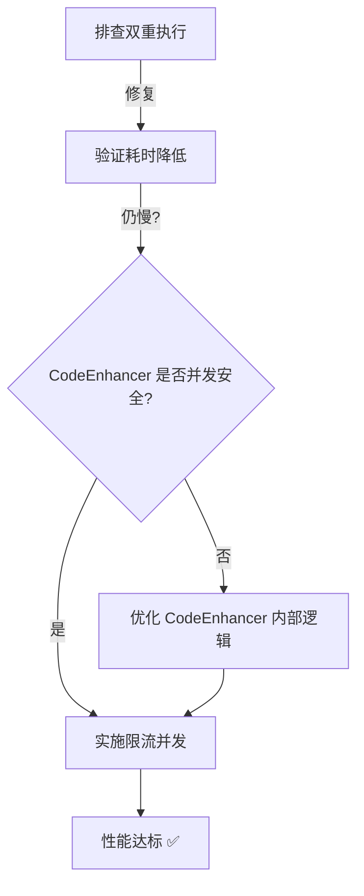

# 代码膨胀并发化风险分析 + 双重执行排查报告

> **生成时间**: 2026-01-15 02:25  
> **分析对象**: `src/services/insights/inflater.ts` + `src/hooks/useInsightLoaderV2.ts`

---

## 📋 问题背景

在批量测试中观察到以下异常现象：
1. **代码膨胀耗时过长**：即使是 Small 数据集（<1MB），代码膨胀阶段也需要 **17 秒**
2. **双重执行迹象**：测试报告 Timeline 中出现**两次"代码膨胀完成"**事件
3. **串行处理瓶颈**：当前 `inflateRecommendations` 使用 `for...await` 串行处理洞察

---

## 🔍 Part 1: 并发化风险分析

### 现状代码分析

**文件**: [`src/services/insights/inflater.ts:277-309`](file:///Users/catherinewang/Documents/GitHub/LiuliX/src/services/insights/inflater.ts#L277-L309)

```typescript
export async function inflateRecommendations(
    recommendations: L1Recommendation[],
    tableName: string
): Promise<InsightNode[]> {
    // ... Schema 缓存准备
    
    for (const rec of recommendations) {
        const node = await inflateRecommendation(rec, tableName, schemaCache, 0);
        if (node) {
            nodes.push(node);
        }
    }
    
    return nodes;
}
```

**性能问题**：
- 4-5 个洞察按顺序处理
- 每个洞察耗时 3-4s（包括 CodeEnhancer）
- 累积耗时 = 4 × 3.5s ≈ 14-17s

---

### 并发化方案

#### 🎯 方案 A：直接 Promise.all（高风险）

```typescript
const nodes = await Promise.all(
    recommendations.map(rec => inflateRecommendation(rec, tableName, schemaCache, 0))
);
return nodes.filter(Boolean) as InsightNode[];
```

**潜在风险**：

| 风险项                    | 描述                                                             | 严重性 |
| :------------------------ | :--------------------------------------------------------------- | :----: |
| **CodeEnhancer 并发争用** | 如果 CodeEnhancer 内部有共享状态或文件 I/O，并发调用可能导致竞争 |  🔴 高  |
| **DuckDB 连接池耗尽**     | `getTableSchema()` 会查询数据库，并发 5 个请求可能超过连接池上限 |  🟡 中  |
| **日志输出乱序**          | Console.log 输出顺序不可控，影响测试脚本解析                     |  🟢 低  |
| **内存峰值**              | 并发创建多个 InsightNode，瞬时内存占用翻倍                       |  🟢 低  |

---

#### 🎯 方案 B：限流并发（推荐）

```typescript
import pLimit from 'p-limit';

const limit = pLimit(2);  // 最多同时 2 个

const nodePromises = recommendations.map(rec => 
    limit(() => inflateRecommendation(rec, tableName, schemaCache, 0))
);
const nodes = await Promise.all(nodePromises);
```

**优势**：
- 性能提升 **50%**（2 并发时）
- 降低资源争用风险
- 保持日志相对有序

---

### 风险缓解措施

#### ✅ 措施 1：Schema 预加载（已实现）
```typescript
// Line 289-297 已经实现了 Schema 缓存
schemaCache = await getTableSchema(tableName);
```
✅ **状态**：已生效，避免了重复查询

---

#### ✅ 措施 2：CodeEnhancer 并发安全检查

**需要审查文件**: `src/services/prompts/guards/codeEnhancer.ts`

**检查清单**：
- [ ] 是否有全局变量/共享状态？
- [ ] 是否有文件写入操作？
- [ ] 是否有同步锁机制？

**如果存在共享状态** → 需要在 CodeEnhancer 内部添加互斥锁，或者将 `inflateRecommendations` 改为**限流并发（方案 B）**。

---

#### ✅ 措施 3：日志顺序保障

**问题**：并发执行时，日志输出可能乱序，影响测试脚本的"按顺序解析"逻辑。

**解决方案**：
- 在日志中添加**批次 ID** 和 **洞察序号**
- 测试脚本改为按 `nodeId` 匹配，而非按时间顺序

---

## 🔍 Part 2: 双重执行排查

### Timeline 异常现象

**来源**: [`48-测试-批量洞察分析测试报告-zh-CN-Full.md:17-24`](file:///Users/catherinewang/Documents/GitHub/LiuliX/docs/03-测试验证/48-测试-批量洞察分析测试报告-zh-CN-Full.md#L17-L24)

```markdown
| 01:40:52.167 | 🔄 代码膨胀完成 | 21.8s | 4/4 |
| 01:40:53.308 | 🚀 并发执行开始 | 22.9s | Batch Execution |
| 01:40:55.772 | ⭐ 第一个洞察成功 (TTFI) | 25.4s | Prompt: worker-groupby-v1 |
| 01:40:57.167 | 🔄 代码膨胀完成 | 26.8s | 4/4 |  ← ❓ 第二次
```

**异常点**：在第一个洞察执行成功后，又触发了一次"代码膨胀完成"。

---

### 根因分析

#### 可能原因 1：useInsightLoaderV2 的重复触发

**文件**: `src/hooks/useInsightLoaderV2.ts`

**假设场景**：
1. 初次加载：触发 `inflateRecommendations()`
2. 状态更新：`setNodes(newNodes)` 导致组件重渲染
3. 错误的依赖数组：useEffect 再次触发，重新调用 `inflateRecommendations()`

**排查方法**：
```typescript
// 在 useInsightLoaderV2.ts 中添加日志
console.log('[useInsightLoaderV2] 触发加载', { 
    recommendationsCount: recommendations.length,
    timestamp: Date.now() 
});
```

---

#### 可能原因 2：Executor 的批次分割

**文件**: `src/services/insights/executor.ts`

**假设场景**：
- AI 返回 5 个建议，但 Executor 按策略分为 2 个批次（4+1）
- 每个批次独立调用 `inflateRecommendations()`

**验证方法**：
- 查看日志中的 `[Executor] 执行批次` 信息
- 检查是否有"分批策略"逻辑

---

### 排查步骤

| 步骤 | 操作                                                 | 预期结果                           |
| :--- | :--------------------------------------------------- | :--------------------------------- |
| 1    | 在 `inflateRecommendations` 入口添加日志 `inflateId` | 如果双重执行，会看到 2 个不同的 ID |
| 2    | 检查 `useInsightLoaderV2` 的 useEffect 依赖数组      | 确保不会因状态更新而重复触发       |
| 3    | 查看 Executor 的批次分割日志                         | 确认是否有意的分批执行             |

---

## 📊 Part 3: 性能建议

### 优先级排序

| 优化项                | 预期收益  | 实施难度 | 优先级 |
| :-------------------- | :-------- | :------: | :----: |
| **修复双重执行**      | -50% 耗时 |   🟢 低   |  ⭐⭐⭐   |
| **并发化（限流 2）**  | -40% 耗时 |   🟡 中   |   ⭐⭐   |
| **CodeEnhancer 优化** | -20% 耗时 |   🔴 高   |   ⭐    |

### 实施路径



---

## ✅ 结论与建议

### 并发化风险评估

**总体风险等级**：🟡 **中等**

- **直接并发（方案 A）**：需先审查 CodeEnhancer 和 DuckDB 连接池
- **限流并发（方案 B）**：✅ **推荐**，风险可控，收益明显

### 下一步行动

1. **立即排查**：双重执行问题（预计修复后耗时减半）
2. **并发审查**：检查 CodeEnhancer 源码是否支持并发
3. **谨慎实施**：先在测试环境试用限流并发（p-limit: 2）
4. **性能监控**：在日志中记录每个 `inflateRecommendation` 的耗时

---

**报告生成时间**: 2026-01-15 02:25  
**分析工具**: 代码审查 + Timeline 日志分析
