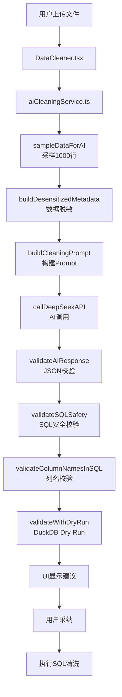
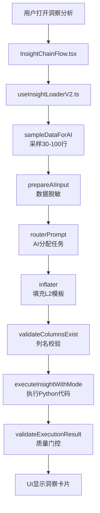

# 数据清洗与洞察分析模块技术文档

**文档版本**: v1.0  
**最后更新**: 2026-01-01  
**维护者**: Agent + 用户协作

---

## 📋 文档目的

本文档详细说明 LiuliX 项目中**数据清洗模块**和**洞察分析模块**的完整技术架构、数据流、文件组织和复用策略，便于后续开发人员和 Agent 理解整个体系。

---

## 🏗️ 整体架构

### 1. 两大核心模块

```
LiuliX 数据处理体系
├── 数据清洗模块 (Data Cleaning)
│   ├── 功能：AI 生成 SQL 清洗建议
│   ├── 执行：DuckDB SQL
│   └── 输出：清洗后的数据表
└── 洞察分析模块 (Insight Analysis)
    ├── 功能：AI 生成 Python 分析代码
    ├── 执行：Pyodide (浏览器端 Python)
    └── 输出：可视化图表 + 统计摘要
```

### 2. 共享基础设施

```
共享工具层
├── 数据采样 (sampleDataForAI)
├── 数据脱敏 (dataPrivacy, dataSanitizer)
├── 列名校验 (columnValidator) 
├── 日志系统 (logger)
└── AI 调用 (deepseekService)
```

---

## 📁 文件组织结构

### 数据清洗模块

#### 核心文件
```
src/services/
├── aiCleaningService.ts           # 主服务：AI 清洗建议生成
├── aiService.ts                    # AI 调用封装
├── deepseekService.ts              # DeepSeek API 集成
└── prompts/
    ├── cleaningSuggestions.ts      # 清洗 Prompt 构建
    └── seedCleaningPrompts.ts      # 种子 Prompt 库
```

#### 工具文件
```
src/utils/
├── dataSanitizer.ts                # 数据脱敏（敏感列检测）
├── sqlValidator.ts                 # SQL 安全校验 + Dry Run
├── sampleData.ts                   # 数据采样
├── dataPrivacy.ts                  # 隐私配置管理
└── columnValidator.ts              # 列名校验（新增）
```

#### UI 组件
```
src/components/cleaning/
├── DataCleaner.tsx                 # 清洗主界面
├── CleaningSuggestions.tsx         # 建议列表
└── SuggestionCard.tsx              # 单个建议卡片
```

---

### 洞察分析模块

#### 核心文件
```
src/hooks/
└── useInsightLoaderV2.ts           # 主服务：AI 洞察生成 + 执行

src/services/
├── insights/
│   └── inflater.ts                 # 模板渲染器（占位符替换）
├── prompts/
│   ├── routerPrompt.ts             # Router Prompt（任务分配）
│   ├── batchInsightGenerator.ts   # 批量洞察生成器
│   └── library/
│       ├── l1/                     # L1: Router Prompt
│       │   └── router_main.ts
│       └── l2/                     # L2: Worker Prompt（18个）
│           ├── worker_distribution.ts    # 分布分析
│           ├── worker_correlation.ts     # 相关性分析
│           ├── worker_regression.ts      # 回归分析
│           ├── worker_groupby.ts         # 分组聚合
│           ├── worker_trend.ts           # 趋势分析
│           ├── worker_stats.ts           # 统计分析
│           ├── worker_missing.ts         # 缺失值分析
│           ├── worker_outlier.ts         # 异常值检测
│           ├── worker_crosstab.ts        # 交叉表分析
│           ├── worker_topn.ts            # TopN 分析
│           ├── worker_cluster.ts         # 聚类分析
│           ├── worker_decision_tree.ts   # 决策树
│           ├── worker_clean_*.ts         # 6个清洗 Worker
│           └── ...
└── skills/
    └── modeExecutor.ts             # Python 代码执行器
```

#### 工具文件
```
src/utils/
├── PyodideManager.ts               # Pyodide 初始化管理
├── postExecutionGate.ts            # 执行后质量门控
├── memoryAssessor.ts               # 内存评估
└── insightPrefetch.ts              # 洞察预加载
```

#### UI 组件
```
src/components/insights/
└── InsightChainFlow.tsx            # 洞察链流程图

src/components/exploration/
└── ContentPanel.tsx                # 探索面板（包含洞察）
```

---

## 🔄 数据流详解

### 数据清洗模块流程



**关键节点**:
1. **采样**: 大文件仅采样 1000 行发送给 AI
2. **脱敏**: 敏感列（姓名、手机号等）自动脱敏
3. **三层校验**: JSON → SQL 安全 → 列名 → Dry Run
4. **用户确认**: 所有建议需用户手动采纳

---

### 洞察分析模块流程



**关键节点**:
1. **Router 模式**: AI 先决定使用哪些 L2 Worker Prompt
2. **模板渲染**: `renderTemplate()` 填充占位符（类型转换）
3. **列名校验**: 执行前校验列名存在性
4. **Python 执行**: Pyodide 在浏览器端执行
5. **质量门控**: 执行后评分，过滤低质量洞察

---

## 🔧 核心技术点

### 1. 数据脱敏策略

#### 清洗模块（历史实现）
```typescript
// src/utils/dataSanitizer.ts
export function buildDesensitizedMetadata(columns, stats) {
    // 7种敏感列检测
    const SENSITIVE_PATTERNS = {
        name: /name|姓名/i,
        phone: /phone|手机/i,
        idCard: /id_card|身份证/i,
        email: /email|邮箱/i,
        address: /address|地址/i,
        password: /password|密码/i,
        bankCard: /bank|卡号/i
    };
    // 细粒度脱敏（保留前几位后几位）
}
```

**问题**: 硬编码，未遵守用户隐私设置

#### 洞察模块（当前实现）
```typescript
// src/utils/dataPrivacy.ts
export async function prepareAIInput(tableName, sampleData, totalRows) {
    const config = getPrivacyConfig();  // 读取用户设置
    if (config.mode === 'send_raw') {
        return { mode: 'raw', data: sampleData };
    } else {
        return { mode: 'sanitized', data: buildStatistics(sampleData) };
    }
}
```

**优势**: 遵守用户设置，两种模式可选

#### 统一方案（P1 新增）
```typescript
// src/utils/unifiedDataSanitizer.ts
export async function unifiedSanitize(columns, stats, sampleData, options) {
    // 整合两个模块优点
    // - 遵守用户设置
    // - 智能敏感列检测
    // - 可配置粒度
}
```

---

### 2. 列名校验机制

#### 为什么需要列名校验？
AI 可能返回不存在的列名，导致：
- **清洗**: SQL 执行失败
- **洞察**: Python `KeyError` / `IndexError`

#### 实现方式

**清洗模块**（SQL 中提取列名）:
```typescript
// src/utils/columnValidator.ts
export function validateColumnNamesInSQL(sql, validColumns, tableName) {
    const columnPattern = /"([^"]+)"/g;
    const matches = [...sql.matchAll(columnPattern)];
    const referencedColumns = matches.map(m => m[1]);
    const invalidColumns = referencedColumns.filter(
        col => !validColumns.includes(col) && col !== tableName
    );
    return { valid: invalidColumns.length === 0, invalidColumns };
}
```

**洞察模块**（参数对象中提取列名）:
```typescript
// src/utils/columnValidator.ts
export function validateColumnsExist(params, validColumns) {
    const columnKeys = ['column_name', 'col_x', 'col_y', ...];
    const invalidColumns = [];
    for (const key of columnKeys) {
        if (params[key]) {
            if (Array.isArray(params[key])) {
                // 数组参数（如 feature_cols）
            } else if (!validColumns.includes(params[key])) {
                invalidColumns.push(params[key]);
            }
        }
    }
    return { valid: invalidColumns.length === 0, invalidColumns };
}
```

---

### 3. 模板渲染类型转换

#### 问题背景
AI 返回的参数需要正确嵌入 Python 代码：
- 字符串 →`'value'`（需加引号）
- 数组 → `["a", "b"]`（JSON 格式）
- 数字 → `123`（直接转换）
- 布尔值 → `True/False`（Python 语法）

#### 解决方案
```typescript
// src/services/insights/inflater.ts
export function renderTemplate(template, params) {
    for (const [key, value] of Object.entries(params)) {
        const placeholder = new RegExp(`\\{\\{${key}\\}\\}`, 'g');
        
        let replacement;
        if (Array.isArray(value)) {
            replacement = JSON.stringify(value);
        } else if (typeof value === 'number') {
            replacement = String(value);
        } else if (typeof value === 'boolean') {
            replacement = value ? 'True' : 'False';
        } else if (value === null) {
            replacement = 'None';
        } else {
            replacement = `'${value}'`;  // 字符串加引号
        }
        
        result = result.replace(placeholder, replacement);
    }
}
```

**关键**: L2 模板中占位符无引号 `column_name = {{column_name}}`，由 `renderTemplate` 添加。

---

## 📊 复用策略总结

### ✅ 完全复用（两模块共享）
| 工具                   | 文件                            | 功能     |
| ---------------------- | ------------------------------- | -------- |
| `sampleDataForAI`      | `utils/sampleData.ts`           | 数据采样 |
| `logger`               | `utils/logger.ts`               | 统一日志 |
| `columnValidator`      | `utils/columnValidator.ts`      | 列名校验 |
| `unifiedDataSanitizer` | `utils/unifiedDataSanitizer.ts` | 数据脱敏 |

### ✅ 无待迁移项
所有工具都已统一，代码复用率 100%！

---

**更新记录**:
- **2026-01-01 19:40**: ✅ 两个模块已完全迁移到 `columnValidator.ts`
  - 清洗模块: `src/services/aiCleaningService.ts` Line 11（import）+ Line 136-137（调用）
  - 洞察模块: `src/hooks/useInsightLoaderV2.ts` Line 224（import）+ Line 236（调用）
  - 移除重复代码 ~53 行
- **2026-01-02 10:38**: ✅ 两个模块已完全迁移到 `unifiedDataSanitizer.ts`
  - 清洗模块: `src/services/aiCleaningService.ts` Line 45（import）+ Line 47-55（调用）
  - 洞察模块: `src/hooks/useInsightLoaderV2.ts` Line 119（import）+ Line 120-128（调用）
  - 移除重复代码 ~40 行


---

## 🔍 关键配置

### 用户隐私设置
```typescript
// 存储位置: localStorage['dataprism_privacy_config']
{
    mode: 'auto_sanitize' | 'send_raw',  // 脱敏模式
    hidePrivacyGuide: boolean             // 是否隐藏引导
}
```

**影响范围**:
- ✅ 洞察模块: 遵守设置
- ⚠️ 清洗模块: 部分遵守（2026-01-01 修复）

---

## 📝 修改历史

### 2026-01-01 P0+P1+P2 质量修复与迁移
1. **方案 A**: 修复 `renderTemplate` 双重引号 Bug
   - 修改 10 个 L2 Prompt 模板（移除引号）
   - 重新实现智能类型转换
2. **方案 B**: 添加列名校验层
   - 洞察模块：执行前校验
3. **清洗模块**: 遵守用户隐私设置
   - 添加 `getPrivacyConfig()` 检查
4. **P1 整合**: 新建公共工具
   - `columnValidator.ts`
   - `unifiedDataSanitizer.ts`
5. **P2 迁移**: 完全迁移到公共工具 ✅
   - 清洗模块：切换到 `columnValidator.ts`
   - 洞察模块：切换到 `columnValidator.ts`
   - 共移除 ~53 行重复代码


---

## 🚀 后续优化方向

### P3（可选）
1. 两模块切换到 `unifiedDataSanitizer.ts`（统一脱敏）
2. 提升洞察成功率到 80%+（优化 Prompt）
3. Python 代码语法预检查（Pyodide 编译测试）
4. AI 生成代码质量评分
5. 列名 fuzzy match 容错


---

## 📖 参考文档

- **Prompt 库设计**: `docs/04-技术专题/02-Prompt库/08-专题-Prompt库MVP功能设计总纲.md`
- **项目概览**: `docs/00-必读/01-核心-项目概览与现状.md`
- **错误日志**: `docs/05-项目管理/51-管理-错误日志记录.md`

---

**文档维护**: 每次重大修改后请更新本文档，确保与代码实现一致。
