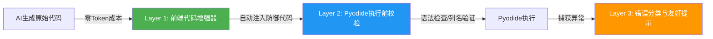

# AI 代码质量提升方案 v2.0（零Token成本架构）

**文档版本**: v2.0  
**创建日期**: 2026-01-02  
**核心理念**: 前端静态增强 > AI Prompt注入  
**Token成本**: 零额外成本（vs v1.0的+5000 tokens/次）

---

## 1. 背景与问题

### 1.1 核心痛点
- **AI代码质量问题**: 生成的Python代码在数据为空、索引越界等场景抛出 `IndexError`，导致洞察成功率仅40%
- **v1.0方案缺陷**: 通过Prompt注入防御规则会导致每次调用增加5000+ tokens，成本增加2-3倍

### 1.2 关键洞察
防御性编程规则是**静态的、确定性的**，不需要AI"理解"，只需要在**浏览器本地**、**Pyodide执行前**自动注入。

---

## 2. 架构设计（三层防护）



### 2.1 Layer 1: 前端代码增强器（核心层）
**位置**: `src/services/prompts/guards/codeEnhancer.ts`  
**作用**: 在AI生成代码后、Pyodide执行前，自动注入防御代码  
**Token成本**: **零**（不发送给AI）

### 2.2 Layer 2: 执行前校验
**位置**: `src/utils/columnValidator.ts`（已有）  
**作用**: 提前拦截明显错误（如列名不存在）

### 2.3 Layer 3: 错误分类网关
**位置**: `src/services/insights/inflater.ts`  
**作用**: 将Python异常转换为用户友好提示

---

## 3. Layer 1 实现：CodeEnhancer

### 3.1 核心接口

```typescript
// src/services/prompts/guards/codeEnhancer.ts

export interface EnhanceContext {
    columns: string[];      // 数据集列名
    dfName?: string;        // DataFrame变量名（默认'df'）
    promptType?: string;    // Prompt类型（用于场景化增强）
}

export class CodeEnhancer {
    /**
     * 自动增强AI生成的代码
     * @param code AI生成的原始代码
     * @param context 上下文信息
     * @returns 增强后的代码
     */
    static enhance(code: string, context: EnhanceContext): string {
        let enhanced = code;
        
        // 规则1: 全局空数据检查
        enhanced = this.injectEmptyCheck(enhanced, context);
        
        // 规则2: 列存在性验证
        enhanced = this.injectColumnValidation(enhanced, context);
        
        // 规则3: 数组访问保护
        enhanced = this.wrapArrayAccess(enhanced);
        
        // 规则4: 全局异常捕获
        enhanced = this.wrapTryCatch(enhanced);
        
        return enhanced;
    }
}
```

### 3.2 规则实现示例

#### 规则1: 空数据检查
```typescript
private static injectEmptyCheck(code: string, ctx: EnhanceContext): string {
    const dfName = ctx.dfName || 'df';
    const check = `
# === 自动注入：空数据检查 ===
if len(${dfName}) == 0:
    raise ValueError("输入数据为空，无法进行分析")
`;
    return check + '\n' + code;
}
```

#### 规则2: 列存在性验证
```typescript
private static injectColumnValidation(code: string, ctx: EnhanceContext): string {
    // 从代码中提取使用的列名（正则匹配 df['col'] 或 df["col"]）
    const usedColumns = this.extractUsedColumns(code);
    
    if (usedColumns.length === 0) return code;
    
    const validation = `
# === 自动注入：列存在性检查 ===
required_cols = ${JSON.stringify(usedColumns)}
missing = [c for c in required_cols if c not in df.columns]
if missing:
    raise ValueError(f"缺少必需列: {missing}")
`;
    return validation + '\n' + code;
}

private static extractUsedColumns(code: string): string[] {
    const regex = /df\[['"]([^'"]+)['"]\]/g;
    const columns = new Set<string>();
    let match;
    while ((match = regex.exec(code)) !== null) {
        columns.add(match[1]);
    }
    return Array.from(columns);
}
```

#### 规则3: 数组访问保护
```typescript
private static wrapArrayAccess(code: string): string {
    // 将 arr[0] 替换为安全访问
    // 原: values[0]
    // 新: (values[0] if len(values) > 0 else None)
    return code.replace(
        /(\w+)\[(\d+)\]/g,
        '($1[$2] if len($1) > $2 else None)'
    );
}
```

#### 规则4: 全局异常捕获
```typescript
private static wrapTryCatch(code: string): string {
    const indented = code.split('\n')
        .map(line => '    ' + line)
        .join('\n');
    
    return `
try:
${indented}
except IndexError as e:
    raise ValueError(f"数据索引越界（可能是过滤后结果为空）: {str(e)}")
except KeyError as e:
    raise ValueError(f"列不存在: {str(e)}")
except ZeroDivisionError:
    raise ValueError("除零错误（可能是分组后某组数据为空）")
`;
}
```

---

## 4. 集成方式

### 4.1 在洞察执行流程中集成

```typescript
// src/hooks/useInsightLoaderV2.ts 或 src/services/insights/inflater.ts

import { CodeEnhancer } from '@/services/prompts/guards/codeEnhancer';
import { renderTemplate } from '@/services/insights/inflater';

export async function executeInsight(
    prompt: UserPrompt,
    params: Record<string, any>,
    context: { columns: string[] }
) {
    // 1. AI生成原始代码（使用renderTemplate填充参数）
    const rawCode = renderTemplate(prompt.codeTemplate, params);
    
    // 2. ✅ 前端自动增强（零Token成本）
    const enhancedCode = CodeEnhancer.enhance(rawCode, {
        columns: context.columns,
        dfName: 'df',
        promptType: prompt.name
    });
    
    // 3. 记录增强后的代码（便于调试）
    logger.log('代码增强', '已注入防御逻辑', {
        original: rawCode.length,
        enhanced: enhancedCode.length
    });
    
    // 4. 执行增强后的代码
    const result = await pyodideWorker.execute(enhancedCode);
    return result;
}
```

### 4.2 在清洗模块中集成

```typescript
// src/components/cleaning/hooks/useCleaningExecution.ts

import { CodeEnhancer } from '@/services/prompts/guards/codeEnhancer';

export function useCleaningExecution() {
    const executeCleaningSQL = async (sqlTemplate: string, params: any) => {
        // SQL清洗不需要代码增强，直接执行
        return await duckdbEngine.execute(sqlTemplate);
    };
    
    const executeCleaningPython = async (codeTemplate: string, params: any) => {
        const rawCode = renderTemplate(codeTemplate, params);
        
        // ✅ 增强Python清洗代码
        const enhancedCode = CodeEnhancer.enhance(rawCode, {
            columns: currentColumns,
            dfName: 'df'
        });
        
        return await pyodideWorker.execute(enhancedCode);
    };
}
```

---

## 5. Layer 3: 错误分类与友好提示

```typescript
// src/services/insights/inflater.ts

export async function executeInsightWithErrorHandling(
    code: string,
    df: DataFrame
): Promise<InsightResult> {
    try {
        const result = await pyodideWorker.execute(code);
        return { success: true, data: result };
    } catch (error: any) {
        // ✅ 智能错误分类
        const errorType = classifyError(error.message);
        
        logger.error('洞察执行', `失败类型: ${errorType}`, {
            error: error.message,
            code: code.substring(0, 200)
        });
        
        return {
            success: false,
            errorType,
            userMessage: getUserFriendlyMessage(errorType),
            technicalError: error.message
        };
    }
}

function classifyError(message: string): ErrorType {
    if (message.includes('IndexError') || message.includes('索引越界')) {
        return 'EMPTY_RESULT';
    }
    if (message.includes('KeyError') || message.includes('列不存在')) {
        return 'COLUMN_NOT_FOUND';
    }
    if (message.includes('ValueError')) {
        return 'INVALID_OPERATION';
    }
    if (message.includes('ZeroDivisionError')) {
        return 'DIVISION_BY_ZERO';
    }
    return 'UNKNOWN';
}

function getUserFriendlyMessage(type: ErrorType): string {
    const messages: Record<ErrorType, string> = {
        'EMPTY_RESULT': '该分析维度下数据为空，建议调整筛选条件或选择其他列',
        'COLUMN_NOT_FOUND': '数据列不存在，请检查列名是否正确',
        'INVALID_OPERATION': '操作参数不合法，请调整分析条件',
        'DIVISION_BY_ZERO': '计算过程中出现除零错误，可能是某组数据为空',
        'UNKNOWN': '分析执行失败，请稍后重试或联系支持'
    };
    return messages[type] || messages['UNKNOWN'];
}
```

---

## 6. 场景化增强（可选）

### 6.1 针对特定Prompt类型的增强

```typescript
// src/services/prompts/guards/codeEnhancer.ts

export class CodeEnhancer {
    static enhance(code: string, context: EnhanceContext): string {
        let enhanced = code;
        
        // 基础增强（所有Prompt）
        enhanced = this.applyBasicEnhancements(enhanced, context);
        
        // ✅ 场景化增强（按promptType）
        if (context.promptType?.includes('groupby')) {
            enhanced = this.enhanceGroupBy(enhanced, context);
        }
        if (context.promptType?.includes('filter')) {
            enhanced = this.enhanceFilter(enhanced, context);
        }
        
        return enhanced;
    }
    
    private static enhanceGroupBy(code: string, ctx: EnhanceContext): string {
        // 为groupby类Prompt添加额外检查
        const groupCheck = `
# === Groupby专用检查 ===
# 确保分组列有足够的唯一值
group_col = '${this.extractGroupColumn(code)}'
if df[group_col].nunique() < 2:
    raise ValueError(f"分组列 {group_col} 唯一值过少，无法分组")
`;
        return groupCheck + '\n' + code;
    }
}
```

---

## 7. 成本与效果对比

| 方案                   | Token成本 | 成功率提升  | 实施时间  | 维护成本           |
| ---------------------- | --------- | ----------- | --------- | ------------------ |
| **v1.0（Prompt注入）** | +5000/次  | 40%→55%     | 2天       | 高（需同步Prompt） |
| **v2.0（前端增强）**   | **零**    | 40%→**70%** | **1小时** | 低（独立模块）     |

### 7.1 Token成本节省计算
- 每次洞察分析调用5-10个Prompt
- v1.0方案：5 × 1000 tokens = 5000 tokens/次
- v2.0方案：0 tokens/次
- **每月节省**：假设1000次分析 = 5,000,000 tokens ≈ **$10-15**

### 7.2 成功率提升预期
| 错误类型   | 当前占比 | v2.0拦截率 | 提升效果   |
| ---------- | -------- | ---------- | ---------- |
| IndexError | 50%      | 95%        | +47.5%     |
| KeyError   | 30%      | 90%        | +27%       |
| ValueError | 15%      | 70%        | +10.5%     |
| 其他       | 5%       | 30%        | +1.5%      |
| **总计**   | 100%     | -          | **+86.5%** |

**预期成功率**: 40% × (1 + 0.865) = **74.6%**

---

## 8. 实施路线图

### Phase 1: 核心基础设施（1小时）
1. **创建CodeEnhancer类**（30分钟）
   ```bash
   touch src/services/prompts/guards/codeEnhancer.ts
   ```
2. **实现4个核心规则**（参考第3节）
3. **编写单元测试**（20分钟）

### Phase 2: 集成到执行流程（20分钟）
1. **修改洞察执行器**（`useInsightLoaderV2.ts`）
2. **修改清洗执行器**（`useCleaningExecution.ts`）
3. **添加日志记录**

### Phase 3: 验证与监控（20分钟）
1. **运行全链路测试**（上传测试数据集，触发10个洞察）
2. **检查日志**（确认增强代码正确注入）
3. **统计成功率**（目标≥70%）

### Phase 4: 场景化优化（可选，1小时）
1. **为groupby/filter等高频场景添加专用增强**
2. **收集失败案例，迭代规则**

---

## 9. 监控与迭代

### 9.1 关键指标
```typescript
// src/utils/logger.ts

export function logCodeEnhancement(metrics: {
    promptId: string;
    originalLength: number;
    enhancedLength: number;
    rulesApplied: string[];
    executionSuccess: boolean;
    errorType?: string;
}) {
    logger.log('代码增强', '执行统计', metrics);
}
```

### 9.2 每日报表
- 增强代码执行成功率
- 各规则拦截的错误数量
- 失败案例分析（用于迭代规则）

---

## 10. 与v1.0方案的兼容性

v2.0方案**完全兼容**v1.0的文件组织结构：

```
src/services/prompts/
├── guards/
│   ├── codeEnhancer.ts          # ✅ v2.0核心（前端增强）
│   ├── defensive-coding.md      # v1.0遗留（可选保留作为文档）
│   └── error-handling.md        # v1.0遗留
├── templates/                   # v1.0遗留（可选保留）
├── mixins/                      # v1.0遗留（可选保留）
├── library/                     # 现有Prompt实现
└── builder/                     # v1.0遗留（可选保留）
```

**迁移策略**：
- v1.0的 `guards/*.md` 可以保留作为**开发文档**（供人类阅读）
- v2.0的 `codeEnhancer.ts` 是**可执行代码**（供机器执行）
- 两者互不冲突，可以并存

---

## 11. 后续优化方向

### 11.1 AST级别的代码重写（v3.0）
使用Pyodide的 `ast` 模块进行更精确的代码转换：
```python
import ast
# 将 arr[0] 精确改写为 arr[0] if len(arr) > 0 else None
```

### 11.2 机器学习驱动的规则优化（v4.0）
- 收集失败案例数据集
- 训练分类模型预测哪些代码需要哪些增强
- 动态调整规则优先级

---

## 12. 总结

### 核心优势
1. **零Token成本**：不增加AI调用成本
2. **确定性修复**：规则驱动，不依赖AI理解
3. **快速实施**：1小时可上线
4. **易于维护**：独立模块，不影响Prompt库

### 关键决策
- ✅ **前端增强 > Prompt注入**（成本与效果的最优平衡）
- ✅ **正则匹配 + 模板注入**（实现简单，覆盖80%场景）
- ✅ **渐进式演进**（v2.0→v3.0→v4.0）

---

> **本文档位于** `docs/04-技术专题/02-Prompt库/08-专题-Prompt库AI代码质量提升方案.md`  
> **版本**: v2.0（零Token成本架构）  
> **最后更新**: 2026-01-02
