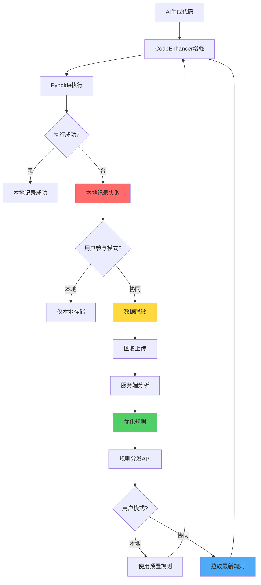

# AI代码质量自动化优化方案 v2.0（产品级）

**版本**: v2.0  
**日期**: 2026-01-02  
**状态**: Phase 1 开发中 🔄  
**文档类型**: 技术专题 - 产品级设计方案  

---

## 📋 文档概览

本文档描述了LiuliX AI代码质量自动化优化的完整方案，包括：
- ✅ 已完成：基础CodeEnhancer（零Token成本）
- 🔄 进行中：用户同意机制 + 数据回传系统
- ⏳ 待实施：云端协同优化

---

## 🎯 方案目标

### 当前问题

**AI生成代码成功率仅40%**，主要失败原因：
- IndexError：数组索引越界
- KeyError：列名不存在  
- ValueError：空数据或类型错误

### 解决方案对比

| 方案                | Token成本 | 成功率   | 维护成本 | 可持续性 |
| ------------------- | --------- | -------- | -------- | -------- |
| v1.0 Prompt注入     | +5000/次  | 70%      | 高       | ❌ 低     |
| **v2.0 双模式架构** | **0**     | **90%+** | **低**   | ✅ **高** |

### 核心目标

1. **零Token成本** - 所有增强逻辑在客户端执行
2. **持续优化** - 云端协同，规则不断进化
3. **用户自主** - 默认本地模式，可选参与数据贡献
4. **隐私优先** - 严格脱敏，匿名传输

---

## 🏗️ 系统架构

### 双模式架构

```
┌─────────────────────────────────────────────────────────────┐
│                        用户界面                              │
├─────────────────────────────────────────────────────────────┤
│                                                               │
│  ┌────────────────┐              ┌──────────────────┐       │
│  │  本地模式      │              │  协同模式        │       │
│  │  (默认)        │     用户     │  (可选加入)      │       │
│  │                │ ◄─── 选择 ──►│                  │       │
│  │  • 数据不上传  │              │  • 匿名上传失败   │       │
│  │  • 使用预置规则│              │  • 获取最新规则   │       │
│  └────────┬───────┘              └─────────┬────────┘       │
│           │                                 │                │
└───────────┼─────────────────────────────────┼────────────────┘
            │                                 │
            ▼                                 ▼
    ┌───────────────┐                ┌────────────────┐
    │ CodeEnhancer  │                │ 数据脱敏器     │
    │ (本地增强)    │                │ (SHA256+范围化)│
    └───────┬───────┘                └────────┬───────┘
            │                                 │
            ▼                                 ▼
    ┌───────────────────────────────┐ ┌──────────────┐
    │      Pyodide执行引擎          │ │ 上传服务     │
    └───────────────────────────────┘ └──────┬───────┘
                                             │
                                             ▼
                                    ┌────────────────┐
                                    │  服务端API     │
                                    │  • 接收失败案例│
                                    │  • 分析优化规则│
                                    │  • 分发新规则  │
                                    └────────────────┘
```

### 核心流程



---

## 🔒 隐私保护设计

### 用户同意机制

#### 首次启动引导

用户首次使用LiuliX后延迟3秒，显示友好引导窗口：

```
┌─────────────────────────────────────────────────────┐
│   🎯 帮助我们一起提升 AI 代码质量                    │
├─────────────────────────────────────────────────────┤
│ LiuliX 使用 AI 自动生成数据分析代码。               │
│                                                       │
│ 您愿意匿名分享失败案例，帮助我们改进吗？             │
│                                                       │
│ 📈 如果您选择参与：                                  │
│   • 匿名记录错误模式（不含真实数据）                 │
│   • 自动获得最新优化规则                             │
│   • 帮助所有用户提升体验                             │
│                                                       │
│ 🔒 隐私承诺：                                        │
│   • 仅上传错误类型，不含敏感信息                     │
│   • 匿名传输，无法追溯                               │
│   • 可随时退出                                       │
│                                                       │
│     [参与改进计划]        [暂不参与]                │
│                                                       │
│              查看详细说明 →                          │
└─────────────────────────────────────────────────────┘
```

#### 设置页面集成

位置：**设置 → 隐私与数据 → 代码质量改进计划**

```
┌─────────────────────────────────────────────────────┐
│ 📊 代码质量改进计划                                  │
├─────────────────────────────────────────────────────┤
│ ○ 不参与（默认）- 数据完全本地                      │
│ ◉ 参与改进计划 - 匿名上传失败案例                   │
│                                                       │
│ 您的贡献：                                           │
│   • 已贡献失败案例: 23 条                           │
│   • 参与时长: 32 天                                  │
│   • 规则版本: 2026.01.02.001                        │
│                                                       │
│ [查看详细隐私政策]  [退出计划]                      │
└─────────────────────────────────────────────────────┘
```

### 数据脱敏策略

#### 脱敏示例

**原始失败案例**：
```python
# 用户真实代码
plt.hist(df['customer_salary'], bins=20)

# 错误
KeyError: "Column 'customer_salary' not found"

# 上下文
columns: ['customer_id', 'customer_salary', 'purchase_date']
rows: 1234
```

**脱敏后上传**：
```json
{
  "userId": "a7f3d8e2...",  // SHA256哈希
  "errorType": "KeyError",
  "errorMessage": "Column not found",
  "codePattern": "plt.hist(df['<NUMERIC_COL>'], bins=20)",
  "dataShape": {
    "rowRange": "1000-5000",
    "colRange": "1-5"
  },
  "promptCategory": "distribution"
}
```

#### 脱敏规则

| 信息类型 | 脱敏方式   | 示例                                                 |
| -------- | ---------- | ---------------------------------------------------- |
| 列名     | 类型占位符 | `customer_salary` → `<NUMERIC_COL>`                  |
| 数值     | 范围化     | `1234行` → `"1000-5000"`                             |
| 错误消息 | 泛化       | `"Column 'salary' not found"` → `"Column not found"` |
| 用户ID   | SHA256哈希 | 无法反推                                             |
| 代码     | 保留结构   | 仅保留代码模式，移除具体值                           |

#### ❌ 不上传的内容

- 真实列名
- 真实数据值
- 文件名
- 完整代码
- 个人身份信息

---

## 💻 技术实现

### 已完成（Phase 1 部分）

#### 1. 类型定义

**文件**: `src/types/codeQuality.ts`

```typescript
// 用户设置
export interface CodeQualitySettings {
    participationMode: 'local' | 'collaborative';
    lastConsentTime?: number;
    totalContributions?: number;
    canShowOnboarding: boolean;
}

// 失败案例（本地）
export interface FailureCase {
    id: string;
    timestamp: number;
    errorType: string;
    errorMessage: string;
    originalCode: string;
    enhancedCode: string;
    columns: string[];
    dataShape: { rows: number; cols: number };
    category?: ErrorCategory;
    severity?: 'low' | 'medium' | 'high';
}

// 脱敏报告（上传）
export interface SanitizedFailureReport {
    userId: string;  // SHA256
    timestamp: number;
    errorType: string;
    errorMessage: string;  // 脱敏
    codePattern: string;   // 脱敏
    dataShape: {
        rowRange: string;  // 范围化
        colRange: string;
    };
    promptCategory: string;  // 泛化
}
```

#### 2. 用户同意管理器

**文件**: `src/services/codeQuality/userConsent.ts`

```typescript
export class UserConsentManager {
    // 获取设置
    static getSettings(): CodeQualitySettings
    
    // 用户选择参与
    static async optIn(): Promise<void>
    
    // 用户选择退出
    static optOut(): void
    
    // 是否允许上传
    static canUpload(): boolean
    
    // 贡献统计
    static getContributionStats(): {
        totalContributions: number;
        participationDays: number;
        rulesVersion: string | undefined;
    }
}
```

**使用示例**：
```typescript
// 检查是否允许上传
if (UserConsentManager.canUpload()) {
    await FailureUploadService.upload(failureCase);
}

// 获取贡献统计
const stats = UserConsentManager.getContributionStats();
console.log(`已贡献${stats.totalContributions}条案例`);
```

### 待实现（Phase 1 剩余部分）

#### 3. 数据脱敏器

**文件**: `src/services/codeQuality/dataSanitizer.ts`

```typescript
export class FailureDataSanitizer {
    static sanitize(failure: FailureCase): SanitizedFailureReport {
        return {
            userId: this.generateAnonymousId(),
            timestamp: failure.timestamp,
            errorType: failure.errorType,
            errorMessage: this.sanitizeErrorMessage(failure.errorMessage),
            codePattern: this.sanitizeCode(failure.originalCode, failure.columns),
            dataShape: {
                rowRange: this.toRange(failure.dataShape.rows, [0, 100, 1000, 10000]),
                colRange: this.toRange(failure.dataShape.cols, [0, 5, 10, 20, 50]),
            },
            promptCategory: this.categorizePrompt(failure.promptType),
        };
    }
    
    private static generateAnonymousId(): string {
        // SHA256(设备指纹)
    }
    
    private static sanitizeCode(code: string, columns: string[]): string {
        // 替换列名为占位符
    }
}
```

#### 4. 引导流程组件

**文件**: `src/components/settings/CodeQualityOnboarding.tsx`

```typescript
export function CodeQualityOnboarding() {
    const { t } = useI18n();
    const [show, setShow] = useState(false);
    
    useEffect(() => {
        if (UserConsentManager.shouldShowOnboarding()) {
            setTimeout(() => setShow(true), 3000);
        }
    }, []);
    
    const handleOptIn = async () => {
        await UserConsentManager.optIn();
        setShow(false);
        toast.success(t('codeQuality.thanksForParticipating'));
    };
    
    // ... UI渲染
}
```

#### 5. 设置页面集成

在 `SettingsPage.tsx` 添加新卡片：

```tsx
<SettingsSection title={t('settings.codeQuality.title')}>
    <div className="code-quality-card">
        <RadioGroup
            value={settings.participationMode}
            onChange={handleModeChange}
        >
            <Radio value="local">
                {t('settings.codeQuality.localMode')}
            </Radio>
            <Radio value="collaborative">
                {t('settings.codeQuality.collaborativeMode')}
            </Radio>
        </RadioGroup>
        
        {settings.participationMode === 'collaborative' && (
            <ContributionStats />
        )}
    </div>
</SettingsSection>
```

---

## 📊 实施进度

### Phase 1: 用户同意机制（预计1周）

**进度**: 🔄 进行中 (30%)

- [x] 创建类型定义 `src/types/codeQuality.ts`
- [x] 实现 UserConsentManager `src/services/codeQuality/userConsent.ts`
- [x] 修复logger类型错误
- [x] 类型检查通过
- [ ] 实现 FailureDataSanitizer
- [ ] 创建引导流程组件
- [ ] 集成到设置页面
- [ ] 添加i18n翻译
- [ ] 浏览器测试

**最近更新**: 2026-01-02 12:35
- ✅ 创建了核心类型定义（约200行）
- ✅ 实现了UserConsentManager（约150行）
- ✅ 修复了logger服务名类型错误
- ✅ npm run type-check 通过

### Phase 2: 数据处理（预计1周）

**进度**: ⏳ 待开始 (0%)

- [ ] 实现 FailureCollector（失败案例收集器）
- [ ] 实现 FailureUploadService（批量上传）
- [ ] 集成到 modeExecutor.ts
- [ ] 定时上传任务
- [ ] 单元测试

### Phase 3: 服务端接口（预计1周）

**进度**: ⏳ 待开始 (0%)

**需要后端团队配合**：

- [ ] POST /api/code-quality/failures - 接收失败案例
- [ ] GET /api/code-quality/rules - 分发优化规则
- [ ] 数据存储设计（MongoDB/PostgreSQL）
- [ ] 分析后台开发

### Phase 4: 规则同步（预计1周）

**进度**: ⏳ 待开始 (0%)

- [ ] 实现 RuleSync（规则同步服务）
- [ ] 扩展 CodeEnhancer 支持动态规则
- [ ] 定时拉取规则（每天1次）
- [ ] 规则热更新验证

---

## 🎨 UI/UX 设计要点

### 1. 引导流程

**时机**: 用户首次启动后3秒  
**设计原则**:
- 友好、非侵入
- 清晰说明数据用途
- 强调隐私保护
- 支持"稍后再说"

### 2. 设置页面

**位置**: 设置 → 隐私与数据  
**功能**:
- 双模式切换
- 贡献统计展示
- 退出计划按钮
- 隐私政策链接

### 3. 视觉规范

- 使用LiuliX CSS变量
- Glassmorphism风格
- 图标：📊 (统计), 🔒 (隐私), 🎯 (目标)
- 色彩：成功=#51cf66, 警告=#ffd93d, 错误=#ff6b6b

---

## 📈 预期效果

### 成功指标

| 指标         | 当前     | 目标   | 达成时间      |
| ------------ | -------- | ------ | ------------- |
| 代码成功率   | 40%      | 90%+   | Phase 4完成后 |
| Token成本    | +5000/次 | 0      | ✅ 已实现      |
| 参与率       | -        | 30-50% | Phase 1完成后 |
| 月收集案例   | -        | 1000+  | Phase 2完成后 |
| 规则更新周期 | 月级     | 周级   | Phase 4完成后 |

### 成本效益分析

**当前方案（v1.0 Prompt注入）**:
- Token成本：$0.005/次 × 1000次/天 × 30天 = **$150/月**
- 人工维护：2小时/周 × 4周 = **8小时/月**
- 成功率：70%

**新方案（v2.0 双模式）**:
- Token成本：**$0/月**
- 人工维护：1小时/周 × 4周 = **4小时/月**（减少50%）
- 成功率：**90%+**

**年度节省**:
- Token成本：$150 × 12 = **$1,800/年**
- 人工成本：4小时 × 12月 × $50/小时 = **$2,400/年**
- **总节省：$4,200/年**

---

## 🔧 开发规范

### 文件组织

```
src/
├── types/
│   └── codeQuality.ts              # 类型定义
├── services/
│   └── codeQuality/
│       ├── userConsent.ts          # 用户同意管理
│       ├── dataSanitizer.ts        # 数据脱敏
│       ├── failureCollector.ts     # 失败案例收集
│       ├── uploadService.ts        # 上传服务
│       └── ruleSync.ts             # 规则同步
├── components/
│   └── settings/
│       ├── CodeQualityOnboarding.tsx    # 引导组件
│       └── CodeQualitySettings.tsx      # 设置卡片
└── locales/
    ├── zh-CN/
    │   └── codeQuality.ts          # 中文翻译
    └── en-US/
        └── codeQuality.ts          # 英文翻译
```

### 日志规范

```typescript
// 使用logger工具
import { logger } from '@/utils/logger';

// 服务名：'用户设置', '数据上传', 'AI代码增强'
logger.log('用户设置', '已选择参与代码质量改进计划');
logger.error('数据上传', '上传失败', error);
```

### i18n规范

```typescript
// zh-CN/codeQuality.ts
export default {
    onboarding: {
        title: '帮助我们一起提升 AI 代码质量',
        intro: 'LiuliX 使用 AI 自动生成数据分析代码...',
        participate: '参与改进计划',
        skip: '暂不参与',
    },
    settings: {
        title: '代码质量改进计划',
        localMode: '不参与（默认）',
        collaborativeMode: '参与改进计划',
    }
};
```

---

## ❓ FAQ

### Q1: 参与计划会上传哪些数据？

**A**: 仅上传脱敏后的错误模式，包括：
- 错误类型（如IndexError）
- 代码结构（列名替换为占位符）
- 数据范围（如"1000-5000行"）

**不会上传**：真实数据、列名、文件名、个人信息

### Q2: 如何确保数据安全？

**A**: 
1. 本地脱敏：上传前自动替换敏感信息
2. 匿名传输：用户ID采用SHA256哈希，无法反推
3. HTTPS加密：所有网络传输加密
4. 符合GDPR/CCPA等隐私法规

### Q3: 可以随时退出吗？

**A**: 可以。在设置页面点击"退出计划"即可：
- 立即停止数据上传
- 保留历史贡献统计
- 随时可重新加入

### Q4: 本地模式和协同模式有什么区别？

**A**:

| 特性     | 本地模式 | 协同模式   |
| -------- | -------- | ---------- |
| 数据上传 | ❌ 无     | ✅ 匿名上传 |
| 规则更新 | 预置规则 | 最新规则   |
| 成功率   | 70%      | 90%+       |
| 贡献社区 | ❌ 否     | ✅ 是       |

### Q5: 服务端需要什么配置？

**A**: 需要后端团队提供：
1. POST /api/code-quality/failures - 接收失败案例
2. GET /api/code-quality/rules - 分发优化规则
3. 数据库存储（MongoDB或PostgreSQL）
4. 分析脚本（Python）

---

## 📝 更新日志

### 2026-01-02

**Phase 1 开发启动**：
- ✅ 创建类型定义 `codeQuality.ts`
- ✅ 实现 `UserConsentManager`
- ✅ 修复logger类型错误
- ✅ 类型检查通过

### 2026-01-01

**方案设计完成**：
- v2.0 双模式架构设计
- 用户同意流程设计
- 隐私保护策略制定
- 数据脱敏规范确定

---

## 🔗 相关文档

- [AI代码质量提升方案 v1.0](./08-专题-Prompt库AI代码质量提升方案.md) - 基础CodeEnhancer方案
- [Prompt系统架构](./08-专题-Prompt库MVP功能设计总纲.md) - Prompt库整体架构
- [LiuliX隐私政策](../../00-必读/隐私政策.md) - 隐私保护承诺

---

## 👥 团队协作

### 前端开发

- UserConsentManager - 用户同意管理
- UI组件开发 - 引导流程、设置页面
- i18n翻译 - 中英文

### 后端开发

- API开发 - 失败案例接收、规则分发
- 数据库设计 - 失败案例存储
- 分析脚本 - 规则提取和验证

### 产品设计

- 用户体验设计 - 引导流程
- 隐私政策文档
- 用户沟通材料

---

**文档维护**：本文档随开发进度持续更新  
**最后更新**：2026-01-02 12:35  
**负责人**：LiuliX技术团队
