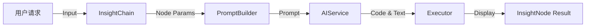

# EDA 闭环与 Context 回流方案分析

**版本**: v1.0  
**日期**: 2026-01-07  
**状态**: 规划中

---

---

## 0. 架构决策记录 (Decision Record)

> [!IMPORTANT]
> **MVP P0 级决策 (2026-01-07)**
> 经与项目组确认，本方案作为 MVP 上线前的核心架构升级项。
> *   **共识**: 采用 **Layer 1 (Router) + Layer 2 (Execution)** 双层 Prompt 架构。
> *   **目标**: 解决 EDA 结论向后续步骤（清洗/建模）传递时的 Context 丢失问题，实现“智能体”闭环。

---

## 1. 背景与目标

### 1.1 用户需求
目前的 EDA（探索性数据分析）流程是线性的：`输入数据 -> AI 生成 Insight -> 用户查看`。
用户希望实现**闭环**：`EDA 发现问题 -> 存入 Context -> 指导 AI 生成后续策略（清洗/建模）`。

### 1.2 典型场景
1.  **EDA 阶段**: AI 发现房价数据在 50 万处存在截断（Capping）。
2.  **Context 回流**: 用户点击 "Adopt"，系统记录 "Feature: house_value, Issue: Capping at 500k"。
3.  **后续阶段**: 用户请求 "构建预测模型"。
4.  **AI 响应**: "基于之前的发现，房价存在 50 万截断，建议先过滤掉这些异常值再建模..." 并生成对应的清洗代码。

---

## 2. 现有流程分析 (Current State)

### 2.1 调用链路


### 2.2 数据流现状
*   **InsightNode**: 包含 `parentContext` 字段，用于父节点向子节点传递简单的上下文。
*   **局限性**:
    *   **单向传递**: 仅支持父 -> 子垂直传递，不支持跨分支或全局共享。
    *   **非结构化**: `parentContext` 通常是纯文本摘要，缺乏结构化信息（如具体的截断阈值、异常列名）。
    *   **易失性**: 点击 "Adopt" 目前仅是将结果定格，并未将 Insight 提升为全局知识。

---

---

## 3. 闭环架构设计 (Architecture)

### 3.1 Prompt 分层架构 (Layered Prompts)
响应用户的建议，我们将 Prompt 体系明确划分为两层：

| 层级                                       | 职责                                                                | 输入                                     | 输出                             | 关键组件       |
| :----------------------------------------- | :------------------------------------------------------------------ | :--------------------------------------- | :------------------------------- | :------------- |
| **Layer 1: 策略层**<br>(Strategy / Router) | **调度与决策**。<br>总结上下文，决定下一步调用哪个 Layer 2 Prompt。 | AnalysisContext<br>User Instruction      | 目标 Prompt ID<br>Schema/Columns | `InsightChain` |
| **Layer 2: 执行层**<br>(Execution / Coder) | **执行与生成**。<br>接收具体的上下文约束，生成可执行代码。          | Structured Context<br>Action Constraints | Python/SQL Code<br>Chart         | `Executor`     |

### 3.2 核心概念：`AnalysisContext` (分析上下文)
（以下内容保持不变）

我们需要引入一个全局的上下文存储，用于记录用户 "Adopt" 的关键发现。

```typescript
interface AnalysisContext {
    // 数据集级元数据
    datasetProfile: {
        rowCount: number;
        columns: string[];
    };
    
    // 已采纳的洞察 (Key Insights)
    adoptedInsights: Array<{
        id: string;
        type: 'data_quality' | 'distribution' | 'correlation';
        description: string; // "房价在 500,000 处存在截断"
        structuredData?: {   // 结构化数据，便于程序处理
            column: string;
            issue: string;
            value?: any;
        };
        codeSnippet?: string; // 相关的代码片段
    }>;
    
    // 当前策略 (基于 Insights 生成的建议)
    actionPlan?: {
        cleaningSteps: string[];
        modelingStrategy: string;
    };
}
```

### 3.2 交互流程改进

1.  **Adopt 动作增强**:
    *   用户点击 Insight 卡片上的 "Adopt" 按钮。
    *   **提取**: 系统从 Insight 结果中提取关键信息（Text-to-Insight 摘要 + 统计值）。
    *   **存储**: 将信息存入全局 `AnalysisContext.adoptedInsights`。

2.  **Prompt 注入增强**:
    *   在构建新的 Prompt（如清洗建议、建模）时，读取 `AnalysisContext`。
    *   **注入 Context**: 将 "已采纳的洞察" 格式化为 Prompt 的一部分。

    **Prompt 示例**:
    ```text
    [Previous Insights]
    The user has verified the following facts:
    1. Column 'median_house_value' is capped at 500,001.
    2. Column 'total_bedrooms' has 207 missing values.
    
    [Task]
    Generate a data cleaning script to prepare for regression modeling.
    Handle the issues mentioned above.
    ```

### 3.3 架构变更点

*   **Store**: 新增 `useAnalysisContext` (Zustand/Context API) 管理全局状态。
*   **Extractor**: 开发 `InsightExtractor`，用于从 AI 返回的非结构化文本中提炼结构化信息（或让 AI 直接返回结构化 JSON）。
*   **Builder**: 修改 `PromptBuilder`，支持合并全局 Context。

---

## 4. Demo 规划：从 EDA 到特征工程

### 场景：房价预测数据准备

**Step 1: EDA (已实现)**
*   用户: "分析房价分布"
*   AI Output: 直方图显示 50万 处有异常高峰。
*   User Action: 点击 "Adopt"。
*   **System Action**: 记录 `Constraint: house_value <= 500000 might be capped`.

**Step 2: Strategy Generation (Context Aware)**
*   用户: "准备训练数据"
*   **System Prompt**: (注入 Step 1 的 Context)
*   **AI Output**: 
    > "检测到房价存在上限截断（Capped at 500k），这会影响模型预测准确性。
    > 建议执行以下清洗步骤：
    > 1. 移除 `median_house_value >= 500000` 的记录（或者单独标记）。
    > 2. 处理缺失值..."
    
**Step 3: Execution**
*   AI 生成具体的 Pandas 清洗代码并执行。

---

## 5. 总结

要实现真正的“智能体”，关键在于**记忆（Memory）**。通过将 EDA 的 Output 转化为 Context Input，我们就能打通感知（EDA）与行动（Cleaning/Modeling）的闭环。
