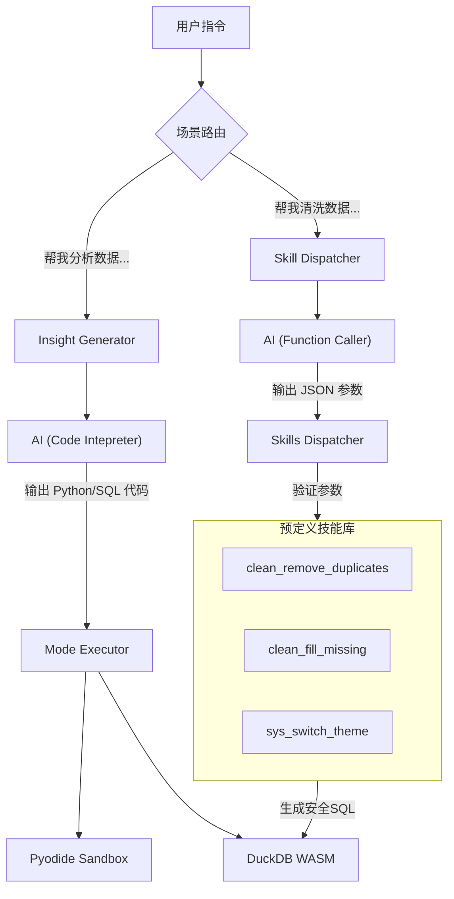

# Skills 与代码执行双模式架构解析

## 1. 核心解答：AI 到底在调用什么？

针对你的疑问："AI 返回的内容直接是 Skills 库的所有函数？"
**答案是：不完全是，视场景而定。**

DataPrism 实际上采用了 **"双模式架构"**，分别处理"无限制探索"和"安全操作"两种需求：

| 模式 | **Code Interpreter 模式** (洞察分析) | **Function Calling 模式** (数据清洗/操作) |
| :--- | :--- | :--- |
| **AI 输出** | **Raw Code** (完整的 Python/SQL 代码) | **Arguments** (函数参数 JSON) |
| **执行器** | `modeExecutor.ts` | `dispatcher.ts` |
| **自由度** | 🌟🌟🌟🌟🌟 (极高，可由 AI 自由发挥绘图) | 🌟🌟 (受限，仅允许执行预定义动作) |
| **安全性** | 🛡️ (依赖沙箱隔离) | 🛡️🛡️🛡️ (依赖白名单与参数校验) |
| **典型场景** | "分析数据分布并画个图" | "把 `age` 列的缺失值填上 0" |

---

## 2. 模式 A：Code Interpreter (洞察分析)
**—— "给我一把刀，我自己切菜"**

在洞察分析（`hooks/useInsightLoaderV2.ts`）中，我们需要 AI 展现最大的创造力（比如选择用散点图还是柱状图，颜色怎么配）。此时我们**不限制**它使用特定的函数。

### 交互流程
1. **Prompt**: "你是一个数据分析师，请写一段 Python 代码分析这些数据..."
2. **AI Response**: 
   ```json
   {
     "full_mode": {
       "code": "import matplotlib.pyplot as plt\ndf.plot(kind='bar')..." 
     }
   }
   ```
   *注意：这里 AI 返回的是字符串形式的**源代码**。*
3. **System**: 直接将这段代码扔给 `Pyodide` (浏览器端 Python 运行时) 或 `DuckDB` 执行。

**结论**：在洞察分析中，**AI 就是程序员**，它直接写代码，系统负责运行。

---

## 3. 模式 B：Function Calling (Skills 调度)
**—— "这是一份菜单，请点菜"**

在数据清洗或系统操作（`services/skills/dispatcher.ts`）中，为了防止 AI 删库跑路或产生不可控的副作用，我们限制它只能调用**预定义好的函数（Skills）**。

### 交互流程
1. **Prompt**: "请帮我去重数据，相关工具已定义在 `tools` 中..."
2. **AI Response**:
   ```json
   {
     "tool_call": "clean_remove_duplicates",
     "arguments": { "columns": ["user_id"] }
   }
   ```
   *注意：这里 AI 返回的是**指令和参数**，不是代码。*
3. **System**: 
   - 收到指令 `clean_remove_duplicates`
   - 查询 `definitions.ts` 检查参数是否合法
   - 生成安全 SQL: `SELECT DISTINCT ON ("user_id") * FROM table`
   - 执行

**结论**：在清洗模式中，**AI 是操作员**，它只能按按钮（调用 Skills），不能自己写逻辑。

---

## 4. 架构全景图



## 5. 为什么这么设计？

1.  **灵活性 vs 安全性的平衡**：
    *   **绘图**需要极高的灵活性，matplotlib 有成千上万种用法，无法将其封装成有限的 Skills 函数（否则 Skills 库会变成几万个函数，Burst Token）。所以**让 AI 写代码**是唯一解。
    *   **删改数据**需要极高的安全性。如果你让 AI 写 SQL `DELETE FROM table`，它可能会忘记加 `WHERE` 条件导致清空表。所以必须用 **Skills 封装**，强制 AI 只能传参，SQL 逻辑由我们写死。

2.  **Generic Skills (通用技能)**：
    你看到的 `sys_run_python` 和 `sys_run_sql` 其实是连接这两种模式的桥梁。它们本质上是"允许执行任意代码"的**超级 Skill**，通常只授权给受信的 Agent（如洞察生成器）使用。

---

## 6. 总结

*   **Prompt 中有 Skills 定义吗？** 
    *   **洞察模式**：没有。Prompt 只是告诉 AI "数据结构长这样，请用 Pandas 写代码"。
    *   **清洗模式**：有。Prompt 中会包含 `definitions.ts` 中的函数签名。

*   **AI 返回的是 Skills 库函数？**
    *   **洞察模式**：不是。返回的是 AI 现场编写的 Raw Code。
    *   **清洗模式**：是。返回的是对 Skill 函数的调用指令。
