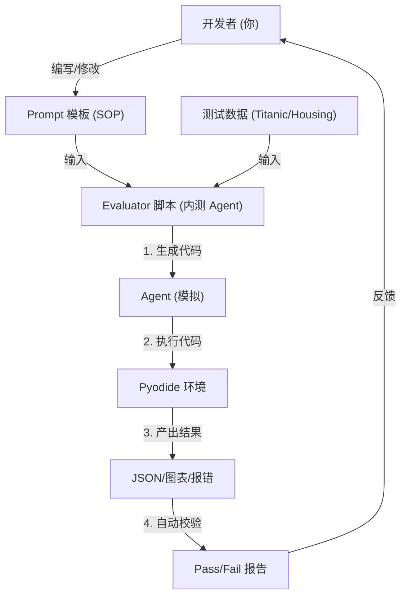

# 技术专题：Skill 提炼与 Agent 进化路线图 (v3.1)

> [!NOTE]
> **版本**：v3.1 (Engineering First)  
> **状态**：✅ 务实落地  
> **核心变更**：聚焦工程化落地，明确了“自动化测试脚本”在Agent体系中的核心地位。

## 1. 核心理念：拒绝黑盒，自动化测试驱动

我们不再谈论虚无缥缈的"自我进化"，而是关注**如何高效地生产高质量 Prompts**。
对于一人开发团队，**自动化测试 (Automated Testing)** 是唯一能保证 Agent 质量且不累死开发者的手段。

### 1.1 两个核心公式

1.  $$ \text{Agent 能力} = \text{通用执行器 (Generic Skills)} + \text{高质量 Prompt (SOP Recipes)} $$
2.  $$ \text{内测 Agent} = \text{Runner (执行脚本)} + \text{Golden Prompts (考题)} + \text{Test Data (数据)} $$

---

## 2. 工程落地：自动化 Evaluator 体系

我们不训练模型（那是大厂的事），我们只做 **"Prompt 工程的自动化验收"**。

### 2.1 架构图 (The Flywheel)



### 2.2 核心组件

#### 组件 A: 测试用例 (Test Cases)
定义清楚**"什么样的结果算对"**。

```typescript
// scripts/test-cases/cleaning.ts
export const CLEANING_CASES = [
  {
    name: "缺失值处理测试",
    inputData: "datasets/titanic_dirty.csv", // 包含 Null 的数据
    expectedIntent: "fill_missing", 
    // 校验点：生成的 Python 代码里必须包含 fillna
    codeMustContain: ["df['Age'].fillna", "inplace=True"] 
  }
];
```

#### 组件 B: 执行脚本 (The Runner)
一个简单的 Node.js 脚本，负责批量跑测试。

*   **功能**：遍历所有 Case -> 调用生成函数 -> 检查输出 -> 打印红绿灯。
*   **命令**：`npm run test:prompts`
*   **收益**：改了一个 Prompt，跑一下脚本，全绿就是稳了。

---

## 3. Agent 进化路径 (From Script to Product)

这个测试脚本 (Evaluator) 不仅仅是测试工具，它的核心逻辑会直接进化为产品的核心功能。

| 阶段 | 名称 | 形态 | 作用 |
| :--- | :--- | :--- | :--- |
| **Phase 1 (当前)** | **跑分脚本** | 开发时运行的 `test.ts` | **验证 Prompt 质量**。帮开发者快速迭代 SOP，不用手动点界面。 |
| **Phase 2 (V1.2)** | **影子助手** | 生产环境后台静默运行 | **预热 & 预检**。用户上传数据时，后台先跑一遍，确定能分析出东西，再弹窗推荐。 |
| **Phase 3 (V2.0)** | **数据医生** | 前台可见的功能模块 | **数据体检报告**。复用校验逻辑，告诉用户："你的数据 30% 是脏的，因为跑‘缺失值测试’挂了"。 |

---

## 4. 立即行动 (Action Plan)

针对 "一人团队" 的现状，我们放弃复杂的 RAG 和向量库，采取**极简工程方案**：

1.  **建立 `scripts/eval/` 目录**：存放测试脚本和测试数据。
2.  **准备 1 个数据 + 1 个 Prompt**：用 Titanic 数据集测试 "清洗建议 Prompt"。
3.  **编写 `test-prompt.ts`**：实现最简单的字符串匹配校验。
4.  **日常开发流**：
    *   修改 `src/services/prompts/xxx.ts`
    *   终端运行 `ts-node scripts/eval/test-prompt.ts`
    *   看到 `✅ PASS` -> 提交代码。

---

## 5. 总结

*   **不算训练**：我们没有训练模型权重，我们只是在**自动化地测试 Prompt**。
*   **关系明确**：测试脚本保证了 Prompt 质量，高质量 Prompt 赋予了内测 Agent 准确性，内测 Agent 未来会变成用户的 AI 助手。
*   **拒绝黑盒**：通过脚本，把玄学的 AI 效果变成了可量化的 Pass/Fail 指标。
