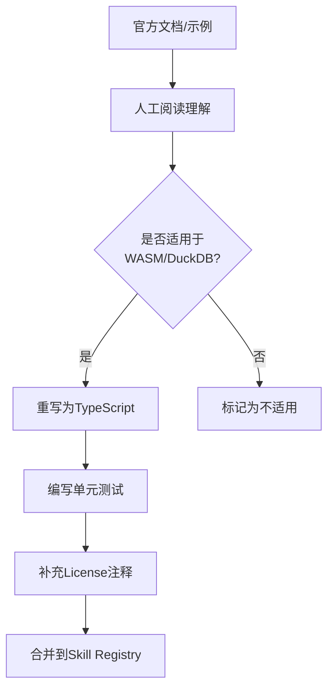

# 技术专题：Skills 官方资源提炼方案

> [!NOTE]
> **版本**：v1.0  
> **状态**：✅ 当前执行方案  
> **作者**：DataPrism Team  
> **更新日期**：2025-12-22

---

## 1. 战略背景

经过深入的法律风险评估，**放弃 Kaggle 作为 Skill 来源**，转而采用**官方开源文档**作为主要资源。

### 1.1 核心优势

| 维度 | Kaggle | 官方资源 |
|------|--------|---------|
| **License 风险** | 🔴 高（混杂GPL/NC/未知） | 🟢 零（BSD/MIT/Apache） |
| **法律责任** | 🔴 衍生作品争议 | 🟢 官方维护，无争议 |
| **质量稳定性** | 🟡 参差不齐 | 🟢 经过生产验证 |
| **维护成本** | 🔴 高（需持续监控License） | 🟢 低（官方更新） |
| **社区认可** | 🟡 可能被视为"抄袭" | 🟢 引用官方文档是行业标准 |

---

## 2. 核心资源库清单

### 2.1 数据处理类（Scikit-learn）

**官方来源**：https://scikit-learn.org/stable/auto_examples/

- **License**: BSD 3-Clause（极度宽松，允许商用、修改、再分发）
- **覆盖领域**：
  - 数据预处理（缺失值、标准化、编码）
  - 特征工程（PCA、特征选择）
  - 异常值检测
  - 数据采样

**示例提炼**：
```python
# 官方示例：https://scikit-learn.org/stable/modules/impute.html
from sklearn.impute import SimpleImputer
imputer = SimpleImputer(strategy='median')
X_filled = imputer.fit_transform(X)
```

↓ 提炼为 DataPrism Skill ↓

```typescript
/**
 * Skill: clean_fill_median
 * 
 * 来源：scikit-learn官方文档 - 数据预处理模块
 * License: BSD 3-Clause
 * URL: https://scikit-learn.org/stable/modules/impute.html
 * 
 * 说明：使用中位数填补数值列的缺失值（相比均值更鲁棒）
 */
export const CLEAN_FILL_MEDIAN: SkillDefinition = {
  name: 'clean_fill_median',
  description: '用中位数填补缺失值（基于scikit-learn标准实现）',
  parameters: {
    table: { type: 'string', required: true },
    column: { type: 'string', required: true }
  }
};
```

---

### 2.2 数据分析类（Pandas）

**官方来源**：https://pandas.pydata.org/docs/user_guide/cookbook.html

- **License**: BSD 3-Clause
- **覆盖领域**：
  - 数据聚合与分组
  - 时间序列分析
  - 数据透视表
  - 数据合并与连接

**可提炼 Skill 数量**：预计 30-50 个

---

### 2.3 SQL 查询类（DuckDB）

**官方来源**：https://duckdb.org/docs/

- **License**: MIT License
- **覆盖领域**：
  - 窗口函数（排名、移动平均）
  - 复杂聚合（PIVOT、UNPIVOT）
  - 日期时间函数
  - JSON 数据处理

**优势**：
- 完美适配 DataPrism 的技术栈
- 性能优化建议（如何高效使用 WASM）

---

### 2.4 数据可视化类（ECharts + Plotly）

**官方来源**：
- ECharts: https://echarts.apache.org/examples/ (Apache 2.0)
- Plotly: https://plotly.com/javascript/ (MIT License)

- **可提炼 Skill 数量**：10-15 个常用图表类型

---

### 2.5 统计学标准算法（公共领域知识）

**参考来源**：
- 《Exploratory Data Analysis》by Tukey (1977) - 公共领域
- Wikipedia 统计学条目 - CC BY-SA（需署名）
- 《统计学习基础》(ESL) - Stanford 免费版本

**示例**：
- IQR 异常值检测
- Z-score 标准化
- 相关性分析（Pearson/Spearman）

---

## 3. Skill 提炼流程（标准化）

### 3.1 流程图



### 3.2 详细步骤

#### Step 1: 选择目标资源
```bash
# 优先级排序
1. Scikit-learn官方示例（BSD，质量最高）
2. Pandas Cookbook（BSD，实用性强）
3. DuckDB文档（MIT，技术栈适配）
4. 统计学教科书（公共知识，零风险）
```

#### Step 2: 提炼与改写

**改写检查清单**：
- [ ] 算法逻辑理解透彻（不是简单复制粘贴）
- [ ] 语言转换（Python → TypeScript 或 SQL）
- [ ] 适配目标环境（WASM、DuckDB）
- [ ] 保留原始算法的核心思想
- [ ] 添加完整的License注释

**反例（不合规）**：
```typescript
// ❌ 直接翻译，未理解算法
function fillMissing(df, col) {
  // Copied from sklearn without understanding
  return df[col].fillna(df[col].median());
}
```

**正例（合规）**：
```typescript
/**
 * 基于scikit-learn的中位数填补策略
 * License: BSD 3-Clause
 * Original: https://scikit-learn.org/stable/modules/impute.html
 * 
 * 实现说明：
 * 1. 先计算列的中位数（使用DuckDB的PERCENTILE_CONT函数）
 * 2. 使用UPDATE语句批量替换NULL值
 * 3. 返回受影响的行数
 */
async function fillMedian(table: string, column: string): Promise<number> {
  const median = await duckdb.query(`
    SELECT PERCENTILE_CONT(0.5) WITHIN GROUP (ORDER BY "${column}")
    FROM ${table}
    WHERE "${column}" IS NOT NULL
  `);
  
  const result = await duckdb.query(`
    UPDATE ${table}
    SET "${column}" = ${median}
    WHERE "${column}" IS NULL
  `);
  
  return result.rowsAffected;
}
```

#### Step 3: 编写测试

```typescript
// tests/skills/clean_fill_median.test.ts
describe('clean_fill_median', () => {
  it('should fill missing values with median', async () => {
    await duckdb.query(`CREATE TABLE test (age INTEGER)`);
    await duckdb.query(`INSERT INTO test VALUES (10), (20), (NULL), (30)`);
    
    await skillsDispatcher.execute('clean_fill_median', {
      table: 'test',
      column: 'age'
    });
    
    const result = await duckdb.query(`SELECT * FROM test WHERE age IS NULL`);
    expect(result.numRows).toBe(0); // 所有NULL已被填充
  });
});
```

#### Step 4: 文档归档

在 `SKILL_SOURCES.md` 中记录来源：

```markdown
## Skill: clean_fill_median

- **来源**: Scikit-learn官方文档
- **URL**: https://scikit-learn.org/stable/modules/impute.html
- **License**: BSD 3-Clause
- **提炼日期**: 2025-12-22
- **维护者**: @your-username
```

---

## 4. Agent 进化策略（基于官方资源）

### 4.1 阶段一：手工提炼（当前阶段）

**目标**：快速构建 50-100 个高质量 Skill

| 资源 | 预计Skill数量 | 优先级 | 周期 |
|------|--------------|--------|------|
| Scikit-learn | 30 | P0 | 1周 |
| Pandas | 20 | P0 | 3天 |
| DuckDB | 15 | P1 | 3天 |
| ECharts | 10 | P1 | 2天 |
| 统计学算法 | 10 | P2 | 1周 |

**人力需求**：2-3 名开发者，全职 2 周

---

### 4.2 阶段二：Few-shot Prompt 库

**目标**：让 LLM 学会"何时使用什么 Skill"

**实施方法**：
```typescript
// 构建 { 问题 -> Skill序列 } 的示例库
const SKILL_USAGE_EXAMPLES = [
  {
    query: "这个数据集有很多缺失值，怎么处理？",
    thinking: "先检查缺失值分布 → 决定填补策略 → 执行填补",
    skills: [
      { name: 'analyze_missing_values', args: { table: 't1' } },
      { name: 'clean_fill_median', args: { table: 't1', column: 'age' } }
    ]
  },
  // ... 50-100个示例
];

// 在LLM调用时注入
const systemPrompt = `
你是一个数据分析专家。以下是常见问题的处理范式：

${SKILL_USAGE_EXAMPLES.map(ex => `
问题: ${ex.query}
思考: ${ex.thinking}
执行: ${JSON.stringify(ex.skills)}
`).join('\n')}

现在用户问: ${userQuery}
请参考上述范式，返回Skill调用序列。
`;
```

---

### 4.3 阶段三：微调专有模型（可选，长期）

**目标**：训练一个专门的 "DataPrism Skill Planner" 模型

**数据集构建**：
```json
{
  "input": "分析各舱位乘客的生存率差异",
  "output": {
    "skills": [
      { "name": "viz_group_bar", "args": { "x": "Pclass", "y": "Survived" } }
    ],
    "reasoning": "这是一个分组统计问题，适合用柱状图展示类别对比"
  }
}
```

**训练方式**：
- 使用 Qwen-7B / DeepSeek-Coder 作为Base Model
- LoRA 微调（成本约 $100-300）
- 训练数据：500-1000 个 (Query, Skill Plan) 对

---

## 5. License 合规管理

### 5.1 LICENSES.md 模板

在 DataPrism 根目录创建：

```markdown
# Third-Party Licenses

## Scikit-learn
- **Version**: 1.3.0
- **License**: BSD 3-Clause
- **Copyright**: 2007-2023 The scikit-learn developers
- **Used for**: Data preprocessing Skills (clean_fill_median, clean_remove_outliers, etc.)
- **Source**: https://github.com/scikit-learn/scikit-learn
- **Full License Text**: [BSD-3-Clause](https://opensource.org/licenses/BSD-3-Clause)

## Pandas
- **Version**: 2.0.0
- **License**: BSD 3-Clause
- **Copyright**: 2008-2023, AQR Capital Management, LLC, Lambda Foundry, Inc., PyData Development Team
- **Used for**: Data analysis Skills (viz_pivot_table, analyze_correlation, etc.)
- **Source**: https://github.com/pandas-dev/pandas

## DuckDB
- **Version**: 0.10.0
- **License**: MIT
- **Copyright**: 2018-2023 Stichting DuckDB Foundation
- **Used for**: SQL query optimization patterns
- **Source**: https://github.com/duckdb/duckdb

## ECharts
- **Version**: 5.5.0
- **License**: Apache License 2.0
- **Copyright**: 2017-2023 The Apache Software Foundation
- **Used for**: Visualization Skills (viz_create_bar, viz_create_scatter, etc.)
- **Source**: https://github.com/apache/echarts
```

---

### 5.2 代码内注释规范

每个 Skill 必须包含：

```typescript
/**
 * Skill: [skill_name]
 * 
 * 来源：[官方文档名称]
 * License: [BSD-3-Clause / MIT / Apache-2.0]
 * URL: [原始文档链接]
 * 
 * 说明：[算法原理简述]
 * 修改：[相对原实现的改动]
 * 
 * @example
 * await dispatcher.execute('skill_name', { ... });
 */
```

---

## 6. 实施时间线

### Week 1: 快速启动
- [ ] Day 1-2: 从 Scikit-learn 提炼前 10 个 Skill
- [ ] Day 3-4: 编写测试 + License 注释
- [ ] Day 5: 创建 `SKILL_SOURCES.md` 和 `LICENSES.md`

### Week 2: 扩展覆盖
- [ ] Day 1-3: Pandas Cookbook 提炼 15 个 Skill
- [ ] Day 4-5: DuckDB 文档提炼 10 个 Skill

### Week 3: 质量提升
- [ ] Day 1-2: 构建 Few-shot Prompt 库（50 个示例）
- [ ] Day 3-5: 端到端测试 + 文档完善

### Week 4: Agent 集成
- [ ] Day 1-3: 将 Skill 库集成到 LLM Adapter
- [ ] Day 4-5: 用户验收测试

---

## 7. 成功标准

- [ ] **质量**: 100% 的 Skill 有完整的 License 注释
- [ ] **数量**: 至少 50 个可用 Skill（覆盖数据清洗、分析、可视化）
- [ ] **合规**: 法务审核通过（若有法务团队）
- [ ] **性能**: 每个 Skill 执行时间 < 2秒（WASM环境）
- [ ] **文档**: 用户手册中有完整的 Skill 目录和示例

---

## 8. 风险与应对

| 风险点 | 应对策略 |
|--------|---------|
| **License 误标注** | 建立 PR Review 流程，强制检查 License 字段 |
| **算法理解偏差** | 每个 Skill 必须有单元测试证明正确性 |
| **资源过时** | 每季度复审 Skill 来源文档的更新 |
| **性能瓶颈** | 在 WASM 环境做性能 Profiling |

---

## 9. 总结

**核心优势**：
- ✅ **零法律风险**：所有资源均为 BSD/MIT/Apache
- ✅ **质量保证**：官方维护，经过生产验证
- ✅ **可持续性**：不依赖第三方平台（如 Kaggle）
- ✅ **社区认可**：引用官方文档是行业标准做法

**Next Steps**：
1. 立即开始从 Scikit-learn 提炼前 10 个 Skill
2. 建立标准化的提炼 + 测试流程
3. 2 周内完成 50 个 Skill 的 MVP

---

**附录**：
- [Scikit-learn 示例库索引](https://scikit-learn.org/stable/auto_examples/index.html)
- [Pandas Cookbook](https://pandas.pydata.org/docs/user_guide/cookbook.html)
- [DuckDB SQL 函数参考](https://duckdb.org/docs/sql/functions/overview)
