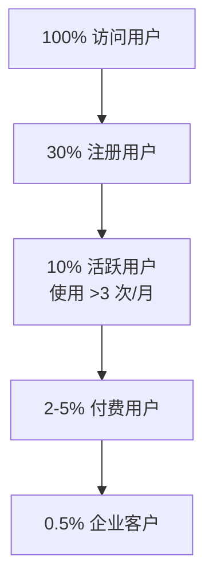

# 专题:DataPrism 定价策略与商业化路径分析

> [!NOTE]
> 本文档基于竞品分析、市场调研与用户行为预测，为 DataPrism 设计 Freemium 定价模型与商业化时间线。

## 1. 竞品定价基准分析

### 1.1 市场现状 (2025 Q1)

| 产品 | 免费版 | 个人版 | 团队版 | 企业版 | 核心差异化 |
| :--- | :--- | :--- | :--- | :--- | :--- |
| **Tableau** | ❌ 无 | $75/月 (Creator) | $42/月 (Explorer) | $15/月 (Viewer) + 定制 | B端主导,视觉强大,价格极高 |
| **Power BI** | ✅ Desktop免费 | $14/月 (Pro) | $24/月 (Premium Per User) | $4,995/月起 (容量制) | Microsoft生态绑定,企业渗透 |
| **Deepnote** | ✅ 3编辑+5项目 | $9/月 (Pro, 新推出) | $39-49/月 (Team) | 定制 (Enterprise) | 协作Notebook,AI Code补全 |
| **DataPrism** | **✅ 完整功能** | **¥99/月 ($14)** | **待设计** | **待设计** | **本地优先+隐私零上传** |

### 1.2 关键发现

1.  **Power BI 是价格锚点**: $14/月 Pro 是中低端市场的心理参照价格,与 DataPrism 的 ¥99 (~$14) 完美对齐。
2.  **Tableau 高端溢价**: $75/月的 Creator 授权(等同个人全功能)证明"专业分析工具"可支撑高价。
3.  **Deepnote 的 Freemium 陷阱**: 免费版限制 3 编辑+5 项目,用户增长到一定规模必然付费,转化漏斗设计精妙。

## 2. DataPrism 定价矩阵设计

### 2.1 三层定价方案

| 功能/限制 | 🆓 **个人版 (Free)** | 💎 **增强版 (Plus)** | 🏢 **企业版 (Enterprise)** |
| :--- | :--- | :--- | :--- |
| **价格** | **免费** | **¥99/月** (中国福利价) **$29/月** (全球定价) | **定制报价** (起步¥999/月) |
| **核心定位** | 个人学习+单文件探索 | 专业分析师的生产力工具 | 团队协作+合规管控 |
| **数据规模** | 单文件 ≤ 10MB | 单文件 ≤ 100MB | 单文件 ≤ 1GB |
| **AI 洞察生成** | 5条/月 | **无限** | **无限** + 自定义 Prompt 模板库 |
| **报告导出** | 3次/月 (Markdown) | **无限** (Markdown + HTML + PDF) | 无限 + 品牌定制水印 |
| **清洗建议** | 10次/月 | **无限** | **无限** |
| **项目数量** | 3个 | **无限** | **无限** |
| **数据留存** | 7天自动清理 | **永久保留** (LocalStorage + IndexedDB) | 永久 + **云备份** (可选私有化部署) |
| **团队协作** | ❌ | ❌ | ✅ 共享项目 + 评论 + 权限管理 |
| **审计日志** | ❌ | ❌ | ✅ 完整操作日志 (满足 SOC2/GDPR) |
| **离线包** | ❌ (需联网加载 Pyodide) | ✅ Self-Hosted Pyodide | ✅ + 私有化部署脚本 |
| **技术支持** | 社区 (GitHub Issues) | 邮件支持 (48h 响应) | 专属客户经理 + Slack 频道 |

### 2.2 付费墙设计策略

**核心原则**: 让免费用户"尝到甜头但感到受限",付费用户"物超所值"。

#### 推荐付费墙位置 (按压迫感排序)

1.  **🔴 AI 洞察生成次数 (强推荐)**  
    *   **理由**: AI 是核心差异化,用户一旦依赖就离不开。限制 5 条/月会让中度用户在第 2 周就撞墙。
    *   **心理锚点**: "5 条免费洞察已用完,升级可解锁无限 AI 分析"。

2.  **🟠 报告导出次数**  
    *   **理由**: 分析师的最终产出是"给老板的报告"。限制 3 次/月会让用户在关键交付时刻付费。
    *   **风险**: 可能导致用户截图/手动复制绕过,建议配合水印策略。

3.  **🟡 数据规模限制**  
    *   **理由**: 10MB 足够玩具数据集,但真实业务数据(订单表/用户行为日志)轻松超过。
    *   **优势**: 技术上易实现,且"文件太大"是自然的痛点。

4.  **🟢 项目数量限制**  
    *   **理由**: 借鉴 Deepnote (限制 5 项目),适合多任务用户。
    *   **风险**: 对个人用户压迫感较弱,更适合团队协作场景。

**建议组合**: **AI 洞察 5 条/月 + 报告导出 3 次/月 + 数据文件 10MB**,三重限制形成"转化漏斗"。

## 3. 中国福利价的可持续性分析

### 3.1 ¥99/月 vs $29/月 的差异

*   **汇率换算**: ¥99 ≈ $14,仅为全球定价的 **48%**。
*   **购买力平价**: 考虑中国 SaaS 付费意愿,¥99 是"小额订阅"心理阈值(等同一顿外卖)。

### 3.2 长期策略选择

| 策略 | 优点 | 缺点 | 推荐度 |
| :--- | :--- | :--- | :--- |
| **永久锁定福利价** | 品牌忠诚度,早期用户口碑传播 | 营收增长受限,难以覆盖成本 | ⭐⭐⭐ |
| **阶梯涨价 (每年+10%)** | 平滑过渡,用户可接受 | 需提前告知,否则引发信任危机 | ⭐⭐⭐⭐⭐ |
| **新用户恢复原价** | 保护早期用户,激励早鸟订阅 | 双轨定价需技术支持 (Stripe Coupon) | ⭐⭐⭐⭐ |

**推荐方案**: **前 1000 名用户终身 ¥99 锁定** + **后续新用户每年 1.1 月涨至 ¥150**。

## 4. 转化漏斗预测模型

### 4.1 用户分层假设

基于类似产品(Notion, Figma)的 Freemium 数据:

### 4.2 关键转化率预估

| 阶段 | 转化率 | 累计漏斗 | 关键动作 |
| :--- | :--- | :--- | :--- |
| 访问 → 注册 | 30% | 30/100 | 落地页价值主张 + Demo 视频 |
| 注册 → 活跃 | 33% | 10/100 | Onboarding 引导 + 示例数据集 |
| 活跃 → 付费 | 3% | 0.3/100 | **撞墙提示** (AI 额度用尽) |
| 付费 → 企业 | 10% | 0.03/100 | 团队协作需求 |

**年化营收预估** (假设月活 10,000 用户):
*   付费用户: 10,000 × 3% = **300 人**
*   月营收: 300 × ¥99 = **¥29,700 ($4,200)**
*   年营收: **¥356,400 ($50,400)**

## 5. 商业化时间线路线图

### Phase 1: MVP 验证期 (2025 Q2)
**目标**: 产品功能闭环 + 早期用户积累

*   [ ] **Week 1-2**: 上线免费版,无任何限制 (收集用户行为数据)
*   [ ] **Week 3-4**: A/B 测试付费墙位置 (AI 洞察 vs 报告导出)
*   [ ] **Week 5-8**: 引入 ¥99 福利价,前 100 名用户终身锁定
*   **KPI**: 1,000 注册用户,100 活跃用户

### Phase 2: 增长加速期 (2025 Q3-Q4)
**目标**: 付费转化优化 + 品牌建设

*   [ ] **Q3**: 集成 Stripe/微信支付,自动化订阅
*   [ ] **Q3**: 上线企业版 Beta (定向邀请 5-10 家种子客户)
*   [ ] **Q4**: 内容营销 (撰写"本地数据分析"最佳实践,SEO 优化)
*   **KPI**: 5,000 注册用户,150 付费用户 (3% 转化率)

### Phase 3: 平台化扩展 (2026 年)
**目标**: 企业市场突破 + 生态建设

*   [ ] **2026 H1**: 推出 Chrome 插件版 (扩大触达面)
*   [ ] **2026 H1**: 开放 Plugin API (允许第三方开发自定义清洗规则)
*   [ ] **2026 H2**: 推出私有化部署版 (针对金融/医疗行业)
*   **KPI**: 10,000 付费用户,50 家企业客户

## 6. 风险与应对

### 6.1 定价风险

*   **风险**: 用户对 ¥99/月 的价值感知不足 (对比免费替代品如 Excel + ChatGPT)。
*   **应对**: 强化"隐私安全"卖点 (数据永不上传) + "时间节省" (自动化清洗省 80% 时间)。

### 6.2 竞品压力

*   **风险**: Power BI 降价或 Tableau 推出免费版。
*   **应对**: 深耕"本地优先"细分市场 (政府/医疗),这是大厂无法触及的合规需求。

## 7. 结论与建议

**立即执行**:
1.  [ ] **设计 Paywall UI**: 优雅的"升级提示框"(参考 Notion 的设计)。
2.  [ ] **集成支付网关**: Stripe (全球) + LemonSqueezy (中国备选)。
3.  [ ] **制定定价页**: `/pricing` 页面,清晰对比三个版本。

**核心策略**: **低价快速渗透 (¥99 福利价) + 高价值企业客户 (定制化部署)**,走"农村包围城市"路线。
