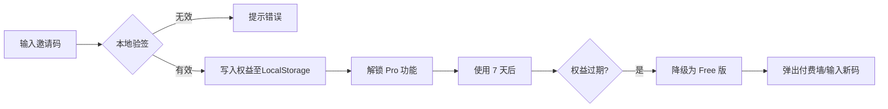

# 专题: MVP 邀请码冷启动方案

> [!NOTE]
> 本文档旨在为 DataPrism MVP 阶段设计一套轻量级、去中心化的邀请码分发与验证机制，用于早期种子用户筛选与增长控制。

## 1. 核心目标
1.  **饥饿营销**: 建立“稀缺感”，提升早期用户注册率。
2.  **用户筛选**: 优先引入高质量的 KOL 和专业分析师。
3.  **灰度发布**: 逐步放开流量，避免 MVP 版本各种 BUG 导致口碑崩盘。
4.  **无需后端**: 契合“本地优先”架构，不依赖复杂的用户数据库。

## 2. 邀请码矩阵设计 (地区化配额)

> [!IMPORTANT]
> 为避免跨地区流量抢跑，中国与全球市场分别设置独立配额。

| 类型 | 前缀格式 | 权益 | 有效期 | **中国配额** | **全球配额** | 发放渠道 |
| :--- | :--- | :--- | :--- | :--- | :--- | :--- |
| **黑金码** | `VIP-CN-xxxx`<br>`VIP-US-xxxx` | **终身免费** + 优先技术支持 | 永久 | **30 个** | **20 个** | KOL定向发放 |
| **早鸟码** | `EARLY-CN-xxxx`<br>`EARLY-US-xxxx` | **1年免费 Pro**<br>+ 锁定福利价权 | 30天内激活 | **1000 个** | **1000 个** | 少数派/Product Hunt |
| **社区码** | `COMM-CN-batch1`<br>`COMM-US-batch1` | **3个月试用** | 7天内激活 | 无限 (按批次) | 无限 (按批次) | 微信群/Discord |
| **裂变码** | `REF-{userId}` | 邀请双方各得1个月 | - | - | - | 用户自生成 |

**地区化策略要点**:
*   **中国侧重点**: 强调"¥99 福利价终身锁定"，对抗未来涨价至 ¥150。
*   **全球侧重点**: 强调"Privacy-First, Zero Cloud Upload"，契合 GDPR/HIPAA 合规需求。

## 3. 技术实施方案 (Offline JWT)

由于 DataPrism 是本地优先应用，我们采用 **离线签名令牌 (Offline Signed Token)** 方案，实现无后端验证。

### 3.1 编码逻辑 (Developer Side)
开发在本地使用私钥 (`Private Key`) 生成签名 Token，格式如下：
`Base64(Payload).Signature`

**Payload 结构**:
```json
{
  "type": "EARLY",          // 权益类型 (VIP/EARLY/COMM/REF)
  "region": "CN",           // 地区标识 (CN/US/GLOBAL)
  "code": "EARLY-CN-0001",  // 邀请码全文 (用于展示)
  "exp": 1798732800,        // 过期时间戳 (Unix timestamp)
  "features": ["PRO_1Y"],   // 解锁功能列表
  "metadata": {
    "issuer": "ProductHunt", // 发放渠道 (可选)
    "batch": "launch_2025"   // 批次标识 (可选)
  }
}
```

### 3.2 验证逻辑 (Client Side)
用户输入邀请码 -> 前端使用公钥 (`Public Key`, 硬编码在源码中) 验证签名 -> 验证通过则写入 `localStorage`。

*   **优点**: 零后端成本，无数据库查询延迟。
*   **缺点**: 如果公钥被替换或破解，可能被绕过（但在 MVP 阶段可接受）。

### 3.3 地区软性匹配 (Soft Regional Matching)
*   **浏览器语言检测**: 读取 `navigator.language`，若为 `zh-CN` 则优先提示用户使用 CN 区邀请码。
*   **非强制校验**: 即使 US 用户使用了 CN 码，也允许激活（避免 VPN 用户被误判），但在后台记录异常地区激活数据用于分析。
*   **UI 引导**: 在邀请码输入框下方显示提示："您的地区为中国，建议使用 EARLY-CN- 开头的邀请码以获得福利价锁定权益"。

### 3.4 防刷机制
1.  **浏览器指纹**: 将激活状态绑定到 `IndexedDB`，且混淆存储 Key，防止简单清空 LocalStorage 后重复刷通用码。
2.  **单码单次激活**: 每个邀请码只能被激活一次（通过后端黑名单记录已激活的码，或在 JWT 中嵌入一次性签名，激活后吊销）。
3.  **在线二次校验 (可选)**: 在用户请求 AI 服务（这是唯一需要联网的环节）时，顺带在 HTTP Header 中携带 Token，服务器端可校验是否为“已撤销”的黑名单 Token。

## 4. 分发与运营策略 (分地区执行)

### 4.1 阶段一：种子期 (Day 1-7) - 双轨并行
**中国渠道**:
*   **发放**: `VIP-CN-0001` ~ `VIP-CN-0030` (30 个)
*   **渠道**: 朋友圈、少数派、知乎专栏
*   **话术**: "DataPrism 内测开始，30 个终身免费黑金码，锁定 ¥99 永不涨价"

**全球渠道**:
*   **发放**: `VIP-US-0001` ~ `VIP-US-0020` (20 个)
*   **渠道**: Personal Twitter, LinkedIn, GitHub Sponsors
*   **话术**: "Privacy-First Data Tool - 20 lifetime VIP codes for early believers"

### 4.2 阶段二：首发期 (Day 8-30) - 分渠道放量
**中国市场 (1000 个)**:
*   **渠道**: 少数派首发、掘金、V2EX
*   **码段**: `EARLY-CN-0001` ~ `EARLY-CN-1000`
*   **卖点**: "1 年免费 + 终身 ¥99 福利价锁定"
*   **玩法**: 文章底部留言"想要测试码"，作者私信发放

**全球市场 (1000 个)**:
*   **渠道**: Product Hunt, Hacker News, Reddit r/datascience
*   **码段**: `EARLY-US-0001` ~ `EARLY-US-1000`
*   **卖点**: "1-Year Pro Access, No Cloud Upload, GDPR-Ready"
*   **玩法**: "Comment 'DataPrism Launch' on Product Hunt, DM for code"

### 4.3 阶段三：裂变期 (Day 31+) - 用户自传播
*   **功能**: 在应用内上线"生成我的邀请码"按钮（仅对已激活用户开放）。
*   **规则**: 每邀请 1 人成功激活，邀请者和被邀请者各得 **1 个月 Pro 延期**。
*   **技术方案**: 生成格式为 `REF-{用户ID哈希}` 的码，后端记录邀请关系树（需要简单的 Serverless Function 或 Firebase）。

## 5. 转化路径 (Funnel)



## 6. 待办清单
- [ ] **生成密钥对**: 生成 RSA 或 Ed25519 公私钥对。
- [ ] **开发生成脚本**: `scripts/generate_invite_code.ts` (用于批量生成)。
- [ ] **实现前端验证组件**: `InviteCodeModal.tsx` (输入框 + 验证逻辑)。
- [ ] **实现权益管理器**: `useLicense.ts` (统一管理当前用户权益状态)。

---

**总结**: 该方案完美契合 DataPrism 的“本地优先”理念，0 成本实现 MVP 阶段的增长控制与用户分层。
