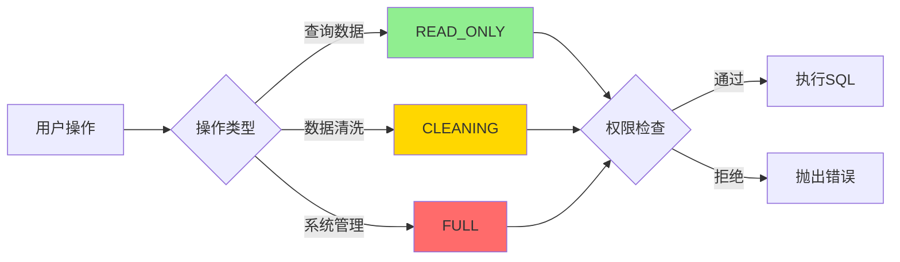

# SQL权限白名单策略说明

**最后更新**: 2025-12-22  
**策略版本**: v1.1（清洗/洞察分离）

---

## 📋 权限级别对比

| 权限级别 | 使用场景 | 允许操作 | 禁止操作 | 安全机制 |
|---------|---------|---------|---------|---------|
| **READ_ONLY** | 洞察分析<br/>数据查询 | ✅ SELECT<br/>✅ DESCRIBE<br/>✅ SHOW | ❌ 任何修改操作<br/>❌ UPDATE<br/>❌ DELETE<br/>❌ DROP<br/>❌ CREATE | 严格只读<br/>保护数据完整性 |
| **CLEANING** | 数据清洗<br/>去重/填充 | ✅ SELECT<br/>✅ UPDATE<br/>✅ DELETE FROM<br/>✅ ALTER TABLE<br/>✅ CREATE TABLE | ❌ DROP TABLE<br/>❌ TRUNCATE<br/>❌ DROP DATABASE | DELETE需WHERE<br/>防止误删全表 |
| **FULL** | 系统内部<br/>表管理 | ✅ 所有操作 | - | 仅系统调用 |

---

## 🎯 设计原则

### 1. **清洗/洞察分离**
- **洞察分析**（READ_ONLY）：
  - 只能读取数据生成图表
  - 禁止任何修改操作
  - 保证分析过程不破坏数据

- **数据清洗**（CLEANING）：
  - 允许修改数据（去重、填充、删行）
  - 禁止删除整表
  - 保留原始表备份

### 2. **最小权限原则**
- 每个场景仅授予必需的最小权限
- 洞察不需要修改，就不给修改权限
- 清洗需要删行，但不需要删表

### 3. **防御性设计**
- DELETE FROM 强制带WHERE（警告，不阻止）
- 禁止DROP TABLE防止误删
- 所有操作记录日志

---

## 💡 典型使用场景

### 场景1：洞察分析（READ_ONLY）

```typescript
// ✅ 允许
await skills.execute('sys_run_sql', {
    sql: 'SELECT * FROM t_data_working WHERE age > 30',
    permission: 'READ_ONLY'
});

// ❌ 禁止
await skills.execute('sys_run_sql', {
    sql: 'DELETE FROM t_data_working WHERE age > 30',
    permission: 'READ_ONLY'  // 报错：READ_ONLY权限仅允许查询
});
```

### 场景2：数据清洗（CLEANING）

```typescript
// ✅ 允许 - 删除重复行
await skills.execute('sys_run_sql', {
    sql: `DELETE FROM t_data_working 
          WHERE id NOT IN (
              SELECT MIN(id) FROM t_data_working GROUP BY name
          )`,
    permission: 'CLEANING'
});

// ✅ 允许 - 更新缺失值
await skills.execute('sys_run_sql', {
    sql: "UPDATE t_data_working SET age = 0 WHERE age IS NULL",
    permission: 'CLEANING'
});

// ✅ 允许（有警告） - 清空工作表
await skills.execute('sys_run_sql', {
    sql: 'DELETE FROM t_data_working',
    permission: 'CLEANING'  // 警告：DELETE无WHERE条件
});

// ❌ 禁止 - 删除整个表
await skills.execute('sys_run_sql', {
    sql: 'DROP TABLE t_data_working',
    permission: 'CLEANING'  // 报错：禁止删除表
});
```

---

## 🛡️ 安全保护措施

### 1. **SQL注入防护**
```typescript
// 所有SQL在执行前经过白名单检查
const forbidden = ['DROP TABLE', 'TRUNCATE', 'DROP DATABASE'];
if (forbidden.some(cmd => sql.includes(cmd))) {
    throw new Error('禁止破坏性操作');
}
```

### 2. **DELETE安全检查**
```typescript
// DELETE FROM必须有WHERE条件（警告机制）
if (sql.includes('DELETE FROM') && !sql.includes('WHERE')) {
    logger.warn('DELETE FROM缺少WHERE条件，可能误删全表');
}
```

### 3. **表名沙箱**
```typescript
// 只允许操作工作表（t_*_working）
if (!tableName.endsWith('_working')) {
    throw new Error('仅允许操作工作表');
}
```

---

## 🔄 权限升级逻辑



---

## 📊 权限使用统计（建议）

| 权限级别 | 使用占比 | 典型调用次数/会话 |
|---------|---------|-----------------|
| READ_ONLY | 70% | 10-50次（洞察生成） |
| CLEANING | 25% | 5-20次（清洗操作） |
| FULL | 5% | 1-5次（初始化/清理） |

---

## ⚠️ 常见错误

### 错误1：洞察分析试图修改数据
```
❌ 错误：READ_ONLY权限仅允许查询操作
原因：AI生成的代码包含UPDATE
解决：检查Prompt，确保只生成SELECT
```

### 错误2：清洗操作试图删表
```
❌ 错误：CLEANING权限禁止删除表或清空整表的操作
原因：SQL包含DROP TABLE
解决：使用DELETE FROM代替DROP TABLE
```

### 错误3：DELETE无WHERE条件
```
⚠️ 警告：DELETE FROM缺少WHERE条件，可能误删全表
原因：SQL为 "DELETE FROM table"
建议：添加WHERE条件或确认真的要清空表
```

---

## 🔧 代码实现

**文件位置**: `src/services/skills/dispatcher.ts` (第185-210行)

```typescript
// 权限检查（清洗/洞察分离策略）
const sqlUpper = sql.toUpperCase().trim();

// READ_ONLY权限（洞察分析）：仅允许查询
if (permission === 'READ_ONLY' && 
    !sqlUpper.startsWith('SELECT') && 
    !sqlUpper.startsWith('DESCRIBE') && 
    !sqlUpper.startsWith('SHOW')) {
    throw new Error('READ_ONLY权限仅允许查询操作');
}

// CLEANING权限（数据清洗）：允许UPDATE/DELETE/ALTER，禁止DROP/TRUNCATE
if (permission === 'CLEANING') {
    const forbidden = ['DROP TABLE', 'DROP VIEW', 'TRUNCATE', 'DROP DATABASE'];
    if (forbidden.some(cmd => sqlUpper.includes(cmd))) {
        throw new Error('CLEANING权限禁止删除表或清空整表的操作');
    }
    
    // 安全检查：DELETE建议带WHERE
    if (sqlUpper.includes('DELETE FROM') && !sqlUpper.includes('WHERE')) {
        logger.warn('Skills', 'DELETE FROM缺少WHERE条件', sql);
    }
}
```

---

## 📚 相关文档

- [Generic Skills架构设计](../04-技术专题/49-技术专题-Skills架构设计与实施方案.md)
- [新用户交互时序图](./11-架构-用户交互时序图-新用户.md)
- [数据清洗Skills化评估](../03-测试验证/33-测试-数据清洗Skills化评估.md)

---

**总结**: 通过清洗/洞察分离的权限策略，我们既满足了数据清洗的DELETE需求，又保证了洞察分析的数据安全。
