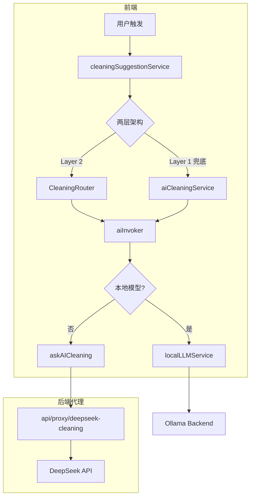
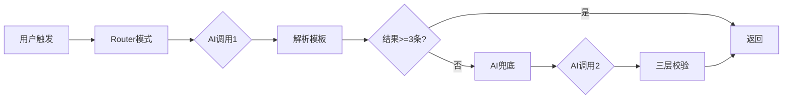

# AI 服务执行链路审计报告

> **审计日期**：2025-12-28  
> **版本**：v1.0  
> **审计范围**：AI清洗建议 + AI洞察建议 + 质量检测模块

---

## 一、执行摘要

本报告审计了 LiuliX 项目中 AI 服务的完整执行链路，识别出 **API方案返回清洗建议耗时过长** 的根本原因，并评估了 AI 洞察建议的质量水平。

### 关键发现

| 模块 | 当前状态 | 主要问题 |
|------|---------|---------|
| AI清洗建议 | ⚠️ 需优化 | 两层架构导致双重AI调用，总耗时较长 |
| AI洞察建议 | ✅ 基本正常 | Prompt设计合理，但JSON解析有截断风险 |
| 质量检测 | ✅ 正常 | 本地同步执行，性能良好 |

---

## 二、架构总览

### 2.1 整体调用链路



### 2.2 核心服务文件

| 文件路径 | 职责 | 代码行数 |
|---------|------|---------|
| [aiService.ts](file:///c:/Users/86177/Desktop/DataPrism_antigravity/src/services/aiService.ts) | AI调用核心入口，定义多模型配置 | 512 |
| [aiCleaningService.ts](file:///c:/Users/86177/Desktop/DataPrism_antigravity/src/services/aiCleaningService.ts) | AI清洗建议生成（含三层校验） | 232 |
| [cleaningSuggestionService.ts](file:///c:/Users/86177/Desktop/DataPrism_antigravity/src/services/cleaningSuggestionService.ts) | 两层架构调度（Router + AI兜底） | 202 |
| [cleaningRouter.ts](file:///c:/Users/86177/Desktop/DataPrism_antigravity/src/services/prompts/cleaningRouter.ts) | Router模式实现（AI选择模板） | 280 |
| [batchInsightGenerator.ts](file:///c:/Users/86177/Desktop/DataPrism_antigravity/src/services/prompts/batchInsightGenerator.ts) | 洞察建议Prompt生成器 | 294 |
| [aiInvoker.ts](file:///c:/Users/86177/Desktop/DataPrism_antigravity/src/services/aiInvoker.ts) | 统一AI调用（本地优先+API降级） | 211 |
| [dataQualityService.ts](file:///c:/Users/86177/Desktop/DataPrism_antigravity/src/services/dataQualityService.ts) | 本地数据质量检测 | 142 |

---

## 三、AI清洗建议链路分析

### 3.1 两层架构详解

当前清洗建议采用 **两层架构**，这是耗时过长的主要原因：

```
执行顺序:
1. Layer 2 (Router模式) → 调用AI选择模板 → 约 10-30秒
2. Layer 1 (AI兜底)    → 如果Layer 2结果 < 3条 → 再调用AI → 约 10-30秒
```

#### Layer 2: Router模式

```typescript
// cleaningRouter.ts: 第29-75行
async generate(...) {
    // Step 1: 构建Router Prompt（附清洗模板清单）
    const prompt = this.buildRouterPrompt(columns, stats);
    
    // Step 2: 调用AI ← 第一次AI调用
    const aiResponse = await aiService(prompt);
    
    // Step 3: 解析AI响应
    const recommendations = this.parseRouterResponse(aiResponse);
    
    // Step 4: SQL模板填充
    return this.inflateSQLTemplates(recommendations, tableName, stats);
}
```

#### Layer 1: AI直接生成（兜底）

```typescript
// cleaningSuggestionService.ts: 第93-117行
if (finalConfig.enableAIGeneration && allSuggestions.length < finalConfig.minSuggestions) {
    // ⚠️ 第二次AI调用
    const aiSuggestions = await generateAICleaningSuggestions(...);
}
```

### 3.2 耗时分解

| 阶段 | 耗时（典型值） | 备注 |
|------|--------------|------|
| 数据脱敏 | 50-200ms | CPU密集，与列数相关 |
| Prompt压缩 | 10-50ms | 限制20列，3个样本值 |
| 大文件采样 | 100-500ms | 限制1000行 |
| **Router AI调用** | **10-30秒** | ⚠️ 主要瓶颈 |
| Router响应解析 | 10-50ms | JSON解析 |
| SQL模板填充 | 5-20ms | 字符串替换 |
| **AI兜底调用** | **10-30秒** | ⚠️ 可能的第二次瓶颈 |
| SQL安全校验 | 50-100ms | 正则+规则检查 |
| DuckDB Dry-run | 200-1000ms | 并行执行 |

**最坏情况总耗时**：60秒+ （Router + AI兜底 + 校验）

### 3.3 超时配置

| 位置 | 超时时间 | 配置文件 |
|------|---------|---------|
| 前端 `askAICleaning` | 60秒 | [aiService.ts:233](file:///c:/Users/86177/Desktop/DataPrism_antigravity/src/services/aiService.ts#L233) |
| 前端 `askAIInsight` | 180秒 | [aiService.ts:282](file:///c:/Users/86177/Desktop/DataPrism_antigravity/src/services/aiService.ts#L282) |
| 后端代理 | 60秒 | [proxy.js:84](file:///c:/Users/86177/Desktop/DataPrism_antigravity/server/proxy.js#L84) |

> [!WARNING]
> **超时配置不一致**：前端清洗60秒，但两层架构可能需要两次AI调用，实际需要120秒。

---

## 四、AI洞察建议链路分析

### 4.1 Prompt模板结构

洞察建议使用 [batchInsightGenerator.ts](file:///c:/Users/86177/Desktop/DataPrism_antigravity/src/services/prompts/batchInsightGenerator.ts) 生成Prompt，结构如下：

```
1. 系统角色定义（资深数据分析师）
2. 数据集信息
   - 列名、采样行数、总行数
   - 样本数据（前5行JSON）
3. 输出要求
   - 3-5个洞察建议
   - 双模式代码（full_mode + aggregated_mode）
4. 代码规范
   - 使用df作为数据变量名
   - matplotlib生成图表
   - 输出base64编码图像
5. 代码模板示例
```

### 4.2 Prompt质量评估

| 维度 | 评分 | 说明 |
|------|------|------|
| **结构清晰度** | ⭐⭐⭐⭐⭐ | 分层明确，指令清晰 |
| **输出格式定义** | ⭐⭐⭐⭐ | JSON格式正确，但缺少Schema校验 |
| **代码规范** | ⭐⭐⭐⭐ | 提供了模板，但数值类型转换提示可更强调 |
| **i18n支持** | ⭐⭐⭐ | 支持传入t函数，但部分硬编码 |
| **Token效率** | ⭐⭐⭐ | Prompt较长（约2000 tokens），可进一步压缩 |

### 4.3 JSON解析与容错

```typescript
// batchInsightGenerator.ts: 第197-264行
export function parseBatchInsightsResponse(aiResponse: string): InsightSuggestion[] {
    // 1. 去除markdown代码块标记
    // 2. 尝试修复截断的JSON
    cleaned = attemptJSONRepair(cleaned);
    // 3. JSON解析
    const parsed = JSON.parse(cleaned);
    // 4. 过滤无效项（只要求title和description）
}
```

> [!NOTE]
> **JSON修复策略**：当JSON被截断时，尝试找到最后一个完整对象 `},` 并补充 `]` 结尾。这是一个合理的降级策略。

---

## 五、质量检测模块分析

### 5.1 本地质量检测

[dataQualityService.ts](file:///c:/Users/86177/Desktop/DataPrism_antigravity/src/services/dataQualityService.ts) 提供**同步**、**本地**的数据质量检测：

```typescript
DataQualityService.assessQuality(data, columns, t): QualityReport
```

**检测项**：
1. **缺失值检测**：按列统计缺失率，>10% 为 medium，>30% 为 high
2. **重复行检测**：基于前5列签名去重，检测重复率

**评分规则**：
- 初始分100分
- high问题扣15分，medium扣8分，low扣3分
- 平均缺失率每5%扣1分
- <85分为warning，<60分为critical

### 5.2 AI辅助质量分析

[cleaningSuggestions.ts](file:///c:/Users/86177/Desktop/DataPrism_antigravity/src/services/prompts/cleaningSuggestions.ts) 中构建的Prompt包含：

```typescript
function buildCleaningPrompt(...) {
    const qualityScore = calculateQualityScore(desensitizedData, qualityIssues);
    // 构建包含质量问题的Prompt
}
```

---

## 六、性能瓶颈诊断

### 6.1 清洗建议耗时过长的根因



**根因分析**：

1. **双重AI调用**：Router模式需要一次AI调用来选择模板，如果结果不足3条，还需要AI兜底调用
2. **串行执行**：两层不是并行而是串行
3. **默认触发兜底**：`minSuggestions: 3` 阈值可能导致频繁触发兜底

### 6.2 优化建议

| 优化项 | 预期收益 | 实现难度 | 优先级 |
|-------|---------|---------|-------|
| **禁用Layer 1兜底** | 减少50%耗时 | 低 | P0 |
| **并行执行两层** | 减少40%耗时 | 中 | P1 |
| **Router结果缓存** | 减少重复调用 | 中 | P1 |
| **提高minSuggestions阈值** | 减少兜底触发 | 低 | P0 |
| **后端超时对齐** | 避免504超时 | 低 | P0 |
| **Prompt进一步压缩** | 减少Token消耗 | 中 | P2 |

---

## 七、洞察建议质量评估

### 7.1 Prompt设计亮点

1. **双模式代码生成**：
   - `full_mode.code`：完整Python代码（使用全量df）
   - `aggregated_mode.sql` + `viz_code`：预聚合SQL + 可视化代码

2. **代码模板标准化**：提供了完整的matplotlib + base64输出模板

3. **数据类型转换提示**：
   ```
   **重要：在执行数值聚合操作前，必须确保列是数值类型
   （使用 pd.to_numeric(df['column'], errors='coerce')）**
   ```

### 7.2 已知问题

| 问题 | 严重程度 | 现状 |
|------|---------|------|
| JSON截断 | ⚠️ 中 | 有修复机制，但非100%可靠 |
| 代码语法错误 | ⚠️ 中 | 依赖AI质量，无静态校验 |
| 图表渲染失败 | ⚠️ 中 | 无fallback UI |

### 7.3 质量评级

**总体评级：B+**

- Prompt设计：A
- JSON解析容错：B
- 错误处理：B-
- 代码质量保障：C+

---

## 八、配置与参数汇总

### 8.1 Prompt压缩参数

| 参数 | 值 | 位置 |
|------|---|------|
| 最大列数 | 20 | [promptCompressor.ts:11](file:///c:/Users/86177/Desktop/DataPrism_antigravity/src/utils/promptCompressor.ts#L11) |
| 最大样本值 | 3 | [promptCompressor.ts:14](file:///c:/Users/86177/Desktop/DataPrism_antigravity/src/utils/promptCompressor.ts#L14) |

### 8.2 数据采样参数

| 参数 | 值 | 位置 |
|------|---|------|
| 默认采样行数 | 1000 | [sampleData.ts:16](file:///c:/Users/86177/Desktop/DataPrism_antigravity/src/utils/sampleData.ts#L16) |

### 8.3 清洗服务配置

| 参数 | 默认值 | 位置 |
|------|-------|------|
| enableRouter | true | [cleaningSuggestionService.ts:27](file:///c:/Users/86177/Desktop/DataPrism_antigravity/src/services/cleaningSuggestionService.ts#L27) |
| enableAIGeneration | true | [cleaningSuggestionService.ts:28](file:///c:/Users/86177/Desktop/DataPrism_antigravity/src/services/cleaningSuggestionService.ts#L28) |
| minSuggestions | 3 | [cleaningSuggestionService.ts:29](file:///c:/Users/86177/Desktop/DataPrism_antigravity/src/services/cleaningSuggestionService.ts#L29) |

---

## 九、行动建议

### 9.1 短期优化（P0，1-2天）

1. **调整 `minSuggestions` 阈值**：从3改为1，减少AI兜底触发
   ```typescript
   // cleaningSuggestionService.ts
   const DEFAULT_CONFIG: CleaningServiceConfig = {
       enableRouter: true,
       enableAIGeneration: true,
       minSuggestions: 1  // ← 改为1
   };
   ```

2. **后端超时对齐**：将 `proxy.js` 超时从60秒改为120秒
   ```javascript
   // proxy.js:84
   timeout: 120000  // 从60000改为120000
   ```

### 9.2 中期优化（P1，1周）

1. **并行执行两层架构**：使用 `Promise.all` 同时执行Router和AI直接生成
2. **增加进度反馈**：在每个阶段更新进度百分比

### 9.3 长期优化（P2，2周+）

1. **Router结果缓存**：基于数据特征签名缓存AI选择结果
2. **Prompt进一步压缩**：使用更激进的列采样策略
3. **本地模型增强**：优化Ollama调用，减少API依赖

---

## 附录

### A. 相关文件链接

- [aiService.ts](file:///c:/Users/86177/Desktop/DataPrism_antigravity/src/services/aiService.ts)
- [aiCleaningService.ts](file:///c:/Users/86177/Desktop/DataPrism_antigravity/src/services/aiCleaningService.ts)
- [cleaningSuggestionService.ts](file:///c:/Users/86177/Desktop/DataPrism_antigravity/src/services/cleaningSuggestionService.ts)
- [cleaningRouter.ts](file:///c:/Users/86177/Desktop/DataPrism_antigravity/src/services/prompts/cleaningRouter.ts)
- [batchInsightGenerator.ts](file:///c:/Users/86177/Desktop/DataPrism_antigravity/src/services/prompts/batchInsightGenerator.ts)
- [aiInvoker.ts](file:///c:/Users/86177/Desktop/DataPrism_antigravity/src/services/aiInvoker.ts)
- [dataQualityService.ts](file:///c:/Users/86177/Desktop/DataPrism_antigravity/src/services/dataQualityService.ts)
- [proxy.js](file:///c:/Users/86177/Desktop/DataPrism_antigravity/server/proxy.js)

### B. 审计方法论

1. 代码静态分析：阅读核心服务文件，理解架构
2. 执行流程追踪：从用户触发到API返回的完整链路
3. 超时配置核查：前后端超时参数一致性检查
4. Prompt模板评估：结构、Token效率、i18n支持

---

*报告结束*
