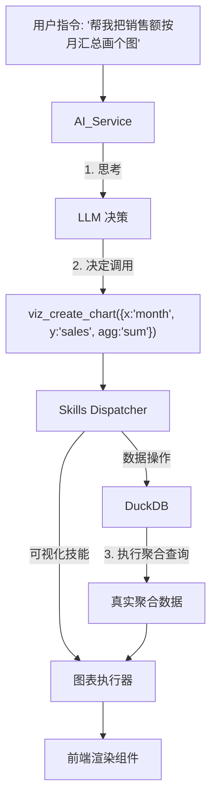

# 专题：Skills (Function Calling) 架构设计与实施方案

> [!NOTE]
> 本文档旨在设计将 DataPrism 的 AI 交互模式从“结构化输出解析”升级为“标准化工具调用 (Skills/Function Calling)”，以实现更自然、精确和可扩展的意图执行。

## 1. 概述与价值 (Executive Summary)

目前 DataPrism 的 AI 模块（如 `InsightChain`）主要依赖 Prompt 工程让 AI 返回特定的 JSON 格式，前端再生硬地解析这些 JSON。这种方式存在 **扩展性差**（每加一个功能都要改 Prompt 和解析逻辑）和 **幻觉风险**（AI 可能生成不存在的参数）等问题。

引入 **Skills (即 Function Calling)** 机制，意味着我们将明确定义一套 AI 可调用的“原子能力库”。AI 仅需决策“调用哪个函数、传什么参数”，执行权回归确定的代码逻辑。

**核心价值**:
1.  **消除幻觉**: AI 不再编造数据，而是生成获取数据的代码/函数调用。
2.  **原子化复用**: 一个 `generate_chart` Skill 可以被对话、自动报告、清洗建议等多个模块复用。
3.  **复杂任务链**: 支持 AI 自主规划 "先清洗 -> 再分析 -> 最后导出" 的多步操作。

## 2. 现状 vs 目标

### 2.1 当前架构 (Current State)
*   **交互**: User Query -> LLM -> JSON (Mock Data or Text) -> Frontend Render
*   **痛点**:
    *   `chartData` 往往是 AI 瞎编的 Mock 数据，非真实运行结果。
    *   新增一个 "导出 PDF" 功能，需要修改 Prompt 让其理解 "export" 字段，容易破坏现有 JSON 结构。

### 2.2 目标架构 (Target State)
*   **交互**: User Query -> LLM -> **Function Call (Name + Args)** -> **Skills Dispatcher** -> **Executor (Pyodide/DuckDB)** -> Real Data/Action
*   **优势**:
    *   前端只负责定义 `tools` schema。
    *   AI 只负责逻辑路由。
    *   执行层确保数据真实性。

## 3. Skills 核心注册表 (Registry)

我们需要构建一个类型安全 (Type-Safe) 的 Skills 注册表。

| 类别 | Skill Name | 参数定义 (TypeScript Interface) | 预期行为 |
| :--- | :--- | :--- | :--- |
| **数据清洗** | `clean_remove_duplicates` | `{ columns: string[] }` | 生成 SQL: `DISTINCT ON (...)` |
| | `clean_fill_missing` | `{ column: string, strategy: 'mean'\|'zero'\|'drop' }` | 生成 Python/SQL 补全逻辑 |
| **可视化** | `viz_create_chart` | `{ type: 'bar'\|'line'..., x: string, y: string, agg: 'sum'\|'avg' }` | 调用 Chart.js 渲染，数据源自 SQL 聚合 |
| **系统操作** | `sys_export_report` | `{ format: 'pdf'\|'md' }` | 触发前端导出功能 |
| | `sys_switch_theme` | `{ theme: 'light'\|'dark' }` | 切换 UI 主题 |

### 3.1 TypeScript Schema 示例

```typescript
// src/services/skills/definitions.ts
export interface SkillParameter {
  type: string;
  description: string;
  enum?: string[];
  required?: boolean;
}

export interface SkillDefinition {
  name: string;
  description: string;
  parameters: Record<string, SkillParameter>;
}

// 示例：可视化技能
export const VIZ_CREATE_CHART: SkillDefinition = {
  name: 'viz_create_chart',
  description: '基于 DuckDB 查询结果生成图表',
  parameters: {
    type: {
      type: 'string',
      description: '图表类型',
      enum: ['bar', 'line', 'scatter', 'pie'],
      required: true
    },
    x: {
      type: 'string',
      description: 'X 轴列名（需从表中存在的列选择）',
      required: true
    },
    y: {
      type: 'string',
      description: 'Y 轴列名',
      required: true
    },
    agg: {
      type: 'string',
      description: '聚合函数',
      enum: ['sum', 'avg', 'count', 'min', 'max']
    }
  }
};
```

## 4. 架构设计



## 5. 实施方案 (Implementation Roadmap)

### Phase 1: 基础设施 (Infrastructure) - P1
1.  **定义 Schema**: 在 `src/services/skills/definitions.ts` 中定义所有 Skills 的 JSON Schema (供 LLM 阅读) 和 TypeScript 类型 (供代码执行)。
2.  **调度器 (Dispatcher)**: 实现 `src/services/skills/dispatcher.ts`，接收 AI 返回的 JSON，路由到具体函数。
    *   **参数白名单校验**: 防止 SQL 注入，所有列名参数必须匹配当前表的实际列名。
    *   **WebWorker 执行**: 所有 DuckDB/Pyodide 调用必须在 Worker 中异步执行，超时5秒强制中断。
3.  **LLM 适配器**: 实现 `src/services/ai/llmAdapter.ts`，屏蔽 DeepSeek 与 Qwen 的差异。
    *   **DeepSeek**: 使用原生 `tools` API。
    *   **Qwen**: 采用 Prompt Shim（将工具定义注入 System Prompt，强制要求返回 JSON）。
    *   **错误降级**: Qwen JSON 解析失败 → 自动重试 1 次 → 仍失败则回退到 Mock 模式。
4.  **可观测性**: 在 Dispatcher 中集成 `logger`，记录每次调用的耗时、参数、结果。

### Phase 2: 核心技能迁移 (Core Migration) - P1
1.  **图表生成**: 废弃 `insightGenerator` 中的硬编码 JSON，改为 `viz_create_chart` Skill。
    *   **优先级**: 最高（最明显的收益：消除幻觉数据）。
2.  **数据清洗**: 废弃 `DataCleaner` 中的正则匹配，改为 `clean_*` Skills。
    *   **建议**: 可与可视化并行开发，或作为"热身任务"优先实施。

### Phase 3: 复杂任务链 (Agentic Flow) - P2 (V1 再上)
1.  **多步执行**: 允许 LLM 一次返回多个 Skills 调用序列（如 `[clean_remove_duplicates, viz_create_chart]`）。
2.  **错误修正**: 如果 Skill 执行报错（如列名不存在），将错误信息回传给 LLM 让其重试。

## 6. 预期效果评估

| 维度 | 提升点 | 评估指标 |
| :--- | :--- | :--- |
| **准确性** | 图表数据 100% 来自 DuckDB 真实查询 | 幻觉率从 ~40% 降至 0% |
| **扩展性** | 新增功能只需注册 Skill，无需调整 Prompt 结构 | 新功能开发工时减少 50% |
| **交互感** | 支持 "把这个图换成红色" 等自然语言微调 | 用户意图识别准确率 > 90% |

## 7. 风险评估与规避策略

| 风险点 | 严重性 | 缓解措施 |
| :--- | :--- | :--- |
| **Qwen JSON 输出不稳定** | 🔴 高 | 引入 `json-repair` 库自动修复格式，重试机制，最终回退到 Mock |
| **SQL 注入攻击** | 🔴 高 | 参数白名单校验：仅允许已存在的列名，拒绝任何 SQL 关键字 |
| **DuckDB 执行阻塞 UI** | 🟡 中 | 强制 WebWorker 执行，5 秒超时中断，显示加载进度条 |
| **LLM 死循环调用** | 🟡 中 | 最大调用深度 Max Steps = 5，超限自动终止并提示用户 |
| **DeepSeek API Token 耗尽** | 🟢 低 | 提供"降级到 Qwen 本地"的开关，自动检测 API 配额 |
| **Token 消耗过大** | 🟢 低 | 动态挂载 Skills，只在相关上下文加载必要的工具定义 |

### SQL 注入防范示例

```typescript
// src/services/skills/dispatcher.ts
import { DuckDBEngine } from '@/db/duckdbEngine';
import { logger } from '@/utils/logger';

export async function executeVizCreateChart(args: any, tableName: string) {
  const db = DuckDBEngine.getInstance();
  const tableColumns = await db.getTableColumns(tableName);
  
  // 参数白名单校验
  if (!tableColumns.includes(args.x)) {
    logger.error('Skills', `Invalid X column: ${args.x}`, { available: tableColumns });
    throw new Error(`Invalid column name: ${args.x}`);
  }
  if (!tableColumns.includes(args.y)) {
    logger.error('Skills', `Invalid Y column: ${args.y}`, { available: tableColumns });
    throw new Error(`Invalid column name: ${args.y}`);
  }
  
  // 安全执行 SQL
  const sql = `SELECT "${args.x}", ${args.agg || 'SUM'}("${args.y}") as value
               FROM ${tableName} 
               GROUP BY "${args.x}"`;
  
  logger.log('Skills', 'Executing viz_create_chart', { sql, args });
  return await db.query(sql);
}
```

## 8. 向后兼容性保证与渐进式迁移 🛡️

> [!IMPORTANT]
> **设计原则**：Skills架构不应破坏现有功能，必须提供可控的、渐进式的迁移路径。

### 8.1 三层开关机制

为保证100%向后兼容，设计三层独立开关：

#### Layer 1: 全局总开关（localStorage）

```typescript
// 用户可在设置面板中控制
const isSkillsEnabled = localStorage.getItem('enable_skills') === 'true';
```

#### Layer 2: 功能模块开关（细粒度控制）

```typescript
// src/config/skillsConfig.ts
export const SKILLS_CONFIG = {
    // 全局开关
    GLOBAL_ENABLED: false,  // 默认关闭，需手动开启
    
    // 各模块独立开关
    MODULES: {
        INSIGHT_CHAIN: false,     // 洞察链模块
        DATA_CLEANING: false,     // 数据清洗模块  
        CHAT_PANEL: false,        // AI聊天面板
        AUTO_REPORT: false        // 自动报告
    },
    
    // Phase 2 专用开关
    ADVANCED: {
        MULTI_STEP: false,        // 多步执行
        ERROR_RECOVERY: false     // 错误修正
    }
};
```

#### Layer 3: 函数级别选择（显式调用）

```typescript
// 新增专用函数，不影响现有函数
export const askAIWithSkills = async (
    prompt: string, 
    options: {
        enableSkills: boolean;      // 必须显式传参
        enableMultiStep?: boolean;
        enableRetry?: boolean;
    }
) => {
    if (!options.enableSkills) {
        // 降级到传统JSON模式
        return await askAI(prompt);
    }
    
    // Skills Function Calling模式
    return await llmAdapter.call(prompt, 'deepseek');
};
```

---

### 8.2 完全隔离方案（推荐）

采用**新增函数**策略，现有代码**零改动**：

#### 示例：洞察链模块

```typescript
// ❌ 现有函数（完全保持不变）
export const loadInsights = async (columns, rowCount, tableName) => {
    // 传统模式：生成JSON Prompt → 解析响应
    const prompt = generateBatchInsightsPrompt(columns, rowCount, sampledData);
    const response = await askAIInsight(prompt);
    return parseBatchInsightsResponse(response.content);
};

// ✅ 新增Skills版本（完全独立）
export const loadInsightsWithSkills = async (columns, rowCount, tableName) => {
    // 检查开关
    if (!SKILLS_CONFIG.MODULES.INSIGHT_CHAIN) {
        return await loadInsights(columns, rowCount, tableName);
    }
    
    // Skills模式
    const llmResponse = await llmAdapter.call(
        `分析这个数据集：${columns.join(', ')}`,
        'deepseek'
    );
    
    if (llmResponse.toolCalls) {
        const executor = new StepsExecutor();
        return await executor.executeSteps(llmResponse.toolCalls);
    }
    
    // 降级到传统模式
    logger.warn('Skills', 'LLM未返回工具调用，降级传统模式');
    return await loadInsights(columns, rowCount, tableName);
};
```

#### 使用方式

```typescript
// InsightChainFlow.tsx
const handleLoadInsights = async () => {
    // 根据开关选择调用路径
    if (SKILLS_CONFIG.MODULES.INSIGHT_CHAIN) {
        return await loadInsightsWithSkills(columns, rowCount, tableName);
    } else {
        return await loadInsights(columns, rowCount, tableName);
    }
};
```

---

### 8.3 安全保障措施

#### 1. 默认全关闭

所有开关默认值为 `false`，用户必须**主动开启**：

```typescript
// 用户需在设置中手动启用
localStorage.setItem('enable_skills', 'true');
localStorage.setItem('enable_skills_multi_step', 'true');
```

#### 2. 实时降级机制

任何Skills执行失败，自动降级到传统模式：

```typescript
try {
    if (SKILLS_CONFIG.GLOBAL_ENABLED) {
        return await skillsPath();
    }
} catch (error) {
    logger.warn('Skills', 'Skills执行失败，降级传统JSON模式', error);
    return await traditionalPath();
}
```

#### 3. 错误监控与告警

```typescript
// 记录降级事件
logger.log('Skills', 'Fallback事件', {
    module: 'insight_chain',
    reason: error.message,
    timestamp: Date.now()
});
```

---

### 8.4 渐进式迁移路径

#### 4周迁移时间线

```
Week 1: 仅在AI Chat面板启用Skills
  - 风险：🟢 低（独立模块，用户主动触发）
  - 监控：Chat成功率、降级频率

Week 2: 启用洞察链Skills
  - 风险：🟡 中（核心功能，但有降级）
  - 监控：洞察生成成功率、Token消耗

Week 3: 启用数据清洗Skills
  - 风险：🟡 中（涉及数据操作）
  - 监控：SQL执行成功率、安全校验拦截率

Week 4: 全面启用 + Phase 2高级功能
  - 风险：🟡 中（多步执行、错误修正）
  - 监控：多步任务成功率、重试次数

Week 5+: 移除传统模式（可选）
  - 条件：Skills成功率 > 95%，用户反馈良好
```

---

### 8.5 配置管理UI（Phase 3可选）

可在设置面板添加实验性功能开关：

```tsx
// SettingsPanel.tsx
<Section title="🧪 实验性功能">
    <Toggle
        label="启用Skills架构（Function Calling）"
        description="使用AI工具调用替代JSON解析，提升准确性"
        checked={skillsEnabled}
        onChange={(val) => {
            localStorage.setItem('enable_skills', val.toString());
            setSkillsEnabled(val);
        }}
    />
    
    {skillsEnabled && (
        <SubSection>
            <Toggle 
                label="多步任务执行" 
                description="允许AI自动规划多步操作序列"
                checked={multiStepEnabled}
                onChange={...}
            />
            <Toggle 
                label="智能错误修正" 
                description="失败时自动重试并修正参数"
                checked={retryEnabled}
                onChange={...}
            />
        </SubSection>
    )}
</Section>
```

---

### 8.6 风险评估矩阵

| 模块 | Skills影响范围 | 降级路径 | 风险等级 |
|------|---------------|----------|----------|
| **AI Chat** | 仅聊天面板 | 返回文本 | 🟢 低 |
| **洞察链** | 图表生成 | 传统JSON | 🟡 中 |
| **数据清洗** | SQL执行 | 规则建议 | 🟡 中 |
| **自动报告** | 完整报告 | 手动导出 | 🟢 低 |

---

### 8.7 实施检查清单

- [ ] **代码隔离**：新增 `*WithSkills` 函数，不修改现有函数
- [ ] **开关机制**：实现三层开关配置文件
- [ ] **降级逻辑**：所有Skills调用必须有 `try-catch` 降级
- [ ] **日志记录**：记录每次Skills调用、降级事件
- [ ] **单元测试**：覆盖Skills模式 + 传统模式双路径
- [ ] **E2E测试**：模拟开关切换、降级场景
- [ ] **文档更新**：在用户手册中说明实验性功能
- [ ] **监控大盘**：Grafana添加Skills成功率面板（可选）

---

## 9. 总结与下一步

### 当前状态

- ✅ **Phase 1**: 100%完成（Schema、Dispatcher、Adapter、日志）
- 🔄 **Phase 2**: 待实施（多步执行、错误修正）
- 📋 **兼容性保障**: 设计完成，待实施

### Phase 2 预计工时

- **总耗时**: 8-12小时（1-1.5天）
- **复杂度**: 🟡 中等
- **优先级**: P1（高价值）

### 推荐行动

1. **立即优先**: 修复AI洞察超时（智能列过滤，20分钟）
2. **本周末/下周**: 实施Phase 2 + 兼容性开关（1-1.5天）
3. **Week 2**: 灰度测试Skills模式（AI Chat先行）
4. **Week 3-4**: 全面迁移，监控稳定性
5. **Week 5+**: 移除传统模式（可选）

---

**附录**：详细实施方案见 [Skills Phase 2评估文档](../artifacts/skills_phase2_evaluation.md)
