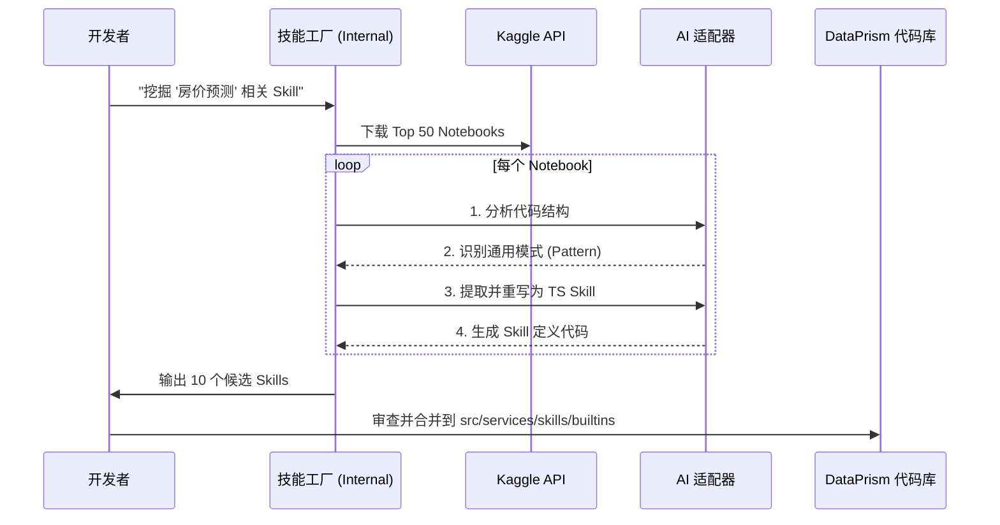
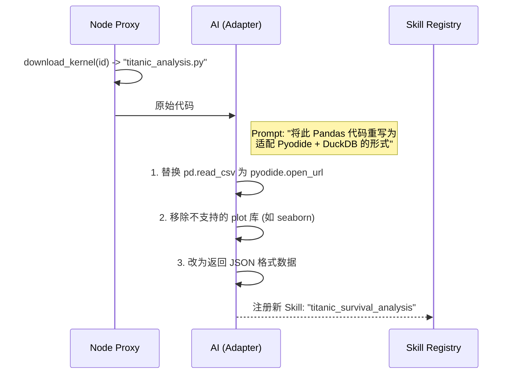

# 技术专题：Kaggle 数据源接入方案

> [!NOTE]
> **版本**：v1.0  
> **状态**：❌ **已废弃** (2025-12-22)  
> **原因**：法律风险过高（License混杂、GPL传染、批量爬取违反ToS）  
> **替代方案**：[53-技术专题-Skills官方资源提炼方案](53-技术专题-Skills官方资源提炼方案.md)  
> **作者**：DataPrism Team  
> **更新日期**：2025-12-22

> [!CAUTION]
> **本文档仅作存档参考，请勿实施本方案。**

## 1. 背景与目标

为了提升 DataPrism 的分析能力，我们计划利用 Kaggle 作为 **"内部技能炼丹炉" (Internal Skill Factory)**。

> [!IMPORTANT]
> **战略定位调整**： 
> 此模块不再直接面向终端用户开放（避免产品定位模糊）。
> 而是作为 **研发基础设施**，用于挖掘、提炼和验证高质量的分析逻辑，转化为内置 Atomic Skills。

---

## 2. 战略实施路径：从"堆砌 Skills"到"进化 Agent"

要实现"让 DataPrism 拥有顶级数据科学家的直觉"这一愿景，单纯增加 Skills 数量（量变）是不够的，我们需要 **Agent 进化（质变）**。

### 阶段一：Skill 挖掘 (Quantitative Skills) - **当前阶段**
*   **目标**：快速扩充原子能力库。
*   **方法**：
    1.  **Ingest**: 批量下载 Kaggle 高分 Notebooks（如 Titanic, House Prices EDA）。
    2.  **Extract**: 人工 + AI 提取其中的通用分析逻辑（如"缺失值热力图", "相关性矩阵"）。
    3.  **Implement**: 将其改写为标准 TypeScript Skills (`sys_xxx`)。
*   **产出**：数百个高质量、可复用的 Atomic Skills。

### 阶段二：Agent 模式克隆 (Behavior Cloning) - **中期目标**
*   **目标**：学习"专家是如何思考的"。
*   **方法**：
    1.  **Dataset**: 构建 { Query -> Sequence of Skills } 的微调数据集。
        *   *示例*: "分析房价" -> [查看分布, 处理缺失值, 计算相关性, 绘制回归图]。
    2.  **Training**: 使用 Qwen/DeepSeek 进行 SFT（监督微调）或构建 Few-shot Prompt 库。
    *   **产出**：一个知道"何时调用什么 Skill"的专有 Agent 模型。

### 阶段三：自我进化 (Auto-Evolution) - **远期愿景**
*   **目标**：Agent 自主学习新 Skill。
*   **方法**：
    1.  Agent 在遇到未知问题时，自动在 Kaggle 搜索相关代码。
    2.  在沙箱中尝试运行并验证效果。
    3.  成功后自动将其持久化到本地 Skills 注册表。

---

## 3. 架构设计 (Internal R&D Pipeline)

此架构仅运行在研发/测试环境，不打包进用户发行版。

---

> [!TIP]
> **关于费用**：Kaggle API 完全免费，无Token计费，无额度限制（仅有常规请求频率限制）。这是相比 OpenAI/Claude API 的巨大成本优势。

---

## 4. 进阶：Kaggle Kernel 代码接入 (Code Skills)

除了数据，Kaggle 还拥有海量的 **Kernels (Notebooks)** 代码。我们可以获取这些高质量代码，将其转化为本地可执行的 Skill。

### 4.1 核心流程：AI 适配层 (Code Adaptation)

由于 Kaggle 运行环境（Docker Linux）与 DataPrism 运行环境（Browser WASM/Pyodide）存在巨大差异，直接运行下载的代码 **100% 会失败**。

**解决方案：引入"AI 代码适配层"**

### 4.2 技术实现

1.  **Proxy 扩展**:
    *   `GET /api/proxy/kaggle/kernels/pull/{id}`: 获取 Notebook 原始内容（JSON/ScriptString）。

2.  **Skill 定义 (Dynamic)**:
    *   此类 Skill 不是预定义的，而是**动态生成**的。
    *   Skill 类型标记为 `dynamic_python`。

3.  **安全沙箱**:
    *   所有从 Kaggle 下载的代码，**必须** 经过 LLM 重写和审查，禁止直接 eval。
    *   执行时运行在独立的 Pyodide Worker 中，无 DOM 访问权限。

---

## 5. 技术挑战与解决方案

### 5.1 跨域与大文件传输
*   **问题**：浏览器直接访问 Kaggle API 会被 CORS 拦截。
*   **解法**：Node.js Proxy 转发。对于大文件，使用 `response.pipe()` 实现流式转发，服务器内存占用极低。

### 5.2 解压处理 (Zip)
*   **问题**：Kaggle 下载通常是 Zip 包。
*   **解法**：
    *   方案 A (后端解压)：Node.js 使用 `adm-zip` 解压流，只返回 CSV 流给前端。
    *   方案 B (前端解压)：前端接收 Zip Blob，使用 `JSZip` 解压。
*   **决策**：**方案 A (后端解压流)**。节省前端算力，且 DuckDB ingestCSV 更喜欢纯文本流。

---

## 6. 风险评估

| 风险点 | 描述 | 应对策略 |
|---|---|---|
| **网络延迟** | Kaggle 服务器在海外，国内下载可能慢 | 增加超时时间，显示实时进度 |
| **API 限制** | Kaggle API 未公开明确的 Rate Limit | 仅针对特定用户请求触发，非高频调用 |
| **Token 安全** | 用户 Key 可能泄露 | Key 仅存在 localStorage，通过 HTTPS 传输，服务器不落盘日志 |
| **知识产权合规** | Kaggle Notebooks 通常为 Apache 2.0/MIT，但也可能存在 "All Rights Reserved" 代码 | 1. 仅抓取明确标注开源协议的 Notebooks 2. 在 Skill 中保留原作者署名 3. 提炼后的 Skill 代码需经过法务审核 |
| **维护成本** | Kaggle 热门主题变化快，过时的 Skill 可能失去价值 | 1. 建立 Skill 版本管理机制 2. 定期审查 Skill 使用频率，淘汰低频 Skill 3. 优先提炼"通用型"Skill（如数据清洗），降低领域依赖 |
| **AI 转换成功率不确定** | Kaggle 代码 → TypeScript Skill 的转换成功率可能低于 30% | 1. Phase 2 设置"PoC 里程碑"验证可行性 2. 若成功率 < 30%，降级为"纯人工提炼" |

---

## 7. 开发规划 (Development Roadmap)

### Phase 1: 基础设施建设 (Dev Environment Only)
*   **周期**: 1-2 天
*   **目标**: 打通开发环境与 Kaggle 云端的通信隧道（**仅限研发使用，绝不打包进生产版本**）。
*   **任务**:
    1.  [ ] **独立 Proxy 服务**: 在 `dataprism-internal-tools` 仓库中实现独立的 Node.js Proxy，支持 `/kaggle/*` 路由。
    2.  [ ] **流式管道测试**: 验证 Proxy → DuckDB 的大文件传输稳定性。
    3.  [ ] **开发环境配置**: 仅在本地 `.env.development` 中配置 Kaggle Token。

> [!WARNING]
> **生产环境隔离**：DataPrism 主仓库的 `server/index.js` 不得包含任何 Kaggle Proxy 代码。所有 Kaggle 相关逻辑必须在独立仓库中维护。

### Phase 2: 内部工具链 (Shadow System)
*   **周期**: 3-4 天
*   **定位**: **严格物理隔离**。绝不内置于 DataPrism 生产环境代码中。
*   **形态**: 独立的 **Electron App** 或 **CLI Tool** (`dataprism-miner`)。
*   **任务**:
    1.  [ ] **独立仓库**: 建立 `dataprism-internal-tools` 仓库。
    2.  [ ] **Skill Miner**: 独立运行的抓取与分析工具，输出 JSON 文件。
    3.  [ ] **安全性**: 确保 DataPrism 主仓库和发行包中不包含任何 "Miner" 相关代码或 API Key。

> [!CAUTION]
> **安全红线**：即便做了路由隐藏，前端代码依然可以被反编译。因此，**内部工具必须在代码库物理层面上与商业产品完全隔离**。

### Phase 3: 自动化流水线 (Automation Pipeline)
*   **周期**: 长期迭代
*   **目标**: 建立持续集成的 Skill 工厂。
*   **任务**:
    1.  [ ] **定时任务**: 每周自动拉取 Kaggle Trending Notebooks。
    2.  [ ] **质量评估脚本**: 自动运行提取的 Skill，通过简单的 Test Case 验证其可用性。
    3.  [ ] **Agent 强化训练**: 用积累的 Case 微调 DeepSeek-Coder 模型。
