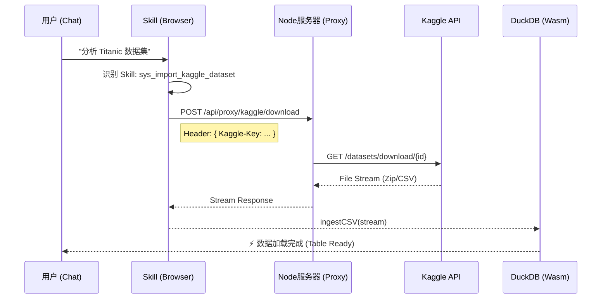

# 技术专题：Kaggle 数据源接入方案

> [!NOTE]
> **版本**：v1.0  
> **状态**：设计中  
> **作者**：DataPrism Team  
> **更新日期**：2025-12-21

## 1. 背景与目标

为了解决用户缺乏高质量测试数据的问题，计划接入 **Kaggle API**。Kaggle 拥有超过 300,000 个公开数据集，接入后将极大扩展 DataPrism 的数据源能力，从单纯的"本地文件分析"升级为"云端数据探索平台"。

**核心目标**：
1.  **Skills 集成**：通过自然语言指令（如"下载 Titanic 数据集"）触发下载。
2.  **流式直连**：数据不落地，通过 Node.js Proxy 管道直接传输到浏览器端 DuckDB。
3.  **零门槛**：用户只需提供 Kaggle API Token，无需配置 Python 环境。

---

## 2. 架构设计

采用 **Node.js Proxy 中转架构**，规避 CORS 问题并隐藏 API 复杂性。



---

## 3. 详细实施方案

### 3.1 后端代理 (Node.js)

在 `server/index.js` 增加 Kaggle 专用路由。

#### 3.1.1 路由定义

*   `GET /api/proxy/kaggle/search`: 搜索数据集
*   `GET /api/proxy/kaggle/list`: 列出数据集内的文件
*   `GET /api/proxy/kaggle/download`: 下载文件（流式）

#### 3.1.2 鉴权机制

*   客户端将 `username` 和 `key` 放入 HTTP Header (`x-kaggle-username`, `x-kaggle-key`)。
*   服务器透传 Basic Auth 到 Kaggle Official API (`https://www.kaggle.com/api/v1`).

---

### 3.2 Skill 定义 (Frontend)

在 `src/services/skills/definitions.ts` 新增 Skill。

```typescript
export const SYS_IMPORT_KAGGLE: SkillDefinition = {
  name: 'sys_import_kaggle_dataset',
  description: '从 Kaggle 下载数据集并加载到数据库',
  parameters: {
    dataset: {
      type: 'string',
      description: '数据集 ID (格式: owner/dataset-slug)',
      required: true
    },
    file: {
      type: 'string',
      description: '具体文件名 (可选，若不填则自动选择最大的 CSV)',
      required: false
    }
  }
};
```

---

### 3.3 交互流程 (UI/UX)

1.  **配置引导**：
    *   用户首次请求时，若无 Token，弹出"Kaggle API 配置模态框"。
    *   指引用户去 `kaggle.com/account` -> `Create New API Token`。

2.  **执行反馈**：
    *   显示下载进度条（借助流式传输）。
    *   下载完成后自动生成数据预览卡片。

---

## 4. 技术挑战与解决方案

### 4.1 跨域与大文件传输
*   **问题**：浏览器直接访问 Kaggle API 会被 CORS 拦截。
*   **解法**：Node.js Proxy 转发。对于大文件，使用 `response.pipe()` 实现流式转发，服务器内存占用极低。

### 4.2 解压处理 (Zip)
*   **问题**：Kaggle 下载通常是 Zip 包。
*   **解法**：
    *   方案 A (后端解压)：Node.js 使用 `adm-zip` 解压流，只返回 CSV 流给前端。
    *   方案 B (前端解压)：前端接收 Zip Blob，使用 `JSZip` 解压。
*   **决策**：**方案 A (后端解压流)**。节省前端算力，且 DuckDB ingestCSV 更喜欢纯文本流。

---

## 5. 风险评估

| 风险点 | 描述 | 应对策略 |
|---|---|---|
| **网络延迟** | Kaggle 服务器在海外，国内下载可能慢 | 增加超时时间，显示实时进度 |
| **API 限制** | Kaggle API 未公开明确的 Rate Limit | 仅针对特定用户请求触发，非高频调用 |
| **Token 安全** | 用户 Key 可能泄露 | Key 仅存在 localStorage，通过 HTTPS 传输，服务器不落盘日志 |

---

## 6. 下一步行动 (Action Items)

1.  [ ] **后端**：实现 `server/routes/kaggle.ts` 代理逻辑。
2.  [ ] **前端**：实现 `KaggleConfigModal` 组件。
3.  [ ] **Skill**：注册 `sys_import_kaggle_dataset` 并实装 Dispatcher。
4.  [ ] **验证**：下载 "titanic" 和 "housing" 数据集测试。
