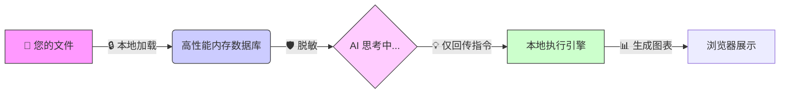

# 欢迎页产品介绍升级方案 (v2.0)

**日期**: 2026-01-06
**状态**: 📅 计划中
**关联文档**: [50-专题-AI实现与UX分析报告.md](./50-专题-AI实现与UX分析报告.md)

---

## 1. 核心设计理念

**"让用户在 10 秒内建立信任，在 30 秒内感知价值。"**

我们将产品卖点分为三个层级，通过页面布局逐步展开：
*   **Layer 1 (Trust)**: 消除恐惧。强调 **隐私安全 (Privacy)** 和 **结果可控 (Control)**。这是用户敢不敢用的门槛。
*   **Layer 2 (Value)**: 展示收益。强调 **极速启动 (Speed)** 和 **分析即报告 (Outcome)**。这是用户愿不愿用的动力。
*   **Layer 3 (Proof)**: 提供证据。强调 **可追溯性 (Traceability)** 和 **白盒透明 (Whitebox)**。这是用户能否留存的关键。

---

## 2. 页面布局与展示优先级 (Layout & Priority)

### 2.1 整体结构示意图

| 区域       | 模块名称               | 核心内容                                    | 优先级            |
| :--------- | :--------------------- | :------------------------------------------ | :---------------- |
| **Top**    | **Hero Section**       | Slogan + CTA + Trust Badges                 | **P0** (首屏必看) |
| **Mid-1**  | **Trust & Safety**     | 隐私防护 + 3层门控 (The "Why")              | **P0** (信任基石) |
| **Mid-2**  | **Feature Highlights** | 秒级回溯 + 极速启动 + 自动报告 (The "What") | **P1** (核心差异) |
| **Bottom** | **How it Works**       | 透明流程图解 (The "How")                    | **P2** (极客背书) |

### 2.2 详细展示策略

#### 1️⃣ Hero Section (首屏)
*   **Slogan**: "Not just AI Analysis. Your **Private Data Scientist**." (不仅是 AI 分析，更是您的私有数据科学家)
*   **CTA Button**: [Upload File] (大尺寸，高亮)
*   **Trust Badges (新增)**: 在按钮下方增加一行微弱的灰色徽章，打消上传顾虑：
    *   🔒 **Local Execution** (本地执行)
    *   ✈️ **Offline Capable*** (离线可用*)
    *   �️ **Desktop Optimized** (PC端优化)
    
    > *注：Offline Capable 指内置数据引擎可完全离线运行。AI 功能若使用 Local LLM 需依赖本地后端服务。*

#### 2️⃣ Trust & Safety Cards (信任层) - *三列布局*
> 消除对 AI 幻觉和隐私泄露的恐惧。

| 模块             | 标题                                           | 文案 (用户视角)                                                                                          | 视觉元素                  |
| :--------------- | :--------------------------------------------- | :------------------------------------------------------------------------------------------------------- | :------------------------ |
| **Local Engine** | **"The Data Invisibility Cloak" (数据隐形衣)** | 您的数据从未离开这台电脑。我们把最先进的 AI 模型搬进了您的浏览器，让您在断网环境下也能处理敏感财务数据。 | 🔒 锁形图标 + 本地运算动效 |
| **可控**         | **"Dry Run Guarantee" (先预演，再执行)**       | 拒绝 AI 瞎指挥。每一条建议都经过真实数据的沙箱预演，明确告知"将影响 5 行数据"，所见即所得。              | 🛡️ 盾牌图标 + Checkmark    |
| **透明**         | **"The Obedient Intern" (听话的超级实习生)**   | AI 负责提供灵感 (Router)，专家规则负责写代码 (Inflater)。既有 AI 的聪明，又有工程师的严谨。              | 🧠 大脑 + 代码块图标       |

#### 3️⃣ Feature Highlights (价值层) - *交错图文布局*
> 展示 LiuliX 相比传统 Excel/Python 的独特优势。

**Feature A: ⚡️ 零配置极速启动 (Zero-Setup Data Engine)**
*   **痛点**: Python 环境难配，Excel 打开大文件卡顿。
*   **卖点**: "告别繁琐配置。LiuliX **内置科学计算栈** (Pandas/Scikit-learn)，拖入文件即刻开跑。在飞机上也能跑数据。"
*   **展示**: ⚡️ 图标 + "Built-in Engine" 标签。
*(准确性说明: 首次加载需下载 WASM 资源 (约20MB)，后续秒开。零配置特指内置计算环境)*

**Feature B: 🔍 秒级回溯 (Instant Audit)**
*   **痛点**: 只有结果没有过程，老板问"数怎么来的"答不上来。
*   **卖点**: "这不是 Log，这是您的'分析黑匣子'。LiuliX 的每一步操作都会生成不可篡改的证据记录，随时回溯，一键审计。"
*   **展示**: 📜 卷轴图标 + "Audit Trail" 界面缩略图。

**Feature C: 📝 分析即报告 (Analysis is Report)**
*   **痛点**: 分析做完了，还要花半天写 PPT。
*   **卖点**: "摒弃'先分析再写 PPT'的传统流程。您采纳的每一个洞察都会自动汇聚成一份交互式报告。点击导出，即刻交付。"
*   **展示**: 📊 图表 + 报告导出动画。

#### 4️⃣ How it Works (极客层) - *宽幅流程图*
> ⚠️ **Feature Flag: Disabled (MVP 阶段暂时隐藏)**
> *注：核心技术栈细节 (DuckDB/WASM/Pyodide) 暂不公开展示，待后续开源阶段揭晓。*

<!-- 

-->

---

## 3. 文案映射 (Token Mapping)

为了便于国际化维护，我们将上述文案映射到 `src/locales` 结构中：

```typescript
// src/locales/en-US/welcome.ts
export default {
    hero: {
        title: "Your Private Data Scientist",
        subtitle: "Local-First · Strictly Validated · Fully Transparent",
        trustBadges: {
            local: "Local Execution",
            offline: "Offline Capable",
            desktop: "Desktop Optimized"
        }
    },
    valueProps: {
        privacy: { title: "Data Invisibility Cloak", desc: "..." },
        safety: { title: "Dry Run Guarantee", desc: "..." },
        control: { title: "The Obedient Intern", desc: "..." }
    },
    features: {
        zeroSetup: { title: "Zero-Setup Performance", desc: "..." },
        audit: { title: "Instant Audit", desc: "..." },
        report: { title: "Analysis is Report", desc: "..." }
    }
}
```

---

## 4. 产品演进路线图 (Roadmap)

> 向用户展示我们的雄心壮志，增强长期使用的信心。

### 4.1 路线图设计
在 Feature Highlights 下方，How it Works 上方，增加一个横向的时间轴组件。

**V1.0 (Current)** - **单兵作战工具**
*   ✅ 本地隐私计算引擎 (DuckDB In-Browser)
*   ✅ 智能数据清洗 (AI Data Cleaning)
*   ✅ 交互式洞察报告 (Analysis Notebook)

**V1.5 (Next)** - **社区协作生态**
*   🚀 提示词广场 (Prompt Marketplace)
*   🚀 分析案例库 (Case Study Library)
*   🚀 创作者激励计划 (Creator Rewards)

**V2.0 (Future)** - **团队协作空间**
*   🔮 团队知识库 (Team Knowledge Base)
*   🔮 多人实时协作 (Multiplayer Collaboration)
*   🔮 长期指标监控 (Metric Monitoring)
*   *(Roadmap driven by community feedback)*

---

## 5. 实施路线图

1.  **Phase 1: 基础信任 (P0)**
    *   更新 Hero Slogan 和 Trust Badges。
    *   替换现有的 3 个 Feature Cards 为 "隐私/可控/透明" 新文案。
2.  **Phase 2: 价值展示 (P1)**
    *   在 LandingPage 下方增加 "Feature Highlights" 区域。
    *   实现 "零配置"、"可追溯"、"报告" 三大板块的 UI。
3.  **Phase 3: 专业背书 (P2)**
    *   以及底部的 "How it Works" 流程图动画。
