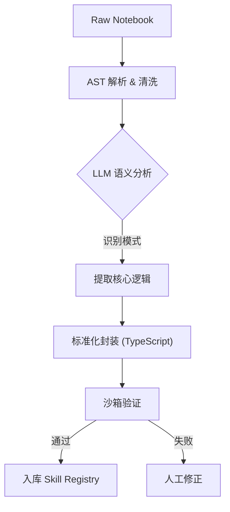

# 技术专题：Skill 提炼与 Agent 进化路线图

> [!NOTE]
> **版本**：v2.0  
> **状态**：✅ 已更新 - 基于官方资源  
> **关联文档**：[53-技术专题-Skills官方资源提炼方案](53-技术专题-Skills官方资源提炼方案.md)

> [!WARNING]
> **战略调整**：原计划使用Kaggle作为Skill来源已废弃，现转为使用Scikit-learn/Pandas/DuckDB等官方文档。

## 1. 核心理念：从 "Code" 到 "Capability"

我们不缺代码（Github/Kaggle 上有亿万行），缺的是**经过验证的、标准化的能力 (Capabilities)**。

Skill 提炼的核心是将**非结构化的 Notebook 代码** 转化为 **结构化的、可复用的 atomic function**。

---

## 2. 自动化提炼流水线 (The Extraction Pipeline)

我们构建一个半自动化的 "Skill Refinery"：



### 2.1 步骤详解

#### Step 1: 语义分块 (Semantic Chunking)
*   **输入**：一个 500 行的 `titanic_eda.ipynb`。
*   **处理**：即不是按行，也不是按 Cell，而是按**逻辑块**切分。
    *   Block A: 数据加载与预览
    *   Block B: 缺失值补全（Age字段）
    *   Block C: 特征工程（提取 Title）
    *   Block D: 可视化（生存率 vs 舱位）

#### Step 2: 模式识别 (Pattern Recognition)
*   **LLM Prompt**: "这段代码在做什么？是否具有通用性？"
*   **判定**：
    *   `Block B` (特定字段补全) -> **Too Specific** (丢弃)
    *   `Block D` (分组柱状图) -> **Generic Skill** (保留，提取为 `viz_plot_survival_rate`)

#### Step 3: 泛化重写 (Generalization)
*   将硬编码变量（`df['Age']`）替换为参数（`df[columnName]`）。
*   将 `plt.show()` 替换为返回 ECharts JSON 配置。

**输出示例**：
```typescript
// 原始 Kaggle 代码：sns.barplot(x='Pclass', y='Survived', data=train_df)
// ↓↓↓
// 提炼后的 Skill
export const VIZ_GROUP_BAR: SkillDefinition = {
  name: 'viz_group_bar',
  description: '绘制分组柱状图，展示类别与数值的关系',
  parameters: { x: 'string', y: 'string', table: 'string' }
};
```

---

## 3. Agent 进化：行为克隆 (Behavior Cloning)

拥有了 Skills 库只是第一步，Agent 需要知道 **"在什么场景下，组合哪些 Skills，解决什么问题"**。

### 3.1 什么是 "专家直觉"？
专家看到 "泰坦尼克数据"，脑子里会蹦出一条**思维链 (Chain of Thought)**：
1.  先看 `info()` 查缺失值。
2.  `Cabin` 缺失太多，不仅要删，还要建一个 `HasCabin` 特征。
3.  `Name` 看起来没用，但可以提取 `Mr/Mrs` 头衔。

### 3.2 训练/微调策略

我们不需要训练一个全新的大模型，而是训练一个 **"SOP (标准作业程序) 引擎"**。

#### 策略 A: In-Context Learning (RAG) - **低成本，即刻可用**
*   建立一个 **"场景 - 案例库" (Scenario Vector DB)**。
*   当用户问 "分析一下客户流失" 时：
    1.  RAG 检索 Kaggle 上 "Customer Churn" 相关的 Top 3 Notebooks 的**摘要**。
    2.  Prompt Inject: "参考专家处理流失问题的思路：先看 Tenure 分布，再看 Contract 类型..."
    3.  LLM 生成执行计划。

#### 策略 B: SFT (Supervised Fine-Tuning) - **高性能，壁垒高**
*   **数据集构建**：
    *   Input: "分析这个数据集 [columns: ...]"
    *   Output (Thinking): "这是一个分类问题。首先检查目标变量平衡性..."
    *   Output (Action): `call(check_balance); call(viz_correlation); ...`
*   使用 Qwen-7B / DeepSeek-Lite 进行微调，专门强化 **Tool Calling** 和 **Data Science Reasoning** 能力。

---

## 4. 实施路线建议

1.  **冷启动 (Manual Mode)**：
    *   人工挑选 10 个经典 Kaggle 案例。
    *   人肉提炼 20 个通用 Skills。
    *   硬编码写入 `src/services/skills/builtins`。
    
2.  **半自动化 (Copilot Mode)**：
    *   开发一个内部工具 "Skill Miner"。
    *   开发者输入 Notebook URL，工具自动生成 "Draft Skill"，人工 Review 入库。

3.  **全自动化 (Auto Mode)**：
    *   Agent 自我进化循环。

---

## 5. 总结

核心不是"搬运代码"，而是**"提取逻辑"**。
Agent 的进化不是"变聪明了"，而是**"见过的世面（Cases）多了"**。
通过建立这套 Pipeline，DataPrism 将从一个单纯的工具，变成一个**"拥有群体智慧的数据科学家"**。
