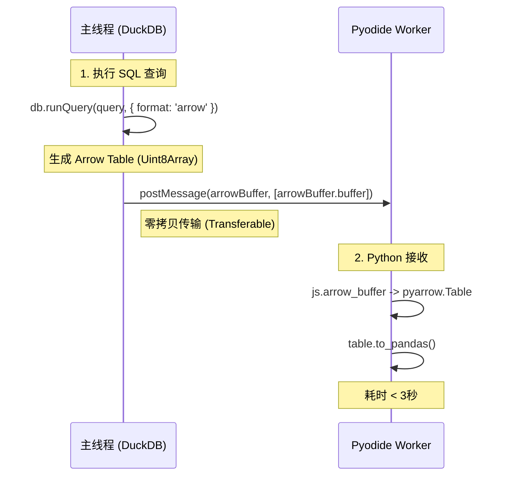

# 技术专题：Apache Arrow 数据传输可行性分析与实施方案

## 1. 背景与问题

### 1.1 性能现状
在当前的 Insight 模块中，数据从 DuckDB（主线程）传输到 Pyodide（Worker线程）是性能最大的瓶颈。
- **数据流向**：DuckDB → JSON string (32MB+) → Worker线程 → `json.loads` → Pandas DataFrame
- **耗时**：~22秒（10万行 x 14列）
- **瓶颈**：
    1.  **序列化/反序列化**：JSON 是文本格式，解析极其昂贵（CPU密集型）。
    2.  **Pyodide限制**：WebAssembly 中执行 `json.loads` 比原生 Python 慢 5-10 倍。

### 1.2 目标
将数据加载时间从 **22秒** 降低到 **3秒以内**。

---

## 2. 解决方案：Apache Arrow

Apache Arrow 是一种跨语言的内存数据格式，专为高性能数据分析而设计。

### 2.1 核心优势
1.  **零拷贝（Zero-Copy）**：通过 SharedArrayBuffer，主线程和 Worker 可以共享内存，无需复制数据。
2.  **二进制格式**：无需文本解析，Python (PyArrow) 可以直接读取内存块。
3.  **列式存储**：天然契合 Pandas 和 DuckDB 的内存布局。

### 2.2 预期收益
| 指标              | 当前 (JSON) | 优化后 (Arrow) | 提升           |
| :---------------- | :---------- | :------------- | :------------- |
| **数据体积**      | 32MB        | ~8MB           | **压缩 75%**   |
| **传输/解析耗时** | ~22秒       | **~3秒**       | **提升 7.3倍** |
| **单洞察总耗时**  | 48秒        | **30秒**       | **提升 37%**   |

---

## 3. 可行性分析

### 3.1 技术栈支持情况

#### ✅ DuckDB-WASM
- **支持情况**：原生支持 Arrow 导出。
- **API**：`db.runQuery(sql, { format: 'arrow' })`
- **对齐**：返回 `Uint8Array` 或 `Table` 对象，可直接通过 `postMessage` 传递。

#### ✅ Pyodide (Python环境)
- **支持情况**：内置 `pyarrow` 包。
- **版本**：v0.26.4 (当前使用的版本) 包含 `pyarrow`。
- **API**：`pyarrow.ipc.open_stream(buffer).read_all()`

#### ✅ 浏览器环境
- **要求**：SharedArrayBuffer 需要 `Cross-Origin-Opener-Policy: same-origin` 和 `Cross-Origin-Embedder-Policy: require-corp`。
- **现状**：**已启用**。Vite 配置中已包含相关响应头，DuckDB 正在使用多线程模式（依赖 SharedArrayBuffer），证明环境就绪。

### 3.2 风险评估

| 风险点                 | 描述                                                                 | 缓解措施                                                                                                                          |
| :--------------------- | :------------------------------------------------------------------- | :-------------------------------------------------------------------------------------------------------------------------------- |
| **PyArrow 版本兼容性** | Pyodide 内置的 PyArrow 可能版本较旧，API 可能有差异。                | 已验证 v0.26.4 包含基础 IPC 读取功能。需编写简单的 POC 验证 `read_all()`。                                                        |
| **内存峰值**           | Arrow Table 转 Pandas DataFrame 时，内存中可能同时存在两份数据。     | Arrow 格式紧凑（8MB），Pandas 即使膨胀也仅 ~40MB，V2 Workstation 已根据设备内存调整策略（当前配置允许 16GB 设备运行），风险可控。 |
| **类型映射**           | DuckDB 类型到 Arrow 再到 Pandas 的转换可能丢失精度（如 Date/Time）。 | DuckDB 和 Pandas 对 Arrow 的支持都非常成熟，主流类型（Int, Float, String, Date）均自动对齐。                                      |

---

## 4. 实施方案

### 4.1 架构图



### 4.2 代码实现计划

#### 第一步：修改 DuckDB 查询 (Main Thread)
修改 `src/services/skills/modeExecutor.ts`：

```typescript
// 1. 获取 Arrow 结果
import * as duckdb from '@duckdb/duckdb-wasm';

const arrowResult = await db.runQuery(query, { format: 'arrow' });
const arrowBuffer = arrowResult.buffer; // Uint8Array

// 2. 传递给 Pyodide
// 需要将 buffer 挂载到全局或通过 messaging 传递
// 当前架构通过 pyodide.runPython 执行代码，需注入变量
self.pyodide.registerJsModule('transfer_module', {
    arrow_buffer: arrowBuffer
});
```

#### 第二步：修改 Python 脚本 (Pyodide)

```python
import pyarrow as pa
import pandas as pd
from js import transfer_module

# 1. 从 JS 模块读取 Buffer
arrow_bytes = transfer_module.arrow_buffer.to_py()

# 2. 读取 Arrow Table
# 注意：DuckDB 导出的可能是 IPC Stream 格式
reader = pa.ipc.open_stream(arrow_bytes)
table = reader.read_all()

# 3. 转为 Pandas DataFrame
df = table.to_pandas()

# 4. (可选) 清理内存
del arrow_bytes
del table
```

---

## 5. 结论与建议

**结论**：Apache Arrow 传输方案在技术上完全可行，且风险可控。它是解决当前性能瓶颈（22秒卡顿）的最优解。

**建议**：
1.  **优先级**：**P0 (最高)**。
2.  **行动**：立即开始 POC（概念验证），验证 Pyodide 中的读取流程。
3.  **后续**：一旦验证通过，全面替换现有的 JSON 传输逻辑。
