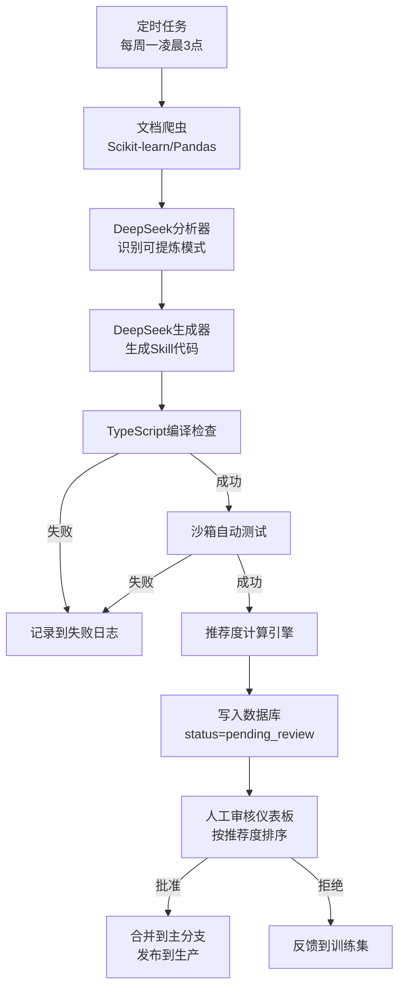

# 技术专题：Skills 全自动提炼流水线

> [!NOTE]
> **版本**：v1.0  
> **状态**：✅ 推荐方案（AI-Driven）  
> **作者**：DataPrism Team  
> **更新日期**：2025-12-22

---

## 1. 设计理念

**核心原则**：**AI负责生产，人工负责质检**

传统方案的问题：
- ❌ 人工提炼效率低（每个Skill需30-60分钟）
- ❌ 质量不稳定（依赖个人理解）
- ❌ 难以规模化（50个Skill需2-3周）

全自动流水线优势：
- ✅ **24/7持续运行**：定时任务自动抓取、生成、验证
- ✅ **推荐度排序**：人工只审核高分Skill（>80分），效率提升10倍
- ✅ **可追溯**：每个Skill都有完整的生成日志和测试报告

---

## 2. 系统架构



---

## 3. 核心组件设计

### 3.1 文档爬虫（Scraper）

**目标**：每周自动抓取官方文档的更新内容

**实现**：`scripts/skill-pipeline/01-scraper.ts`

```typescript
import axios from 'axios';
import cheerio from 'cheerio';
import fs from 'fs';

interface DocSource {
  name: string;
  baseUrl: string;
  selector: string; // CSS选择器，定位代码块
}

const SOURCES: DocSource[] = [
  {
    name: 'scikit-learn',
    baseUrl: 'https://scikit-learn.org/stable/modules',
    selector: 'div.highlight pre'
  },
  {
    name: 'pandas',
    baseUrl: 'https://pandas.pydata.org/docs/user_guide/cookbook.html',
    selector: 'div.highlight pre'
  }
];

async function scrapeDoc(source: DocSource): Promise<string[]> {
  logger.log('Skills', `爬取文档`, { source: source.name });
  
  const response = await axios.get(source.baseUrl);
  const $ = cheerio.load(response.data);
  
  const codeBlocks: string[] = [];
  $(source.selector).each((i, elem) => {
    const code = $(elem).text();
    if (code.length > 50 && code.length < 5000) { // 过滤过短/过长的代码
      codeBlocks.push(code);
    }
  });
  
  logger.log('Skills', `抓取完成`, { count: codeBlocks.length });
  return codeBlocks;
}

// 每周定时任务
async function weeklyScraperJob() {
  for (const source of SOURCES) {
    const blocks = await scrapeDoc(source);
    
    // 保存到临时文件
    fs.writeFileSync(
      `./tmp/scraped/${source.name}_${Date.now()}.json`,
      JSON.stringify(blocks, null, 2)
    );
  }
}
```

---

### 3.2 DeepSeek分析器（Analyzer）

**目标**：识别哪些代码块值得提炼为Skill

**Prompt模板**：

```typescript
const ANALYSIS_PROMPT = `
你是一个数据科学专家，负责分析Python代码片段，判断是否适合转化为DataPrism的Skill。

【代码片段】
\`\`\`python
{code_block}
\`\`\`

【判断标准】
1. 是否是通用的数据处理逻辑？（而非特定数据集的硬编码）
2. 是否可以用DuckDB SQL实现？（不依赖复杂的Python库）
3. 是否在数据分析中常用？（使用频率高）
4. 代码复杂度是否适中？（避免过于简单或复杂）

【输出格式（严格JSON）】
{
  "is_suitable": true,
  "skill_name": "clean_fill_median",
  "category": "data_cleaning", // data_cleaning | data_analysis | visualization
  "priority": "high", // high | medium | low
  "reason": "中位数填补是数据清洗的标准操作，适用性广",
  "estimated_usage_frequency": 85, // 0-100，预估使用频率
  "sql_feasibility": 95 // 0-100，用SQL实现的可行性
}
`;

async function analyzeCodeBlock(code: string): Promise<AnalysisResult | null> {
  const response = await llmAdapter.call(
    ANALYSIS_PROMPT.replace('{code_block}', code),
    'deepseek',
    process.env.DEEPSEEK_API_KEY
  );
  
  try {
    const result = JSON.parse(response.content);
    
    // 只有高优先级且SQL可行性>70的才继续
    if (result.is_suitable && result.priority === 'high' && result.sql_feasibility > 70) {
      return result;
    }
  } catch (error) {
    logger.error('Skills', 'JSON解析失败', error);
  }
  
  return null; // 不合适的代码块直接过滤
}
```

---

### 3.3 DeepSeek生成器（Generator）

**目标**：为通过分析的代码块生成完整Skill实现

**Prompt模板**：

```typescript
const GENERATION_PROMPT = `
你是一个高级TypeScript开发者，负责将Python数据处理代码转换为DataPrism的Skill。

【原始代码】
\`\`\`python
{original_code}
\`\`\`

【任务要求】
1. 生成TypeScript的SkillDefinition
2. 使用DuckDB SQL实现核心逻辑（不能用Python/Pandas）
3. 编写完整的单元测试
4. 添加BSD 3-Clause License注释
5. 确保代码可以直接在WASM环境运行

【输出格式（严格JSON，代码用字符串）】
{
  "skill_definition": "export const CLEAN_FILL_MEDIAN: SkillDefinition = { ... }",
  "implementation": "async function executeCleanFillMedian(args) { ... }",
  "unit_test": "describe('clean_fill_median', () => { ... })",
  "license_comment": "/**\\n * License: BSD 3-Clause\\n * Source: https://...\\n */",
  "estimated_complexity": 3, // 1-10，代码复杂度
  "dependencies": ["DuckDBEngine"] // 依赖的其他模块
}

【关键约束】
- SQL必须是DuckDB方言（支持PERCENTILE_CONT、窗口函数等）
- 参数必须是 { table: string, column: string } 形式
- 测试必须创建临时表并验证结果
- License注释必须包含原始文档URL
`;

async function generateSkill(analysis: AnalysisResult, code: string): Promise<GeneratedSkill> {
  const response = await llmAdapter.call(
    GENERATION_PROMPT
      .replace('{original_code}', code),
    'deepseek',
    process.env.DEEPSEEK_API_KEY
  );
  
  const skill = JSON.parse(response.content);
  
  // 保存到数据库
  await db.query(`
    INSERT INTO generated_skills (
      name, definition, implementation, test, license, 
      complexity, status, created_at
    ) VALUES (?, ?, ?, ?, ?, ?, 'pending_validation', NOW())
  `, [
    analysis.skill_name,
    skill.skill_definition,
    skill.implementation,
    skill.unit_test,
    skill.license_comment,
    skill.estimated_complexity
  ]);
  
  return skill;
}
```

---

### 3.4 自动化验证器（Validator）

**目标**：在沙箱环境中自动测试生成的Skill

**实现**：`scripts/skill-pipeline/04-validator.ts`

```typescript
interface ValidationResult {
  passed: boolean;
  score: number; // 0-100
  details: {
    syntaxCheck: boolean;
    testPassed: boolean;
    performance: number; // ms
    licenseCheck: boolean;
  };
  errors: string[];
}

async function validateSkill(skill: GeneratedSkill): Promise<ValidationResult> {
  const result: ValidationResult = {
    passed: false,
    score: 0,
    details: {
      syntaxCheck: false,
      testPassed: false,
      performance: 0,
      licenseCheck: false
    },
    errors: []
  };
  
  // 1. TypeScript语法检查
  try {
    await typescript.transpileModule(skill.definition + skill.implementation, {
      compilerOptions: { target: 'ES2020' }
    });
    result.details.syntaxCheck = true;
  } catch (error) {
    result.errors.push(`语法错误: ${error.message}`);
    return result; // 语法错误直接失败
  }
  
  // 2. 单元测试
  try {
    const testStart = Date.now();
    const testResult = await runTestInSandbox(skill.unit_test);
    result.details.performance = Date.now() - testStart;
    result.details.testPassed = testResult.success;
    
    if (!testResult.success) {
      result.errors.push(`测试失败: ${testResult.error}`);
    }
  } catch (error) {
    result.errors.push(`测试执行失败: ${error.message}`);
  }
  
  // 3. License合规检查
  result.details.licenseCheck = 
    skill.license.includes('BSD 3-Clause') || 
    skill.license.includes('MIT') ||
    skill.license.includes('Apache 2.0');
  
  if (!result.details.licenseCheck) {
    result.errors.push('缺少License注释');
  }
  
  // 判定是否通过
  result.passed = 
    result.details.syntaxCheck && 
    result.details.testPassed && 
    result.details.performance < 3000 && 
    result.details.licenseCheck;
  
  return result;
}

// 沙箱测试（使用独立的Worker）
async function runTestInSandbox(testCode: string): Promise<{ success: boolean; error?: string }> {
  const worker = new Worker('./sandbox-worker.js');
  
  return new Promise((resolve) => {
    worker.postMessage({ code: testCode });
    
    worker.on('message', (msg) => {
      resolve({ success: msg.success, error: msg.error });
      worker.terminate();
    });
    
    // 超时保护
    setTimeout(() => {
      worker.terminate();
      resolve({ success: false, error: 'Timeout' });
    }, 10000);
  });
}
```

---

### 3.5 推荐度计算引擎（Scorer）

**目标**：为通过验证的Skill计算推荐度（0-100分）

**算法**：

```typescript
function calculateRecommendationScore(
  skill: GeneratedSkill,
  validation: ValidationResult,
  analysis: AnalysisResult
): number {
  let score = 0;
  
  // 1. 测试质量（30分）
  if (validation.details.testPassed) {
    score += 30;
  } else {
    return 0; // 测试不通过，直接0分
  }
  
  // 2. 性能（20分）
  if (validation.details.performance < 500) {
    score += 20;
  } else if (validation.details.performance < 1500) {
    score += 15;
  } else if (validation.details.performance < 3000) {
    score += 10;
  }
  
  // 3. 代码复杂度（15分，越简单越好）
  const complexity = skill.complexity;
  if (complexity <= 3) {
    score += 15;
  } else if (complexity <= 5) {
    score += 10;
  } else if (complexity <= 7) {
    score += 5;
  }
  
  // 4. 预估使用频率（20分）
  score += Math.min(analysis.estimated_usage_frequency / 5, 20);
  
  // 5. SQL可行性（10分）
  score += Math.min(analysis.sql_feasibility / 10, 10);
  
  // 6. License合规（5分）
  if (validation.details.licenseCheck) {
    score += 5;
  }
  
  return Math.round(score);
}
```

**评分标准**：
- **90-100分**：极力推荐，可自动合并
- **80-89分**：推荐，人工快速审核即可
- **70-79分**：需仔细审核
- **60-69分**：谨慎，可能需要修改
- **<60分**：废弃

---

## 4. 人工审核仪表板

**界面设计**：一个简单的Web页面 `/internal/skill-review`

**功能**：

```tsx
// src/pages/internal/SkillReviewDashboard.tsx
export function SkillReviewDashboard() {
  const [skills, setSkills] = useState<PendingSkill[]>([]);
  
  useEffect(() => {
    fetch('/api/internal/pending-skills')
      .then(res => res.json())
      .then(data => setSkills(data));
  }, []);
  
  return (
    <div className="skill-review-dashboard">
      <h1>Skills 待审核队列</h1>
      
      <table>
        <thead>
          <tr>
            <th>名称</th>
            <th>推荐度</th>
            <th>分类</th>
            <th>生成时间</th>
            <th>操作</th>
          </tr>
        </thead>
        <tbody>
          {skills
            .sort((a, b) => b.score - a.score) // 按推荐度降序
            .map(skill => (
              <tr key={skill.id} className={getScoreClass(skill.score)}>
                <td>{skill.name}</td>
                <td>
                  <ScoreBadge score={skill.score} />
                  {skill.score >= 90 && <span>⭐ 极力推荐</span>}
                </td>
                <td>{skill.category}</td>
                <td>{formatDate(skill.createdAt)}</td>
                <td>
                  <button onClick={() => viewSkill(skill)}>查看详情</button>
                  <button onClick={() => approveSkill(skill)}>批准</button>
                  <button onClick={() => rejectSkill(skill)}>拒绝</button>
                </td>
              </tr>
            ))}
        </tbody>
      </table>
    </div>
  );
}

// 根据推荐度设置行样式
function getScoreClass(score: number): string {
  if (score >= 90) return 'score-excellent';
  if (score >= 80) return 'score-good';
  if (score >= 70) return 'score-ok';
  return 'score-low';
}
```

**CSS样式**（使用CSS变量）：

```css
/* src/pages/internal/SkillReviewDashboard.css */
.skill-review-dashboard {
  padding: var(--spacing-lg);
  background: var(--color-bg-primary);
}

.score-excellent {
  background: var(--color-success-light);
  border-left: 4px solid var(--color-success);
}

.score-good {
  background: var(--color-info-light);
  border-left: 4px solid var(--color-info);
}

.score-ok {
  background: var(--color-warning-light);
  border-left: 4px solid var(--color-warning);
}

.score-low {
  background: var(--color-error-light);
  border-left: 4px solid var(--color-error);
  opacity: 0.6;
}
```

---

## 5. 定时任务配置

**使用Node-Cron**：

```typescript
// scripts/skill-pipeline/scheduler.ts
import cron from 'node-cron';

// 每周一凌晨3点执行
cron.schedule('0 3 * * 1', async () => {
  logger.group('Skills', '定时任务开始');
  
  try {
    // Step 1: 爬取文档
    const scrapedBlocks = await weeklyScraperJob();
    logger.log('Skills', `爬取完成`, { count: scrapedBlocks.length });
    
    // Step 2: 分析代码块
    const analyses = [];
    for (const block of scrapedBlocks) {
      const analysis = await analyzeCodeBlock(block.code);
      if (analysis) {
        analyses.push({ analysis, code: block.code });
      }
    }
    logger.log('Skills', `分析完成`, { suitable: analyses.length });
    
    // Step 3: 生成Skill
    const generated = [];
    for (const { analysis, code } of analyses) {
      const skill = await generateSkill(analysis, code);
      generated.push(skill);
    }
    logger.log('Skills', `生成完成`, { count: generated.length });
    
    // Step 4: 验证
    for (const skill of generated) {
      const validation = await validateSkill(skill);
      
      if (validation.passed) {
        const score = calculateRecommendationScore(skill, validation, analysis);
        
        await db.query(`
          UPDATE generated_skills
          SET status = 'pending_review', recommendation_score = ?
          WHERE id = ?
        `, [score, skill.id]);
        
        logger.log('Skills', `Skill验证通过`, { name: skill.name, score });
      } else {
        await db.query(`
          UPDATE generated_skills
          SET status = 'failed', errors = ?
          WHERE id = ?
        `, [JSON.stringify(validation.errors), skill.id]);
      }
    }
    
    logger.log('Skills', '定时任务完成');
  } catch (error) {
    logger.error('Skills', '定时任务失败', error);
  } finally {
    logger.groupEnd();
  }
});

logger.log('Skills', '定时任务已启动（每周一凌晨3点）');
```

---

## 6. 数据库Schema

```sql
CREATE TABLE generated_skills (
  id INTEGER PRIMARY KEY AUTOINCREMENT,
  name VARCHAR(100) NOT NULL,
  category VARCHAR(50), -- data_cleaning | data_analysis | visualization
  definition TEXT NOT NULL, -- TypeScript Skill定义
  implementation TEXT NOT NULL, -- 实现代码
  unit_test TEXT NOT NULL, -- 单元测试
  license_comment TEXT NOT NULL, -- License注释
  complexity INTEGER, -- 1-10
  recommendation_score INTEGER DEFAULT 0, -- 0-100
  status VARCHAR(20) DEFAULT 'pending_validation', -- pending_validation | pending_review | approved | rejected | failed
  errors TEXT, -- JSON格式的错误信息
  created_at TIMESTAMP DEFAULT CURRENT_TIMESTAMP,
  reviewed_at TIMESTAMP,
  reviewer VARCHAR(50)
);

CREATE INDEX idx_status_score ON generated_skills(status, recommendation_score DESC);
```

---

## 7. 实施时间线

### Week 1: 基础设施搭建
- [ ] Day 1-2: 搭建文档爬虫 + DeepSeek调用框架
- [ ] Day 3: 实现自动化验证器
- [ ] Day 4-5: 开发人工审核仪表板

### Week 2: Prompt优化与测试
- [ ] Day 1-2: 用10个样本测试Prompt，优化生成质量
- [ ] Day 3-4: 完善推荐度算法
- [ ] Day 5: 端到端测试全流程

### Week 3: 试运行
- [ ] Day 1: 第一次定时任务执行，生成10-20个Skill
- [ ] Day 2-4: 人工审核第一批Skill，统计数据
- [ ] Day 5: 根据反馈优化Prompt和评分算法

### Week 4: 正式上线
- [ ] 配置每周定时任务
- [ ] 建立监控报警（如果生成失败率>50%）
- [ ] 文档归档

---

## 8. 成功标准

- [ ] **自动化率**：90%的Skill由AI生成（人工只需审核）
- [ ] **质量**：推荐度>80的Skill，人工批准率>90%
- [ ] **效率**：每周自动生成5-10个新Skill
- [ ] **覆盖率**：3个月内积累100个高质量Skill

---

## 9. 风险与应对

| 风险 | 应对策略 |
|------|---------|
| **DeepSeek生成质量不稳定** | 建立反馈循环，持续优化Prompt |
| **SQL转换失败率高** | 增加"SQL可行性"预判断步骤 |
| **License注释遗漏** | 在验证器中强制检查 |
| **人工审核滞后** | 推荐度>90的自动合并（需开关控制） |

---

## 10. 未来优化方向

1. **强化学习**：根据人工批准/拒绝的反馈，微调DeepSeek的生成策略
2. **A/B测试**：同时生成多个Skill变体，让测试自动选择最优版本
3. **社区贡献**：开放Skill提交API，允许外部开发者贡献

---

**附录**：
- [DeepSeek API文档](https://platform.deepseek.com/docs)
- [Node-Cron使用指南](https://github.com/node-cron/node-cron)
