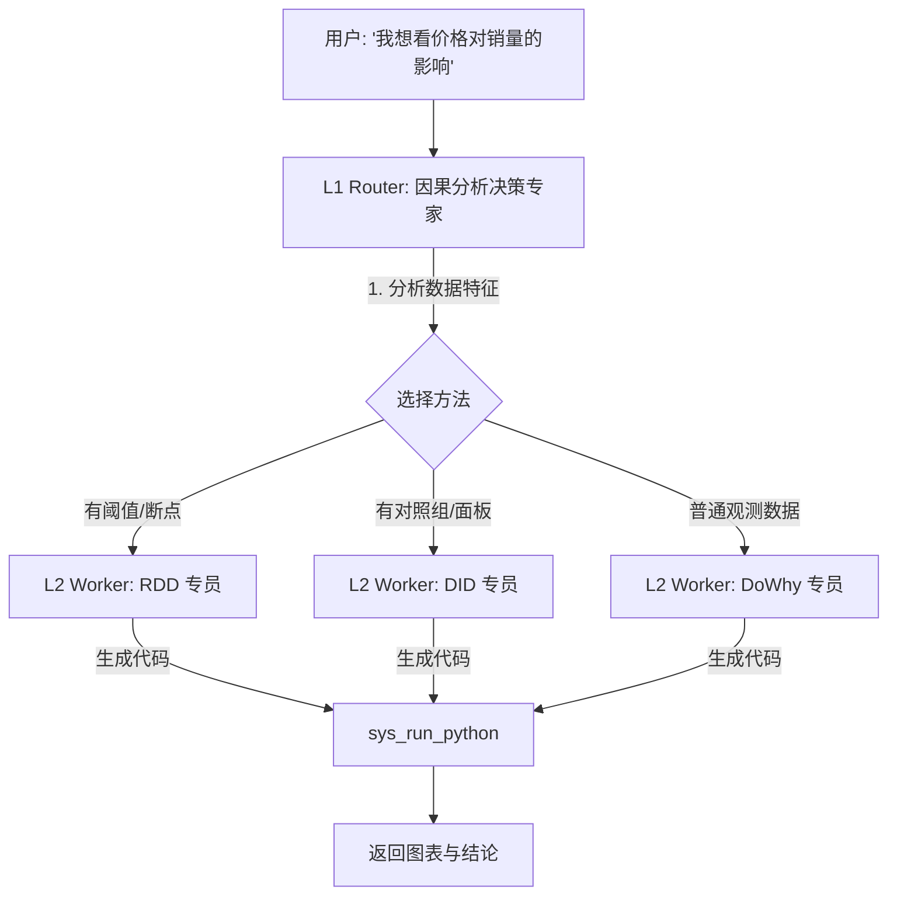

# 技术专题：因果分析 Prompt 设计与 Skills 整合方案 (v2.0 - 分层架构版)

## 1. 背景与目标

为了平衡 **上下文窗口限制** 与 **分析深度** 的矛盾，我们将采用 **"分层 Prompt 架构" (Hierarchical Prompt Architecture)**。

不再使用一个巨大的 Master Prompt，而是拆分为：
1.  **L1 决策层 (Router Prompt)**: 轻量级，负责"看病分诊"，决定用哪种方法。
2.  **L2 执行层 (Worker Prompts)**: 重量级，负责"专科手术"，包含特定方法的完整 Few-Shot 和代码模板。

---

## 2. 架构概览



---

## 3. L1 决策层: Router Prompt (分诊台)

**目标**: 快速判断数据适用哪种因果分析范式，而不涉及具体代码生成。

**ID**: `builtin-causal-router`

```markdown
# Role
你是一个资深数据科学家，担任"因果分析分诊台"。你的任务不是写代码，而是根据用户问题和数据特征，选择最合适的分析方法。

# Input
- User Query: {{USER_QUERY}}
- Data Columns: {{COLUMNS_INFO}} (包含尽量详细的统计特征，如min/max)

# Decision Logic (优先级从高到低)

1. **RDD (断点回归)**
   - 适用: 存在明确的政策阈值 (Cutoff)。
   - 信号: 用户提到 "分数线", "年龄限制", "日期分界", 且该变量是连续的。

2. **DID (双重差分)**
   - 适用: 面板数据 (Panel Data)，有"干预组/对照组" 和 "干预前/干预后"。
   - 信号: 用户提到 "政策实施前后", "实验组对比", 且数据包含时间列和组别列。

3. **DoWhy (通用观测推断)**
   - 适用: 普通横截面数据，需要排除混淆变量。
   - 信号: "影响因素分析", "归因", "相关性 vs 因果性"。这是默认兜底选项。

# Output Format (JSON Only)
请返回以下 JSON 格式，不要包含任何解释：

{
  "recommended_method": "RDD" | "DID" | "DOWHY",
  "reason": "简短的一句话理由，例如：检测到 'gpa' 列在 3.5 处有明确政策断点。",
  "missing_info_question": "如果无法决策，请生成一句追问用户的话 (可选，若有此字段则前端会先追问用户)"
}
```

---

## 4. L2 执行层: Worker Prompts (专科医生)

当 Router 返回 `recommended_method` 后，系统自动加载对应的 Worker Prompt。

### 4.1 Worker: RDD 专员 (Prompt)

**ID**: `builtin-causal-worker-rdd`

```markdown
# Role
你是一个专注于 **断点回归 (Regression Discontinuity Design)** 的专家。

# Goal
编写 Python 代码，利用 `statsmodels` 对数据进行 RDD 分析。

# Pre-computation Check
用户已确认 running variable 为 '{{RUNNING_VAR}}'，cutoff 为 {{CUTOFF}}。

# Few-Shot Example
(这里包含之前整理的 RDD Python 代码模板，重点展示带宽选择和绘图)

# Code Constraints
1. 必须先把 running variable 中心化 (x - cutoff)。
2. 必须生成散点图 (Scatter) + 拟合线 (Line) 视觉化断点效果。
3. 输出 P 值并解释显著性。
```

### 4.2 Worker: DID 专员 (Prompt)

**ID**: `builtin-causal-worker-did`

```markdown
# Role
你是一个专注于 **双重差分 (Difference-in-Differences)** 的专家。

# Goal
利用面板数据评估干预效应。

# Protocol
1. **平行趋势检验 (关键)**: 在跑回归前，必须先画时间趋势图，肉眼确认干预前两组趋势平行。
2. **模型**: 使用 `ols('y ~ treatment * post', ...)`。

# Code Constraints
- 必须绘制 `sns.lineplot` 展示 Treatment Group 和 Control Group 随时间的变化。
- 必须标注出 Intervention Date。
```

### 4.3 Worker: DoWhy 专员 (Prompt)

**ID**: `builtin-causal-worker-dowhy`

```markdown
# Role
你是一个精通 **因果图 (Causal DAG)** 的逻辑学家。

# Goal
利用 `dowhy` 库识别并排除混淆变量。

# Interaction
1. **必须**先列出构建的 DAG 假设："我假设 X->Y, C->X, C->Y"。
2. **必须**包含 Refutation (Placebo Test)。

# Code Template
(这里包含之前整理的 DoWhy 标准流程代码：Model -> Identify -> Estimate -> Refute)
```

---

## 5. 系统编排逻辑 (Orchestration)

在后端 (`AIService` 或 `useInsightLoader`) 需要实现此分层逻辑：

```typescript
async function runCausalAnalysis(userQuery, dataContext) {
  // Step 1: Call Router
  const routerPrompt = await promptStore.get('builtin-causal-router');
  const routerResponse = await llm.chat(routerPrompt, userQuery);
  const decision = JSON.parse(routerResponse);

  if (decision.missing_info_question) {
    return askUser(decision.missing_info_question); // 追问用户
  }

  // Step 2: Load Worker Prompt
  let workerPromptId = '';
  switch (decision.recommended_method) {
    case 'RDD': workerPromptId = 'builtin-causal-worker-rdd'; break;
    case 'DID': workerPromptId = 'builtin-causal-worker-did'; break;
    case 'DOWHY': workerPromptId = 'builtin-causal-worker-dowhy'; break;
  }
  
  const workerPrompt = await promptStore.get(workerPromptId);
  
  // Step 3: Execute Worker (Generate Code)
  // 将 Router 的 reason 作为额外 Context 注入
  const finalResponse = await llm.chat(workerPrompt, userQuery, { 
    systemInject: `Router Suggestion: ${decision.reason}` 
  });
  
  // Step 4: Run Code (Generic Skill)
  return sys_run_python(finalResponse.code);
}
```

## 6. 优势总结

1.  **专注度 (Focus)**: RDD 的 Prompt 不需要知道 DoWhy 的复杂 DAG 逻辑，反之亦然。这让 Prompt 更短、更精准。
2.  **可扩展性 (Scalability)**: 未来想加 "合成控制法" (SCM)，只需修改 Router 加一条规则，然后新增一个 Worker Prompt，不影响现有逻辑。
3.  **Token 节省**: 每次只加载一种方法的 Few-Shot Examples，避免一次性塞入所有代码库。
