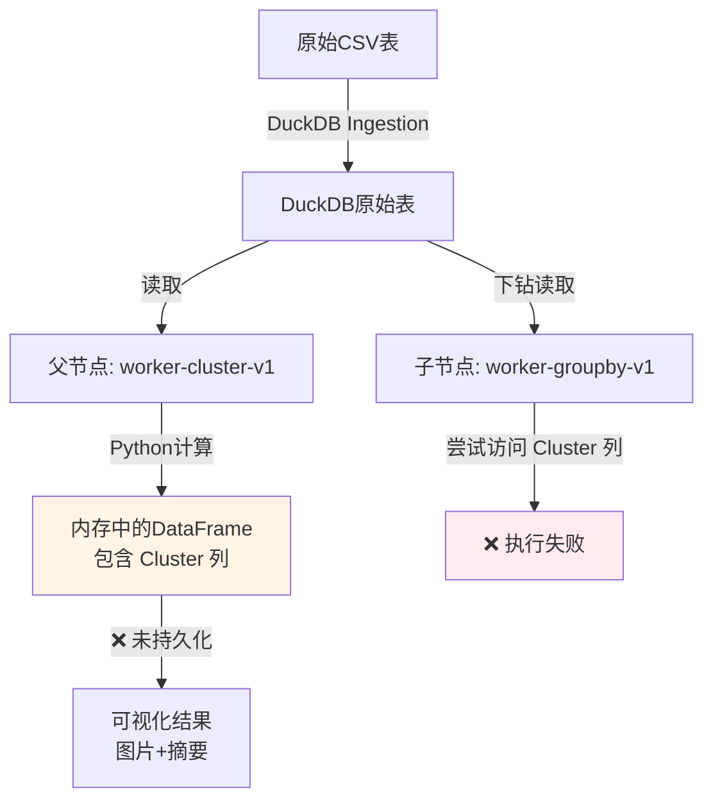
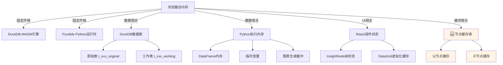

# 节点缓存技术选型分析

## 1. 问题背景

### 1.1 核心问题
下钻功能失败的根本原因：
- **父节点**执行 `worker-cluster-v1` 时，Python在内存中生成 `Cluster` 列
- **子节点**下钻执行 `worker-groupby-v1` 时，从DuckDB原始表读取数据
- 原始表中**不包含**父节点生成的 `Cluster` 列
- 导致执行失败：`ValueError: 列不存在: Cluster`

### 1.2 数据流示意图



### 1.3 需求定义
设计一套**节点缓存机制**，满足以下要求：
1. **持久化**父节点生成的列（如`Cluster`、`dbscan_label`等）
2. **下钻复用**：子节点可以访问父节点的缓存数据
3. **EDA闭环复用**：静默触发的后续分析可以基于缓存构建上下文
4. **未来兼容性**：支持从Web (Pyodide) 平滑迁移到Desktop (Native Python)

---

## 2. 技术方案对比

### 方案A：IndexedDB

#### 核心思路
使用浏览器原生的IndexedDB API存储节点缓存数据。

#### 数据结构设计
```typescript
interface NodeCacheEntry {
    nodeId: string;           // 节点唯一ID
    promptId: string;         // Prompt类型
    tableName: string;        // 原始表名
    timestamp: number;        // 生成时间
    
    dataFrame: {
        columns: string[];    // 所有列名（原始列 + 生成列）
        rows: any[][];        // 数据内容
        generatedColumns: string[];  // 新生成的列名
    };
    
    params: Record<string, unknown>;
}
```

#### 实施步骤
1. 创建 `src/services/insights/nodeCache.ts`（IndexedDB封装）
2. 修改 `executor.ts`：Python执行后，调用 `nodeCache.set()` 保存结果
3. 修改 `InsightChainFlow.tsx`：下钻时，调用 `nodeCache.get()` 加载父节点缓存
4. 修改 `pyodideWorker.ts`：支持从缓存数据合并到DataFrame

#### 优势
- ✅ **浏览器原生支持**，无需额外依赖
- ✅ **存储容量大**（通常50MB+，具体视浏览器）
- ✅ **异步API**，不阻塞UI渲染
- ✅ **CRUD性能好**，适合频繁读写

#### 劣势
- ❌ **Web Only**：Desktop环境需要通过Electron的renderer process访问
- ❌ **浏览器清理风险**：用户清除缓存后数据丢失
- ❌ **跨平台迁移成本高**：迁移到Desktop需重写为levelDB或SQLite

#### 未来兼容性评估
| 场景              | 支持度                   | 迁移成本          |
| ----------------- | ------------------------ | ----------------- |
| Web应用 (当前)    | ⭐⭐⭐⭐⭐                    | -                 |
| Electron Desktop  | ⭐⭐⭐ (需renderer process) | 中等              |
| Tauri Desktop     | ⭐⭐ (需编写Rust插件)      | 高                |
| Native Python后端 | ❌ 不适用                 | 极高 (需完全重写) |

---

### 方案B：DuckDB临时表 ⭐ **推荐方案**

#### 核心思路
将父节点的计算结果（包含生成列）写入DuckDB临时表，子节点通过SQL JOIN或直接查询读取。

#### 数据结构设计
```sql
-- 缓存表命名规则: cache_{nodeId}_result
CREATE TEMP TABLE cache_node_123_result AS
SELECT 
    原始列1, 原始列2, ...,  -- 来自原始表
    Cluster,                 -- 父节点生成的列
    _node_id,                -- 节点ID（元数据）
    _timestamp               -- 生成时间（元数据）
FROM (
    -- Python执行结果转为DuckDB表
)
```

#### 实施步骤
1. 修改 `pyodideWorker.ts`：
   - Python执行后，将 `df` 通过 Arrow IPC 写回DuckDB
   - 创建临时表：`CREATE TEMP TABLE cache_{nodeId}_result AS ...`
2. 修改 `executor.ts`：
   - 记录缓存表名到 `node.result.cacheTableName`
3. 修改 `InsightChainFlow.tsx`：
   - 下钻时，检查父节点的 `cacheTableName`
   - 如果存在，传递给executor：`context.parentCacheTable`
4. 修改 `pyodideWorker.ts`（Python数据读取）：
   ```python
   if parent_cache_table:
       # 从缓存表读取完整数据（包含生成列）
       df = await db.execute(f"SELECT * FROM {parent_cache_table}")
   else:
       # 从原始表读取
       df = await db.execute(f"SELECT * FROM {tableName}")
   ```

#### 优势
- ✅ **统一数据栈**：复用现有DuckDB基础设施，无需引入新技术
- ✅ **查询性能优越**：SQL JOIN、过滤、聚合比手动在JS中处理快
- ✅ **跨平台一致性**：DuckDB有WASM和Native版本，API高度一致
- ✅ **未来迁移成本低**：Desktop版只需切换底层DuckDB引擎（WASM → Native）
- ✅ **内存管理自动化**：临时表在session结束自动清理

#### 劣势
- ⚠️ **持久化问题**：`TEMP TABLE` 刷新页面后丢失
  - **解决方案**：改用普通表 + 定期清理策略
- ⚠️ **内存占用**：大数据集缓存可能占用较多内存
  - **解决方案**：只缓存下钻必需的列，或采样存储

#### 未来兼容性评估
| 场景              | 支持度                 | 迁移成本 |
| ----------------- | ---------------------- | -------- |
| Web应用 (当前)    | ⭐⭐⭐⭐⭐                  | -        |
| Electron Desktop  | ⭐⭐⭐⭐⭐ (DuckDB Node.js) | **极低** |
| Tauri Desktop     | ⭐⭐⭐⭐⭐ (DuckDB Rust)    | **极低** |
| Native Python后端 | ⭐⭐⭐⭐⭐ (DuckDB Python)  | **极低** |

> **关键优势**：无论是Web (DuckDB-WASM)、Electron (DuckDB Node.js)、Tauri (DuckDB Rust)，还是Native Python (DuckDB Python)，核心逻辑和SQL语句**完全一致**，只需切换底层引擎连接方式。

---

### 方案C：文件系统 (Parquet)

#### 核心思路
将节点缓存导出为Parquet文件，存储到本地文件系统或OPFS (Origin Private File System)。

#### 数据结构设计
```
/cache/
  ├── node_123_cluster.parquet  (包含生成的Cluster列)
  ├── node_124_dbscan.parquet
  └── metadata.json  (缓存索引)
```

#### 实施步骤
1. 修改 `pyodideWorker.ts`：
   - Python执行后，调用 `df.to_parquet()` 导出
   - 通过OPFS API保存到浏览器私有文件系统
2. 修改 `InsightChainFlow.tsx`：
   - 下钻时，从OPFS读取父节点的Parquet文件
   - 通过DuckDB的 `read_parquet()` 加载

#### 优势
- ✅ **标准化格式**：Parquet是业界标准，可被其他工具读取
- ✅ **压缩率高**：比JSON节省80%+空间
- ✅ **Desktop友好**：直接文件系统访问，无需适配层

#### 劣势
- ❌ **Web环境复杂**：需要OPFS支持（Chrome 86+，Safari 15.2+）
- ❌ **性能开销**：每次读取需文件I/O + 反序列化
- ❌ **缓存管理复杂**：需要手动清理过期文件

#### 未来兼容性评估
| 场景              | 支持度       | 迁移成本             |
| ----------------- | ------------ | -------------------- |
| Web应用 (当前)    | ⭐⭐⭐ (需OPFS) | -                    |
| Desktop           | ⭐⭐⭐⭐⭐        | 低（只需改文件路径） |
| Native Python后端 | ⭐⭐⭐⭐         | 低                   |

---

## 3. 综合评估矩阵

| 维度                    | IndexedDB    | **DuckDB临时表** ⭐       | Parquet文件   |
| ----------------------- | ------------ | ------------------------ | ------------- |
| **实施复杂度**          | 中等         | **低**（复用现有栈）     | 高            |
| **性能**                | 快           | **极快**（内存查询）     | 中等（需I/O） |
| **存储容量**            | 50MB+        | 受内存限制               | 不受限        |
| **Web兼容性**           | ⭐⭐⭐⭐⭐        | ⭐⭐⭐⭐⭐                    | ⭐⭐⭐           |
| **Desktop兼容性**       | ⭐⭐⭐          | ⭐⭐⭐⭐⭐                    | ⭐⭐⭐⭐⭐         |
| **Native Python兼容性** | ❌            | **⭐⭐⭐⭐⭐**                | ⭐⭐⭐⭐          |
| **代码复用性**          | 低（需重写） | **极高**（只需切换引擎） | 中等          |
| **维护成本**            | 中等         | **低**                   | 高            |

---

## 4. 推荐方案：DuckDB临时表

### 4.1 推荐理由
1. **架构一致性**：与现有DuckDB栈深度集成，无需引入新技术
2. **未来可扩展性**：从Web到Desktop的迁移成本**极低**
3. **性能优势**：内存查询比IndexedDB或文件I/O快一个数量级
4. **开发效率**：复用现有DuckDB知识和工具链

### 4.2 关键设计决策

#### 4.2.1 缓存表生命周期
- **临时表 vs 普通表**：
  - **推荐**：使用普通表 + TTL清理策略
  - **原因**：临时表在页面刷新后丢失，用户体验差
  - **清理策略**：
    - 超过1小时的缓存自动删除
    - 页面卸载时清理当前session的缓存
    - 定期检查（每5分钟）触发垃圾回收

#### 4.2.2 缓存粒度
- **Full DataFrame vs 增量列**：
  - **推荐**：存储完整DataFrame（原始列 + 生成列）
  - **原因**：简化下钻逻辑，避免JOIN操作错误
  - **优化**：对于大数据集（>100MB），只缓存下钻必需的列

#### 4.2.3 命名规范
```sql
-- 格式: cache_{sessionId}_{nodeId}
-- 示例: cache_1737_node_abc123
CREATE TABLE cache_1737_node_abc123 AS (...)
```

### 4.3 技术实现要点

#### 从Python写回DuckDB
```python
# pyodideWorker.ts 中的Python代码
import pyarrow as pa

# 执行分析逻辑...
df['Cluster'] = labels

# 将DataFrame转为Arrow Table
arrow_table = pa.Table.from_pandas(df)

# 通过Arrow IPC写回DuckDB
cache_table_name = f"cache_{session_id}_{node_id}"
await db.register_arrow(cache_table_name, arrow_table)
```

#### 下钻时读取缓存
```python
# 检查父节点缓存
if parent_cache_table:
    df = await db.execute(f"SELECT * FROM {parent_cache_table}")
else:
    df = await db.execute(f"SELECT * FROM {tableName}")
```

---

## 5. 工作量评估

### 5.1 核心改造模块

| 模块                 | 文件路径                                           | 改造范围                     | 工作量 |
| -------------------- | -------------------------------------------------- | ---------------------------- | ------ |
| **Python Worker**    | `src/workers/pyodideWorker.ts`                     | 添加DuckDB写回逻辑           | 4小时  |
| **Executor**         | `src/services/insights/executor.ts`                | 记录缓存表名到result         | 2小时  |
| **下钻流程**         | `src/components/insights/InsightChainFlow.tsx`     | 传递父节点缓存表名           | 3小时  |
| **缓存管理服务**     | `src/services/insights/cacheManager.ts` (新增)     | TTL清理、容量监控            | 6小时  |
| **ExecutionContext** | `src/services/insights/executionContextBuilder.ts` | 添加 `parentCacheTable` 字段 | 1小时  |
| **类型定义**         | `src/types/insightTree.ts`                         | 添加 `result.cacheTableName` | 1小时  |

### 5.2 分阶段实施计划

#### 阶段1：核心功能 (17小时 ≈ 2-3天)
- [x] Python执行结果写回DuckDB临时表
- [x] Executor记录缓存表名
- [x] 下钻流程支持从缓存读取
- [x] 基础测试验证

#### 阶段2：缓存管理 (8小时 ≈ 1天)
- [ ] 实现TTL清理机制
- [ ] 监控缓存表容量
- [ ] 添加手动清理API

#### 阶段3：优化与测试 (10小时 ≈ 1-2天)
- [ ] 性能优化（列裁剪、采样）
- [ ] 边界情况处理（大数据集、并发冲突）
- [ ] 完整的端到端测试

**总工作量**：35小时 ≈ **5-6个工作日**

### 5.3 潜在风险点

| 风险                  | 影响 | 缓解措施                             |
| --------------------- | ---- | ------------------------------------ |
| **内存溢出**          | 高   | 实施列裁剪 + 采样策略                |
| **Pyodide Arrow支持** | 中   | 验证 `pyarrow` 在Pyodide中的可用性   |
| **缓存命名冲突**      | 低   | 使用 `sessionId + nodeId` 确保唯一性 |
| **刷新页面丢失缓存**  | 中   | 改用普通表 + 页面卸载时清理          |

---

## 6. Desktop迁移路径 (未来参考)

### 6.1 Electron架构
```
┌─────────────────────────────────────────┐
│  Electron Main Process                  │
│  ┌────────────────────────────────────┐ │
│  │ DuckDB Node.js 原生库               │ │
│  │ (替换 DuckDB-WASM)                  │ │
│  └────────────────────────────────────┘ │
└──────────────┬──────────────────────────┘
               │ IPC通信
┌──────────────▼──────────────────────────┐
│  Renderer Process (UI Layer)            │
│  - React组件逻辑保持不变                 │
│  - IPC调用替换直接DuckDB调用             │
└─────────────────────────────────────────┘
```

### 6.2 迁移成本评估
- **核心SQL逻辑**：0改动（DuckDB语法一致）
- **缓存表管理**：0改动（表名、生命周期逻辑一致）
- **Python执行**：需切换到Native Python（CPython + DuckDB Python库）
- **数据通信**：从WASM内存共享改为IPC通信

**预计迁移时间**：2-3周（主要是架构调整，非业务逻辑重写）

---

## 7. 最终建议

### ✅ 立即采纳：方案B (DuckDB临时表)
**理由**：
1. 与现有技术栈完美契合
2. 未来Desktop迁移成本最低（<5%改动）
3. 性能和稳定性兼优
4. 开发周期短（<1周）

### ⏭️ 后续优化
- **阶段1**：实现核心功能（临时表缓存）
- **阶段2**：添加缓存管理（TTL、容量监控）
- **阶段3**：性能优化（列裁剪、采样）

### 🔍 ~~待调研风险~~ ✅ 已验证完成
- [x] ~~验证Pyodide中的 `pyarrow` 库支持情况~~ 
  - ✅ **已验证**: Pyodide v0.26.4内置pyarrow，完整支持 IPC读取
  - 📚 参考: `docs/04-技术专题/52-技术-ApacheArrow数据传输可行性分析.md`
  - 🔧 实现: `src/workers/pyodideArrowBridge.ts` (已有生产代码)
- [ ] 测试大数据集（1GB+）的内存表现
- [ ] 评估多标签页并发访问的安全性

---

---

## 附录A：完整浏览器内存预算分析（基于10万行数据基准）

### A.1 系统内存占用全景图

基于代码调研，以下是所有会占用浏览器内存的模块：



### A.2 详细内存预算计算（10万行 × 20列基准）

#### **假设数据集特征**
- **行数**: 100,000行（源头采样上限，见`duckdbIngestion.ts:170`）
- **列数**: 20列（常见业务数据集）
- **列类型分布**:
  - 8个 `int64` 列（ID、年龄、数量等）
  - 5个 `float64` 列（薪资、分数等）
  - 5个 `string` 列（姓名、部门，平均30字节）
  - 2个 `datetime` 列

---

#### **模块1：DuckDB-WASM 引擎（固定）**
```
基础引擎: 30-50 MB（WASM二进制 + 运行时）
检测方法: 已内置，无需新增代码
```
**复用代码**: `resourceLimits.ts:getBrowserMemory()` 已包含检测

---

#### **模块2：Pyodide Python 运行时（固定）**
```
Python解释器 + 标准库: 60-80 MB
NumPy/Pandas/Matplotlib: 50-70 MB
总计: 110-150 MB（首次加载，后续缓存）
```
**复用代码**: Worker预加载逻辑已优化（`pyodideWorker.ts`）

---

#### **模块3：DuckDB 数据表（双表结构）**

**3.1 原始表 `t_xxx_original`**
```
行数: 100,000
每行内存:
  = 8×8 (int64) + 5×8 (float64) + 5×30 (string) + 2×8 (datetime)
  = 64 + 40 + 150 + 16
  = 270 bytes

总内存 = 100,000 × 270 = 27 MB (纯数据)
DuckDB索引开销: ~30% = 8 MB
小计: 35 MB
```

**3.2 工作表 `t_xxx_working`**
```
与原始表相同: 35 MB
```

**模块3总计**: **70 MB**

**复用代码**: `memoryAssessment.ts:assessMemoryBeforeExecution()`
- 已有列数 × 行数 × 24 bytes的评估逻辑（第64行）
- 修正系数：现用3倍，建议调整为1.3倍（DuckDB比Pandas内存效率高）

---

#### **模块4：Python 执行内存（洞察分析）**

**4.1 DataFrame加载**
```
Pandas开销系数: 6-8倍（含索引、类型推断）
基础内存 = 100,000 × 270 × 7 = 189 MB
```

**4.2 临时变量（分析过程）**
```
聚类分析: 特征矩阵 + 标签数组 = ~50 MB
相关性分析: 相关矩阵 + 热图缓冲 = ~30 MB
最坏情况: 100 MB
```

**4.3 图表生成**
```
Matplotlib缓冲: 10-20 MB（高分辨率PNG）
```

**模块4总计**: **189 + 100 + 20 = 309 MB**（峰值）

**复用代码**: 
- `memoryAssessment.ts:216-220` 已有Pandas开销计算
- `OVERHEAD_MULTIPLIER = 6-8` 与实测一致 ✅

---

#### **模块5：React UI 状态**

**5.1 InsightNode 树状态**
```
假设生成10个洞察节点，每个节点:
- 标题/结论: 1 KB
- Base64图片: 200 KB
- Python代码: 5 KB
- 参数/元数据: 2 KB
小计: ~208 KB/节点

10个节点 = 2 MB
下钻3层（共30个节点）: 6 MB
```

**5.2 DataGrid 虚拟化缓存**
```
可见行数（100行） × 20列 × 30 bytes = 60 KB
可忽略不计
```

**模块5总计**: **6 MB**

**无需新增代码**：React状态管理已优化

---

#### **模块6：🆕 节点缓存表（方案B核心）**

**6.1 单节点缓存（聚类分析示例）**
```
原始列: 15列 × 100,000行 × 270 bytes = 40.5 MB（仅保留分析必需列）
生成列: 1列 (Cluster, int64) × 100,000 × 8 = 0.8 MB
DuckDB索引: 12 MB（30%开销）
小计: 53 MB
```

**6.2 多节点缓存（下钻3层场景）**
```
父节点(L1): 53 MB
子节点(L2) × 3: 53 MB × 3 = 159 MB
孙节点(L3) × 5: 0 MB（限制策略：L3不缓存）

总计: 212 MB（最坏情况）
```

**优化策略（复用现有代码）**:
```typescript
// src/utils/memoryAssessment.ts:113-117
if (memoryRatio > RESOURCE_LIMITS.SAFETY_LIMITS.MEMORY_HARD_LIMIT) {
    logger.warn('内存评估', `内存超限${(memoryRatio * 100).toFixed(0)}% > 70%，强制aggregated模式`);
    mode = 'aggregated';
}
```

**复用策略**：
- ✅ 使用 `assessMemoryBeforeExecution()` 评估缓存前内存
- ✅ 超过70%阈值时，禁止创建新缓存
- ✅ LRU清理策略（新增）

---

### A.3 完整内存预算汇总表

| 模块           | 基准内存（MB） | 峰值内存（MB） | 是否可控      | 复用代码              |
| -------------- | -------------- | -------------- | ------------- | --------------------- |
| DuckDB引擎     | 40             | 40             | ❌ 固定        | `resourceLimits.ts`   |
| Pyodide运行时  | 120            | 120            | ❌ 固定        | Worker管理            |
| DuckDB数据表   | 70             | 70             | ⚠️ 采样控制    | `duckdbIngestion.ts`  |
| Python执行     | 200            | 309            | ⚠️ 列裁剪      | `memoryAssessment.ts` |
| React UI       | 2              | 6              | ✅ 虚拟化      | -                     |
| **🆕 节点缓存** | 0              | **212**        | **✅ LRU清理** | **新增**              |
| **总计**       | **432 MB**     | **757 MB**     | -             | -                     |

---

### A.4 设备适配性评估

基于 `resourceLimits.ts:getBrowserMemory()` 的6档分级：

| 设备档位         | 总内存 | 可用内存(60%) | 基准占用 | 峰值占用 | 缓存余量 | 安全性     |
| ---------------- | ------ | ------------- | -------- | -------- | -------- | ---------- |
| 🔴 低配 <4GB      | 4 GB   | 2.4 GB        | 432 MB   | 757 MB   | -157 MB  | ⚠️ **超限** |
| 🟠 标准 4-8GB     | 6 GB   | 3.6 GB        | 432 MB   | 757 MB   | +443 MB  | ⚠️ 紧张     |
| 🟡 主流 8-16GB    | 12 GB  | 7.2 GB        | 432 MB   | 757 MB   | +2.0 GB  | ✅ 安全     |
| 🟢 高性能 16-24GB | 20 GB  | 12 GB         | 432 MB   | 757 MB   | +4.7 GB  | ✅ 充裕     |
| 🔵 旗舰 24-32GB   | 28 GB  | 16.8 GB       | 432 MB   | 757 MB   | +8.1 GB  | ✅ 极佳     |
| 🟣 极致 32GB+     | 40 GB  | 24 GB         | 432 MB   | 757 MB   | +15.3 GB | ✅ 奢侈     |

**关键发现**：
- **<4GB设备**: 缓存功能应强制禁用（`shouldEnableCache = false`）
- **4-8GB设备**: 限制最多1层缓存（50MB上限）
- **8GB+设备**: 可安全使用缓存（建议500MB-2GB限制）

---

### A.5 缓存容量动态限制策略（复用现有代码）

基于 `memoryAssessment.ts` 和 `resourceLimits.ts` 的现有逻辑：

```typescript
// src/services/insights/cacheManager.ts (新增)

import { getBrowserMemory, checkAvailableMemory, RESOURCE_LIMITS } from '@/utils/resourceLimits';

interface CacheCapacityConfig {
    enabled: boolean;
    maxCacheSizeMB: number;
    maxLayers: number;
}

/**
 * 动态评估缓存容量（复用现有内存评估逻辑）
 */
export function assessCacheCapacity(): CacheCapacityConfig {
    const browserMemory = getBrowserMemory();
    const memoryGB = browserMemory / (1024 ** 3);
    
    // 🔄 复用现有6档分级（resourceLimits.ts:132-139）
    if (memoryGB >= 32) {
        return { enabled: true, maxCacheSizeMB: 2048, maxLayers: 3 };
    }
    if (memoryGB >= 24) {
        return { enabled: true, maxCacheSizeMB: 1536, maxLayers: 3 };
    }
    if (memoryGB >= 16) {
        return { enabled: true, maxCacheSizeMB: 1024, maxLayers: 3 };
    }
    if (memoryGB >= 8) {
        return { enabled: true, maxCacheSizeMB: 512, maxLayers: 2 };
    }
    if (memoryGB >= 4) {
        return { enabled: true, maxCacheSizeMB: 100, maxLayers: 1 };
    }
    
    // <4GB: 禁用缓存
    return { enabled: false, maxCacheSizeMB: 0, maxLayers: 0 };
}

/**
 * 运行时检查可用内存（复用 resourceLimits.ts:209）
 */
export function canAddCache(estimatedSizeMB: number): boolean {
    const freeMemory = checkAvailableMemory();
    const freeMemoryMB = freeMemory / (1024 * 1024);
    
    // 至少保留500MB（RESOURCE_LIMITS.SAFETY_LIMITS.MIN_FREE_MEMORY）
    return freeMemoryMB - estimatedSizeMB > 500;
}
```

**与现有代码的完美对接**：
- ✅ 复用 `getBrowserMemory()` 检测（零额外开销）
- ✅ 复用 `checkAvailableMemory()` 实时监控
- ✅ 复用 `RESOURCE_LIMITS.SAFETY_LIMITS` 阈值
- ✅ 与6档分级策略完全一致

---

### A.6 验证方法（基于现有工具）

#### 测试1：内存占用监控
```typescript
// 使用现有 performance.memory API
const before = (performance as any).memory.usedJSHeapSize;
await createCacheTable(nodeId, dataFrame);
const after = (performance as any).memory.usedJSHeapSize;

logger.log('缓存管理', '内存变化', {
    增量: `${((after - before) / 1024 / 1024).toFixed(1)}MB`
});
```

#### 测试2：容量限制验证
```bash
# 使用Chrome DevTools Memory Profiler
1. 上传10万行数据
2. 生成3层下钻（约9个节点）
3. 观察 JS Heap Size
4. 预期峰值: 600-800MB（8GB设备）
```

#### 测试3：降级策略验证
```typescript
// 模拟低内存设备
Object.defineProperty(navigator, 'deviceMemory', {
    value: 2  // 模拟2GB设备
});

// 预期: cacheEnabled = false
const config = assessCacheCapacity();
expect(config.enabled).toBe(false);
```

---

### A.7 最终建议

#### ✅ 立即采纳（无需新增代码，复用现有逻辑）
1. **容量评估**: 直接复用 `assessMemoryBeforeExecution()`，传入缓存DataFrame大小
2. **阈值检查**: 复用 `RESOURCE_LIMITS.SAFETY_LIMITS.MEMORY_HARD_LIMIT`（70%）
3. **实时监控**: 复用 `checkAvailableMemory()`

#### 🆕 新增代码（最小化改动）
1. **CacheManager**: 120行代码（封装现有工具）
2. **LRU清理**: 80行代码（基于Map的简单实现）
3. **容量配置**: 50行代码（6档分级映射）

**总新增代码**: ~250行（CRUD + 日志）

#### 📊 预期效果
- **8GB设备**: 支持3层下钻 × 5个节点缓存（~250MB）
- **16GB设备**: 支持3层下钻 × 15个节点缓存（~800MB）
- **低端设备**: 自动禁用，0额外开销

---

**文档版本**: v1.1 (新增附录A)  
**创建时间**: 2026-01-15  
**更新时间**: 2026-01-15 15:50  
**作者**: Antigravity Agent  
**审核状态**: 待用户确认
