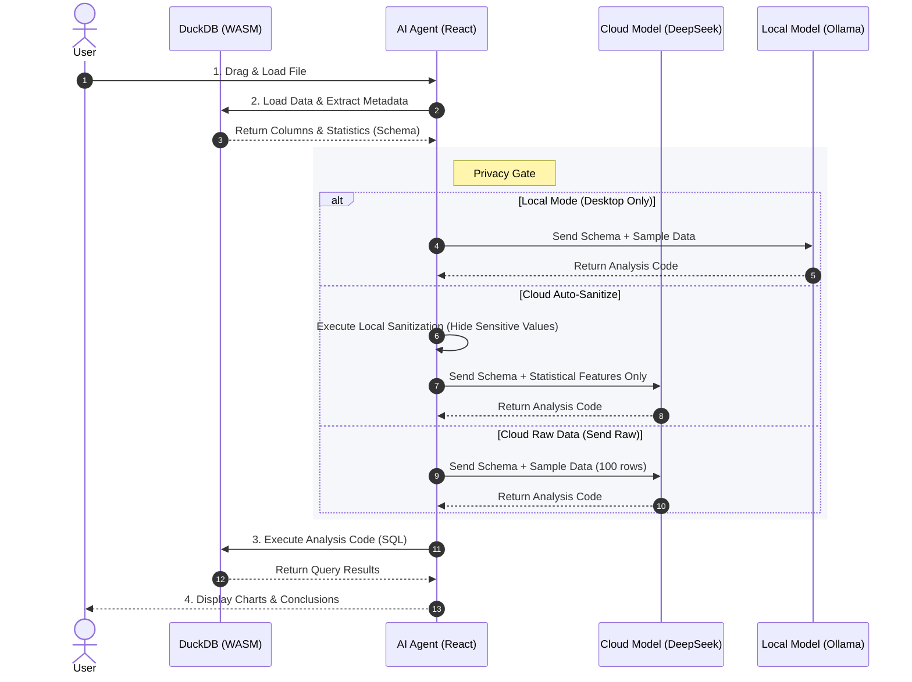

# 10. Security Architecture: Local-First Data Fortress

> **Last Updated**: 2026-01-13

> **Summary**: LiuliX adopts a "Local-First" architecture, ensuring your raw data never leaves the browser. This document details how this architecture physically eliminates data leakage risks.

---

> [!IMPORTANT]
> **Scope of "Local-First" Strategy**
> The fully localized architecture described in this document (Data never leaves browser) applies to all versions. However, the part involving **"Local LLM"** execution is only supported in **LiuliX Desktop** (In Development).
>
> **LiuliX Web Online Version** adopts a **"Cloud-Native"** strategy, providing services via Cloud DeepSeek API, coupled with an auto-sanitization mechanisms to ensure privacy.

## 1. Core Promise: Your Data Never Leaves the Browser

In traditional data analysis tools (like Jupyter Notebooks, SaaS BI), your data often needs to be uploaded to cloud servers for processing. This brings potential privacy risks.

**LiuliX chooses a different path.**

We leverage powerful modern browser capabilities (WebAssembly) to move the entire OLAP database engine and Python execution environment **into your browser**.

*   **0 Upload**: When you open CSV/Parquet files, the file is loaded only in your local memory, **not a single byte** is transmitted to our servers over the network.
*   **0 Retention**: Because we have no backend database, we **cannot** save your data, even if we wanted to.
*   **Local Processing**: LiuliX's core analysis functions (query, cleaning, plotting) run entirely in your browser. Network connection is only required when requesting AI insights (sending sanitized metadata).

---

## 2. Tech Stack: Data Center in the Browser

To achieve this architecture, we integrated cutting-edge Web technologies:

### 2.1 DuckDB-WASM: OLAP Engine in Browser

We integrated [DuckDB-WASM](https://duckdb.org/docs/api/wasm/overview), which is not just a database, but a complete analysis engine.

*   **High Performance**: Utilizes WASM (WebAssembly) to achieve near-native execution speed.
*   **Columnar Storage**: Designed for analytics, capable of processing millions of rows in milliseconds.
*   **SQL Support**: Supports full SQL standards, allowing complex queries to run directly in the frontend.

### 2.2 Pyodide: Python SciPy Stack in Browser

We integrated [Pyodide](https://pyodide.org/), a CPython distribution compiled to WebAssembly.

*   **Complete Environment**: Includes standard scientific computing libraries like NumPy, Pandas, Scikit-learn.
*   **Sandbox Execution**: Python code runs in a WASM sandbox, isolated from the host system, safe and secure.

---

## 3. Next-Gen AI Interaction: Send Schema Only, No Data

You might ask: "If data is not uploaded, how does AI analyze the data?"

This is the most ingenious part of the LiuliX architecture. We adopt a **"Metadata-Driven"** AI interaction mode.

### 3.1 What We Send to AI:
To let AI understand your data, we only extract and send the following **sanitized information** via API:
1.  **Schema**: Column names, data types (e.g., `Age: int`, `Name: string`).
2.  **Statistics**: Sent only when necessary (e.g., max, min, null count).
3.  **Sample**: **Not sent by default**. Only when you actively enable [Send Raw Data] mode in settings, a small sample (top 100 rows) is sent to improve AI understanding.
    > For detailed mechanisms, please refer to: [Data Sanitization Policy](./03-隐私安全-数据脱敏策略说明.md)

### 3.2 What We NEVER Send to AI:
*   **Full Dataset**: Your million-row raw data stays in local DuckDB forever.
*   **Privacy Sensitive Fields**: Even if sample sending is enabled, you can mark "Sensitive Columns" (like ID number, Phone number) in settings, and the system will automatically mask them.

---

## 4. Architecture Diagram

---

## 5. Security Commitment

As a future-oriented data tool, we know trust is the foundation.

1.  **Open Source & Transparent**: LiuliX's core code (including data processing logic) is fully open source. Anyone can audit our network requests to verify the above promises.
2.  **Principle of Least Privilege**: We only request necessary browser permissions and never overstep to access your system files.
3.  **No Tracking**: All non-essential data collection is disabled by default. Even if telemetry is enabled, it only collects error stacks, never user content.

**LiuliX — Returning Data Sovereignty to Users.**
