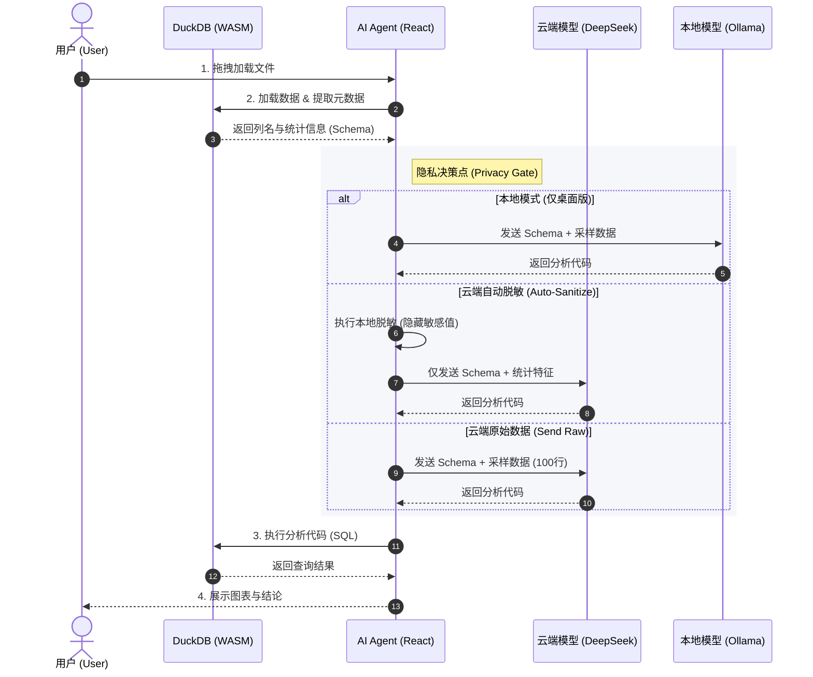

# 10. 安全架构原理：本地优先的数据堡垒

> **最后更新**: 2026-01-13

> **概要**: LiuliX 采用 "Local-First" (本地优先) 架构，确保您的原始数据从未离开浏览器。本文档详细阐述了这一架构如何从物理层面消除数据泄露风险。

---

> [!IMPORTANT]
> **关于 "Local-First" 策略的适用范围**
> 本文档描述的完全本地化架构（Data never leaves browser）适用于所有版本。但其中涉及 **"本地模型 (Local LLM)"** 运行的部分，仅支持 **LiuliX Desktop (桌面版)**（开发中）。
> 
> **LiuliX Web 在线版** 采用 **"Cloud-Native"** 策略，通过云端 DeepSeek API 提供服务，并配合自动脱敏机制保障隐私。

## 1. 核心承诺：您的数据从未离开浏览器

在传统的数据分析工具（如 Jupyter Notebooks, SaaS BI）中，您的数据通常需要上传到云端服务器才能进行处理。这带来了潜在的隐私风险。

**LiuliX 选择了不同的道路。**

我们利用现代浏览器的强大能力（WebAssembly），将整个 OLAP 数据库引擎和 Python 执行环境**搬到了您的浏览器中**。

*   **0 上传**: 当您打开 CSV/Parquet 文件时，文件仅在您的本地内存中加载，**没有任何字节**通过网络传输到我们的服务器。
*   **0 留存**: 因为我们没有后端数据库，所以我们**无法**保存您的数据，即使我们想保存也做不到。
*   **本地处理**: LiuliX 的核心分析功能（查询、清洗、绘图）完全在您的浏览器中运行。仅在请求 AI 洞察时需要网络连接（发送脱敏元数据）。

---

## 2. 技术栈：浏览器中的数据中心

为了实现这一架构，我们集成了最前沿的 Web 技术：

### 2.1 DuckDB-WASM：浏览器里的 OLAP 引擎

我们集成了 [DuckDB-WASM](https://duckdb.org/docs/api/wasm/overview)，这不仅仅是一个数据库，而是一个完整的分析引擎。

*   **高性能**: 利用 WASM (WebAssembly) 实现接近原生的执行速度。
*   **列式存储**: 专为分析设计，能在毫秒级处理百万行数据。
*   **SQL 支持**: 支持完整的 SQL 标准，让复杂查询在前端直接运行。

### 2.2 Pyodide：浏览器里的 Python 科学计算栈

我们集成了 [Pyodide](https://pyodide.org/)，这是一个编译成 WebAssembly 的 CPython 发行版。

*   **完整环境**: 包含 NumPy, Pandas, Scikit-learn 等标准科学计算库。
*   **沙箱执行**: Python 代码运行在 WASM 沙箱中，与主机系统隔离，安全无虞。

---

## 3. 下一代 AI 交互：仅发送 Schema，不发送数据

您可能会问："如果数据不上传，AI 怎么分析数据？"

这是 LiuliX 架构中最精妙的部分。我们采用了 **"元数据驱动 (Metadata-Driven)"** 的 AI 交互模式。

### 3.1 我们发送给 AI 的是：
为了让 AI 理解您的数据，我们只会提取并通过 API 发送以下**脱敏信息**：
1.  **Schema (表结构)**: 列名、数据类型（如 `Age: int`, `Name: string`）。
2.  **Statistics (统计摘要)**: 只有在必要时发送（如最大值、最小值、空值数量）。
3.  **Sample (样本片段)**: **默认不发送**。仅当您在设置中主动开启 [发送原始数据] 模式时，才会发送少量样本（前 100 行）以提升 AI 理解力。
    > 详细机制请参考：[数据脱敏策略说明](../../docs/04-技术专题/🔒数据脱敏策略说明.md)

### 3.2 我们绝不发送给 AI 的是：
*   **完整数据集**: 您的百万行原始数据永远停留在本地 DuckDB 中。
*   **隐私敏感字段**: 即使开启发送样本，您也可以在设置中标记"敏感列"（如身份证号、手机号），系统会自动屏蔽。

---

## 4. 架构图解

---

## 5. 安全承诺

作为一款面向未来的数据工具，我们深知信任是基础。

1.  **架构透明**: LiuliX 的核心执行引擎基于开源技术栈（DuckDB-WASM + Pyodide）。任何人都可以审计我们的网络请求，验证上述承诺。
2.  **最小权限原则**: 我们只申请必要的浏览器权限，绝不越界访问您的系统文件。
3.  **无追踪**: 默认关闭所有非必要的数据收集。即使开启遥测，也仅收集报错堆栈，绝不包含用户内容。

**LiuliX —— 把数据主权还给用户。**
